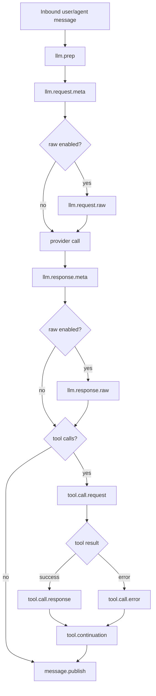

# AP: Feature-Path Logging Categories for LLM and Tool Diagnostics

**Date:** 2026-02-28  
**Status:** Draft (Awaiting SS approval gate)  
**Related REQ:** `.docs/reqs/2026/02/28/req-feature-path-logging-categories.md`

## Overview

Implement a path-oriented logging taxonomy and guide so one user turn can be traced across message preparation, LLM request/response, tool execution, continuation, and final publish/persistence, including opt-in raw payload diagnostics with safety controls.

## Baseline Observations

1. Existing runtime categories are mixed between path-oriented and legacy/domain-oriented names.
2. Guide and runtime category names are partially out of sync, reducing operator trust in `LOG_*` toggles.
3. Bridge logging exists for LLM/tool handoff but intentionally truncates payloads.
4. Message preparation logs exist but are not surfaced as first-class path-stage diagnostics.

## Architecture Decisions

- **AD-1: Introduce canonical path-stage categories under stable namespaces**
  - `turn.trace`
  - `llm.prep`
  - `llm.request.meta`
  - `llm.request.raw`
  - `llm.response.meta`
  - `llm.response.raw`
  - `tool.call.request`
  - `tool.call.response`
  - `tool.call.error`
  - `tool.continuation`
  - `message.publish`

- **AD-2: Keep backward compatibility through alias dual-emission during migration**
  - Existing categories continue emitting during transition window.
  - New categories are emitted in parallel for targeted feature paths.

- **AD-3: Add a consistent correlation envelope on path logs**
  - Required keys: `worldId`, `chatId`, `agentId`, `messageId`, plus `turnId` or `runId`.
  - Tool stages must include `toolCallId` and `toolName`.

- **AD-4: Raw payload categories are explicit opt-in**
  - `*.raw` categories remain disabled by default.
  - Raw payload logs pass through mandatory redaction utility before emit.

- **AD-5: Keep logging structured and machine-filterable**
  - Constant message strings plus object payload metadata.
  - No change to functional business behavior, only observability surface.

## Target Path Flow

## Implementation Phases

### Phase 1: Category Contract and Migration Map
- [x] Define canonical path-stage category constants in core logging utilities.
- [x] Define legacy-to-canonical mapping for compatibility and documentation.
- [x] Define required correlation-field contract per path stage.

### Phase 2: LLM Message Preparation and Request/Response Instrumentation
- [x] Add/align `llm.prep` emission for message include/exclude/transform reasons.
- [x] Add `llm.request.meta` at provider invocation boundary with non-sensitive metadata.
- [x] Add `llm.response.meta` at provider return boundary with response shape/usage metadata.
- [x] Add opt-in `llm.request.raw` and `llm.response.raw` emissions with redaction.

### Phase 3: Tool Lifecycle and Continuation Instrumentation
- [x] Add canonical tool lifecycle events: `tool.call.request`, `tool.call.response`, `tool.call.error`.
- [x] Add canonical continuation events under `tool.continuation` for retries/fallbacks/stop paths.
- [x] Ensure tool lifecycle logs include `toolCallId`, `toolName`, and correlation envelope.

### Phase 4: Publish/Persistence Path Visibility
- [x] Add/align `message.publish` category where final responses/tool outcomes are published/persisted.
- [x] Ensure publish-stage logs carry correlation envelope to close end-to-end traces.

### Phase 5: Logging Guide and Debug Profiles
- [x] Update `docs/logging-guide.md` with canonical categories and migration notes.
- [x] Add profile presets for:
  - [x] Raw LLM exchange diagnosis
  - [x] Message-preparation diagnosis
  - [x] Tool lifecycle + continuation diagnosis
  - [x] Full turn trace diagnosis
- [x] Document category-level examples and `LOG_*` commands for each profile.

### Phase 6: Tests
- [ ] Add/adjust unit tests for category emission and field shape at message-prep, LLM boundary, tool lifecycle, and continuation boundaries.
- [x] Add tests for raw-log gating (disabled by default, enabled by explicit category level).
- [x] Add tests for redaction of sensitive keys in raw categories.
- [ ] Add regression tests to ensure existing behavior/output (non-log functional behavior) is unchanged.

## Expected File Scope

- `core/logger.ts`
- `core/message-prep.ts`
- `core/utils.ts`
- `core/llm-manager.ts`
- `core/openai-direct.ts`
- `core/anthropic-direct.ts`
- `core/google-direct.ts`
- `core/events/orchestrator.ts`
- `core/events/memory-manager.ts`
- `core/events/tool-bridge-logging.ts`
- `docs/logging-guide.md`
- `tests/core/*` (targeted logging and redaction tests in relevant modules)

## Verification Plan

- `npx vitest run` on targeted core logging/path tests.
- `npm test` for broader regression confidence.
- Validate category toggles manually with focused `LOG_*` profile commands from updated guide.

## Architecture Review (AR)

### High-Priority Issues Found

1. **Category drift risk:** canonical names can diverge from emitted names if migration is piecemeal.
2. **Sensitive payload risk:** raw categories can leak credentials/content without enforced redaction path.
3. **Trace break risk:** missing correlation IDs in any stage makes end-to-end reconstruction unreliable.
4. **Operator confusion risk:** old and new category names can overlap without clear migration guidance.

### AR Fixes Applied

1. Added explicit canonical category list and migration-map phase before instrumentation changes.
2. Added mandatory raw-category gating and redaction decision to architecture.
3. Added required correlation envelope contract and tool ID requirements as architecture decisions.
4. Added dedicated guide migration section and troubleshooting profiles as first-class deliverables.

### Options and Tradeoffs

1. **Option A: Big-bang rename only (not selected)**
   - Pros: immediate taxonomy cleanliness.
   - Cons: high operator disruption, broken existing env toggles.

2. **Option B: Dual-emission migration (selected)**
   - Pros: safe transition, preserves existing workflows.
   - Cons: temporary verbosity and duplicated category surfaces.

3. **Option C: Docs-only alignment without runtime changes (not selected)**
   - Pros: minimal implementation effort.
   - Cons: does not meet raw payload and feature-path diagnosability goals.

### AR Exit Condition

No unresolved high-priority architecture flaw remains for AP stage. Proceed to SS only after explicit approval.
