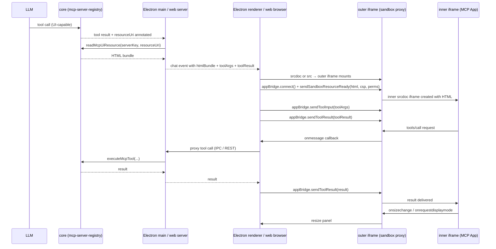

# Plan: Host MCP Apps

**Date:** 2026-02-28
**REQ:** `.docs/reqs/2026/02/28/req-host-mcp-apps.md`
**Targets:** Electron renderer + web app (AppRun) — both in scope.

---

## Architecture Decision Log

| Decision | Choice | Rationale |
|---|---|---|
| Platform scope | Electron + web simultaneously | Component logic is identical; only framework (React vs. AppRun) and proxy path (IPC vs. REST) differ. |
| Protocol impl | `@modelcontextprotocol/ext-apps` `newAppBridge()` | SDK manages the full `ui/*` postMessage protocol, double-iframe sandboxing, and typed callbacks. No manual JSON-RPC wiring. |
| Sandbox model | AppBridge double-iframe pattern | Outer proxy iframe (static asset) handles security relay; inner `srcdoc` iframe holds untrusted HTML. Double-origin isolation built into SDK. |
| Resource fetch | `core/mcp-server-registry.ts` via `client.readResource()` | All MCP client handles live there; re-using transport avoids duplication. |
| Tool-call proxy (Electron) | Renderer → IPC → main-process → MCP client | Matches existing IPC patterns; main process owns MCP client refs. |
| Tool-call proxy (web) | Renderer → `POST /api/worlds/:id/mcp-tool` | Existing REST API pattern; new endpoint mirrors IPC handler logic. |
| Multi-panel | Each tool-call message → own independent panel | Panels tracked by `messageId`; all open simultaneously; user dismisses individually. |
| External CSP | Allowed via `_meta.ui.csp`, enforced by SDK | AppBridge delivers CSP to sandbox proxy; host needs no additional filtering. |

---

## Data Flow



---

## Module Map

```
Shared / Core
  core/
    mcp-server-registry.ts       ← extend: readMcpUiResource(), isUiCapableTool(), getMcpUiResourceUri()
    index.ts                     ← export new functions

Electron
  electron/
    assets/
      mcp-sandbox-proxy.html     ← new: static outer iframe proxy page (bundled asset)
    shared/
      ipc-contracts.ts           ← add: MCP_READ_UI_RESOURCE, MCP_PROXY_TOOL_CALL channels + payloads
    main-process/
      ipc-handlers.ts            ← add: handleMcpReadUiResource(), handleMcpProxyToolCall()
      ipc-routes.ts              ← wire: two new routes
    preload/
      bridge.ts                  ← expose: mcpReadUiResource(), mcpProxyToolCall()
    renderer/src/
      components/
        McpAppPanel.tsx          ← new: AppBridge host, outer iframe, dismiss control
        MessageListPanel.tsx     ← extend: render McpAppPanel for UI-capable tool results

Web
  web/src/
    assets/
      mcp-sandbox-proxy.html     ← same proxy page (symlink or copied asset)
    domain/
      mcp-app-host.ts            ← new: AppBridge lifecycle helpers (pure functions, shared logic)
    components/
      mcp-app-panel.tsx          ← new: AppRun component wrapping AppBridge + outer iframe
    pages/
      World.tsx                  ← extend: render mcp-app-panel for UI-capable tool results
  server/
    routes/mcp-tool-proxy.ts     ← new: POST /api/worlds/:id/mcp/tool-proxy endpoint
```

---

## Phased Tasks

### Phase 1 — Dependency
- [ ] 1.1 Add `@modelcontextprotocol/ext-apps` to root `package.json` dependencies.
- [ ] 1.2 Verify `newAppBridge`, `buildAllowAttribute`, `getToolUiResourceUri` are importable from the package.

### Phase 2 — Core: UI Resource Support
- [x] 2.1 In `core/mcp-server-registry.ts`, add:
  - `isUiCapableTool(tool: Tool): boolean` — returns `true` when `(tool as any)._meta?.ui?.resourceUri` is a non-empty string.
  - `getMcpUiResourceUri(tool: Tool): string | null` — extracts the URI.
  - `readMcpUiResource(serverKey: string, resourceUri: string): Promise<string>` — calls `client.readResource({ uri: resourceUri })`, returns the first text blob's content.
- [ ] 2.2 Export all three from `core/index.ts`.
- [x] 2.3 Add `getMcpServerInfo(serverKey: string): { name: string; version: string } | null` — retrieves the connected server's identity for use as the `serverInfo` argument to `newAppBridge()`.
- [x] 2.4 Export from `core/index.ts`.
- [x] 2.5 Unit test: `isUiCapableTool` — true/false for with/without `_meta.ui.resourceUri`.
- [x] 2.6 Unit test: `readMcpUiResource` — mock `client.readResource`, assert HTML returned.

### Phase 3 — Sandbox Proxy Asset
- [x] 3.1 Create `electron/assets/mcp-sandbox-proxy.html` — a minimal static page that:
  - Accepts `postMessage` from the parent (outer frame).
  - Creates a child `<iframe srcdoc>` for the untrusted HTML.
  - Relays messages bidirectionally between parent and inner iframe.
  - Validates message origins strictly.
  - Applies the CSP received from the host as a `<meta>` tag in the inner `srcdoc`.
  - *(Follow the pattern from the `basic-host` example in the ext-apps repo.)*
- [x] 3.2 Reference / symlink the same proxy HTML into `web/public/` so the web app can load it via a relative URL.
- [x] 3.3 Configure Electron `vite.config.js` to copy `assets/mcp-sandbox-proxy.html` to the renderer dist.
- [x] 3.4 In Electron main process (`lifecycle.ts` or `environment.ts`), register a custom `app://` protocol handler via `protocol.registerFileProtocol('app', ...)` so the proxy page is served at `app://host/mcp-sandbox-proxy.html` — giving it a stable, consistent origin for postMessage validation.
- [x] 3.5 In web app: place `mcp-sandbox-proxy.html` in `web/public/` so Vite serves it at `/mcp-sandbox-proxy.html` (same origin as the app).

### Phase 4 — Electron IPC Channels
- [x] 4.1 Add to `electron/shared/ipc-contracts.ts`:
  - `MCP_READ_UI_RESOURCE: 'mcp:readUiResource'`
  - `MCP_PROXY_TOOL_CALL: 'mcp:proxyToolCall'`
  - `McpReadUiResourcePayload { worldId: string; serverKey: string; resourceUri: string }`
  - `McpProxyToolCallPayload { worldId: string; serverKey: string; toolName: string; args: unknown }`
- [x] 4.2 In `electron/main-process/ipc-handlers.ts`, add:
  - `handleMcpReadUiResource(payload)` → calls `readMcpUiResource`, returns `{ html: string }`.
  - `handleMcpProxyToolCall(payload)` → calls existing `executeMcpTool`; routes through HITL approval tagged as `source: 'mcp-app'`; returns tool result.
- [x] 4.3 Wire both in `ipc-routes.ts`.
- [x] 4.4 Expose in `electron/preload/bridge.ts`:
  - `mcpReadUiResource(payload): Promise<{ html: string }>`
  - `mcpProxyToolCall(payload): Promise<unknown>`
- [x] 4.5 Unit test: `handleMcpReadUiResource` with mocked `readMcpUiResource`.
- [x] 4.6 Unit test: `handleMcpProxyToolCall` routes through HITL and returns tool result.

### Phase 5 — Web Server Proxy Endpoint
- [x] 5.1 Create `server/routes/mcp-tool-proxy.ts`:
  - `POST /api/worlds/:worldId/mcp/tool-proxy`
  - Body: `{ serverKey, toolName, args }`.
  - Calls `executeMcpTool` (from `core`); applies HITL approval tagged `source: 'mcp-app'`.
  - Returns `{ result }` or `{ error }`.
- [x] 5.2 Register route in the main Express app.
- [ ] 5.3 Unit/integration test: endpoint calls MCP tool and returns result; HITL blocks when not approved.

### Phase 6 — Shared AppBridge Lifecycle Helpers
- [x] 6.1 Create `web/src/domain/mcp-app-host.ts` (pure functions, no framework coupling):
  - `createAppBridgeHost(iframe, callbacks, options): AppBridge` — wraps `newAppBridge`, connects, and calls `sendSandboxResourceReady`.
  - `destroyAppBridgeHost(bridge: AppBridge): void` — tears down the bridge.
  - `buildProxySrc(): string` — returns the URL to `mcp-sandbox-proxy.html` (relative, env-agnostic).
  - `sessionUiResourceCache: Map<string, string>` — module-level cache keyed by `resourceUri`.
- [ ] 6.2 Unit test: `createAppBridgeHost` calls `connect()` and `sendSandboxResourceReady()`; mock AppBridge.
- [ ] 6.3 Unit test: `destroyAppBridgeHost` tears down; repeat calls are no-ops.

### Phase 7 — Electron: McpAppPanel Component
- [x] 7.1 Create `electron/renderer/src/components/McpAppPanel.tsx`:
  - Props: `worldId`, `serverKey`, `htmlBundle`, `toolArgs`, `toolResult`, `onClose(): void`.
  - Renders `<iframe sandbox="allow-scripts allow-forms allow-popups allow-popups-to-escape-sandbox">`.
  - On mount (`useRef` + `useEffect`): set `iframe.src = ELECTRON_PROXY_SRC`, listen for `load`, call `createAppBridgeHost(iframeEl, callbacks, options)`.
  - Callbacks: `oncalltool` → IPC `mcpProxyToolCall`, `onopenlink`, `onsizechange` → panel height state.
  - Dismiss button: `destroyAppBridgeHost(bridge)` then `onClose()`.
  - Cleanup on unmount: `destroyAppBridgeHost(bridge)`.
- [ ] 7.2 Unit test: panel mounts → `connect()` and `sendSandboxResourceReady()` called; `onClose` unmounts cleanly.
- [ ] 7.3 Unit test: `tools/call` postMessage → IPC proxy called → `sendToolResult()` called.

### Phase 8 — Electron: MessageListPanel Integration
- [x] 8.1 In `electron/renderer/src/components/MessageListPanel.tsx`:
  - Added `worldId` prop, `dismissedPanels: Set<string>` state, `htmlBundleCache: Map<string, string>` state, `pendingFetchesRef`.
  - `fetchHtmlBundle` triggers `mcpReadUiResource` IPC on first render; guarded by pending ref.
  - After each message row: if `message.uiResourceUri` present and bundle cached and not dismissed, renders `<McpAppPanel />` inside a `React.Fragment` wrapper.
  - `dismissMcpPanel` callback adds panelKey to `dismissedPanels`.
- [ ] 8.2 Unit test: panel renders when UI-capable; does not render for non-UI tools; dismisses on close.

### Phase 9 — Web: mcp-app-panel AppRun Component
- [x] 9.1 Create `web/src/components/mcp-app-panel.tsx` (AppRun JSX):
  - `Component` subclass with `rendered` lifecycle hook for bridge init (guarded by `initialized` flag).
  - `this.element.querySelector('iframe')` to get proxy iframe after first render.
  - Tool-call proxy: `fetch('POST /api/worlds/:id/mcp/tool-proxy', ...)`.
  - `onopenlink` → `window.open(url, '_blank', ...)`.
  - `onsizechange` → `this.setState({ panelHeight: height })`.
  - `unload` → `destroyAppBridgeHost(bridge)`.
- [ ] 9.2 Unit test: mounted → `connect()` called; tool-call proxy hits `/api` endpoint.

### Phase 10 — Web: World Page Integration
- [x] 10.1 In `web/src/pages/World.tsx` and `web/src/components/world-chat.tsx`:
  - Added `uiResourceUri?: string; serverKey?: string` to `Message` interface.
  - Added `worldId?: string`, `mcpUiBundles?: Record<string,string>`, `dismissedMcpPanelIds?: string[]` to `WorldChatProps`.
  - Added `mcpUiBundles`, `dismissedMcpPanelIds` to `WorldComponentState` and initial state.
  - `createMessageFromMemory` and SSE handler pass through `uiResourceUri`/`serverKey`.
  - `World.update.ts`: `mcp-ui-bundle-loaded` and `mcp-ui-panel-dismiss` event handlers.
  - `WorldChat`: `triggerMcpBundleFetch` fires `/api/worlds/:id/mcp/ui-resource` on first encounter; renders `<McpAppPanel>` wrapped in `display:contents` div when bundle is available.
- [ ] 10.2 Unit test: panel renders when tool is UI-capable; dismisses cleanly.

### Phase 11 — End-to-End Verification
- [ ] 11.1 Integration test (Electron): mock MCP server with UI-capable tool returning `<html><body>Hello</body></html>`; assert `readMcpUiResource` returns HTML; assert IPC handler chains correctly.
- [ ] 11.2 Integration test (web): same mock server; assert `/api/worlds/:id/mcp/tool-proxy` proxies tool call.
- [ ] 11.3 Manual smoke test checklist:
  - Panel appears in Electron chat when UI-capable tool is called.
  - Panel appears in web chat for the same scenario.
  - Tool-call from inside the app reaches MCP server and updates the panel.
  - Multiple panels open simultaneously (two UI-capable tools in same chat).
  - Dismissing one panel does not affect others.
  - Non-UI tool results are visually unchanged.

---

## Key Risks and Mitigations

| Risk | Mitigation |
|---|---|
| `_meta` not in SDK `Tool` types | Use `(tool as any)._meta?.ui?.resourceUri`; wrap in typed guard function. |
| `@modelcontextprotocol/ext-apps` API drift | Pin to an exact version; review release notes before upgrading. |
| Electron CSP blocks proxy page scripts | Set `webPreferences.contentSecurityPolicy` on the BrowserWindow to allow the proxy page; or serve it as a `file://` asset. |
| Proxy page origin (Electron) | Resolved in Phase 3.4: register `app://` custom protocol in Electron main process; proxy served at `app://host/mcp-sandbox-proxy.html`. |
| Proxy page origin (web) | Resolved in Phase 3.5: place in `web/public/`; served at `/mcp-sandbox-proxy.html` (same origin). |
| Tool-call proxy bypasses HITL | `handleMcpProxyToolCall` and `/api/mcp/tool-proxy` explicitly tag calls as `source: 'mcp-app'` and run through the existing HITL gate. |
| Web app SSE event timing | Fetch HTML bundle after the tool-result event arrives (not before); use session cache to avoid races on re-render. |
| AppRun lifecycle vs. React `useEffect` | Use AppRun `mounted`/`unload` hooks in `mcp-app-panel.tsx`; verify `destroyAppBridgeHost` is called on component teardown. |

---

## Out of Scope for This Plan

- `ui/updateContext` full integration (model context injection requires re-processing the LLM turn).
- Persistent panel state across page reloads.
- Fullscreen mode beyond a CSS class toggle.
- Web app: streaming tool results to the MCP App panel (Phase 10 handles static results only).
