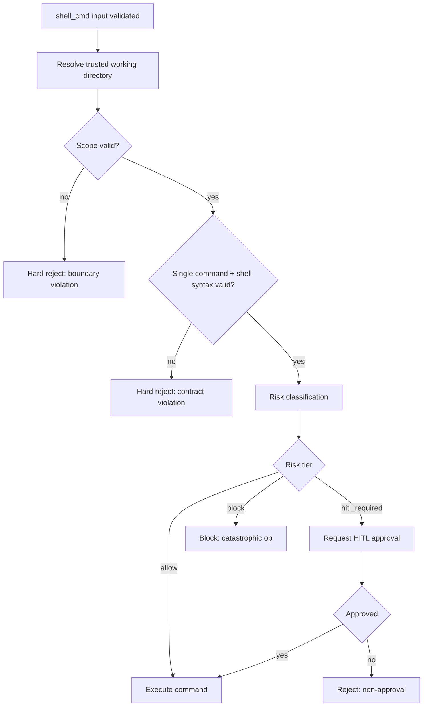

# Architecture Plan: `shell_cmd` Risk Gating and Script Execution Support

**Date**: 2026-02-28  
**Type**: Security and Policy Enhancement  
**Status**: SS Complete  
**Related Requirement**: `.docs/reqs/2026/02/28/req-shell-cmd-risk-gating-and-script-execution.md`

## Overview

Implement deterministic risk gating for `shell_cmd` while preserving strict trusted-working-directory boundaries and clarifying support for direct script execution (`bash`, `python`, `node`, `npx`) under existing single-command safety constraints.

## Architecture Decisions

- Keep trust-boundary scope checks as non-overridable hard rejects.
- Keep shell-control syntax blocked by default.
- Introduce a risk classification stage that outputs `allow`, `hitl_required`, or `block` before execution.
- Support direct interpreter/runner invocation with script file arguments, while keeping inline eval modes blocked (`-c`, `-e`, `--eval`, `-Command`).
- Reuse existing HITL infrastructure for approval-required outcomes instead of inventing a new approval channel.

## AR Findings and Resolutions

1. **Finding:** Policy precedence was implied but not explicit enough to prevent accidental HITL-before-boundary checks.  
  **Resolution:** Enforce strict preflight order: boundary/contract validation, then risk tiering, then HITL only for `hitl_required`.

2. **Finding:** AP allowed ambiguity on where approval should be integrated.  
  **Resolution:** Use `core/tool-approval.ts` (`requestToolApproval`) in `shell_cmd` execution path, mirroring existing built-in tool approval patterns.

3. **Finding:** Shell-control-syntax exception mode was referenced but not scoped.  
  **Resolution:** No exception-mode rollout in this scope; keep blocked-by-default behavior unchanged.

4. **Finding:** HITL non-approval terminal semantics were not explicit, and timeout-control could be misinterpreted as in-scope.  
  **Resolution:** Require deterministic non-executed outcomes with explicit reason tagging and user-visible messaging, and do not add timeout-control knobs in this scope.

## AR Review Outcome (AP)

- **Status:** Conditionally approved for implementation.
- **Guardrail 1:** Do not weaken `working_directory` containment checks.
- **Guardrail 2:** Risk classification must be deterministic and token-based, not ad-hoc substring-only.
- **Guardrail 3:** HITL is for risky in-scope actions, not for trust-boundary escape attempts.
- **Guardrail 4:** Preserve current SSE/tool-result behavior unless explicitly changed by a separate requirement.
- **Guardrail 5:** Add targeted tests proving each tier (`allow`, `hitl_required`, `block`) and script support boundaries.

## Execution Flow

## Deterministic Policy Table

| Condition | Outcome | HITL | Execution |
| --- | --- | --- | --- |
| Boundary violation (cwd/path scope) | `hard_reject` | No | No |
| Single-command/shell-syntax contract violation | `hard_reject` | No | No |
| Catastrophic destructive pattern | `block` | No | No |
| High-risk in-scope destructive pattern | `hitl_required` | Yes | Only if approved |
| Low-risk command | `allow` | No | Yes |

## Phase Plan

### Phase 1: Baseline and Policy Wiring
- [x] Confirm current call path where `shell_cmd` validation errors are surfaced and insert HITL hook only after successful boundary/contract preflight checks.
- [x] Define normalized policy outcome type for `shell_cmd` preflight (`allow` | `hitl_required` | `block`) with reason + risk tags.
- [x] Ensure preflight order is explicit: boundary/contract checks before risk tiering.

### Phase 2: Risk Classifier Design and Implementation
- [x] Add command-risk classifier in `core/shell-cmd-tool.ts` (or dedicated helper in `core/security/` if preferred by current conventions).
- [x] Classifier input must include normalized executable, argv tokens, and resolved path targets.
- [x] Implement minimum risk families:
  - deletion/destructive clean operations
  - mass permission/ownership operations
  - disk/device destructive operations
  - remote-download-to-execute chains/patterns
- [x] Map each family to policy tier and reason code.

### Phase 3: HITL Integration for `hitl_required`
- [x] Route `hitl_required` outcomes through `requestToolApproval` in `core/tool-approval.ts`.
- [x] Ensure approval payload includes: command preview, risk reason, trusted cwd context.
- [x] Ensure non-approval returns clear user-facing non-executed terminal result and does not execute process.
- [x] Do not add any timeout-control setting/knob to `shell_cmd` approval flow; keep approval message-option based.
- [x] Ensure boundary-violation and blocked-catastrophic outcomes bypass HITL and terminate directly.

### Phase 4: Script Execution Support Boundary
- [x] Verify/adjust support for direct forms:
  - `bash <script-file>`
  - `python <script-file>`
  - `node <script-file>`
  - `npx <package-or-binary> ...`
- [x] Keep inline eval modes blocked with actionable errors:
  - `bash -c`, `sh -c`
  - `python -c`
  - `node -e`, `--eval`
  - `powershell -Command`
- [x] Confirm path scope checks still apply to script file arguments and option-assignment path forms.

### Phase 5: Telemetry and Audit Metadata
- [x] Emit risk classification metadata (`tier`, `reason`, tags) through existing tool execution metadata channels used for audit/logging.
- [x] Ensure telemetry excludes sensitive full-output bodies not required for policy tracing.
- [x] Keep backward compatibility for existing event consumers.

### Phase 6: Tests (Strict)
- [x] Add/update targeted unit tests (deterministic, in-memory, mocked) in `tests/core/shell-cmd-tool.test.ts`:
  - allow case (safe read-only command)
  - hitl-required case (destructive in-scope command)
  - block case (catastrophic destructive pattern)
  - hard reject boundary escape case (out-of-scope path)
  - supported script-file invocation case(s)
  - blocked inline eval case(s)
- [x] Add integration tests around execution path and approval gating in `tests/core/shell-cmd-integration.test.ts`.
- [x] Ensure no real filesystem/real SQLite/real network/real LLM provider use in tests.

### Phase 7: Validation and Regression Checks
- [x] Run targeted tests first:
  - `npm test -- tests/core/shell-cmd-tool.test.ts tests/core/shell-cmd-integration.test.ts`
- [x] Run full unit tests:
  - `npm test`
- [x] Because tool runtime path is touched, run integration suite:
  - `npm run integration`
- [x] Fix regressions before completion.

## Expected File Scope

- `core/shell-cmd-tool.ts`
- `core/tool-approval.ts` (reuse existing helper; no API contract changes expected)
- `tests/core/shell-cmd-tool.test.ts`
- `tests/core/shell-cmd-integration.test.ts`
- Optional docs update: `docs/shell-cmd-tool.md` (policy section)

## Risk Matrix

1. **Risk:** Over-blocking legitimate developer workflows.  
   **Mitigation:** prefer `hitl_required` over `block` for in-scope destructive actions.

2. **Risk:** Under-detecting dangerous commands due to simplistic matching.  
   **Mitigation:** tokenize executable + args and include path-context-aware rules.

3. **Risk:** Prompt-injection attempts requesting HITL override of boundary escape.  
   **Mitigation:** enforce boundary checks before HITL and make them non-overridable.

4. **Risk:** Inconsistent behavior across Web/Electron/CLI.  
   **Mitigation:** centralize policy in core tool execution path and test via integration.

5. **Risk:** `npx` behavior ambiguity (install/run side effects).  
   **Mitigation:** classify destructive downstream patterns via args and require HITL when risk indicators appear.

## Acceptance Mapping

- REQ-1 and REQ-2 map to Phases 1, 3, and 4.
- REQ-3 and REQ-4 map to Phases 2 and 3.
- REQ-5 maps to Phase 4.
- REQ-6 maps to Phases 3 and 5.
- REQ-7 maps to Phases 1 and 3.
- REQ-8 maps to Phase 3.

## Exit Criteria

- [x] Hard boundary violations remain non-overridable rejects.
- [x] Risk tiering is deterministic and exercised by tests.
- [x] HITL is required for high-risk in-scope operations and bypassed for blocked catastrophic cases.
- [x] Direct script-file invocation support is explicit and tested.
- [x] Inline eval modes remain blocked with actionable guidance.
- [x] HITL non-approval outcomes are non-executed and explicitly surfaced.
- [x] No timeout-control setting is introduced for `shell_cmd` approval flow.
- [x] Unit + integration tests pass without regressions.
