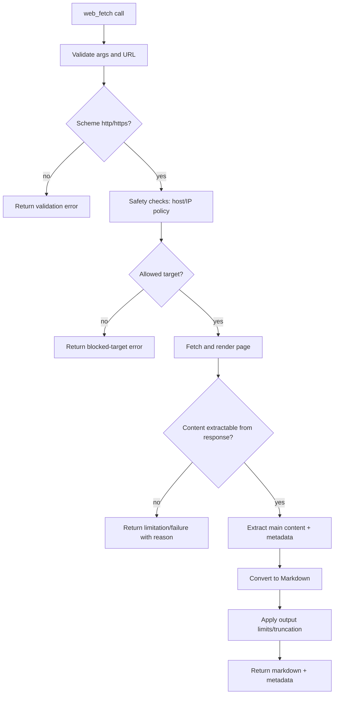

# Architecture Plan: Built-in `web_fetch` Tool (Lightweight Fetch-to-Markdown)

**Date**: 2026-02-28  
**Type**: Feature Addition  
**Status**: SS Complete  
**Related Requirement**: `.docs/reqs/2026/02/28/req-web-fetch-tool.md`

## Overview

Implement a built-in `web_fetch` tool that retrieves web content through lightweight HTTP fetch and returns normalized Markdown output with source metadata and explicit limit/error handling.

## Architecture Decisions

- Add `web_fetch` as a first-class built-in tool in the same registration path as `shell_cmd`, `read_file`, `list_files`, `grep`, `load_skill`, `create_agent`, and `human_intervention_request`.
- Use a lightweight fetch pipeline:
  - Stage A: HTTP fetch + validation/safety guardrails.
  - Stage B: extract content from response payload and convert to Markdown.
- Normalize extracted content into Markdown as the canonical tool output.
- Keep all behavior deterministic with bounded timeout/output-size and explicit truncation metadata.
- Keep implementation function-based and isolated to `core/` tool modules.

## AR Review Outcome (AP)

- **Status:** Approved for implementation with guardrails.
- **Guardrail 1:** No bypass of existing built-in tool validation/wrapping (`wrapToolWithValidation`).
- **Guardrail 2:** Restrict to `http`/`https` URLs only; reject other schemes early.
- **Guardrail 3:** Enforce safety checks for loopback/private-network targets unless explicitly allowed by current security policy.
- **Guardrail 4:** Do not introduce heavy browser automation/runtime rendering dependencies.
- **Guardrail 5:** Enforce strict runtime/output limits and include reasoned truncation/partial-result metadata.
- **Guardrail 6:** Add deterministic unit/integration tests with mocked fetch/rendering dependencies.

## Scope Map

- **In scope:**
  - New `core/web-fetch-tool.ts` built-in tool definition and execution path.
  - Lightweight fetch-only behavior with explicit SPA limitation signaling.
  - HTML/content extraction and Markdown conversion.
  - Built-in tool registration + schema validation + tests.
- **Out of scope:**
  - Site crawling (single call remains single URL).
  - Login/session automation.
  - Persistent page archiving.

## Delivery Flow

## Implementation Phases

### Phase 1: Tool Module Skeleton and Contract
- [x] Create `core/web-fetch-tool.ts` with file-header comment and function-based API.
- [x] Define `createWebFetchToolDefinition()` with JSON schema:
  - Required: `url`.
  - Optional: `timeoutMs`, `maxChars`, `includeLinks`, `includeImages`.
- [x] Return structured JSON string payload containing:
  - `url`, `resolvedUrl`, `title`, `markdown`, `truncated`, `reason`, `timingMs`.
- [x] Standardize tool error prefix (`Error: web_fetch failed - ...`) for consistency with existing tools.

### Phase 2: URL Validation and Network Safety
- [x] Add URL parse/validation helper functions in `core/web-fetch-tool.ts` (or `core/web-fetch-utils.ts` if needed).
- [x] Reject empty/malformed URLs and non-HTTP(S) schemes.
- [x] Resolve host and enforce denylist checks for loopback/private/link-local targets.
- [x] Add explicit, actionable error categories:
  - `invalid_url`
  - `unsupported_scheme`
  - `blocked_target`

### Phase 3: Fetch Extraction Limits and SPA Limitation Signaling
- [x] Detect low-content/JS-shell responses and emit clear limitation metadata for client-rendered pages.
- [x] Define deterministic limitation outcomes (no implicit rendering retries).
- [x] Return actionable reasons when fetch-only mode cannot extract meaningful content.

### Phase 4: Content Extraction and Markdown Conversion
- [x] Build extraction pipeline for meaningful content blocks:
  - title, headings, paragraphs, lists, links, code blocks, tables (best effort).
- [x] Remove noisy blocks where feasible:
  - script/style/nav/footer boilerplate.
- [x] Convert extracted content into normalized Markdown.
- [x] Apply deterministic output-size bound (`maxChars`) and include `truncated` flag.

### Phase 5: Built-in Tool Registration
- [x] Wire `createWebFetchToolDefinition()` into `core/mcp-server-registry.ts` built-ins creation.
- [x] Register as `web_fetch` and wrapped with `wrapToolWithValidation`.
- [x] Keep backward compatibility for all existing built-in tools and aliases.

### Phase 6: Tool Prompt and Parameter Alias Compatibility
- [x] Update `core/tool-utils.ts` alias normalization if needed (for common variants like `uri -> url`).
- [x] Ensure unknown argument rejection still works (`additionalProperties: false`).
- [ ] Update tool-usage prompt hints if this repo currently surfaces built-in usage guidance by tool name.

### Phase 7: Tests (Required)
- [x] Add targeted unit tests for new feature (1-3 cases minimum, deterministic):
  - Happy path: valid URL returns markdown + metadata.
  - Edge case: non-HTTP(S) URL rejected.
  - Edge case: blocked/private target rejected.
  - Edge case: JS-dependent page returns limitation reason in fetch-only mode.
- [x] Add integration-level built-in registration assertion:
  - `tests/core/shell-cmd-integration.test.ts` verifies `web_fetch` exists alongside other built-ins.
- [x] Add registry-level test updates if needed:
  - `tests/core/mcp-server-registry.test.ts` mock and assertions for new built-in registration path.
- [x] Mock network layer in tests; no real network calls.

### Phase 8: Validation and Runtime Checks
- [x] Run targeted tests first:
  - `npm test -- tests/core/web-fetch-tool.test.ts tests/core/shell-cmd-integration.test.ts tests/core/mcp-server-registry.test.ts`
- [x] Run full unit suite:
  - `npm test`
- [x] Because runtime tool transport path is touched, run:
  - `npm run integration`
- [x] Fix failures and keep scope limited to this feature.

## Expected File Scope

- `core/web-fetch-tool.ts` (new)
- `core/mcp-server-registry.ts` (registration)
- `core/tool-utils.ts` (optional alias normalization)
- `tests/core/web-fetch-tool.test.ts` (new)
- `tests/core/shell-cmd-integration.test.ts` (built-in availability assertion)
- `tests/core/mcp-server-registry.test.ts` (mock registration coverage, if required)
- `package.json` (only if new runtime dependency is required for JS rendering or markdown conversion)

## Risks and Mitigations

1. **Risk:** Fetch-only mode may not recover full content on JS-heavy pages.  
  **Mitigation:** extract bootstrap JSON where possible and return explicit limitation metadata.

2. **Risk:** SSRF-like access to local/private targets.  
   **Mitigation:** strict host/IP safety checks and explicit block errors.

3. **Risk:** Excessively large pages produce oversized tool output.  
   **Mitigation:** hard `maxChars` truncation with `truncated=true` and reason.

4. **Risk:** Markdown conversion quality varies by page structure.  
   **Mitigation:** extractor prioritizes semantic content blocks and strips known noise.

5. **Risk:** User expects SPA-rendered data from fetch-only tool.  
  **Mitigation:** return explicit limitation messaging and avoid ambiguous partial success claims.

## Validation Plan

- [x] Unit: URL parsing/scheme checks/safety denials.
- [x] Unit: markdown conversion pipeline from representative HTML fixtures.
- [x] Unit: truncation/timeout behavior and explicit reason metadata.
- [x] Integration: built-in tool map includes `web_fetch` in standard worlds.
- [x] Regression: existing built-ins (`shell_cmd`, `load_skill`, `create_agent`, `read_file`, `list_files`, `grep`, `grep_search`) remain available and executable.

## Exit Criteria

- [x] `web_fetch` is available in built-in tool list in all worlds.
- [x] Tool returns Markdown for valid web pages.
- [x] SPA/client-rendered pages return explicit fetch-only limitation outcomes.
- [x] Validation and safety errors are explicit/actionable.
- [x] Unit tests and integration checks pass.
