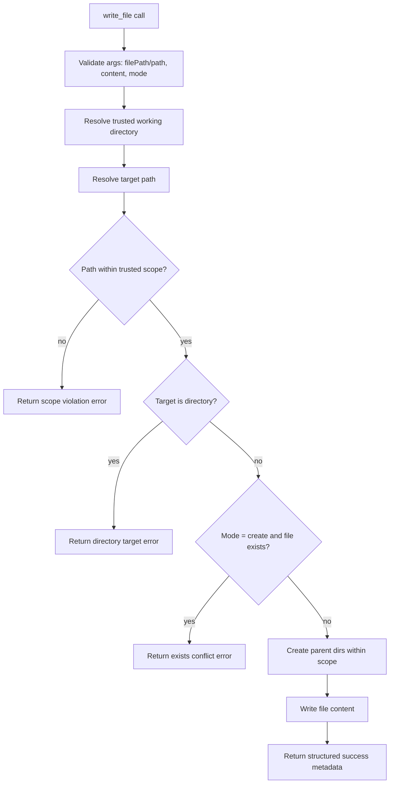

# AP: Built-in `write_file` Tool with Trusted-Scope Security

**Date:** 2026-02-28  
**Status:** SS Complete  
**Related REQ:** `.docs/reqs/2026/02/28/req-write-file-tool.md`

## Overview

Implement a built-in `write_file` tool that safely creates or updates files inside the trusted working-directory scope, with explicit write-mode semantics and deterministic structured responses.

## Architecture Decisions

- **AD-1: Register as built-in core tool**
  - Add `write_file` alongside existing file tools (`read_file`, `list_files`, `grep`) in built-in tool registration.
  - Keep `wrapToolWithValidation` path unchanged.

- **AD-2: Reuse existing trust-boundary primitives**
  - Use the same trusted working-directory resolver and scope validator already used by `read_file` and `shell_cmd`-adjacent safety logic.
  - Do not introduce alternate bypass paths.

- **AD-3: Enforce explicit write modes**
  - Support deterministic modes:
    - `create` (create-only, fails if file exists)
    - `overwrite` (replace existing content or create if missing)
  - Default mode is explicit and documented in schema (`overwrite` unless changed during AR/SS approval).

- **AD-4: Keep response contract machine-readable**
  - Return structured JSON string with stable fields (`ok`, `status`, `path`, `operation`, `bytesWritten`, `created`).
  - Error outcomes return `Error: write_file failed - ...` to match built-in style.

- **AD-5: Deterministic filesystem behavior**
  - Parent directories are created only when inside trusted scope using deterministic `mkdir -p` equivalent behavior.
  - Writing to an existing directory path is rejected.

## AR Review Outcome (AP)

- **Status:** Approved for implementation with guardrails.
- **Guardrail 1:** No writes outside trusted working directory under any mode.
- **Guardrail 2:** Additional tool parameters remain strict (`additionalProperties: false`).
- **Guardrail 3:** Mode conflicts (`create` on existing file) must fail cleanly and deterministically.
- **Guardrail 4:** Existing built-in tool behavior must remain backward compatible.
- **Guardrail 5:** Add targeted deterministic tests with in-memory/mocked FS behavior where practical.

## Execution Flow

## Implementation Phases

### Phase 1: Tool Contract and Module Update
- [x] Extend `core/file-tools.ts` with `createWriteFileToolDefinition()`.
- [x] Define schema inputs:
  - [x] `filePath` (required) with optional alias `path`.
  - [x] `content` (required string).
  - [x] `mode` (optional enum: `create` | `overwrite`).
- [x] Set strict schema behavior (`additionalProperties: false`).

### Phase 2: Security and Path Enforcement
- [x] Reuse trusted working-directory resolution helper in `file-tools`.
- [x] Reuse scope validator for resolved target path.
- [x] Ensure directory-target writes are rejected.
- [x] Ensure nested parent directories are created only after scope validation.

### Phase 3: Write Semantics and Response Shape
- [x] Implement mode branching:
  - [x] `create`: fail if file already exists.
  - [x] `overwrite`: write/replace content deterministically.
- [x] Return structured JSON payload with deterministic fields.
- [x] Normalize error messages to built-in style.

### Phase 4: Built-in Registration
- [x] Register new built-in in `core/mcp-server-registry.ts`.
- [x] Ensure built-in tool list includes `write_file` with expected description and schema.
- [x] Keep existing built-ins unchanged.

### Phase 5: Tests (Required)
- [x] Add/extend targeted unit tests (1-3+ cases) for `write_file`:
  - [x] Happy path: in-scope create/overwrite succeeds with metadata.
  - [x] Edge case: `create` mode fails when target exists.
  - [x] Security case: out-of-scope path is rejected.
  - [x] Validation case: missing required fields rejected.
- [x] Add registration assertion so built-in map includes `write_file`.
- [x] Keep tests deterministic with no real network/time dependencies.

### Phase 6: Verification
- [x] Run focused tests for modified/added test files.
- [x] Run `npm test` for regression confidence.
- [x] If transport/runtime integration path is touched, run `npm run integration`.

## Expected File Scope

- `core/file-tools.ts`
- `core/mcp-server-registry.ts`
- `tests/core/*` (targeted tool and registry tests)

## Risks and Mitigations

1. **Risk:** Path traversal or scope bypass via crafted relative paths.  
   **Mitigation:** Resolve to absolute path first, then enforce trusted-scope validator.

2. **Risk:** Accidental overwrite due to ambiguous defaults.  
   **Mitigation:** Explicit mode enum and deterministic default behavior documented in schema.

3. **Risk:** Behavior drift versus other built-ins.  
   **Mitigation:** Reuse existing helper functions and error-format conventions.

4. **Risk:** Tool registration regressions for existing built-ins.  
   **Mitigation:** Add/maintain registry tests asserting existing and new tools coexist.

## Verification and Exit Criteria

- [x] `write_file` appears in built-in tool inventory.
- [x] In-scope writes succeed and return deterministic structured metadata.
- [x] `create` mode conflict is properly rejected.
- [x] Out-of-scope writes are denied.
- [x] Existing tool behavior remains unchanged.
- [x] Targeted tests and regression tests pass.
