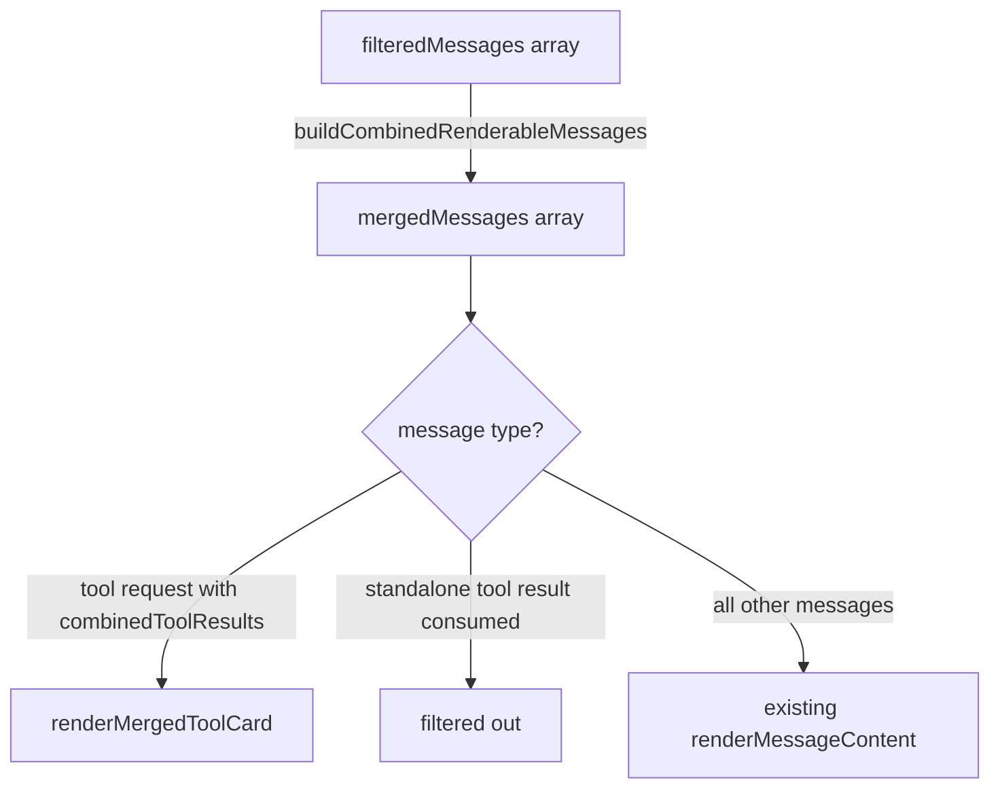

# Plan: Web App Message Display Parity with Electron

**Date:** 2026-03-01  
**REQ:** [req-web-message-display-parity.md](../../reqs/2026/03/01/req-web-message-display-parity.md)  
**Status:** Complete (Phase 1–3 delivered; Phase 4 deferred)

---

## Overview

Four requirements, delivered in priority order. REQ-1 and REQ-2 are high priority. REQ-4 is a quick win. REQ-3 is deferred to its own phase.

---

## Phase 1 — REQ-2: Markdown Pre-processing Parity (High)

Changes are isolated to one file. Implement first as it unblocks REQ-1 tests.

- [x] **1.1** Add `normalizeMultilineMarkdownLinks(markdownText: string): string` to `web/src/utils/markdown.ts`  
  — Port verbatim from `electron/renderer/src/utils/markdown.ts`

- [x] **1.2** Add `isLikelyXmlPayload(markdownText: string): boolean` and `normalizeXmlForMarkdownDisplay(markdownText: string): string` to `web/src/utils/markdown.ts`  
  — Port verbatim from Electron

- [x] **1.3** Refactor `renderMarkdown()` in `web/src/utils/markdown.ts`:
  - Replace `ALLOWED_ATTR: ALLOWED_ATTRIBUTES` with flat `ALLOWED_ATTR` array (same pattern as Electron)
  - Add `ALLOWED_URI_REGEXP` constant (identical to Electron's)
  - Add `ADD_DATA_URI_TAGS: ['img']` to the DOMPurify options
  - Call `normalizeXmlForMarkdownDisplay(normalizeMultilineMarkdownLinks(markdownText))` before passing to `marked()`

- [x] **1.4** Export `createMarkdownSanitizeOptions()` helper from `web/src/utils/markdown.ts` (needed for unit tests, matching Electron pattern)

- [x] **1.5** Port tests — `tests/web-domain/markdown-rendering.test.ts` to `tests/web/markdown-rendering.test.ts`:
  - Multiline link normalization renders as `<a>` tag
  - Raw XML payload wraps in code block
  - XML with `@mention` prefix wraps in code block
  - `ALLOWED_URI_REGEXP` allows `data:image/svg+xml;base64` URIs

---

## Phase 2 — REQ-1: Merged Tool Call Cards (High)



### 2.1 — New domain module: `web/src/domain/tool-merge.ts`

Port the following pure functions from `electron/renderer/src/components/MessageListPanel.tsx` and `electron/renderer/src/utils/message-utils.ts`:

- [x] `isToolRequestMessage(message): boolean`  
  — Message has `tool_calls` array with at least one entry
- [x] `isToolRelatedMessage(message): boolean`  
  — Message has role `tool`, `tool_call_id`, `toolCallStatus`, or `isToolStreaming`
- [x] `collectToolCallIds(message): string[]`  
  — Extract all `id` values from `message.tool_calls`
- [x] `buildCombinedRenderableMessages(messages: Message[]): Message[]`  
  — Full merge logic: index tool results by key, attach `combinedToolResults` to request rows, filter consumed result rows. Skip rows where `isToolStreaming === true`.

### 2.2 — Update `world-chat.tsx`

- [x] Import `buildCombinedRenderableMessages` from `domain/tool-merge`
- [x] Apply it to `filteredMessages` before the render loop:
  ```ts
  const renderableMessages = buildCombinedRenderableMessages(filteredMessages);
  ```
- [x] Replace the `filteredMessages.map(...)` loop to iterate `renderableMessages`

### 2.3 — Update `web/src/domain/message-content.tsx`

- [x] Add `renderMergedToolCard(message, combinedToolResults)` function that renders:
  - Tool name (from `tool_calls[0].function.name` or `tool_calls[0].name`)
  - Arguments section (collapsed JSON) 
  - Status pill: `● running` / `✓ done` / `✗ failed`
  - Each result's output in a collapsible `<pre>` block
  - Collapse/expand toggle wired to existing `toggle-tool-output` event
- [x] Update `renderMessageContent(message)` to call `renderMergedToolCard` when `message.combinedToolResults` is present

### 2.4 — Styles

- [x] Add CSS classes for the merged tool card in `web/src/styles.css`:
  `merged-tool-card`, `tool-status`, `tool-args`, `tool-result-block`  
  — Mirror the visual style of existing `.tool-output-container`

### 2.5 — Tests: `tests/web-domain/tool-merge.test.ts`

- [x] `buildCombinedRenderableMessages` merges matching tool result into request by `tool_call_id`
- [x] `buildCombinedRenderableMessages` removes consumed tool result rows from output
- [x] Streaming tool rows (`isToolStreaming: true`) are not merged and remain in place
- [x] Unmatched tool result rows (no matching request) pass through unchanged

---

## Phase 3 — REQ-4: Log Events to `console.log` (Medium, quick win)

`handleLogEvent` in `web/src/utils/sse-client.ts` already emits `console.log`. The only change needed is to stop appending the log message to `state.messages`.

- [x] **3.1** In `handleLogEvent` (`web/src/utils/sse-client.ts`): remove the `logMessage` object construction and the `messages: [...state.messages, logMessage]` state update. Return the unchanged state (after the console.log).

- [x] **3.2** Extend `shouldHideWorldChatMessage` in `web/src/domain/message-visibility.ts` to also return `true` for messages where `logEvent` is truthy — defensive guard for any messages already in persisted state.

- [x] **3.3** Update `world-chat.tsx`: remove the inline `if (message.logEvent)` render branch (now unreachable).

- [x] **3.4** Tests: extend `tests/web-domain/world-chat-message-visibility.test.ts`:
  - `shouldHideWorldChatMessage` returns `true` for a message with a truthy `logEvent` field
- [x] **3.5** Tests: `tests/web-domain/sse-log-event.test.ts`:  
  - `handleLogEvent` returns state with unchanged `messages` array (log not appended)
  - `handleLogEvent` still calls `console.log`

---

## Phase 4 — REQ-3: RAF-Batched Streaming (Medium, deferred)

Lower priority. Implement after REQ-1/2/4 are merged and stable.

- [ ] **4.1** Add `createRafBatchedUpdater(flush: (chunks: any[]) => void)` in `web/src/utils/sse-client.ts`  
  — Accumulates chunks in a buffer; schedules a single `requestAnimationFrame` flush per frame
- [ ] **4.2** Wrap SSE `chunk` event handler to use the batcher
- [ ] **4.3** Bypass batcher (immediate flush) for: `end`, `error`, `hitl`, `world` event types
- [ ] **4.4** Tests: verify chunk batching and immediate flush on end/error

---

## File Change Summary

| File | Change type |
|------|-------------|
| `web/src/utils/markdown.ts` | Modify — add preprocessing + DOMPurify fixes |
| `web/src/domain/tool-merge.ts` | **New** — pure merge logic |
| `web/src/domain/message-content.tsx` | Modify — add merged tool card renderer |
| `web/src/components/world-chat.tsx` | Modify — apply merge, remove log branch |
| `web/src/domain/message-visibility.ts` | Modify — add logEvent guard |
| `web/src/utils/sse-client.ts` | Modify — stop appending log to messages |
| `web/src/styles.css` | Modify — add merged tool card styles |
| `tests/web/markdown-rendering.test.ts` | **New** — ported from electron tests |
| `tests/web-domain/tool-merge.test.ts` | **New** — merge logic unit tests |
| `tests/web-domain/world-chat-message-visibility.test.ts` | Modify — add logEvent case |
| `tests/web-domain/sse-log-event.test.ts` | **New** — log routing unit tests |

---

## Approval Gate

Implementation begins after this plan is approved. Phases 1→2→3 can be implemented in sequence in one session. Phase 4 is independent and deferred.
