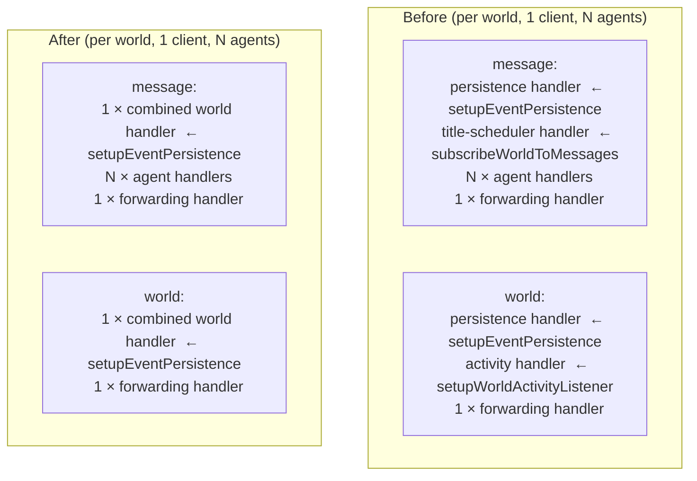

# Plan: Event Subscription Consolidation (One Agent One Subscription)

**Date:** 2026-03-03  
**REQ:** `.docs/reqs/2026/03/03/req-subscription-consolidation.md`  
**Status:** In Progress

---

## Goal

Eliminate `MaxListenersExceededWarning` by ensuring every world-level infrastructure concern shares one listener per event channel instead of owning independent ones.

---

## Architecture Overview

The problem was **incremental accumulation**: as features were added (event persistence, activity tracking, chat-title scheduling), each one independently attached its own listener to the world's EventEmitter rather than sharing a single combined subscriber. There was no single design decision — it drifted.

The right design: **one combined world-level setup function, one handler per event channel**.

`setupEventPersistence` becomes the **single owner** of all world-level infrastructure listeners. It handles persistence + title-scheduling + activity in one handler per channel. `setupWorldActivityListener` and `subscribeWorldToMessages` become idempotent no-ops when persistence is active; standalone fallbacks when `DISABLE_EVENT_PERSISTENCE=true`.

---

## Layering Constraint & Solution

`persistence.ts` is Layer 4. `subscribers.ts` is Layer 6. `persistence.ts` must NOT import from `subscribers.ts`.

The title-scheduling logic in `subscribers.ts` (the `scheduleNoActivityTitleUpdate`, `commitChatTitleIfDefault`, `tryGenerateAndApplyTitle` private functions) only imports from Layer 4 and below:
- `memory-manager.ts` (Layer 4)
- `publishers.ts` (Layer 3)
- `chat-constants.ts`
- `storage-factory.ts`

**Solution:** Extract the title-scheduling logic into a new `events/title-scheduler.ts` at **Layer 4**. Both `persistence.ts` (Layer 4) and `subscribers.ts` (Layer 6) can import from it.

No injected callbacks needed. No changes to `managers.ts` call sites.

---

## Phase 1 — Create `events/title-scheduler.ts` (Layer 4)

Move from `subscribers.ts` into new file:
- Module-level state: `titleGenerationInFlight`, `titleGenerationTimers`
- Private helpers: `getTitleGenerationKey`, `commitChatTitleIfDefault`, `tryGenerateAndApplyTitle`
- Exported functions:
  - `scheduleNoActivityTitleUpdate(world, chatId, content)` — debounced title generation on human message
  - `runIdleTitleUpdate(world, event)` — title generation trigger on idle activity event
  - `clearWorldTitleTimers(worldId)` — cleanup helper for world teardown

`isHumanSender` (private helper currently in `subscribers.ts`) must also be accessible here — either duplicate the 2-line helper or move it to `utils.ts`.

---

## Phase 2 — Update `persistence.ts` to be the combined world subscriber

In `setupEventPersistence`:

- `messageHandler`: after persisting, call `scheduleNoActivityTitleUpdate` from `title-scheduler.ts` for human messages.
- `toolHandler`: after persisting, call `runIdleTitleUpdate` from `title-scheduler.ts` for idle events.
- Cleanup: in addition to removing listeners, call `clearWorldTitleTimers(world.id)` and set `world._worldMessagesUnsubscriber = undefined` and `world._activityListenerCleanup = undefined`.
- After registering handlers, set `world._worldMessagesUnsubscriber = cleanup` and `world._activityListenerCleanup = cleanup` so idempotent wrappers short-circuit.

---

## Phase 3 — Make `subscribers.ts` wrappers idempotent

`subscribeWorldToMessages`:
- If `world._worldMessagesUnsubscriber` is already set → return it (persistence has the combined listener).
- Standalone fallback (persistence disabled): use `scheduleNoActivityTitleUpdate` from `title-scheduler.ts`.

`setupWorldActivityListener`:
- If `world._activityListenerCleanup` is already set → return it.
- Standalone fallback: use `runIdleTitleUpdate` from `title-scheduler.ts`.

Remove the private title-scheduling functions from `subscribers.ts` (now in `title-scheduler.ts`).

---

## Phase 4 — Update `events/index.ts`

Re-export public symbols from `title-scheduler.ts` (if any callers need `clearWorldTitleTimers`).

---

## Phase 5 — Tests

- Update `post-stream-title.test.ts`: replace the two-call setup (`setupWorldActivityListener` + `subscribeWorldToMessages`) with a single `setupEventPersistence` call + mock event storage.
- Add listener-count regression test: after `setupEventPersistence`, assert `world.eventEmitter.listenerCount('message') === 1` and `world.eventEmitter.listenerCount('world') === 1`.

---

## Phase 4 — Tests

- Update `tests/core/events/post-stream-title.test.ts`: remove the separate `setupWorldActivityListener` + `subscribeWorldToMessages` calls. Instead call only `setupEventPersistence` (with the mock event storage). Verify both idle-title and message-title paths still work via the combined handler.
- Verify `tests/core/event-persistence-enhanced.test.ts` still passes (no structural change, just combined handler).
- Add a new listener-count regression test: after `setupEventPersistence`, assert `world.eventEmitter.listenerCount('message') === 1` and `world.eventEmitter.listenerCount('world') === 1`.

---

## Implementation Checklist

- [ ] **1** — Create `core/events/title-scheduler.ts` (Layer 4): move `scheduleNoActivityTitleUpdate`, `commitChatTitleIfDefault`, `tryGenerateAndApplyTitle`, timers/in-flight state from `subscribers.ts`; export `scheduleNoActivityTitleUpdate`, `runIdleTitleUpdate`, `clearWorldTitleTimers`.
- [ ] **2** — Update `persistence.ts`: import from `title-scheduler.ts`; in `messageHandler` call `scheduleNoActivityTitleUpdate` for human messages; in `toolHandler` call `runIdleTitleUpdate` for idle events; after registering handlers set `world._worldMessagesUnsubscriber = cleanup` and `world._activityListenerCleanup = cleanup`; clear both on cleanup.
- [ ] **3** — Update `subscribers.ts`: replace deleted private functions with imports from `title-scheduler.ts`; make `subscribeWorldToMessages` idempotent (return existing handle if set); make `setupWorldActivityListener` idempotent.
- [ ] **4** — Update `events/index.ts`: re-export from `title-scheduler.ts`.
- [ ] **5** — Update `post-stream-title.test.ts`: replace two-call setup with single `setupEventPersistence` + mock storage.
- [ ] **6** — Add `tests/core/subscription-listener-count.test.ts`: assert `listenerCount('message') === 1` and `listenerCount('world') === 1` after `setupEventPersistence`.
- [ ] **7** — Run `npm test` and confirm all tests pass.

---

## Files Affected

| File | Change |
|---|---|
| `core/events/title-scheduler.ts` | **New** — Layer 4 module with title scheduling logic extracted from `subscribers.ts` |
| `core/events/subscribers.ts` | Remove private title logic; import from `title-scheduler`; make wrappers idempotent |
| `core/events/persistence.ts` | Import from `title-scheduler`; combined handler per channel; set/clear cleanup refs |
| `core/events/index.ts` | Re-export `title-scheduler.ts` symbols |
| `tests/core/events/post-stream-title.test.ts` | Update setup to use `setupEventPersistence` with mock storage |
| `tests/core/subscription-listener-count.test.ts` | **New** — listener-count regression test |

No changes to `managers.ts`, `subscription.ts`, or any other callers.
