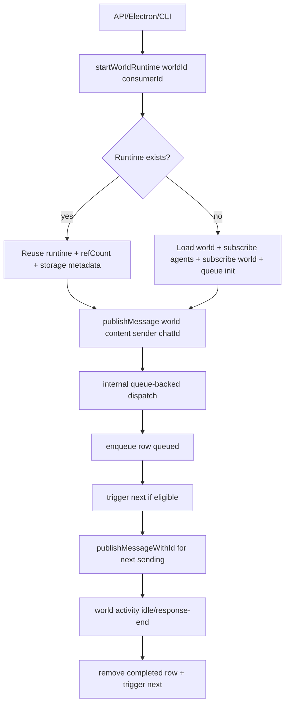

# Plan: Core World Runtime Registry and Queue-Backed Dispatch

**Date:** 2026-03-03  
**Requirements:**
- [req-world-runtime-registry.md](../../reqs/2026/03/03/req-world-runtime-registry.md)
- [req-world-message-dispatch-queue.md](../../reqs/2026/03/03/req-world-message-dispatch-queue.md)

**Estimated Effort:** 1.5-2.5 days

---

## Implementation Summary

This plan introduces a canonical runtime owner in core and converges message ingress so `publishMessage(...)` remains public while queue-backed dispatch becomes the shared internal path.

Implementation is phased to minimize breakage:

1. Introduce runtime registry in core without changing external interfaces.
2. Move startup ownership (load/subscriptions/queue init) behind runtime start.
3. Route direct user send path through queue-backed internal dispatch.
4. Migrate API/Electron runtime acquisition to registry.
5. Add targeted deterministic unit/integration tests.

Guardrails from AR:

1. Queue-backed routing is limited to external user-send ingress.
2. Internal assistant/tool/system publications remain immediate event emissions.
3. Runtime identity must be keyed by storage context + world id.

---

## Architecture Flow

---

## Phase 1: Add Core Runtime Registry

**Goal:** Introduce registry abstraction with idempotent acquire/release and runtime metadata.

- [x] Create `core/world-registry.ts` with function-based API:
  - [x] `startWorldRuntime(worldId, options?)`
  - [x] `getWorldRuntime(worldId)`
  - [x] `releaseWorldRuntime(worldId, consumerId)`
  - [x] `stopWorldRuntime(worldId)`
  - [x] `stopAllWorldRuntimes()`
- [x] Runtime record includes:
  - [x] `world`
  - [x] `runtimeKey` (`storageType + storagePath + worldId`)
  - [x] `refCount` and `consumerIds`
  - [x] `storageType`
  - [x] `storagePath`
  - [x] startup timestamp / diagnostics fields
- [ ] Ensure idempotent startup:
  - [x] no duplicate subscription wiring
  - [x] no duplicate queue listeners/processors
- [x] Normalize storage identity once and reuse for runtime-key generation.
- [x] Export registry APIs via `core/index.ts`.

---

## Phase 2: Canonical Startup Wiring

**Goal:** Make world startup lifecycle explicit and registry-owned.

- [x] Refactor runtime startup internals to consolidate:
  - [x] world load
  - [x] agent message subscriptions
  - [x] world-level subscriptions
  - [x] queue startup for active chat
- [x] Integrate startup recovery at runtime start (`sending -> queued` remains intact).
- [x] Ensure start/refresh paths in `core/subscription.ts` use registry-owned startup flow.
- [x] Preserve existing public subscription behavior (`subscribeWorld`) for compatibility.

---

## Phase 3: Queue-Backed Internal Dispatch

**Goal:** Keep `publishMessage(...)` public while converging to shared internal queue path.

- [ ] Add internal dispatch helper in core managers/events boundary:
  - [x] accepts source metadata (`direct`/`queue`/`retry`)
  - [x] supports optional preassigned messageId
- [x] Update external user-send ingress so `publishMessage(...)` callsites in API/IPC/CLI funnel through queue-backed internal flow.
- [x] Keep internal assistant/tool/system publishers on immediate event path.
- [x] Ensure per-chat ordering remains deterministic and unchanged.
- [x] Preserve stream lifecycle ordering (`start -> chunk -> end/error`) under queued dispatch.

---

## Phase 4: Consumer Migration (API + Electron + CLI)

**Goal:** Use registry as canonical runtime owner across app surfaces.

- [ ] API (`server/api.ts`):
  - [x] acquire runtime from registry for request/stream
  - [x] release runtime on response close/finish
  - [x] preserve SSE/non-streaming semantics
  - [x] confirm no duplicate world forwarding listeners per request lifecycle
- [ ] Electron (`electron/main-process/*`):
  - [x] ensure runtime acquisition uses registry
  - [x] retain current world subscription behavior while removing duplicate startup paths
- [ ] CLI (`cli/index.ts`):
  - [x] interactive mode holds runtime for session
  - [x] one-shot mode acquire/send/release

---

## Phase 5: Tests (Required)

**Goal:** Add deterministic boundary-level coverage for runtime and queue behavior.

- [ ] Unit tests for registry (`tests/core/world-registry.test.ts`):
  - [x] idempotent `startWorldRuntime` for same world
  - [x] distinct runtime instances for same worldId across different storage paths
  - [x] refCount increments/decrements by consumer
  - [x] runtime not destroyed while at least one consumer remains
  - [x] storage metadata exposed correctly
- [ ] Unit tests for queue-dispatch convergence:
  - [x] external user-send ingress enqueues and triggers processing eligibility
  - [x] assistant/tool/system publish paths are not enqueued
  - [x] queue chain advances on idle/response-end only
  - [x] no duplicate processing when concurrent triggers occur
- [ ] Unit tests for startup lifecycle:
  - [x] startup wires subscriptions once
  - [x] startup triggers queue init for active chat
- [ ] Integration tests (per policy, transport/runtime touched):
  - [x] `npm run integration`

---

## Migration Strategy

- [x] Keep `subscribeWorld(...)` API stable; internally delegate runtime acquisition to registry.
- [x] Land registry first with no behavior changes to message dispatch.
- [ ] Enable queue-backed user-send routing behind a temporary feature flag for staged rollout.
- [ ] Remove rollout flag after integration coverage passes.

---

## Risks and Mitigations

- [ ] Risk: behavior drift between streaming and non-streaming paths.
  - [ ] Mitigation: explicit tests for event ordering and payload stability.
- [ ] Risk: duplicate listeners during migration overlap.
  - [ ] Mitigation: idempotent guards in registry + listener count assertions in tests.
- [ ] Risk: API short-lived lifecycle releasing runtimes too aggressively.
  - [ ] Mitigation: hold runtime through stream lifetime; optional TTL reuse in follow-up.
- [ ] Risk: accidental enqueue of internal assistant/tool/system events.
  - [ ] Mitigation: explicit source-scoping checks + unit tests on non-user paths.
- [ ] Risk: duplicate send in multi-process storage access.
  - [ ] Mitigation: define atomic queue claim behavior or document single-process guarantee until claim semantics land.

---

## Definition of Done

- [x] Registry is the canonical runtime owner in core.
- [x] `publishMessage(...)` remains public and caller-compatible.
- [x] Internal dispatch is queue-backed for user-send flow.
- [x] Queue startup is tied to runtime start lifecycle.
- [x] API/Electron/CLI use shared runtime acquisition contract.
- [x] Targeted unit tests added/updated and passing.
- [x] `npm run integration` passes.
