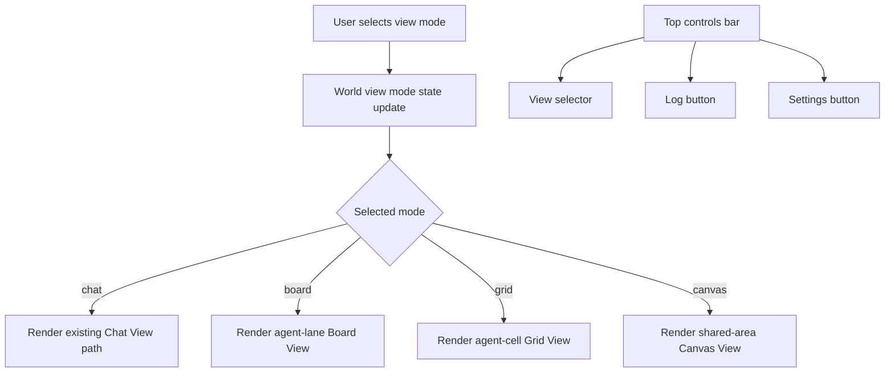

# Plan: Electron World View Modes and View Selector

**Date:** 2026-03-04  
**Requirements:**
- [req-electron-world-view-modes.md](../../reqs/2026/03/04/req-electron-world-view-modes.md)

**Estimated Effort:** 1-2 days

---

## Implementation Summary

Add typed world view modes in the Electron renderer (`chat`, `board`, `grid`, `canvas`), preserve current rendering as `Chat View`, introduce alternate visual layouts (`Board`, `Grid`, `Canvas`), and add a top-level view selector positioned immediately left of `Log` and `Settings`.

## AR Notes (REQ/AP Loop)

- Reviewed architectural risk: introducing new views could break existing chat message rendering and control layout.
- Decision: keep `Chat View` as the existing rendering path and treat other modes as additive render strategies.
- Decision: maintain existing message ordering semantics in all views.
- Decision: keep controls stable by adding selector beside existing top-right actions (`Log`, `Settings`) without removing current buttons.
- Decision: separate state typing, selector UI, and rendering adapters into small phases to reduce regression risk.

No major architectural flaws remain for implementation with this phase order.

## Architecture Flow

## Phase 1: Type and State Foundations

- [x] Identify current world view/message rendering state location in Electron renderer.
- [x] Add typed world view mode union (`chat | board | grid | canvas`) at domain/state boundary.
- [x] Add typed grid layout option model to support `1+2`, `2+2`, `2+2` values.
- [x] Ensure initial/default mode is `chat`.
- [x] Add targeted unit tests for default mode and valid mode transitions.

## Phase 2: Top Controls - View Selector

- [x] Add a view selector control in the top screen controls region.
- [x] Place selector immediately left of existing `Log` and `Settings` buttons.
- [x] Populate selector options: `Chat View`, `Board View`, `Grid View`, `Canvas View`.
- [x] Wire selector change events to view mode state updates.
- [x] Add targeted renderer/UI tests for selector visibility, option list, and placement intent.

## Phase 3: Chat View Preservation

- [x] Explicitly route `chat` mode to existing message rendering implementation.
- [x] Validate no visual/behavior regression in current message display.
- [x] Add regression unit test proving chat rendering parity when mode is `chat`.

## Phase 4: Board View Rendering

- [x] Add `board` render strategy that groups agent messages by agent identity.
- [x] Render each agent group in its own vertical lane.
- [x] Keep user messages visible with clear conversation continuity.
- [x] Add targeted tests for lane grouping and message visibility.

## Phase 5: Grid View Rendering

- [x] Add `grid` render strategy that groups agent messages into agent-specific cells.
- [x] Implement selectable grid layout options: `1+2`, `2+2`, `2+2`.
- [x] Ensure switching grid option updates arrangement without dropping messages.
- [x] Add targeted tests for cell grouping and grid option switching.

## Phase 6: Canvas View Rendering

- [x] Add `canvas` render strategy to show all agent messages in one shared area (`div`/canvas region).
- [x] Preserve message visibility and contextual continuity with user messages.
- [x] Add targeted tests for single-area rendering behavior.

## Phase 7: Verification and Hardening

- [x] Run targeted tests for touched Electron renderer/domain files.
- [x] Run broader test command(s) required by repo policy for affected areas.
- [x] Verify top controls responsiveness and usability for desktop/mobile layouts used by Electron renderer.
- [x] Validate no regressions in message/event lifecycle behaviors.

## Risks and Mitigations

- [ ] Risk: new layouts may diverge from canonical message chronology.
  - [ ] Mitigation: preserve source order and apply layout-only transformations.
- [ ] Risk: selector placement could disrupt top action controls.
  - [ ] Mitigation: enforce selector-before-log/settings ordering in component structure and tests.
- [ ] Risk: grid option semantics may be ambiguous due duplicate `2+2` entry.
  - [ ] Mitigation: implement verbatim required options first, then follow-up clarification if product intent changes.

## Definition of Done

- [x] Typed world view mode support exists for `chat`, `board`, `grid`, `canvas`.
- [x] `Chat View` preserves current rendering as default.
- [x] `Board View`, `Grid View`, and `Canvas View` render per requirements.
- [x] Top view selector is present and placed left of `Log` and `Settings`.
- [x] Targeted tests are added/updated and passing.
- [x] No regression in existing Electron message rendering behavior.
