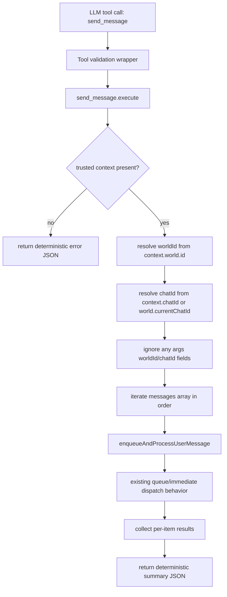

# Plan: Implement Built-in send_message Tool With Trusted Context Injection

**Date:** 2026-03-04  
**Requirements:**
- [req-send-message-tool-context-injection.md](../../reqs/2026/03/04/req-send-message-tool-context-injection.md)

**Estimated Effort:** 0.5-1 day

---

## Implementation Summary

Implement a new built-in `send_message` tool that accepts an array of messages and dispatches them through existing core message-ingress boundaries while injecting required routing context (`worldId`, `chatId`) from trusted tool execution context.

The implementation preserves existing queue/event semantics by calling existing manager dispatch APIs instead of introducing a parallel publish path.

## AR Notes (REQ/AP Loop)

- Reviewed major risk: context spoofing via tool arguments.
- Decision: do not include `worldId` or `chatId` in public tool parameters.
- Decision: hard-fail when trusted context is missing.
- Decision: preserve existing sender-based queue behavior by delegating to existing manager API.
- Decision: lock input shape to `messages: Array<string | { content: string; sender?: string }>`.
- Decision: use queue-safe result semantics (`accepted`/`dispatched`), not delivery claims (`sent`).

No major architectural flaws remain for implementation after the above clarifications.

## Architecture Flow

## Phase 1: Add Tool Module

- [x] Create `core/send-message-tool.ts`.
- [x] Add file-header comment block with purpose/features/notes/recent changes.
- [x] Define argument and context types:
  - [x] `messages` input shape: `Array<string | { content: string; sender?: string }>`
  - [x] context with `world` and `chatId`
- [x] Implement validation/normalization helpers.
- [x] Implement `createSendMessageToolDefinition()` with:
  - [x] description
  - [x] JSON schema
  - [x] execute function returning JSON string

## Phase 2: Trusted Context Injection

- [x] In execute path, resolve trusted routing context:
  - [x] `worldId` from `context.world.id`
  - [x] `chatId` from `context.chatId` fallback `world.currentChatId`
- [x] Reject execution if required routing context is missing.
- [x] Ignore any caller-provided routing identifiers in root args and message entries.

## Phase 3: Dispatch Integration

- [x] Delegate each message entry to `enqueueAndProcessUserMessage(...)`.
- [x] Preserve array order and accumulate per-item status.
- [x] Keep queue-backed user sender behavior and immediate non-user behavior unchanged by using existing manager API.
- [x] Return deterministic tool result summary:
  - [x] resolved context
  - [x] requested/accepted/dispatched/error counts
  - [x] per-item statuses

## Phase 4: Built-in Registration

- [x] Register `send_message` in `core/mcp-server-registry.ts` built-in tool set.
- [x] Ensure wrapped validation path uses `wrapToolWithValidation`.
- [x] Update built-in tool comments/docs in that module.

## Phase 5: Targeted Unit Tests

- [x] Add `tests/core/send-message-tool.test.ts` covering:
  - [x] missing context returns deterministic error
  - [x] sends array entries in order through manager API
  - [x] ignores model-supplied routing fields
  - [x] validates shorthand string entries and object entries
  - [x] verifies queue-safe result semantics (dispatched/enqueued wording)
- [x] Update integration-style built-in tool availability coverage in:
  - [x] `tests/core/shell-cmd-integration.test.ts`
  - [x] `tests/core/mcp-server-registry.test.ts` (if needed for mocked built-ins)

## Phase 6: Verification

- [x] Run targeted tests for touched files.
- [ ] Run repository test command (`npm test`) if change scope requires broader validation.
- [x] Confirm no regression in existing built-in tool registration behavior.

## Risks and Mitigations

- [ ] Risk: accidental routing by untrusted args.
  - [ ] Mitigation: no routing fields in schema + context-only routing resolution.
- [ ] Risk: chat context missing in some tool execution paths.
  - [ ] Mitigation: deterministic fail-fast error with explicit reason.
- [ ] Risk: behavior drift from existing queue semantics.
  - [ ] Mitigation: route through existing `enqueueAndProcessUserMessage` boundary.

## Definition of Done

- [x] `send_message` is available as a built-in tool.
- [x] Tool accepts message array and dispatches via trusted context only.
- [x] Missing context fails safely and deterministically.
- [x] Targeted unit tests added/updated and passing.
- [x] No regression to existing built-in tool behavior.
