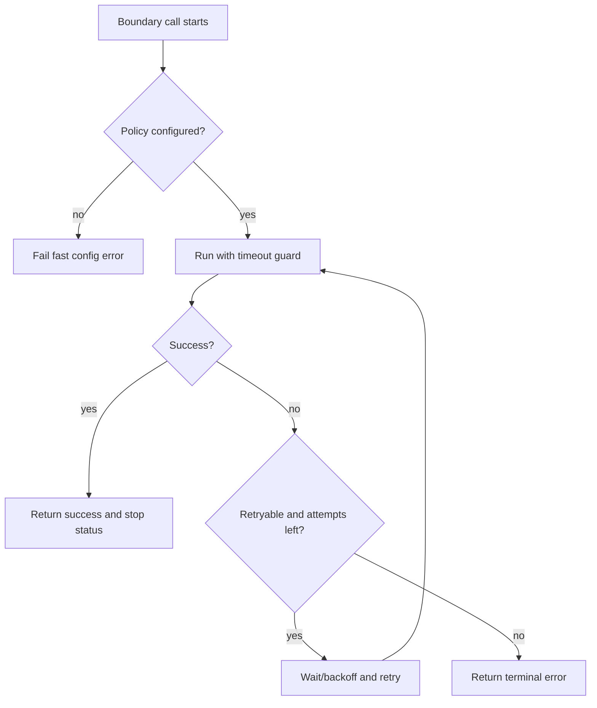

# Plan: Tool Runtime Timeout/Retry Reliability and Status

**Date:** 2026-03-05  
**Last Updated:** 2026-03-05 (implementation + config centralization)  
**Req:** `.docs/reqs/2026/03/05/req-tool-wait-retry-system-status.md`

---

## Objective

Implement bounded timeout/retry/backoff/escalation behavior across tool runtime boundaries, and emit deterministic chat-scoped wait/retry status updates without breaking stream ordering or world/chat isolation.

---

## Coverage Map (Scenario -> Plan Phase)

1. MCP discovery hard timeout -> Phase 2
2. MCP execution reconnect + bounded retry -> Phase 3
3. Queue redispatch exponential backoff -> Phase 4
4. Queue retry exhaustion -> error -> Phase 4
5. Queue `no responder started` timeout guard -> Phase 4
6. Shell execution timeout/terminate -> Phase 5
7. Web fetch abort timeout -> Phase 6
8. LLM warning + hard timeout -> Phase 7
9. Empty post-tool continuation bounded retry -> Phase 7
10. Agent load retry with short delay -> Phase 8
11. Storage wrapper retries (file/sqlite) -> Phase 8
12. SQLite busy timeout -> Phase 8
13. Chat-scoped per-second status updates for wait/retry phases -> Phase 1 and cross-phase integration

---

## Architecture Direction

- Use a shared reliability policy contract (timeouts, attempts, delays, terminal mappings) with per-boundary adapters.
- Centralize default timeout/retry/backoff values in one shared reliability config module.
- Keep ownership local to each subsystem (MCP, queue, shell, web fetch, LLM, storage) to avoid cross-layer coupling.
- Reuse one chat-scoped wait-status emitter for user-visible progress in applicable wait windows.
- Preserve existing event contracts and streaming lifecycle ordering.

---

## Phase 1 - Shared Reliability Contracts and Status Emitter

- [x] Define boundary policy schema:
  - timeout duration,
  - max attempts,
  - retry delay strategy,
  - terminal error category.
- [x] Centralize boundary default timeout/retry configuration and env parsing in shared reliability config module.
- [x] Define deterministic error categories for timeout/retry exhaustion/transport failures.
- [x] Implement or finalize shared wait-status emitter contract:
  - immediate first emission + 1-second cadence while active,
  - elapsed seconds always,
  - remaining seconds when known,
  - retry counters where applicable.
- [x] Ensure no-context executions never emit chat-visible status.
- [x] Ensure stop/cleanup behavior on all exits (success/failure/abort).

---

## Phase 2 - MCP Tool Discovery Timeout

- [x] Add hard timeout around MCP tool discovery/list operations.
- [x] Ensure timeout result is deterministic and does not leave pending promises.
- [x] Ensure discovery timeout handling does not leak chat-visible status when no world/chat context exists.
- [x] Add focused tests for discovery timeout success/failure boundaries.

---

## Phase 3 - MCP Tool Execution Reconnect + Retry

- [x] Add transport-failure reconnect path with bounded retry attempts for MCP tool execution.
- [x] Integrate status emission for chat-scoped retry waits (attempt counters required).
- [x] Ensure both AI-converted and direct MCP execution paths share the same bounded semantics.
- [x] Preserve existing stream ordering and explicit error emission on exhaustion.
- [x] Add targeted tests for reconnect success and retry exhaustion.

---

## Phase 4 - Queue Dispatch Reliability

- [x] Add delayed exponential backoff redispatch for transient queue send failures.
- [x] Add max-attempt cap and terminal error transition when exhausted.
- [x] Add queue send-state timeout guard for `no responder started`.
- [x] Route queue timeout through retry path first, then error path on exhaustion.
- [x] Emit deterministic system/status updates for chat-scoped waits.
- [x] Add targeted tests for:
  - retry schedule behavior,
  - exhaustion to error,
  - no-responder timeout transition.

---

## Phase 5 - Shell Command Timeout Enforcement

- [x] Enforce per-command hard execution timeout.
- [x] Terminate long-running command/process tree on timeout.
- [x] Map result to deterministic `timed_out` outcome.
- [x] Ensure timeout completion publishes final tool/error events without lifecycle drift.
- [x] Add targeted tests for normal completion vs timed-out termination.

---

## Phase 6 - Web Fetch Timeout via Abort

- [x] Enforce per-request timeout using abort signals.
- [x] Ensure aborted fetch maps to timeout error category.
- [x] Ensure no stuck pending fetches after timeout.
- [x] Add targeted tests for success path and timeout abort path.

---

## Phase 7 - LLM Timeout, Warning, and Empty-Continuation Retry

- [x] Add per-call LLM warning threshold event (`taking too long`) before hard timeout.
- [x] Add per-call hard timeout termination and deterministic timeout error mapping.
- [x] Add bounded continuation retry when post-tool LLM follow-up output is empty.
- [x] Ensure bounded continuation retry cannot loop indefinitely.
- [x] Add targeted tests for:
  - warning then success,
  - warning then hard timeout,
  - empty continuation recovery vs exhaustion.

---

## Phase 8 - Storage and SQLite Reliability

- [x] Add short-delay retry for agent load at call sites that read from storage.
- [x] Add bounded retry+delay in storage wrappers for file/sqlite agent loads.
- [x] Configure sqlite busy timeout to wait on brief lock contention.
- [x] Ensure retries preserve deterministic final error mapping when exhausted.
- [x] Add targeted tests with mocked storage/sqlite wrappers (no real filesystem/sqlite file).

---

## Phase 9 - Integration and Regression Validation

- [x] Run targeted unit tests for all changed boundaries.
- [x] Run `npm run integration` (required for API transport/runtime path changes).
- [x] Verify streaming and non-streaming behavior parity.
- [x] Verify world/chat isolation and no cross-world status leakage.
- [x] Verify no orphan timers or pending operations after abort/failure.

---

## Options and Tradeoffs (AR)

1. Retry ownership model
   - Option A: one centralized global retry engine.
   - Option B: per-boundary retry implementations with a shared contract helper.
   - Decision: Option B, because boundary semantics differ and global coupling risks regression.
2. Backoff strategy for queue redispatch
   - Option A: fixed delay.
   - Option B: exponential backoff with cap.
   - Decision: Option B for improved transient failure recovery and bounded retry windows.
3. Empty continuation behavior
   - Option A: fail immediately on empty output.
   - Option B: bounded continuation retries then fail.
   - Decision: Option B to reduce silent stalls from transient empty follow-ups.

---

## Risks and Mitigations

- Risk: timer leaks/orphan retries.
  - Mitigation: explicit stop handles, `finally` cleanup, fake-timer unit tests.
- Risk: retry storms under repeated failures.
  - Mitigation: bounded attempts + exponential backoff + terminal escalation.
- Risk: event ordering regressions in streaming paths.
  - Mitigation: preserve existing lifecycle path and validate sequencing in tests.
- Risk: behavior drift between streaming and non-streaming paths.
  - Mitigation: shared boundary contracts and integration validation for both modes.

---

## Exit Criteria

- All 12 reliability scenarios are implemented with bounded deterministic behavior.
- Chat-scoped wait/retry status visibility is present and isolated correctly.
- No indefinite hangs remain on covered boundaries.
- Targeted unit tests pass with deterministic mocks/fake timers.
- `npm run integration` passes for transport/runtime regression safety.

---

## AR Findings and Resolutions

1. High: Previous plan scope only covered status visibility and left reliability controls undefined.
  - Resolution: expand phases to include timeout/retry/backoff/escalation controls for all listed boundaries.
2. High: Approval-process plan (2025-11-03) was incorrectly used as reliability coverage evidence.
  - Resolution: use this dedicated 2026-03-05 reliability plan as the authoritative implementation plan.
3. Medium: Missing explicit mapping between scenarios and implementation tasks.
  - Resolution: add scenario-to-phase coverage map and phase-specific acceptance work.
