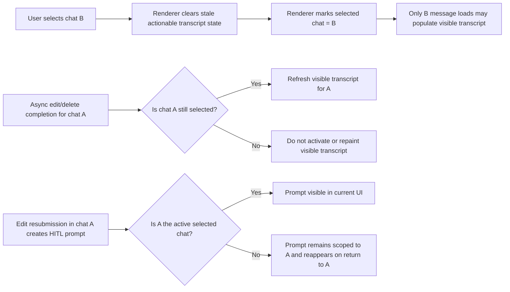

# AP: Fix Electron Edit and Chat Switch Isolation

**Date:** 2026-03-06  
**Status:** Proposed  
**Related REQ:** `.docs/reqs/2026/03/06/req-electron-edit-chat-switch-isolation.md`

## Overview

Fix the Electron renderer so chat switching, message editing, message deletion, message refresh, and HITL prompt visibility remain strictly scoped to the active selected chat. The implementation is expected to stay renderer-scoped unless code inspection during implementation proves a remaining backend coupling that cannot be resolved from the renderer.

## Architecture Decisions

- **AD-1:** The renderer-selected chat is the authority for what transcript may be shown and what chat-scoped async results may mutate the visible message list.
- **AD-2:** Switching chats clears actionable stale transcript state before the next chat becomes interactable.
- **AD-3:** Edit and delete operations may complete for their owning chat, but their follow-up UI refresh work may only affect the currently selected chat.
- **AD-4:** Chat-scoped HITL visibility follows the active selected chat subscription; prompts for another chat are recoverable through normal return-to-chat replay, not by cross-chat display.
- **AD-5:** The first implementation pass remains in Electron renderer state management and tests; expanding to main/core requires a fresh AR pass.
- **AD-6:** All async transcript-apply entry points in the renderer must consume one shared selected-chat isolation rule; no path may hand-roll different apply semantics.
- **AD-7:** Visible active-chat refresh and non-visible follow-up work must be separated explicitly so background completion for another chat cannot implicitly reactivate backend session state.

## Target Components

```text
electron/renderer/src/
  App.tsx                              selected-chat message refresh gating
  hooks/useSessionManagement.ts        chat switch flow and stale transcript clearing
  hooks/useMessageManagement.ts        edit/delete follow-up refresh behavior and edit-state scoping
  hooks/useChatEventSubscriptions.ts   verify current chat remains the subscription authority
  domain/*                             extract small pure guard helpers if needed for testability

tests/electron/renderer/
  new renderer regression coverage for stale session/apply guards
  updated existing renderer tests if shared helpers move
```

## Target Flow



## Phases and Tasks

### Phase 1 - Introduce explicit selected-chat apply guards
- [x] Identify every renderer path that can apply message arrays after an async boundary.
- [x] Identify every renderer path that can activate backend session state as part of transcript refresh or switch completion.
- [x] Centralize the selected-chat guard for:
  - message refresh apply,
  - optional backend session activation during refresh,
  - stale async result discard.
- [x] Keep the guard logic as a small pure function or module so targeted unit tests can exercise it directly.
- [x] Ensure both known transcript-apply paths are wired through the same guard:
  - `useSessionManagement` switch-prefetch apply,
  - `App.tsx` centralized `refreshMessages()` flow.

### Phase 2 - Fix chat switch stale transcript behavior
- [x] Update `onSelectSession()` to clear the full previous transcript (not just transient errors) immediately before the prefetch starts.
- [x] Add a staleness guard to the `onSelectSession()` prefetch `void` block using `messageRefreshCounter` so a later chat switch can discard the in-flight response.
- [x] Ensure previous chat message actions are no longer clickable while the new chat is loading.
- [x] Ensure the session-switch path cannot succeed visually while leaving a second transcript loader with weaker isolation semantics.
- [x] Preserve existing successful same-chat load behavior and status messaging.

### Phase 3 - Fix edit/delete follow-up refresh contamination
- [x] Split `refreshMessages()` (or introduce a companion) into two explicit paths: a visible-chat path that calls `api.selectSession()` only when `targetChatId === selectedSessionId`, and a background path that fetches without activating backend session state.
- [x] Route edit follow-up `refreshMessages()` calls through the background path when `targetChatId !== selectedSessionId` at the time of completion.
- [x] Route delete follow-up `refreshMessages()` calls through the same background-path guard.
- [x] Ensure renderer state used for these decisions reads the latest `selectedSessionId` at call time, not a stale closure snapshot from when the edit/delete began.
- [x] Keep same-chat edit/delete refresh behavior intact when the user does not switch chats mid-operation.

### Phase 4 - Fix chat-scoped edit UI and HITL visibility
- [x] Clear `editingMessageId` / `editingText` on chat switch (trigger from `onSelectSession()` or a `useEffect` on `selectedSessionId`).
- [x] Clear `deletingMessageId` on chat switch with the same mechanism.
- [x] Filter `hitlPromptQueue` on chat switch to retain only prompts whose `chatId` matches the newly selected session; do not discard prompts with a null or matching `chatId` so existing behavior is preserved.
- [x] Preserve the current rule that HITL prompts are chat-scoped.
- [x] Verify that a prompt created for a non-visible chat is not shown in the active visible chat and is still recoverable when returning to its owning chat.

### Phase 5 - Targeted regression coverage
- [x] Add renderer unit coverage for the selected-chat guard logic.
- [x] Add regression coverage for stale async refresh results after a chat switch.
- [x] Add regression coverage for edit/delete follow-up behavior after the user navigates away.
- [x] Add regression coverage for edit-state clearing on chat switch.
- [x] Add regression coverage proving both renderer transcript-apply entry points use the same selected-chat guard behavior.
- [x] Keep the new/updated test count targeted and deterministic.

### Phase 6 - Verification
- [x] Run focused Vitest suites for the touched Electron renderer tests.
- [x] Run Electron TypeScript check.
- [x] If implementation expands beyond renderer into main/core runtime activation behavior, rerun AR before proceeding and add any newly required verification commands.

## Implementation Notes

- Prefer fixing the renderer race and stale-apply logic before touching IPC or core.
- Avoid broad resets that would break concurrent per-chat send/stop state unless the state is specifically edit/delete-local.
- If a shared helper is extracted for chat-refresh gating, keep it renderer-only and React-independent.
- Maintain the current chat-scoped realtime subscription model; the plan is to stop stale renderer state from fighting that model, not to weaken chat filtering.

## Risks and Mitigations

| Risk | Mitigation |
|------|------------|
| Clearing transcript too aggressively causes visible flicker or welcome-state regressions | Clear or hide stale transcript while explicitly preserving loading-state behavior for the new selected chat |
| Guarding refresh apply without guarding backend activation still changes session state behind the UI | Apply the same selected-chat rule to both visual apply and optional backend activation |
| Fix introduces loss of same-chat edit/delete refresh behavior | Keep same-chat follow-up refresh explicitly allowed and cover it with targeted regression tests |
| Overbroad reset breaks per-chat concurrent send/stop indicators | Limit chat-switch resets to edit/delete-local UI state rather than full message runtime state |
| HITL prompt appears to vanish permanently | Preserve the normal replay/restore path and test return-to-chat recovery explicitly |
| Implementation reveals a remaining main/core coupling | Stop and run another AR pass before broadening scope beyond renderer |

## Architecture Review (AR)

### High-Priority Issues

1. **Stale transcript actions remain live after chat switch.**
   - This is the most user-visible bug and the easiest way to edit the wrong chat while believing the new chat is active.

2. **Late async apply is currently more dangerous than late async fetch.**
   - The bug is not only "old request finishes late"; it is also "late completion is still allowed to mutate current UI and session activation."

3. **Edit/delete follow-up refresh is the renderer path most likely to create backend/frontend chat drift.**
   - If the implementation only clears stale rows on switch but still lets old mutation follow-up paths activate another chat, the core symptom remains.

4. **HITL invisibility is a consequence of chat drift, not an independent prompt-generation bug.**
   - The plan should not rewrite HITL generation. It should keep the renderer from being subscribed to one chat while visually operating on another.

### New Issues Found and Fixed (AR Pass 2, 2026-03-06)

1. **Two async transcript-apply paths exist today, not one.**
   - `useSessionManagement` writes prefetched history directly, while `App.tsx` also owns a central `refreshMessages()` path. A one-path fix would leave the race alive in the other path.

2. **Activation and apply can drift separately.**
   - Guarding `setMessages(...)` alone is insufficient if an async path still calls backend `selectSession(...)` for a non-visible chat.

### New Issues Found (AR Pass 3, 2026-03-06 — code inspection)

1. **`onSelectSession()` prefetch has no staleness guard.**
   - `useSessionManagement.ts:116–132`: `void (async () => { ... setMessages(history) })()` fires without reading `messageRefreshCounter`. If the user switches to a third chat before this prefetch resolves, the stale response overwrites the newly selected transcript with no check.

2. **`refreshMessages()` calls `api.selectSession()` before any staleness check.**
   - `App.tsx:579`: `await api.selectSession(worldId, sessionId)` executes unconditionally before the `messageRefreshCounter` guard at line 586. Edit and delete follow-up both call `refreshMessages(worldId, targetChatId)` where `targetChatId` is the message's owning chat, not necessarily the currently selected one. If the user has switched chats, this activates the wrong backend session even if the counter guard prevents the visual apply.

3. **`messageRefreshCounter` guards visual apply only — not backend activation or the prefetch.**
   - The counter in `refreshMessages()` is checked at `App.tsx:586`, but `api.selectSession()` at line 579 has already executed. The `onSelectSession()` prefetch path at `useSessionManagement.ts:116–132` never reads the counter at all.

4. **`hitlPromptQueue` is not cleared on chat switch.**
   - `App.tsx:229`: the queue is a global `useState<HitlPrompt[]>([])`. Prompts carry a `chatId` field but no filter clears them when `selectedSessionId` changes. A HITL prompt for chat A remains visible and actionable while the user is on chat B.

5. **`editingMessageId` and `deletingMessageId` are not cleared on chat switch.**
   - Both are local state in `useMessageManagement`. No cleanup fires when `selectedSessionId` changes, so inline edit UI and delete spinners from the previous chat persist into the new chat's view.

6. **`onSelectSession()` only clears transient errors, not the full transcript.**
   - `useSessionManagement.ts:113`: `clearChatTransientErrors()` removes only error-level log messages for the previous chat. The body of the previous transcript (user/assistant messages) stays visible during the new chat's load window, leaving stale actionable rows on screen.

### Resolutions in Plan

1. Clear or hide stale actionable transcript state immediately on switch.
2. Add one shared selected-chat guard around both message apply and optional backend activation.
3. Explicitly wire both renderer transcript-apply entry points through that same guard.
4. Update edit/delete follow-up paths to respect the latest selected chat before mutating the visible transcript.
5. Keep HITL logic chat-scoped and validate return-to-chat replay rather than broadening prompt display.
6. Add a staleness guard to the `onSelectSession()` prefetch path using `messageRefreshCounter` so it can be cancelled by a later chat switch.
7. Split `refreshMessages()` into a visible-chat apply path (that calls `api.selectSession()` only when the target chat is still selected) and a non-activating background fetch path (for edit/delete follow-up on a non-visible chat).
8. Clear `hitlPromptQueue` on chat switch, filtering to retain only prompts whose `chatId` matches the newly selected chat.
9. Clear `editingMessageId` and `deletingMessageId` on chat switch.
10. Clear the full previous transcript (not just transient errors) immediately when `onSelectSession()` begins, before the prefetch resolves.

### Tradeoffs

- **Strict selected-chat gating (selected)**
  - Pros: deterministic renderer behavior, no stale action leakage, minimal scope, aligns with existing chat-scoped subscriptions.
  - Cons: slightly less aggressive speculative preloading and more explicit guard code.

- **Keep optimistic cross-chat preload and patch individual bugs (rejected)**
  - Pros: fewer initial edits.
  - Cons: preserves the race surface and makes future cross-chat regressions likely.

### AR Exit Condition

- No renderer path may display actionable transcript content for a chat other than the active selected chat.
- No stale async edit/delete/history completion may reactivate or repaint a non-selected chat in the visible transcript.
- HITL visibility remains chat-scoped; `hitlPromptQueue` is filtered on chat switch to remove prompts that do not belong to the newly selected chat.
- Both known renderer transcript-apply entry points (`onSelectSession()` prefetch and `refreshMessages()`) are guarded by the same `messageRefreshCounter`-based staleness check.
- `refreshMessages()` calls `api.selectSession()` only when the target chat is still the active selected chat; edit/delete follow-up for a non-visible chat must not change backend active session state.
- `editingMessageId`, `editingText`, and `deletingMessageId` are cleared on every chat switch.
- The full previous transcript (not just transient errors) is cleared before the new chat's history is interactable.

## Verification Commands (planned)

- `npx vitest run tests/electron/renderer/*chat* tests/electron/renderer/*session*`
- `npx vitest run tests/electron/renderer/*message*`
- `npm run check --prefix electron`

## Rollout Gate

Proceed to implementation only when this plan is approved and the following remain true:
1. The first implementation pass stays renderer-scoped.
2. Selected-chat gating is applied to both async message apply and any renderer-triggered backend activation.
3. Both renderer transcript-apply entry points are wired to the same guard before the implementation is considered complete.
4. Targeted regression coverage is defined before code changes begin.
