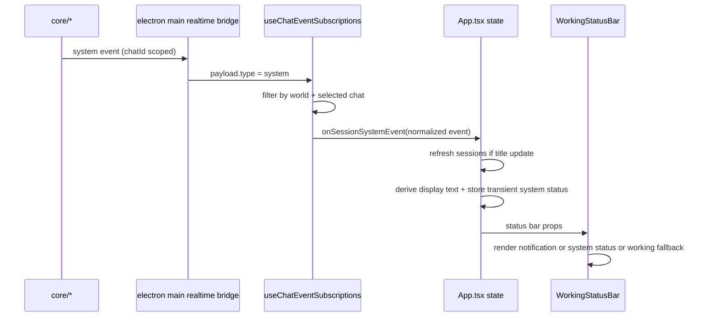

# Plan: Electron Status Bar System Event Visibility

**Date:** 2026-03-06
**Req:** `.docs/reqs/2026/03/06/req-electron-system-event-status-bar.md`
**Status:** SS implemented

---

## Architecture Notes

The realtime transport path needed for this feature already exists.

- Core already emits chat-scoped `system` events for title updates, timeout statuses, retry countdowns, and other operational notifications.
- Electron main-process serialization already forwards realtime `system` events with `eventType`, `content`, `messageId`, `createdAt`, and `chatId`.
- The renderer chat subscription path already filters `system` events by world and selected chat, then forwards them through `onSessionSystemEvent`.
- The current Electron status bar is still App-local and only knows about:
  - transient renderer notifications,
  - working agent indicators,
  - completion state.

This means the implementation can stay entirely within the Electron renderer unless code review during implementation uncovers a missing transport edge case.

For this story, only explicitly chat-scoped system events are eligible for the chat status bar. If implementation uncovers a producer that is intended for status-bar visibility but does not emit an explicit chat association, that producer must be hardened before renderer work for that event family is considered complete.

---

## Key Design Decisions

1. **Keep system-event visibility renderer-only.**
   No core, server, or main-process contract change is planned by default. This remains true only while the relevant status-event producers continue to emit explicit chat-scoped events.

2. **Use a dedicated status-bar system-event state separate from transcript/message state.**
   System events will be shown in the status bar only. They will not be inserted into the conversation message list and will not affect message counting.

3. **Keep the existing system-event ingress path.**
   `createChatSubscriptionEventHandler()` remains the chat-scoped event entry point. The renderer will extend the callback flow rather than inventing a second listener path.

4. **Require explicit chat scoping for supported status events.**
   The status bar will only display system events that are explicitly associated with a chat. Unscoped system events are excluded rather than heuristically mapped onto the selected chat.

5. **Preserve title-update side effects while adding visible status.**
   `chat-title-updated` must continue refreshing session metadata and also produce human-readable status-bar text.

6. **Adopt explicit status-bar precedence.**
   The renderer needs deterministic ordering between competing status sources:
   - local renderer notifications,
   - session-scoped system-event status,
   - working/completed fallback state.

7. **Keep system-event status transient rather than permanently sticky.**
   System-event overlays should expire or be superseded so old title/timeout/retry text does not permanently suppress the normal working/done status bar states. Repeated live events such as retry countdowns naturally refresh the displayed text.

8. **Use generalized formatting with event-specific enrichment only where needed.**
   The renderer should support both plain-string system content and structured content objects. `chat-title-updated` can receive richer formatting, but the fallback path must still display other human-readable system events without custom renderer work per event type.

---

## Event Flow

---

## Phases and Tasks

### Phase 1 — Add a Renderer System-Status Model

Goal: isolate formatting and precedence logic from the top-level App component.

- [x] Add a pure renderer-domain utility for converting normalized session system events into status-bar display state.
- [x] Support both payload families:
  - structured object content with fields such as `eventType`, `title`, `message`,
  - plain string content.
- [x] Define a normalized display shape for the status bar, for example:
  - text,
  - kind/severity,
  - source event type,
  - createdAt / freshness metadata if needed for expiry.
- [x] Add explicit formatting rules:
  - `chat-title-updated` becomes clear user-facing text containing the new title when available,
  - plain timeout/retry strings pass through as visible text,
  - structured payloads with `message` fall back to that message,
  - unknown but human-readable system payloads still render sensible fallback text.

### Phase 2 — Extend Renderer Subscription Wiring

Goal: let App receive selected-chat system events without duplicating subscription logic.

- [x] Extend `useChatEventSubscriptions()` to accept an app-level session-system callback in addition to its current internal title-refresh handling.
- [x] Keep the current selected-chat/world filtering behavior unchanged.
- [x] Treat explicit chat scoping as a hard gate: events without a concrete chat association remain excluded from the chat status bar.
- [x] Preserve the existing `chat-title-updated` session refresh side effect.
- [x] Forward normalized session-scoped system events to the new app-level callback after filtering.
- [x] Confirm that plain-string system events still arrive with normalized `eventType` and `content` through the existing path.

### Phase 2.5 — Audit Relevant Event Producers for Explicit Chat Scoping

Goal: verify that every event family covered by this story is explicitly chat scoped and does not depend on implicit fallback context.

- [x] Verify title-update system events are emitted with a concrete chat ID.
- [x] Verify timeout-status system events are emitted with a concrete chat ID.
- [x] Verify retry-tracking system events are emitted with a concrete chat ID.
- [x] If any event family intended for status-bar visibility is not explicitly chat scoped, update the implementation plan before SS continues and harden that producer as part of the story.

### Phase 3 — Add App-Level System-Status State and Lifecycle

Goal: integrate session-scoped system-event display into the existing status-bar state model.

- [x] Add dedicated App state for the active session's system-event status overlay.
- [x] Add deterministic lifecycle rules:
  - clear system-event status when the selected chat changes,
  - clear system-event status when the loaded world changes,
  - replace prior system-event status when a newer selected-chat system event arrives,
  - auto-clear expired transient system-event status so fallback working/done state can reappear.
- [x] Route the `useChatEventSubscriptions()` session-system callback into this new state.
- [x] Keep the existing local `setStatusText()` path for renderer-triggered notifications unchanged.
- [x] Ensure title updates still call `refreshSessions()` and also populate the new status-bar system-event state.

### Phase 4 — Update WorkingStatusBar Rendering Contract

Goal: render system-event status cleanly without breaking current notification/activity behavior.

- [x] Extend `WorkingStatusBar` props to accept system-event status-bar content separately from local notifications.
- [x] Implement precedence explicitly in the component contract:
  - local notification first,
  - active system-event status second,
  - working/completed fallback last.
- [x] Preserve current idle-row mounting behavior.
- [x] Preserve current completion rendering when no higher-priority overlay is active.
- [x] Use the same compact one-line visual treatment already used by notifications so the status bar remains stable.

### Phase 5 — Add Focused Automated Coverage

Goal: cover the new behavior at the renderer unit boundary without resorting to broad end-to-end tests.

- [x] Add pure unit tests for the new system-status formatting utility.
  - structured title-update payload -> readable title status text,
  - plain timeout string -> readable pass-through status,
  - generic structured payload with `message` -> fallback display text.
- [x] Extend `tests/electron/renderer/chat-event-handlers-domain.test.ts` only as needed to confirm system events still reach the callback for the selected chat and remain filtered for non-selected chats.
- [x] Extend `tests/electron/renderer/working-status-bar.test.ts` to cover rendering precedence:
  - notification overrides system-event status,
  - system-event status overrides working/done fallback,
  - idle fallback still renders empty mounted row when no overlay exists.
- [x] Add a focused App- or hook-level unit test for lifecycle behavior:
  - selected-chat system event updates visible status,
  - switching chats clears or replaces prior chat-scoped system status,
  - repeated retry events replace earlier retry text.
- [x] Add or update tests that confirm unscoped system events are not displayed in the chat status bar.

### Phase 6 — Verify No Contract Drift

Goal: ensure the implementation remains in scope and does not accidentally change non-target behavior.

- [x] Confirm no message-list rendering path treats system events as transcript messages.
- [x] Confirm no main-process transport change is required; if one is unexpectedly needed, update this plan before implementation continues.
- [x] Confirm all supported status-event producers remain explicitly chat scoped; do not rely on `currentChatId` fallback semantics for eligibility.
- [x] Confirm local renderer notifications still behave as before.
- [x] Run targeted renderer tests plus the required project test command once code is implemented.

---

## File Changelist

| File | Change type | Notes |
|---|---|---|
| `electron/renderer/src/hooks/useChatEventSubscriptions.ts` | Modify | Forward selected-chat system events to App-level status handling while preserving title refresh |
| `electron/renderer/src/App.tsx` | Modify | Own session system-status state, lifecycle, and status-bar prop wiring |
| `electron/renderer/src/components/WorkingStatusBar.tsx` | Modify | Render system-event status with deterministic precedence |
| `electron/renderer/src/domain/session-system-status.ts` | Add | Pure formatter/state helper for system-event status-bar text |
| `tests/electron/renderer/chat-event-subscriptions-system-status.test.ts` | Add | Pure forwarding-helper coverage for title refresh + callback behavior |
| `tests/electron/renderer/session-system-status.test.ts` | Add | Status formatting, timeout/retry text, and scoping coverage |
| `tests/electron/renderer/working-status-bar.test.ts` | Modify | Add system-status precedence and overlay rendering coverage |

---

## Risks and Mitigations

| Risk | Mitigation |
|---|---|
| Sticky system status permanently hides working/done state | Use transient overlay lifecycle with supersession and expiry |
| Local renderer notifications regress because of new overlay source | Keep notifications as highest-precedence status-bar content |
| Cross-chat leakage of system status on session switch | Clear system-event status on selected chat/world change and keep existing filtered callback path |
| Event producer is not explicitly chat scoped | Audit title/timeout/retry producers before or during SS; if any producer fails the audit, harden it before treating that event family as supported |
| Overfitting to `chat-title-updated` only | Build a generalized formatter with title-update enrichment plus generic fallback |
| Hidden transport mismatch for plain-string system events | Verify normalized callback payloads in existing renderer tests before implementation |
| App.tsx grows with more ad hoc state logic | Extract pure formatter/state helpers and keep App responsible only for orchestration |

---

## Architecture Review Notes (AR)

### High-Priority Issues Found and Resolved

- **No deterministic precedence exists today for three competing status classes.**
  - Resolution: define precedence up front in the plan: local notification > system-event status > working/completed fallback.

- **A naive implementation could make title/timeout/retry text permanently sticky.**
  - Resolution: treat system-event status as a transient overlay with expiry and supersession rules so normal fallback state can resume.

- **Placing all formatting logic in `App.tsx` would create another oversized renderer orchestration hotspot.**
  - Resolution: require a pure domain/utility formatter for system-event-to-status-bar conversion.

- **Adding event-specific branches directly in `WorkingStatusBar` would couple presentation to transport semantics.**
  - Resolution: keep `WorkingStatusBar` presentational; derive final display state upstream and pass simple props down.

- **There is a risk of broadening scope into core or main-process transport changes unnecessarily.**
  - Resolution: keep the plan renderer-only by default and explicitly verify transport sufficiency before implementation changes anything outside the Electron renderer.

- **Implicit chat fallback is too weak a contract for this UI surface.**
  - Resolution: add an explicit producer audit phase and require supported status-event families to be emitted with a concrete chat association.

### New Issues Found (AR Pass 2, 2026-03-06)

- **The plan previously assumed chat scoping without elevating it to a checked execution step.**
  - Resolution: add a producer-audit phase and explicit verification tasks so status-bar-visible events are guaranteed to be chat scoped.

### Decision

Implement the feature as a renderer-only status-bar overlay system driven by the existing selected-chat system-event callback path.

### Tradeoffs

- **Renderer-only overlay model (selected)**
  - Pros: minimal surface area, reuses existing realtime contracts, keeps transcript semantics intact, allows focused unit tests.
  - Cons: requires careful local state lifecycle management in the renderer.

- **Core/main-process event-contract changes (rejected for now)**
  - Pros: could standardize richer event metadata globally.
  - Cons: unnecessary for the current requirement, increases blast radius, and risks unrelated regressions.

### AR Exit Condition

No unresolved high-priority design issue remains once the renderer plan has a single selected-chat system-event ingress path, explicit status-bar precedence, bounded overlay lifecycle, focused unit-test coverage for visibility and scoping, and verified explicit chat scoping for every supported system-event family.