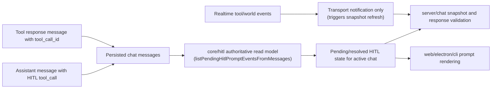

# AP: Consolidate HITL on Message-Authoritative State

**Date:** 2026-03-06  
**Status:** Proposed  
**Related REQ:** `.docs/reqs/2026/03/06/req-hitl-message-authoritative-state.md`

## Overview

Refactor HITL so message history is the single source of truth for pending/resolved state, request matching, restore behavior, and stale-prompt cleanup. Events remain transport only. The implementation must replace residual event-authoritative logic with one shared message-derived calculation path used by core, server, web, electron, and CLI.

## Architecture Decisions

- **AD-1:** A single core read model computes HITL state from chat messages.
- **AD-2:** HITL request identity is message-linked and deterministic, using tool-call identity as the canonical matching key.
- **AD-3:** Restore, chat switch, and edit/resubmit flows all consume the same core HITL read model instead of maintaining separate patch logic.
- **AD-4:** Realtime events may notify clients that state changed, but they do not decide whether a request is pending or resolved.
- **AD-5:** No dedicated HITL persistence store is introduced; authoritative state comes from existing persisted messages.
- **AD-6:** Internal and built-in HITL producers must emit canonical message artifacts that participate in the same authoritative matching path as LLM-originated HITL requests.
- **AD-7:** Response submission after restore/restart must be supported by reconstructing authoritative pending requests from messages, not by requiring a preexisting runtime pending map.

## Target Components

```text
core/
  hitl.ts                            authoritative HITL read model and matching helpers
  managers.ts                        chat activation, restore, edit/resubmit, and snapshot assembly
  hitl-tool.ts                       request identity contract
  events/*                           remove residual HITL state authority assumptions

server/
  api.ts                             expose authoritative pending HITL state through existing load/response flows

web/src/
  domain/hitl.ts                     consume authoritative pending prompts and keep queue dedupe aligned
  pages/World.update.ts              chat-switch and edit/update state hydration
  utils/sse-client.ts                treat events as transport, not authority

electron/
  main-process/message-serialization.ts  preserve message identity needed by authoritative matching
  renderer/*                             consume authoritative pending prompt state

cli/
  hitl.ts / index.ts                 rely on authoritative state, not event-only prompt detection

tests/
  tests/core/hitl.test.ts
  tests/core/message-edit.test.ts
  tests/web-domain/world-update-chat-switch-hitl-replay.test.ts
  tests/web-domain/world-update-edit-clears-hitl.test.ts
  tests/api/*hitl* or related transport/runtime tests
```

## Target Data Flow



> **AR Fix (2026-03-06):** Removed the backward arrow from client rendering back to the core read model. Clients do not write to the core read model; a realtime event triggers a server snapshot refresh, which then feeds the authoritative state down to the client. The core function `listPendingHitlPromptEventsFromMessages()` is the existing implementation of the authoritative read model described by AD-1.

## Phases and Tasks

### Phase 1 - Define the authoritative HITL read model
- [ ] Inventory all current HITL state decisions in `core/hitl.ts`, `core/managers.ts`, server transport, and client prompt code.
- [ ] Inventory all HITL producers, including built-in/internal callers of `requestWorldOption()`, and classify which already materialize canonical messages versus runtime-only prompts.
  - **Known runtime-only producer:** `requestShellCommandRiskApproval()` (in `core/shell-cmd-tool.ts`) → `requestToolApproval()` → `requestWorldOption()`. This path does NOT write a `human_intervention_request` tool-call message to chat history. It is purely runtime-only and cannot be reconstructed by `listPendingHitlPromptEventsFromMessages()` after a server restart.
  - **Known message-persistent producer:** skill approval via `core/load-skill-tool.ts` — persists a tool-role message and reconstructs via `reconstructSkillApprovalsFromMessages()`.
  - The shell command approval gap is a REQ 17 violation. Resolution options are documented in Phase 2 below.
- [ ] Define one canonical message-derived shape for a HITL request, resolved request, and pending prompt.
- [ ] Centralize request/response matching rules around persisted message-linked identity.
- [ ] Define deterministic ordering rules for multiple pending requests in one chat.
- [ ] Document invariants for chat/world scoping and duplicate suppression.

### Phase 2 - Move core state calculation to messages only

> **AR Note (2026-03-06 codebase review):** `listPendingHitlPromptEventsFromMessages()` already exists in `core/hitl.ts` and already scans persisted tool-call/tool-response pairs to determine pending/resolved state. This is the correct foundation for AD-1. The primary code change in this phase is not building a new reader, but **inverting the authority order in `activateChatWithSnapshot()` in `core/managers.ts`**: currently it reads runtime pending state first and falls back to messages; it must instead use only `listPendingHitlPromptEventsFromMessages()` as the primary and final source, with runtime state limited to transport notification. The split-authority merge in that function is the main regression risk.

> **AR Note (2026-03-06 chained HITL review) — Shell Command Approval Gap (REQ 17):** Shell command approval (`requestShellCommandRiskApproval` → `requestToolApproval` → `requestWorldOption`) is the **only HITL producer that is entirely runtime-only**. It does NOT write a `human_intervention_request` tool-call message to chat history and therefore cannot appear in `listPendingHitlPromptEventsFromMessages()` results.
>
> **In a live session:** chained skill approval + shell approval works correctly — both are registered in the runtime pending map, FIFO-ordered by the global sequence counter, visible simultaneously in the UI. No live-session regression.
>
> **After server restart:** skill approval reconstructs from persisted messages ✅; shell approval is lost ❌ because the execution coroutine that issued it is dead. Even if a synthetic message were persisted, there is no shell command execution context to resume. This is identical to the "in-flight HITL across server restart" known constraint.
>
> **Decision — Option A (Accept with documentation):** Shell command approval is execution-context-bound. A server restart kills the agent execution loop unconditionally, so message-persistence of the shell approval prompt would create a reconstructable pending prompt with no resolvable target. Persisting it would violate REQ 18's intent (resolvable after restore) rather than satisfy REQ 17. REQ 17 will be updated to acknowledge this execution-context exception explicitly. Add a regression test confirming the live-session chained case works correctly.

- [ ] Refactor `core/hitl.ts` so pending/resolved determination is derived from chat messages rather than event-side state.
- [ ] In `activateChatWithSnapshot()` (`core/managers.ts`), replace the dual-source merge (`listPendingHitlPromptEvents` + `listPendingHitlPromptEventsFromMessages`) with a single call to `listPendingHitlPromptEventsFromMessages()` as the sole authority for the returned `hitlPrompts` array.
- [ ] Add or standardize canonical message materialization for any internal HITL producer that does not currently persist message artifacts.
- [ ] Explicitly exempt shell command approval from message-persistence under the execution-context exception (Option A above); document this exemption in code comments.
- [ ] Remove residual event-authoritative helpers for HITL status, replay eligibility, or resolution lookup.
- [ ] Ensure request resolution acceptance still validates scope and identity against the authoritative message-derived model, including after restore/reconnect when no runtime pending entry exists yet.
- [ ] Keep runtime-only helpers limited to transport concerns, not logical pending-state authority.

### Phase 3 - Unify restore, chat switch, and edit/resubmit behavior

> **AR Note (2026-03-06 codebase review):** `editUserMessage()` currently calls `clearPendingHitlRequestsForChat()` to clear the runtime map and then resubmits. It does NOT scan the revised message history for HITL requests that **survived** the edit truncation (i.e., requests whose tool-call messages are still present in the trimmed transcript). After Phase 2, the `restoreChat()` / `replayPendingHitlRequests()` call sequence implicitly handles this for subsequent chat loads, but the edit path itself needs to ensure the runtime map is rebuilt from the revised transcript before any new SSE events are emitted. This should be done by calling `replayPendingHitlRequests()` after `syncRuntimeAgentMemoryFromStorage()` in `editUserMessage()`, not by adding new special-case logic.

- [ ] Update `core/managers.ts` chat activation/restore flows to fetch pending HITL prompts from the shared authoritative read model.
- [ ] Replace chat-switch-specific HITL replay logic with read-model recomputation from the newly active chat messages.
- [ ] After `syncRuntimeAgentMemoryFromStorage()` in `editUserMessage()`, call `replayPendingHitlRequests()` so the runtime map reflects HITL requests still present in the revised transcript, ensuring the same recomputation path used by restore is also used by edit.
- [ ] Ensure stale/orphaned prompts disappear only because the revised messages no longer justify them.
- [ ] Preserve strict world/chat isolation in all activation and edit paths.

### Phase 4 - Align server and clients to the single authority

> **AR Note (2026-03-06 codebase review):** There is a validated gap in the current `/hitl/respond` endpoint: `submitWorldHitlResponse()` validates against the runtime pending map, which is only populated when `replayPendingHitlRequests()` has run (i.e., after a `restoreChat()` / `activateChatWithSnapshot()` call). A client that calls `/hitl/respond` after a server restart **without** a prior `/setChat` call will fail validation because the pending map is empty even though the HITL request exists in persisted messages. The endpoint must be hardened to auto-reconstruct from messages when the map entry is absent.
>
> For SSE convergence: when a `tool-progress` event carrying a `hitlPrompt` arrives at the web client, it should be treated as a notification to enqueue the prompt locally (for immediate UX responsiveness) while the rendered pending set is authoritative once a `/setChat` snapshot is retrieved. If the snapshot already contains the same prompt (by `requestId`), dedup prevents duplication. This existing `enqueueHitlPrompt` dedupe path is sufficient; no separate re-fetch is required on every SSE event.

- [ ] Update server chat snapshot/load APIs to return authoritative pending HITL state from core rather than reconstructing locally from transport/event paths.
- [ ] Remove snapshot/subscription merging that treats runtime-pending and message-derived pending HITL as separate authorities; runtime hints may remain only as a short-lived transport optimization.
- [ ] Harden `submitWorldHitlResponse()` (or the `/hitl/respond` API handler) so that if the runtime pending map lacks the target request, it reconstructs from persisted messages for that chat before validation — enabling restart-safe resolution without a prior `setChat` call.
- [ ] Update web prompt hydration: SSE `tool-progress` events enqueue for immediate UX; snapshot `hitlPrompts` from `/setChat` is authoritative and dedup (by `requestId`) prevents double-display. Document this contract in `web/src/domain/hitl.ts`.
- [ ] Update electron and CLI flows to stop relying on event-only HITL prompt detection as the long-term source of truth.
- [ ] Keep non-HITL SSE/system event behavior unchanged.

### Phase 5 - Remove residual event-driven HITL assumptions
- [ ] Eliminate leftover HITL logic that reads event payloads as authoritative pending-state input.
- [ ] Consolidate duplicate helper paths so future HITL fixes change one decision function rather than multiple client- or flow-specific patches.
- [ ] Verify no code path treats replay/system events as the final source of HITL status.

### Phase 6 - Verification and regression coverage
- [ ] Add core regression test for new-message HITL request appearing as pending from authoritative messages.
- [ ] Add core regression test for request/response matching producing resolved state from messages.
- [ ] Add regression test for a built-in/internal HITL producer proving its prompt is represented by canonical messages and participates in the same authoritative pending/resolved calculation (skill approval).
- [ ] Add regression test for live-session chained HITL: skill approval pending + shell/script approval pending simultaneously → both visible in FIFO order → resolve each in turn → both clear correctly. (Shell approval is runtime-only by design; this test validates the live-session path only, not restore.)
- [ ] Add regression test proving a restored pending HITL prompt can still be resolved after runtime reconstruction from persisted messages.
- [ ] Add chat-switch regression test proving active-chat HITL state is recalculated from the selected chat only.
- [ ] Add edit/resubmit regression test proving stale HITL prompts disappear when the message branch is replaced.
- [ ] Add transport/runtime boundary coverage where needed so load/response paths use the same authoritative state.
- [ ] Run targeted vitest coverage for touched files.
- [ ] Run `npm run integration` because server/runtime transport paths are in scope.

## Implementation Notes

- The refactor should prefer adding one reusable core helper over adding compensating logic in web/electron/CLI.
- If any flow still needs a live event hint for responsiveness, it should trigger a state refresh or queue update, not compute final pending state independently.
- Built-in flows such as tool approvals and create-agent confirmations should be treated as first-class HITL producers; if they currently bypass message persistence, that gap must be closed before the architecture is considered complete.
- Message edit handling must preserve existing chat/session integrity side effects while recomputing HITL state from the revised transcript.
- Existing options-only HITL behavior remains unchanged.

## Risks and Mitigations

| Risk | Mitigation |
|------|------------|
| Runtime pending map and persisted messages disagree during transition | Make the core read model authoritative and update runtime helpers to mirror it rather than compete with it |
| Internal HITL producers bypass persisted messages | Require canonical synthetic or native message artifacts for every HITL producer before prompt becomes authoritative |
| Chat switch still leaks prompts from prior chat | Route all active-chat pending prompt assembly through one scoped core function |
| Edit/resubmit clears too much or too little | Base cleanup strictly on revised message history; call `replayPendingHitlRequests()` after message truncation to correctly seed the runtime map from surviving messages |
| Realtime UI duplicates prompts during convergence | Dedupe by canonical `requestId` in `enqueueHitlPrompt`; snapshot-derived state remains authoritative |
| Validation breaks if identity contracts are inconsistent | Keep tool-call identity canonical and assert invariants in tests |
| Restored prompt cannot be resolved because runtime state was lost | Harden `/hitl/respond` to reconstruct pending state from persisted messages when the runtime map lacks the entry (restart-safe) |
| Client resolves HITL without a prior `/setChat` call after server restart | `/hitl/respond` handler auto-reconstructs from persisted messages before validation; no `/setChat` prerequisite required for response acceptance |
| In-flight HITL request lost across server restart before tool-response is persisted | Known limitation: if the server restarts mid-tool-execution before the assistant tool-call message is saved, the prompt cannot be recovered from messages. Document as an inherent transient gap, not a regression from this change |

## Architecture Review (AR)

### AR Pass 1 (original)

#### High-Priority Issues

1. **Split authority remains possible during migration** if any client or API still treats events as final HITL state.
2. **Edit/resubmit is the highest stale-state risk** because it can invalidate earlier HITL-producing branches without a new chat load.
3. **Validation drift is possible** if response acceptance continues to trust runtime-only pending state instead of authoritative matching.
4. **Transport duplication can mask logic defects** if UI dedupe papers over incorrect authoritative state assembly.
5. **Internal producer exception risk** remains if built-in HITL prompts are not represented by canonical messages.

#### Resolutions in Plan

1. Move all pending-state assembly into one core read model consumed by all entry points.
2. Make edit/resubmit call the same recalculation path used by chat activation and restore.
3. Align response validation and restore behavior around the same message-linked identity rules.
4. Keep transport dedupe as a UX safeguard only, not as correctness logic.
5. Require every HITL producer to emit canonical message artifacts and include restart-safe reconstruction in the validation path.

---

### AR Pass 2 (2026-03-06 post-codebase review)

#### New Issues Found and Fixed

1. **Data flow diagram backward arrow (Fixed):** The diagram had `G --> D` (client renders → core read model), which is architecturally incorrect. The core read model is not written to by clients. Fixed to show realtime events as transport notifications that trigger a server snapshot refresh.

2. **Phase 2 lacked codebase grounding (Fixed):** `listPendingHitlPromptEventsFromMessages()` already exists in `core/hitl.ts` and is the correct foundation for AD-1. Clarifying note and pinpoint task added to Phase 2 identifying `activateChatWithSnapshot()` in `core/managers.ts` as the primary split-authority change point.

3. **Edit/resubmit recomputation path was implicit (Fixed):** The plan said "replace edit/resubmit HITL cleanup logic" but didn't specify the concrete mechanism. Codebase analysis shows `editUserMessage()` calls `clearPendingHitlRequestsForChat()` but does not call `replayPendingHitlRequests()` afterward. Added explicit Phase 3 task to call `replayPendingHitlRequests()` after `syncRuntimeAgentMemoryFromStorage()` in the edit path so surviving HITL requests (still present in the trimmed transcript) are correctly seeded into the runtime map.

4. **Restart-safe response validation gap (Fixed):** `submitWorldHitlResponse()` validates against the runtime pending map, which is only populated after `replayPendingHitlRequests()` runs. A client calling `/hitl/respond` after a server restart without a prior `/setChat` call will fail validation. Added explicit Phase 4 task to harden the endpoint to reconstruct from persisted messages when the map entry is absent.

5. **SSE convergence contract was underspecified (Fixed):** Phase 4 said "trigger refresh" without defining the mechanism. Clarified: SSE `tool-progress` events enqueue for immediate UX (existing behavior); `/setChat` snapshot `hitlPrompts` is the authoritative source; existing `requestId` dedupe in `enqueueHitlPrompt` prevents double-display. No separate re-fetch is needed on every SSE event.

6. **Risks table: edit/resubmit and restart-safe rows updated (Fixed):** Mitigation rows now reference specific functions and patterns found in the codebase.

#### Remaining Constraint (Not a Plan Defect)

- **In-flight HITL request across server restart:** If the server restarts mid-tool-execution before the assistant tool-call message is persisted, the HITL prompt cannot be recovered from messages. This is an inherent transient gap — not introduced by this change — and is documented in the Risks table. It does not violate REQ 18, which requires reconstruction from *persisted* messages.

### Tradeoffs

- **Single core read model (selected)**
  - Pros: one source of truth, easier reasoning, fewer regressions.
  - Cons: requires touching multiple integration points to remove old assumptions.
- **Incremental patching of each flow (rejected)**
  - Pros: smaller initial edits.
  - Cons: preserves drift and repeats the same bug class in new paths.

## Acceptance Mapping to REQ

- REQ 1-6: Phase 1-2 central authoritative read model and identity/matching rules.
- REQ 7-10: Phase 3 unified handling for new message, chat switch, and edit/resubmit.
- REQ 11-19: Phase 4-5 removal of event-authoritative assumptions, elimination of hidden internal exceptions, and restart-safe validation while preserving non-HITL compatibility.
- REQ 20: Phase 6 targeted regression and transport/runtime verification.

## Verification Commands (planned)

- `npx vitest run tests/core/hitl.test.ts`
- `npx vitest run tests/core/message-edit.test.ts`
- `npx vitest run tests/web-domain/world-update-chat-switch-hitl-replay.test.ts`
- `npx vitest run tests/web-domain/world-update-edit-clears-hitl.test.ts`
- `npm run integration`

## Rollout Gate

Proceed to implementation only when this plan is approved and the following remain true:
1. There is a single named core function or module responsible for authoritative HITL state assembly.
2. Chat switch and edit/resubmit are explicitly covered by that same path.
3. Internal/built-in HITL producers are explicitly covered by that same model rather than left as runtime-only exceptions.
4. Targeted regression tests are defined before touching behavior.
