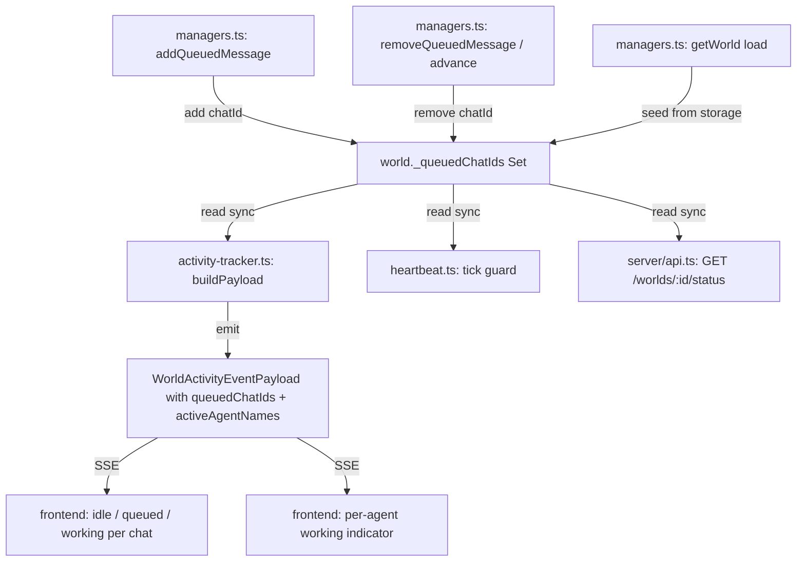

# Plan: Queue-Based Status Visibility

**Date:** 2026-03-06
**Req:** `.docs/reqs/2026/03/06/req-queue-status-visibility.md`
**Status:** Pending approval

---

## Architecture Notes

Two separate queue subsystems exist in the codebase:

| Subsystem | Location | Status values | Used for |
|---|---|---|---|
| In-memory LLM queue | `core/llm-manager.ts` → `getLLMQueueStatus()` | `pending/processing/completed/failed` | LLM call throttling; already in `WorldActivityEventPayload.queue` |
| SQLite message queue | `StorageAPI.getQueuedMessages()` / `types.ts` `QueuedMessage` | `queued/sending/error/cancelled` | Per-world/chat message dispatch; the queue addressed by this plan |

All work in this plan targets the **SQLite message queue** layer.

**Key design decisions:**

1. **Sync-safe cache (`world._queuedChatIds`):** Because `WorldActivityEventPayload` is built synchronously and `activity-tracker.ts` cannot `await` storage calls at emit time, a `Set<string>` cache on the `World` object tracks which chat IDs currently have `queued` messages. `managers.ts` is the sole writer; `activity-tracker.ts` and `heartbeat.ts` are readers. This avoids circular imports and keeps emission synchronous.

2. **`activeAgentNames` from `activeSources`:** The `ActivityState.activeSources` map already tracks source labels keyed by agent identifier for each `beginWorldActivity` call. `activeAgentNames` is derived from the `activeSources` keys at payload build time. No new data structure needed; only a rename for clarity in the payload.

3. **`getWorld()` populates the cache:** On world load, `getWorld()` in `managers.ts` calls storage to fetch queued messages and seeds `world._queuedChatIds` from the result. This replaces the broken `isProcessing` re-derivation with explicit queue-backed state.

4. **Heartbeat guard: sync check only.** Both `isChatProcessing(world, chatId)` (from activity-tracker) and `world._queuedChatIds` are synchronous reads, so the heartbeat guard remains non-async.

5. **Status endpoint: aggregate from in-memory + storage.** `GET /worlds/:id/status` reads `activeChatIds` from `getActiveProcessingChatIds()`, `queuedChatIds` from storage, and `activeAgentNames` from `activeSources`. One async storage call per request is acceptable.

---

## Flow Diagram



---

## Phases and Tasks

### Phase 1 — Type changes

- [ ] **`core/types.ts`**: Add `_queuedChatIds?: Set<string>` field to `World` interface
- [ ] **`core/activity-tracker.ts`**: Add `queuedChatIds: string[]` and `activeAgentNames: string[]` fields to the `WorldActivityEventPayload` interface

### Phase 2 — Cache maintenance (`core/managers.ts`)

The subscribed world runtime (long-lived) is the canonical cache owner. Cache mutations must cover every code path that changes queue status.

- [ ] **On enqueue:** After any successful `addQueuedMessage` call, add the `chatId` to `world._queuedChatIds`
- [ ] **On dispatch (`queued → sending`):** In `triggerPendingQueueResume`, immediately after calling `updateMessageQueueStatus(messageId, 'sending')`, remove `chatId` from `world._queuedChatIds` before dispatching. This closes the async gap where neither guard would fire.
- [ ] **On advance/complete:** After `removeQueuedMessage` / queue-advance, remove `chatId` from `world._queuedChatIds` (the removal in the previous step makes this a no-op for the common path, but keep it for safety)
- [ ] **On `stopChatQueue`:** After `cancelQueuedMessages`, delete `chatId` from `world._queuedChatIds`
- [ ] **On `clearChatQueue`:** After `deleteQueueForChat`, delete `chatId` from `world._queuedChatIds`
- [ ] **On retry re-queue (`handleQueueDispatchFailure`):** When `updateMessageQueueStatus(messageId, 'queued')` is called on the retry path, re-add `chatId` to `world._queuedChatIds`
- [ ] **`getWorld()` seeding:** After loading world from storage, iterate `world.chats` (already populated) and for each chat call `storageWrappers.getQueuedMessages(worldId, chatId)`, collecting all chat IDs with at least one `status === 'queued'` message into `world._queuedChatIds`. *(Note: `StorageAPI.getQueuedMessages` requires both `worldId` and `chatId` — there is no world-level overload. Fan-out per chat is required. If a world-level query is needed frequently, add `getAllQueuedMessages(worldId): Promise<QueuedMessage[]>` to `StorageAPI` and both storage backends.)*
- [ ] **Subscription seeding:** Wherever the subscribed runtime `World` object is first activated (e.g., `subscribeWorld` or equivalent), also seed `_queuedChatIds` from storage using the same per-chat fan-out. The cold-loaded `getWorld()` instance and the subscribed runtime are separate JS objects; both must be seeded.

### Phase 3 — Activity payload enrichment (`core/activity-tracker.ts`)

The payload is constructed **inline inside `emitActivityEvent()`** — there is no `buildPayload` function.

- [ ] In `emitActivityEvent()`, add `queuedChatIds: Array.from(world._queuedChatIds ?? [])` to the `WorldActivityEventPayload` object literal
- [ ] In `emitActivityEvent()`, add `activeAgentNames` derived by stripping the `agent:` prefix from `activeSources` keys:
  ```ts
  activeAgentNames: Array.from(activityState.activeSources.keys())
    .filter(s => s.startsWith('agent:'))
    .map(s => s.slice('agent:'.length))
  ```
  *(Source labels are stored as `"agent:<id>"` — not bare agent IDs. Filtering on `world.agents` keys would always return empty because of this prefix.)*
- [ ] Export a new accessor `getActiveAgentNames(world: World): string[]` from `activity-tracker.ts` using the same prefix-stripping logic. This allows `server/api.ts` to derive agent names without accessing the Symbol-keyed internal `ActivityState`.

### Phase 4 — Heartbeat guard fix (`core/heartbeat.ts`)

- [ ] Import `isChatProcessing` from `core/activity-tracker.js`
- [ ] Update the tick guard to:
  ```ts
  const chatId = world.currentChatId;
  if (!chatId) return;
  if (world.isProcessing || isChatProcessing(world, chatId) || world._queuedChatIds?.has(chatId)) return;
  ```
  *(Keep `world.isProcessing` — it covers world-level activity where `chatId` was not passed to `beginWorldActivity`, so `isChatProcessing` would return false for those cases.)*

### Phase 5 — REST status endpoint (`server/api.ts`)

- [ ] Add imports: `getActiveProcessingChatIds`, `getActiveAgentNames` from `core/activity-tracker.js`
- [ ] Add route `GET /worlds/:worldName/status` after the existing `GET /worlds/:worldName` route, using the `validateWorld` middleware
- [ ] Handler computes and returns:
  ```ts
  {
    worldId:          world.id,
    isProcessing:     world.isProcessing ?? false,
    activeChatIds:    [...getActiveProcessingChatIds(world)],
    queuedChatIds:    [...(world._queuedChatIds ?? [])],   // "queued" status only; see note
    activeAgentNames: getActiveAgentNames(world),
    queueDepth:       (world._queuedChatIds?.size ?? 0),
    sendingCount:     <count from storageWrappers.getQueuedMessages per-chat, filtered to 'sending'>
  }
  ```
  > **Client guidance (to include in API doc):** `queuedChatIds` contains chats waiting to be dispatched (`queued` status). Chats in the brief `queued→sending` gap may not appear in either set. Treat `activeChatIds ∪ queuedChatIds` as the "busy" set for UI purposes.

### Phase 6 — Tests

- [ ] `tests/core/heartbeat.test.ts` — add regression test: heartbeat skips when `world._queuedChatIds` contains `currentChatId`
- [ ] `tests/core/activity-tracker.test.ts` — add/update tests:
  - `WorldActivityEventPayload` includes `queuedChatIds` from `world._queuedChatIds`
  - `WorldActivityEventPayload` includes `activeAgentNames` correctly stripped of `agent:` prefix
  - `getActiveAgentNames(world)` returns correct names from `activeSources`
- [ ] `tests/api/world-status-route.test.ts` — new test file:
  - `GET /worlds/:id/status` returns the full required JSON shape
  - `queuedChatIds` reflects `world._queuedChatIds`
  - `activeChatIds` reflects in-flight chats from activity tracker
- [ ] `tests/core/managers.test.ts` (or world-load test) — `getWorld()` seeds `_queuedChatIds` from per-chat storage fan-out

---

## File Changelist

| File | Change type | Notes |
|---|---|---|
| `core/types.ts` | Modify | Add `_queuedChatIds?: Set<string>` to `World` |
| `core/activity-tracker.ts` | Modify | Add `queuedChatIds` + `activeAgentNames` to payload; add `getActiveAgentNames()` export |
| `core/managers.ts` | Modify | Cache maintenance on all queue state transitions; seed in `getWorld()` and subscription init |
| `core/heartbeat.ts` | Modify | Import `isChatProcessing`, update tick guard |
| `server/api.ts` | Modify | Add `GET /worlds/:worldName/status` route |
| `tests/core/heartbeat.test.ts` | Modify | Regression test for queue-guard |
| `tests/core/activity-tracker.test.ts` | Create or modify | Payload field + accessor tests |
| `tests/api/world-status-route.test.ts` | Create | Status endpoint tests |

---

## Risk and Tradeoffs

| Risk | Mitigation |
|---|---|
| `_queuedChatIds` cache drift (stale entries) | All queue state transitions in managers.ts update the cache explicitly. On `getWorld()` load, always seed from per-chat storage fan-out. Subscription init also seeds. |
| Circular imports: `activity-tracker.ts` → `managers.ts` | Avoided entirely — `activity-tracker.ts` reads from `world._queuedChatIds` (field on the World object). Managers writes to the set; no import of managers in activity-tracker. |
| `activeAgentNames` prefix handling | Sources are `"agent:<id>"`. Stripping prefix explicitly in both `emitActivityEvent` and `getActiveAgentNames` ensures correctness. |
| `sendingCount` in status endpoint | Requires async per-chat fan-out storage calls. Acceptable for a REST GET; consider adding `getAllQueuedMessages(worldId)` to StorageAPI if this proves expensive at scale. |
| `queued→sending` transition gap | Mitigated in Phase 2 by removing from `_queuedChatIds` immediately before dispatch, before `beginWorldActivity` is called. |
| Subscribed vs. cold-loaded world instances | Both seeded independently. Cache mutations in managers.ts operate on whichever `World` object is in scope — callers must pass the canonical subscribed runtime. |
