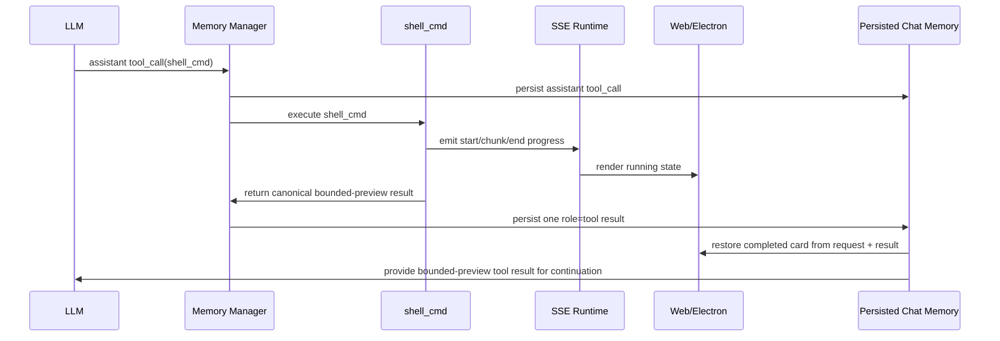

# Architecture Plan: Tool Call Output Simplification

**Date:** 2026-03-06
**Type:** Runtime Simplification
**Status:** Proposed
**Related:** [REQ](../../../reqs/2026/03/06/req-tool-call-output-simplification.md)

## Overview

Simplify `shell_cmd` output handling by converging on one canonical persisted tool-result contract with bounded previews, removing the persisted synthetic assistant stdout mirror message, and reducing shell-specific continuation mode branching.

## Current-State Findings

1. `shell_cmd` currently branches among `minimal`, `smart`, and `verbose` return modes in core.
2. Shell stdout is streamed during execution and later persisted again as a separate assistant message.
3. Tool completion is also persisted as a `role='tool'` message, so final shell state is split across two durable message types.
4. Web and Electron then merge assistant tool-call rows with tool-result rows and streamed state to recover one coherent card.
5. Reconnect paths synthesize pending tool-start state because the durable record layout is not minimal.

## Target Architecture

### AD-1: One Durable Completion Record

- Persist exactly one authoritative final shell completion record as a `role='tool'` message tied to `tool_call_id`.
- Do not persist shell stdout as an additional assistant transcript row.

### AD-2: One Default Continuation Contract

- Replace shell continuation branching across `minimal` and `smart` with one bounded-preview formatter for normal continuation.
- Keep explicit full-output behavior only for direct user-facing use cases that request full output.
- If explicit full output is retained, it must still be serialized through the same canonical final `tool` result shape/path rather than a second persisted assistant transcript row.

### AD-3: Streaming Is Transport, Not Durable State

- Keep live SSE/tool-progress behavior for runtime visibility.
- Treat streaming as transient state only.
- Treat persisted assistant tool-call plus persisted tool-result as the durable source of truth.

### AD-4: UI Renders from Canonical Request/Result Pair

- Completed cards render from:
  - assistant message with `tool_calls`
  - matching `tool` result with `tool_call_id`
- Running cards render from runtime tool lifecycle/stream events plus unresolved assistant tool-call state.

## Recommended Result Shape

The default canonical shell result should contain:

- `status`
- `exit_code`
- `timed_out`
- `canceled`
- `reason` when applicable
- `stdout_preview`
- `stderr_preview`
- `stdout_truncated`
- `stderr_truncated`
- optional redaction markers when preview content is intentionally suppressed

The exact serialized representation may be markdown or JSON-string, but the semantic contract should be singular.
Validation failures, approval denials, and execution/runtime errors should use the same semantic contract.

## Options Considered

### Option A: Keep Current `minimal` / `smart` / `verbose` Split

- Pros:
  - No migration work for continuation logic.
  - Preserves current script/skill special casing.
- Cons:
  - Retains special-case branching.
  - Keeps shell as an outlier relative to simpler tool contracts.
  - Continues split mental model between status-only vs preview vs full output.

### Option B: Collapse to Status-Only Result

- Pros:
  - Simplest continuation payload.
  - Lowest token footprint.
- Cons:
  - Too weak for script/skill workflows that benefit from bounded stdout context.
  - Would likely regress useful post-tool reasoning.

### Option C: Collapse to One Preview Result plus Optional Full Mode

- Pros:
  - Removes most branching.
  - Preserves enough bounded stdout/stderr context for continuation.
  - Keeps transcript restoration simple.
  - Fits the user request to always send output as tool result, but truncated.
- Cons:
  - Slightly larger continuation payload than status-only mode.
  - Requires formatter and test updates across core and UI assumptions.

## AR Decision

Proceed with **Option C**.

Status-only simplification is too aggressive. The clean cut is:
- remove persisted synthetic assistant stdout mirror messages,
- remove separate `smart` continuation mode,
- keep one canonical bounded-preview tool-result contract,
- keep full output only for explicit user-driven requests.

Also preserve backward-compatible rendering for historical chats that already contain legacy synthetic stdout assistant rows.

## Data Flow

## Phased Plan

### Phase 1: Canonical Result Contract

- [ ] Define one canonical bounded-preview shell result formatter in `core/shell-cmd-tool.ts`.
- [ ] Preserve normalized failure semantics and redaction behavior.
- [ ] Apply the same semantic result contract to validation errors, approval denials, and execution failures.
- [ ] Remove ordinary continuation dependence on separate `smart` mode.

### Phase 2: Continuation Simplification

- [ ] Update `core/events/memory-manager.ts` so shell continuation selects one default bounded-preview mode.
- [ ] Remove shell-specific script-context branching that exists only to choose `smart` vs `minimal`.
- [ ] Preserve existing duplicate-shell-call suppression and tool lifecycle handling.

### Phase 3: Persistence Simplification

- [ ] Stop persisting final shell stdout as a synthetic assistant message.
- [ ] Keep exactly one persisted final `tool` result per shell tool call.
- [ ] Confirm message prep and continuation consume the canonical tool result without regressions.

### Phase 4: UI and Restore Alignment

- [ ] Simplify web tool-card merge logic to rely on assistant tool-call plus tool-result records for completed state.
- [ ] Simplify Electron tool-card merge logic with the same durable assumptions.
- [ ] Keep transient running-state rendering from SSE/tool lifecycle events.
- [ ] Validate reconnect/restore behavior for pending unresolved tool calls.
- [ ] Preserve backward-compatible rendering for legacy chats that already contain persisted assistant stdout mirror rows.

### Phase 5: Tests

- [ ] Add targeted unit coverage for canonical bounded-preview shell results.
- [ ] Add targeted unit coverage proving no persisted assistant stdout mirror message is created.
- [ ] Add targeted boundary coverage for transcript restoration from request + result only.
- [ ] Run required integration coverage for transport/runtime path changes.

## File Scope

- `core/shell-cmd-tool.ts`
- `core/events/memory-manager.ts`
- `core/message-prep.ts`
- `server/sse-handler.ts`
- `web/src/domain/tool-merge.ts`
- `web/src/domain/message-content.tsx`
- `electron/renderer/src/components/MessageListPanel.tsx`
- `electron/renderer/src/components/MessageContent.tsx`
- related tests under `tests/core`, `tests/web`, and `tests/electron`

## Risks and Mitigations

1. Risk: Skill/script continuations may lose too much context if preview bounds are too small.
   - Mitigation: keep bounded preview output with redaction rules instead of status-only output.
2. Risk: Reconnect UI may temporarily lose pending-state fidelity if synthesis assumptions are removed too early.
   - Mitigation: preserve transient unresolved-tool synthesis where necessary, but only for pending state.
3. Risk: Old chats may still contain legacy persisted assistant stdout mirror messages.
   - Mitigation: keep backward-compatible render handling for legacy data while stopping new writes.
4. Risk: Tool-result payloads could still become too large.
   - Mitigation: centralize explicit preview bounds and truncation markers.
5. Risk: Validation and approval failure paths could keep returning special-case strings and undermine the canonical contract.
   - Mitigation: normalize every terminal shell path through the same result formatter.

## AR Exit Criteria

- No new shell execution writes a persisted assistant stdout mirror message.
- Default shell continuation uses one bounded-preview result contract.
- Validation, approval-denial, timeout, cancellation, and execution-error paths all emit the same semantic shell result shape.
- Completed shell cards restore correctly from persisted assistant tool-call plus tool-result only.
- Historical chats with legacy persisted shell stdout mirror rows still render correctly.
- Running shell state still appears during execution.
- Targeted tests pass, and required integration coverage is run before implementation is considered complete.
