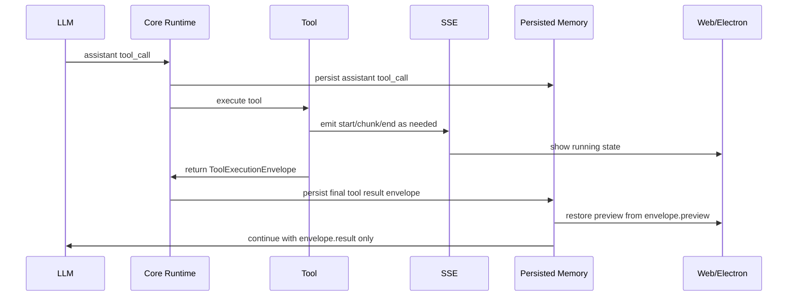

# Architecture Plan: Tool Execution Envelope

**Date:** 2026-03-06
**Type:** Runtime Contract and UI Rendering Alignment
**Status:** Proposed
**Related:** [REQ](../../../reqs/2026/03/06/req-tool-execution-envelope.md)

## Overview

Introduce a generic `ToolExecutionEnvelope` type at the final tool-result boundary so tools can persist:

- `preview` for UI/history/restore
- `result` for LLM continuation

while keeping streaming progress on SSE only.

The first adopters are:

- `shell_cmd`
- skill-script execution outputs in `load_skill`

The plan also defines a basic preview-rendering contract so web and Electron can render common non-text outputs without sending oversized payloads back to the LLM.

## Current-State Findings

1. `shell_cmd` already has special logic for bounded continuation output, but it is tool-specific rather than generic.
2. `load_skill` currently returns XML-like strings and can include script execution output, but it has no generic preview/result split for artifact-heavy flows.
3. Web already has a pluggable custom-renderer registry in [custom-renderers.tsx](/Users/esun/Documents/Projects/agent-world.worktrees/feature-heart-beat/web/src/domain/custom-renderers.tsx), including VexFlow and YouTube-specific rendering, but it is not driven by a generic persisted envelope contract.
4. Tool request/result merge behavior already exists in the transcript layer, so the main gap is the final tool-result payload contract, not the existence of tool rows themselves.
5. Large renderable outputs such as SVG need UI visibility without becoming continuation payloads.

## Target Architecture

### AD-1: Canonical Final Envelope

Each adopted tool persists one final envelope on the `role='tool'` completion record:

```json
{
  "tool": "shell_cmd",
  "tool_call_id": "tc_123",
  "status": "completed",
  "version": 1,
  "preview": { "...": "UI-facing persisted preview" },
  "result": { "...": "LLM-facing canonical tool result" }
}
```

Rules:
- `preview` is persisted and rendered by UI
- `result` is the only payload reintroduced into LLM continuation
- SSE remains separate

### AD-2: Preview Contract

Use a small declarative preview schema with stable categories:

```json
{
  "kind": "text | markdown | artifact | media | graphic | url",
  "renderer": "text | markdown | image | svg | audio | video | youtube",
  "media_type": "image/svg+xml",
  "text": "...",
  "url": "...",
  "artifact": {
    "path": "output/score.svg",
    "media_type": "image/svg+xml",
    "bytes": 248731,
    "display_name": "score.svg"
  }
}
```

Notes:
- `renderer` is optional and acts as a UI hint
- `kind` plus `media_type` remains the primary semantic input for validation and fallback
- no arbitrary code or raw component definitions

### AD-3: Result Contract

`result` remains tool-specific but compact.

Examples:

For `shell_cmd`:

```json
{
  "status": "success",
  "exit_code": 0,
  "timed_out": false,
  "canceled": false,
  "stdout_preview": "bounded stdout...",
  "stderr_preview": ""
}
```

For a skill script that produced an SVG:

```json
{
  "status": "success",
  "message": "SVG created successfully.",
  "artifacts": [
    {
      "path": "output/score.svg",
      "media_type": "image/svg+xml"
    }
  ]
}
```

### AD-4: Message Preparation Boundary

- Persistence stores the full envelope
- UI reads `preview`
- `prepareMessagesForLLM()` and continuation/resume flows extract only `result`

This is the key separation point that prevents UI preview payloads from leaking into LLM context.

### AD-5: Initial Basic Renderer Set

Add or align renderer support for:

- `text`
- `markdown`
- `image`
- `svg`
- `audio`
- `video`
- `youtube`
- generic file/artifact fallback

Web and Electron should use the same semantic contract, even if the implementation details differ.

## Options Considered

### Option A: Infer Everything from `kind` and `media_type` Only

- Pros:
  - Smaller protocol surface
  - Less frontend registry management
- Cons:
  - Harder to handle special URL cases like YouTube cleanly
  - Less explicit control for domain-specific but safe render modes

### Option B: Require Explicit `renderer` for Every Preview

- Pros:
  - Simple UI dispatch
  - Clear intentionality from tools
- Cons:
  - Stronger frontend coupling
  - More breakage risk when a renderer value is unknown

### Option C: `kind` + `media_type` Primary, Optional `renderer` Hint

- Pros:
  - Best fallback behavior
  - Supports special cases without making renderer mandatory
  - Fits existing custom-renderer extension pattern
- Cons:
  - Slightly more logic in frontend matching

## AR Decision

Proceed with **Option C**.

This keeps the protocol generic and durable without over-committing the frontend to a brittle renderer registry. It also cleanly supports the user's main example: previewing a large generated SVG while passing only a compact success result to the model.

## Data Flow



## Phased Plan

### Phase 1: Shared Contract

- [ ] Define a shared `ToolExecutionEnvelope` type in core.
- [ ] Define a minimal shared `ToolPreview` shape with `kind`, `media_type`, optional `renderer`, and artifact/url/text forms.
- [ ] Document which envelope fields are persisted for UI/history and which fields are forwarded to the LLM.

### Phase 2: shell_cmd Adoption

- [ ] Wrap the existing shell completion payload in `ToolExecutionEnvelope`.
- [ ] Map bounded stdout/stderr UI preview into `preview`.
- [ ] Preserve the current compact shell continuation payload in `result`.
- [ ] Keep normalized error/timeout/cancel/validation semantics unchanged.

### Phase 3: Skill-Script Adoption

- [ ] Add envelope support to skill-script execution outputs surfaced by `load_skill`.
- [ ] Preserve existing instruction-loading semantics while allowing script-produced artifacts to surface as UI previews.
- [ ] Support artifact references for large SVG or other renderable files without inlining them into LLM continuation content.
- [ ] Keep the model-facing `result` focused on success/failure plus artifact metadata needed for reasoning.

### Phase 4: Message Preparation and Persistence

- [ ] Update message-preparation logic so only `envelope.result` is sent to the LLM.
- [ ] Preserve full envelope persistence on final tool result records.
- [ ] Ensure resumed pending tool-call flows obey the same result-only continuation rule.

### Phase 5: Renderer Wiring

- [ ] Extend web custom-renderer matching to consume the generic preview contract.
- [ ] Add basic renderer handling or fallback behavior for text, markdown, image, SVG, audio, video, YouTube, and generic files.
- [ ] Mirror the same semantic preview support in Electron without creating cross-app shared modules.

### Phase 6: Tests

- [ ] Add targeted unit tests for `ToolExecutionEnvelope` serialization/usage at the core boundary.
- [ ] Add `shell_cmd` regression tests proving `preview` is persisted while only `result` flows into continuation.
- [ ] Add `load_skill`/skill-script tests covering artifact preview references and compact LLM result payloads.
- [ ] Add frontend tests for basic preview matching/render fallback.
- [ ] Run `npm run integration` because tool transport/runtime paths are affected.

## File Scope

- `core/shell-cmd-tool.ts`
- `core/load-skill-tool.ts`
- `core/events/memory-manager.ts`
- `core/events/orchestrator.ts`
- `core/message-prep.ts` or equivalent LLM-preparation boundary
- `web/src/domain/custom-renderers.tsx`
- `web/src/domain/message-content.tsx`
- `web/src/domain/tool-merge.ts`
- corresponding Electron renderer message/preview files
- targeted tests under `tests/core`, `tests/web-domain`, and `tests/electron`

## Risks and Mitigations

1. Risk: Preview payloads could accidentally leak into continuation and recreate the current coupling.
   - Mitigation: centralize `result` extraction in the LLM preparation path and test it directly.
2. Risk: Skill-script artifact previews could depend on local file paths that are not stable enough for UI loading.
   - Mitigation: require stable artifact metadata and path handling rules in the tool preview contract.
3. Risk: Frontend renderer coverage could become fragmented between web and Electron.
   - Mitigation: keep the preview semantics shared, while letting each app implement its own renderer mapping.
4. Risk: Explicit renderer values could drift from actual media types.
   - Mitigation: treat renderer as hint only and validate against `kind`, `url`, and `media_type`.
5. Risk: Broad migration across all tools would increase rollout risk.
   - Mitigation: scope first adoption to `shell_cmd` and skill-script outputs only.

## AR Exit Criteria

- A generic envelope type exists in the plan with explicit `preview` and `result` semantics.
- The plan keeps streaming out of the persisted final envelope.
- The plan requires `shell_cmd` and skill-script execution outputs to adopt the envelope.
- The plan requires message preparation to exclude `preview` from LLM continuation.
- The plan defines a basic renderer set and safe declarative rendering expectations.
- No major architecture flaws remain for the initial scoped rollout.
