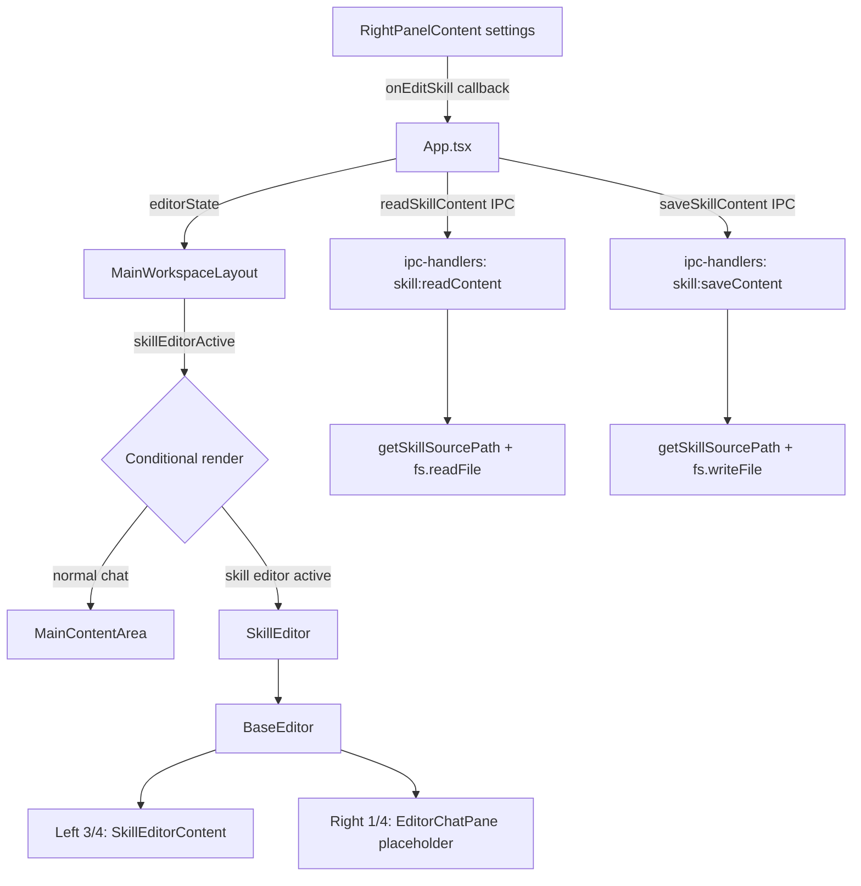

# AP: Base Editor + Skill Editor (Electron Renderer)

**Date:** 2026-03-08  
**REQ:** `.docs/reqs/2026/03/08/req-editor-skill-editor.md`

---

## Architecture Overview

---

## Phase 1: IPC Layer (backend + bridge)

### 1.1 `electron/shared/ipc-contracts.ts`
- [ ] Add `SKILL_READ_CONTENT: 'skill:readContent'` to `DESKTOP_INVOKE_CHANNELS`
- [ ] Add `SKILL_SAVE_CONTENT: 'skill:saveContent'` to `DESKTOP_INVOKE_CHANNELS`
- [ ] Add `SkillContentPayload: { skillId: string }` interface
- [ ] Add `SkillSavePayload: { skillId: string; content: string }` interface
- [ ] Add `readSkillContent(skillId: string): Promise<string>` to `DesktopApi`
- [ ] Add `saveSkillContent(skillId: string, content: string): Promise<void>` to `DesktopApi`

### 1.2 `electron/main-process/ipc-handlers.ts`
- [ ] Add `async function readSkillContent(payload)`: resolve path via `getSkillSourcePath`, read and return file content
- [ ] Add `async function saveSkillContent(payload)`: resolve path via `getSkillSourcePath`, write new content
- [ ] Register both handlers on their IPC channels in the handler factory

### 1.3 `electron/preload/bridge.ts`
- [ ] Add `readSkillContent(skillId)` bridge method invoking `SKILL_READ_CONTENT`
- [ ] Add `saveSkillContent(skillId, content)` bridge method invoking `SKILL_SAVE_CONTENT`

---

## Phase 2: New React Components

### 2.1 `electron/renderer/src/components/BaseEditor.tsx`
- [ ] Two-column layout: left `flex-[3]` (3/4), right `flex-[1]` (1/4)
- [ ] Props: `leftContent: React.ReactNode`, `rightContent: React.ReactNode`
- [ ] Takes full height within the workspace body (`flex-1 min-h-0`)

### 2.2 `electron/renderer/src/components/EditorChatPane.tsx`
- [ ] Placeholder right-panel for AI-assisted editing
- [ ] Shows "AI Assistant" heading and a minimal disabled chat UI (textarea + send button, styled but not wired)
- [ ] Labeled as "Coming soon" or similar placeholder text

### 2.3 `electron/renderer/src/components/SkillEditor.tsx`
- [ ] Built on `BaseEditor`
- [ ] Props: `skill: { skillId: string; description: string }`, `onBack: () => void`, `onSave: (content: string) => Promise<void>`, `content: string`, `onContentChange: (c: string) => void`, `saving: boolean`
- [ ] **Top row (toolbar):** `←` back SVG button, skill name/title, save button
- [ ] **Content:** `<textarea>` filling the left column, bound to `content` / `onContentChange`

---

## Phase 3: App.tsx State + Wiring

### 3.1 New state in `App.tsx`
- [ ] `editorMode: 'none' | 'skill'` — controls what shows in the main workspace body
- [ ] `editingSkillEntry: { skillId: string; description: string; sourceScope: string } | null`
- [ ] `editingSkillContent: string` — raw textarea content
- [ ] `savingSkillContent: boolean`
- [ ] `previousPanelState: { panelOpen: boolean; panelMode: string } | null` — saved panel state for restore on back

### 3.2 Handlers in `App.tsx`
- [ ] `onOpenSkillEditor(entry)`: save `previousPanelState`, close panel (`setPanelOpen(false)`), load skill content via `api.readSkillContent(skillId)`, set `editorMode = 'skill'`, set `editingSkillEntry`
- [ ] `onCloseSkillEditor()`: restore `previousPanelState` (reopen panel/mode), reset `editorMode = 'none'`, clear skill state
- [ ] `onSaveSkillContent()`: call `api.saveSkillContent(skillId, content)`, update `savingSkillContent`

### 3.3 Passing callback to settings
- [ ] Pass `onOpenSkillEditor` down to `RightPanelContent` via `mainContentRightPanelContentProps`

---

## Phase 4: RightPanelContent – Skill Clickable Entries

### 4.1 `RightPanelContent.tsx`
- [ ] Accept `onEditSkill?: (entry: { skillId: string; description: string }) => void` prop
- [ ] Wrap each `SettingsSkillSwitch` row in `settings` mode with a clickable area/button that calls `onEditSkill(entry)`
- [ ] Add a small edit icon (pencil SVG ✏) next to each skill label that triggers `onEditSkill`

---

## Phase 5: MainWorkspaceLayout – Conditional Render

### 5.1 `MainWorkspaceLayout.tsx`
- [ ] Accept optional `editorContent?: React.ReactNode` prop
- [ ] When `editorContent` is provided, render it instead of `MainContentArea`

### 5.2 Wiring in `App.tsx`
- [ ] When `editorMode === 'skill'`, pass `SkillEditor` as `editorContent` to `MainWorkspaceLayout`
- [ ] When `editorMode === 'none'`, render normal `MainContentArea`

---

## Phase 6: Unit Tests

- [ ] `SkillEditor.test.tsx`: renders skill name, textarea content, back/save buttons; calls `onBack` and `onSave`
- [ ] `BaseEditor.test.tsx`: renders left and right children with correct proportions
- [ ] IPC handler unit tests for `readSkillContent` / `saveSkillContent`

---

## Component Index Update

- [ ] Add `BaseEditor`, `SkillEditor`, `EditorChatPane` to `electron/renderer/src/components/index.ts`

---

## File Changelist

| File | Change |
|------|--------|
| `electron/shared/ipc-contracts.ts` | Add channels + types + DesktopApi methods |
| `electron/main-process/ipc-handlers.ts` | Add read/save handlers |
| `electron/preload/bridge.ts` | Add bridge methods |
| `electron/renderer/src/components/BaseEditor.tsx` | New |
| `electron/renderer/src/components/EditorChatPane.tsx` | New |
| `electron/renderer/src/components/SkillEditor.tsx` | New |
| `electron/renderer/src/components/index.ts` | Export new components |
| `electron/renderer/src/components/RightPanelContent.tsx` | Add `onEditSkill` prop + UI |
| `electron/renderer/src/components/MainWorkspaceLayout.tsx` | Add `editorContent` slot |
| `electron/renderer/src/App.tsx` | Add state + handlers + wiring |
| `electron/renderer/tests/SkillEditor.test.tsx` | New unit test |
