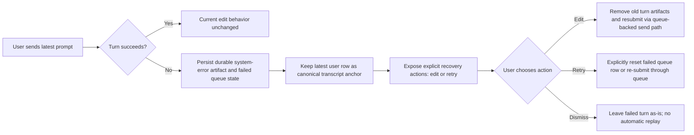

# AP: Fix Electron Last User Message Editability After Error

**Date:** 2026-03-09  
**Status:** Implemented  
**Related REQ:** `.docs/reqs/2026/03/09/req-electron-edit-last-user-after-error.md`

## Overview

Fix the Electron failed-turn recovery path so the latest user message remains editable after an error, edit resubmission uses the canonical queue-backed submit path, and queue becomes the only automatic resume authority for user turns. Restore must stop replaying user turns from persisted chat memory, failed user turns must stop using automatic queue retry/backoff replay, and the queue contract must be narrowed so only user-authored turns ever enter queue persistence. Recovery after terminal failure should become an explicit user choice surfaced through existing recovery UI rather than implicit replay.

## Architecture Decisions

- **AD-1:** The failed-turn recovery target is the latest user-authored message for the active chat, not the trailing error artifact.
- **AD-2:** Existing edit semantics remain canonical: editing still means "edit this user message and remove subsequent turn artifacts."
- **AD-3:** Failed-turn editability must use one explicit target-resolution rule rather than incidental UI ordering.
- **AD-4:** If transcript and queue state diverge on failed turns, Electron must reconcile them into one deterministic editable target instead of exposing competing recovery paths.
- **AD-5:** The initial fix should avoid changing core/server event contracts unless Electron cannot recover a canonical editable target from existing state.
- **AD-6:** Queue state is the sole authority for automatic restore-time resume of user turns; persisted chat memory may inform UI/diagnostics only and must not replay a user turn.
- **AD-7:** Terminal-SSE guard logic applies only to queue-owned interrupted-flight recovery, not to normal send, manual retry, or edit resubmission.
- **AD-8:** Edit/delete mutation flows must suppress restore-time auto-resume for the target chat while mutation is in progress.
- **AD-9:** Transcript editability remains anchored to canonical user-message rows; error rows are diagnostic only.
- **AD-10:** Edit resubmission must call the same queue-backed user-submit path as normal user send so retry, status, and persistence semantics remain unified.
- **AD-10a:** Queue storage and queue lifecycle state are user-turn-only; assistant/tool/system dispatch must stay outside queue persistence and queue retry state.
- **AD-10b:** The current mixed-send helper must be renamed or split so queue-backed user submission and immediate non-user dispatch are explicit at the API boundary.
- **AD-11:** Terminally failed user turns do not auto-resend on restore; recovery becomes explicit and user-driven.
- **AD-12:** Retry affordances should be expressed as explicit recovery options, using existing recovery UI primitives where helpful but not relying on transient process-local HITL runtime state as the sole source of truth.
- **AD-13:** Automatic queue retry/backoff for user-authored dispatch/runtime failures should be removed; only interrupted in-flight recovery remains automatic.
- **AD-14:** Persisted queue row state plus durable system-error transcript artifacts are the recovery authority after restart.
- **AD-15:** Selected-chat refresh must merge persisted history with live optimistic/system-error/streaming state rather than replacing the transcript wholesale.
- **AD-16:** Queue dispatch failures before streaming starts must emit a durable recovery artifact, not just a queue-row state transition.
- **AD-17:** Subscription/rebind helpers must be idempotent to prevent duplicate processing and duplicate durable error artifacts.
- **AD-18:** Persisted system-error replay must preserve original timestamps even when storage returns `Date` objects.

## Target Components

```text
core/
  message-edit-manager.ts               queue-backed edit resubmission
  managers.ts                           restore policy / no memory-based resend
  queue-manager.ts                      user-only queue API, explicit retry-only queue transitions, remove auto backoff replay
  events/publishers.ts                  direct non-user dispatch remains immediate and explicitly named
  hitl.ts / hitl-tool.ts                optional UI reuse only if not required for persistence

electron/renderer/src/
  components/MessageListPanel.tsx        failed-turn edit affordance visibility
  hooks/useMessageManagement.ts          failed-turn edit target handling
  hooks/useMessageQueue.ts               inspect queued/error user-turn identity if needed
  components/* or domain/*               explicit failed-turn recovery option wiring
  utils/message-utils.ts                 optional helper for latest failed-turn editability rule

electron/main-process/
  ipc-handlers.ts                        keep edit/delete restore in mutation mode and route retry/edit through canonical APIs

tests/core/
  targeted restore/edit/queue regression coverage
tests/electron/renderer/
  targeted failed-turn editability and explicit-retry regression coverage
```

## Target Flow



## Phases and Tasks

### Phase 1 - Confirm failed-turn state shape and authority boundaries
- [x] Inspect how Electron represents the latest failed turn across:
  - transcript message rows,
  - selected-chat error log rows,
  - sticky error status,
  - queue-backed failed message state.
- [x] Identify whether the latest failed user turn already has a canonical `messageId` in the renderer when the bug occurs.
- [x] Identify the narrowest integration point that can restore editability without changing happy-path message behavior.
- [x] Inspect persisted DB state for a concrete failing chat to distinguish renderer-only duplication from persisted duplication.
- [x] Verify whether edit duplicates are consistent with restore-time replay of the old failed user message.

### Phase 2 - Define restore/resume and failed-turn target rules
- [x] Define one helper/rule that resolves the editable latest failed user turn for the active chat.
- [x] Ensure trailing error artifacts do not suppress edit visibility for that resolved user turn.
- [x] Preserve the current requirement that edit actions target user messages only.
- [x] Keep the rule chat-scoped and deterministic.
- [x] Define queue-only restore rules:
  - `queued` => resumable,
  - `sending` => resumable only through interrupted-flight recovery,
  - `error` / `cancelled` => not auto-resumable.
- [x] Remove persisted-memory fallback replay from restore.
- [x] Define terminal-SSE guard scope narrowly for queue-owned interrupted-flight recovery only.
- [x] Decide that terminally failed turns are explicit-recovery only; no restore-time auto resend.

### Phase 3 - Remove failed-turn auto resend and unify queue ownership
- [x] Remove restore-time resend from persisted chat memory for user turns.
- [x] Remove automatic queue backoff replay for user-authored dispatch/runtime failures.
- [x] Keep interrupted-flight recovery only for truly in-flight `queued` / recoverable `sending` rows.
- [x] Ensure `editMessageInChat(...)` cannot trigger replay of the old failed turn before edit removal/resubmission.
- [x] Route edit resubmission through the same queue-backed submit path used by normal sends.
- [x] Ensure queue rows associated with removed/edit-replaced turns are cleared or invalidated appropriately.
- [x] Narrow queue ownership so only user-authored turns enter queue persistence/lifecycle state.
- [x] Split or rename the current mixed-send helper so the API surface has:
  - [x] one queue-only user submission function, and
  - [x] one clearly named direct-dispatch function for assistant/tool/system/non-user senders.
- [x] Update queue-backed user-turn callers to use the renamed queue-only API.
- [x] Update non-user dispatch callers to use the direct-dispatch API instead of the mixed helper.

### Phase 4 - Wire explicit failed-turn recovery into transcript/UI
- [x] Update `MessageListPanel.tsx` so the latest failed user turn remains editable under the resolved rule.
- [x] Update `useMessageManagement.ts` only as needed so save/edit submission still uses the correct canonical target and canonical queue-backed submit path.
- [x] Surface explicit failed-turn recovery actions so users can choose retry/edit rather than triggering automatic replay.
- [x] Keep those recovery actions derivable from persisted queue/system-error state after restart; do not depend solely on in-memory HITL request replay.
- [x] Keep logs in the logs panel and only durable system-error artifacts in the transcript.
- [x] If the canonical target is missing from transcript state but available in queue/main-process state, bridge that identity into the renderer in the smallest possible way.
- [x] Avoid changing normal successful-turn edit/delete behavior.

### Phase 5 - Targeted regression coverage
- [x] Add 1-3 focused Electron tests for failed-turn editability and explicit recovery.
- [x] Cover at least:
  - latest user message remains editable after a provider/config-style failure,
  - trailing error artifact does not block the edit affordance,
  - failed-turn editability stays scoped to the owning chat,
  - explicit retry action is required after terminal failure.
- [x] Add core/runtime regression coverage for:
  - restore-time terminal-error chats not auto-resending,
  - dispatch/runtime queue failures moving directly to explicit recovery state without automatic backoff replay,
  - interrupted `sending` rows still being recoverable,
  - edit flow resubmitting through queue rather than direct publish,
  - explicit retry path resetting/reusing queue state only when user chooses it,
  - restart restoring failed-turn recovery affordances from persisted state.
- [x] Keep tests deterministic and avoid filesystem/LLM dependencies.
- [x] Add focused coverage that non-user dispatch does not create queue rows.
- [x] Add focused coverage that edit resubmission still uses the queue-only user API after the rename/split.
- [ ] Add focused coverage that selected-chat refresh preserves optimistic/live streaming/system-error rows.
- [ ] Add focused coverage that queue preflight/no-response failures emit a durable system-error recovery artifact.
- [ ] Add focused coverage that `subscribeAgentToMessages(...)` rebinding is idempotent.
- [ ] Add focused coverage that replayed persisted system-error events preserve original timestamps when `createdAt` is a `Date`.

### Phase 6 - Verification
- [x] Run focused Vitest suites for the touched Electron/core tests.
- [x] Run any required Electron or integration verification if the final implementation crosses renderer/runtime transport boundaries.

### Phase 7 - Audit Gap Fixes (2026-03-10)
- [ ] Replace the narrow `preserveLiveSystemErrorMessages(...)` refresh patch with one selected-chat reconciliation helper that also preserves optimistic and live streaming/tool state.
- [ ] Publish a durable structured system-error event from queue preflight/no-response failure paths so non-streaming failed turns still surface visible recovery state.
- [ ] Make agent subscription rebinding idempotent by removing any existing listener before adding a new one for the same agent.
- [ ] Normalize persisted system-event replay timestamps from both `string` and `Date`.

## Intended Process Model

### Restore / Resume

1. Restore chat resources.
2. Replay HITL and rebuild chat-scoped derived state.
3. Inspect `message_queue` for the chat.
4. Resume behavior:
   - `queued` row present: resume queue dispatch.
   - `sending` row present: recover only when interrupted-flight rules allow it.
   - `error` or `cancelled` row present: do not auto-resume and surface explicit recovery only.
   - non-user messages: never represented as queue-owned resume candidates.
5. Persisted chat memory may be inspected only to rebuild transcript/UI state; it must not directly trigger resend of a user turn.
6. Apply terminal-SSE guard only to queue-owned interrupted-flight recovery candidates:
   - last post-message SSE is `error` or `end` => suppress restore-time auto-resume,
   - last post-message SSE is `start` only => interrupted, may recover,
   - no post-message SSE => do not invent a new automatic replay path from chat memory.

### Queue-Owned Recovery

1. Automatic recovery must operate only on existing queue-owned user turns.
2. Allowed only when:
   - a queue row exists for the candidate message,
   - the queue row is `queued` or recoverable `sending`,
   - no terminal SSE already post-dates that queue-owned turn,
   - no mutation flow is currently replacing it.
3. Blocked when:
   - no queue row exists,
   - queue row is `error` or `cancelled`,
   - terminal SSE exists,
   - newer user turn exists,
   - edit/delete mutation is active for the chat.
4. Assistant/tool/system/non-user messages are never eligible for queue-owned automatic recovery because they are not queue-backed work.

### Edit Message

1. Enter chat-scoped mutation mode.
2. Suppress restore-time auto-resume for that chat.
3. Stop in-flight processing and queue advancement for the old turn.
4. Remove the target user message and all subsequent artifacts.
5. Clear/invalidate queue rows belonging to the removed old turn.
6. Submit the edited content through the canonical queue-backed user-submit path.
7. Exit mutation mode.
8. If the new turn terminally fails, that new user message becomes the latest failed-turn editable target.

### Explicit Retry

1. When a user turn reaches terminal failure, the system records durable failure state and exposes recovery options.
2. No restore path automatically retries that failed turn.
3. Retry occurs only after an explicit user action.
4. Explicit retry should reuse queue semantics where possible:
   - reset a failed queue row when the original queued message remains authoritative, or
   - create a new queue-backed send when retry is represented as a new canonical user turn.
5. Error-specific recovery options may vary, but automatic replay remains disabled.
6. The persisted queue row plus durable system-error artifact must be sufficient to rebuild retry/edit affordances after restart.
7. Retry/reset handlers must only operate on user-owned queue rows.

### Selected-Chat Refresh

1. Selected-chat refresh must start from persisted chat memory and persisted events.
2. Before applying the refreshed result, the renderer must merge back any still-authoritative live selected-chat state:
   - optimistic user rows,
   - durable/live system-error rows,
   - active streaming/tool rows.
3. The selected-chat transcript must never be emptied during normal send/edit/delete/refresh flows while the chat still exists.

### Queue Failure Recovery Surface

1. Queue preflight/no-response failures must transition the queue row to durable `error`.
2. Those failures must also emit a durable structured system-error artifact so the transcript has a visible failed-turn recovery surface.
3. Silent “nothing streamed” failures are not acceptable for queue-owned user turns.

### Message Display

1. Transcript shows one canonical user anchor row per user `messageId`.
2. Error/system/queue-error rows are diagnostic only.
3. The latest canonical failed user message remains editable.
4. Queue UI may show retry/remove controls independently, but transcript editability stays anchored to the user row.

## Implementation Notes

- Prefer a pure helper for "latest failed-turn editable target" so the rule is unit-testable.
- Do not broaden general editability rules unless required; this fix is about preserving editability after failure, not redesigning which historical messages can be edited.
- Reuse existing canonical message identity where possible.
- If queue-backed failed turns are the only reliable source of identity/content for the bug case, keep the bridge narrowly scoped to Electron and chat-specific.
- Prefer fixing restore/edit mutation ordering and queue unification first; renderer edit affordance changes alone will not solve persisted duplicate user-message rows or inconsistent retry semantics.
- Rename mixed dispatch helpers as part of the queue-boundary cleanup so future callers cannot accidentally route assistant/tool/system sends through a user-queue API name.
- Do not model failed-turn retry affordances as transient HITL requests unless they are also derivable from persisted queue/system state after restart.
- Delete the memory-based restore resend path rather than attempting to keep it in sync with queue ownership.

## Risks and Mitigations

| Risk | Mitigation |
|------|------------|
| Fix accidentally makes the wrong user message editable | Resolve the target with an explicit latest-user-message rule scoped to the active chat |
| Renderer and queue state disagree about the failed turn | Introduce a single failed-turn target-resolution helper and test it |
| Fix regresses normal edit behavior | Keep successful-turn behavior unchanged and cover only the failure-specific branch |
| Fix requires broader event-contract changes than expected | Stop and run another AR pass before expanding into core/server contracts |
| Removing auto resend leaves failed turns stranded | Add explicit retry/edit recovery actions and durable system-error state |
| Edit queue unification changes persistence timing | Test resubmission at the IPC/core boundary with in-memory queue storage |
| Existing queue retry loop still replays failed turns automatically | Remove automatic user-turn backoff replay and cover with queue-manager regression tests |
| Recovery options disappear after restart if tied only to HITL runtime | Drive renderer recovery state from persisted queue/system-error artifacts |
| Keeping memory-based resend alongside queue resume preserves duplicate replay paths | Remove restore-time resend from persisted chat memory entirely |
| Mixed user/non-user dispatch helper keeps reintroducing queue-boundary ambiguity | Rename/split the API so queue-only user submission and direct non-user dispatch are distinct and test-covered |

## Architecture Review (AR)

### High-Priority Issues

1. **The latest failed prompt currently lacks a reliable recovery path.**
   - Users should not have to manually copy/retype the exact last message after a runtime/provider error.

2. **Failed-turn state may exist in more than one Electron surface.**
   - The transcript can show the user row plus an error artifact while the queue layer still owns failure metadata. The fix must reconcile those into one edit target.

3. **The bug should be solved with identity preservation, not broad UI exceptions.**
   - If the app special-cases arbitrary error rows without a canonical target rule, future message-ordering changes will break the behavior again.

### New Issues Found and Resolved (AR Pass 2, 2026-03-09 - code inspection)

1. **Edit affordance is transcript-row driven.**
   - `electron/renderer/src/components/MessageListPanel.tsx` exposes edit buttons from rendered user rows only. Resolution: define failed-turn target resolution first, then make the user row remain the affordance anchor.

2. **Send flow is event-driven rather than optimistic in the transcript.**
   - `electron/renderer/src/hooks/useMessageManagement.ts` does not create an optimistic transcript row on send. Resolution: keep the fix focused on preserving/deriving a canonical failed-turn target from existing runtime state rather than adding broad optimistic transcript behavior unless implementation proves necessary.

3. **Queue-backed failures may hold the only durable identity for the failed turn in some timing windows.**
   - Resolution: allow the implementation to bridge queue/main-process identity into the renderer only if transcript state alone is insufficient.

### New Issues Found and Resolved (AR Pass 3, 2026-03-10 - persisted chat inspection)

1. **Edit restore path can replay the old failed user turn before mutation.**
   - `editMessageInChat(...)` calls `restoreChat(...)` before edit removal/resubmission. `restoreChat(...)` currently triggers pending-last-message auto-resume.
   - Resolution: suppress restore-time user-last auto-resume when queue/terminal-SSE state marks the turn as terminal, and block auto-resume during chat-scoped edit mutation.

2. **Current auto-resume still has a memory-based replay path.**
   - `triggerPendingLastMessageResume(...)` still inspects the last persisted user message and can trigger resend outside queue ownership.
   - Resolution: remove memory-based resend entirely and let queue be the only automatic resume authority.

3. **The removed terminal-SSE guard likely conflicted because its scope was too broad.**
   - Broad guard behavior can suppress legitimate retry/edit flows.
   - Resolution: narrow guard semantics to queue-owned interrupted-flight recovery only; explicit resend/edit/manual retry remain allowed.

4. **Edit resubmission still bypasses the queue today.**
   - `core/message-edit-manager.ts` currently republishes edited content directly, so send and edit do not share one retry/persistence contract.
   - Resolution: route edit resubmission through the same queue-backed submit path as normal send.

5. **Auto resend hides error-specific recovery choices from users.**
   - Blind replay is a poor fit for configuration errors, permission errors, and HITL-denied paths where retry may not be the right next step.
   - Resolution: disable automatic retry for terminal failures and surface explicit recovery options.

6. **Current queue failure handling still auto-requeues failed user turns with exponential backoff.**
   - `handleQueueDispatchFailure(...)` increments retry count, returns the row to `queued`, and schedules a timed replay.
   - Resolution: remove automatic user-turn retry/backoff replay and transition directly to durable explicit-recovery state.

7. **Existing HITL runtime is process-local and not durable enough to be the sole retry UI source.**
   - `core/hitl.ts` keeps pending requests in memory only, so restart-safe recovery cannot depend on unresolved HITL requests still existing.
   - Resolution: keep failed-turn recovery state derivable from persisted queue rows and durable system-error transcript artifacts; HITL primitives may be reused only as a presentation/input mechanism.

8. **The current queue ingress API is semantically overloaded.**
   - `enqueueAndProcessUserMessage(...)` still direct-publishes non-user senders, so callers cannot tell from the name whether they are using queue persistence or immediate dispatch.
   - Resolution: split or rename the API so queue-backed submission is user-only by contract, and non-user dispatch uses a separate clearly named immediate path.

### Tradeoffs

- Explicit failed-turn target resolution (selected)
  - Pros: deterministic, testable, minimal behavior change outside the bug path.
  - Cons: requires understanding both transcript and queue state for failures.
- Queue-first restore semantics with narrow terminal guard (selected)
  - Pros: matches persisted processing authority, prevents failed-chat replay loops and edit races.
  - Cons: requires touching core restore/queue mutation flow instead of renderer-only changes.
- Remove memory-based restore resend (selected)
  - Pros: one automatic resume path, simpler reasoning, fewer duplicate replay risks.
  - Cons: interrupted turns without queue ownership will no longer auto-recover.
- Queue-backed edit resubmission unification (selected)
  - Pros: one send/edit/retry contract, simpler failure handling, easier persistence control.
  - Cons: requires touching message-edit core path and IPC expectations.
- Queue-only user API plus separate non-user direct dispatch (selected)
  - Pros: cleaner contracts, easier reasoning, prevents future accidental queue misuse.
  - Cons: requires caller updates and a small naming migration.
- Explicit retry instead of auto resend (selected)
  - Pros: better user control, safer for non-transient errors, avoids surprise duplicate processing.
  - Cons: removes one convenience path for transient failures.
- Persisted recovery-state authority instead of transient HITL-only prompts (selected)
  - Pros: restart-safe, matches persisted chat/error model, easier renderer refresh behavior.
  - Cons: requires explicit mapping from persisted failure state to recovery controls.
- Broad "always allow latest visible user row to edit" exception (rejected)
  - Pros: simpler in the short term.
  - Cons: risks editing the wrong target when failed-turn state and transcript ordering diverge.

### AR Exit Condition

- The latest failed user turn in Electron always has one deterministic edit path.
- The edit action remains scoped to the owning chat and canonical user message.
- Retry after failure is explicit and user-driven.
- Recovery affordances survive restart from persisted state.
- Queue is the only automatic resume authority for user turns.
- Queue-backed APIs are user-turn-only by contract.
- Normal successful-turn edit behavior is unchanged.

## Verification Commands (planned)

- `npx vitest run tests/electron/renderer/*message* tests/electron/renderer/*queue*`
- `npm run integration`

## Rollout Gate

Proceed to implementation only when this plan is approved and the following remain true:
1. The first implementation pass stays as narrow as possible.
2. The fix preserves canonical user-message targeting.
3. Failed-turn editability remains chat-scoped.
4. Terminal failed turns do not auto-resend during restore.
5. Edit resubmission uses the queue-backed submit path.
6. Recovery options do not depend solely on in-memory HITL state.
7. Restore does not replay user turns from persisted chat memory.
8. Queue-backed APIs are user-turn-only by contract and by tests.
