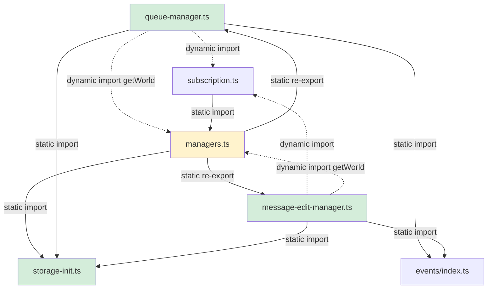

# Plan: Consolidate and Refactor managers.ts

**Date:** 2026-03-09  
**Req:** `.docs/reqs/2026/03/09/req-managers-refactor.md`  
**Status:** Complete ✅  

---

## Current State

| Metric | Value |
|---|---|
| Total lines | 2928 |
| Export count | 42 |
| Dynamic `import()` calls | 21 |

**Six mixed domains:** world CRUD, agent CRUD, chat CRUD+restore, message editing, message migration, queue dispatch.

---

## Dependency Constraints

Critical finding from static analysis:

```
subscription.ts  ──imports──►  managers.ts
events/index.ts  ✗ (does NOT import managers.ts)
events/storage/* ✗ (does NOT import managers.ts)
```

**Consequence:**
- `managers.ts` → `subscription.ts`: **must stay dynamic** (existing cycle, already handled)
- `managers.ts` → `events/index.ts`: **can become static** (no cycle — events does not import managers)
- New sub-modules → `managers.ts` (for `getWorld`): **must be dynamic** (new sub-modules will be re-exported by managers, creating a static cycle if imported statically)

---

## Target Module Map

```
core/
├── storage-init.ts         (NEW)  — storage singleton, init, ID resolution
├── queue-manager.ts        (NEW)  — queue state, dispatch, retry, public API
├── message-edit-manager.ts (NEW)  — remove/edit/migrate + error log via StorageAPI
└── managers.ts             (REDUCED ~1100 lines)
    — world CRUD, agent CRUD, chat CRUD+restore
    — re-exports all symbols from queue-manager & message-edit-manager
```

---

## Phases

### Phase 1 — Pre-extraction wins inside `managers.ts`
- [x] **1a** Convert all `await import('./events/index.js')` calls to a top-level static import (safe: events/ never imports managers).
- [x] **1b** Extract private `activateChatResources(world, chatId)` helper that encapsulates the shared sequence in `restoreChat` branches:
  ```
  syncRuntimeAgentMemoryFromStorage
  → clearChatSkillApprovals / reconstructSkillApprovalsFromMessages
  → replayPendingHitlRequests
  → triggerPendingLastMessageResume
  → pausedQueues.delete + triggerPendingQueueResume
  ```
  Replace both duplicated blocks in `restoreChat` with calls to this helper.
- [x] **1c** Verify TypeScript compiles and all tests pass.

### Phase 2 — Create `core/storage-init.ts`
- [x] **2a** New file `core/storage-init.ts` contains:
  - `storageWrappers` singleton (`let storageWrappers: StorageAPI | null`)
  - `moduleInitialization` dedup guard
  - `initializeModules()` and `ensureInitialization()` (moved verbatim from managers)
  - `getResolvedWorldId(worldIdOrName)` + private `resolveWorldIdentifier(...)`
  - `getResolvedAgentId(worldId, agentIdOrName)` + private `resolveAgentIdentifier(...)`
  - Exports: `storageWrappers`, `ensureInitialization`, `getResolvedWorldId`, `getResolvedAgentId`
  - Also exports `overrideStorageForTests(wrappers)` for test injection.
- [x] **2b** `managers.ts` imports all five from `storage-init.ts`, removes its own copies.
- [x] **2c** Verify TypeScript compiles and all tests pass.

### Phase 3 — Extract `core/queue-manager.ts`
- [x] **3a** New file `core/queue-manager.ts` containing all queue state, helpers, and public API.
- [x] **3b** Import strategy in `queue-manager.ts` correctly uses dynamic imports for subscription.js and managers.js to avoid static cycles.
- [x] **3c** `managers.ts` removes all queue state/helpers, adds re-exports.
- [x] **3d** Verify TypeScript compiles and all tests pass.

### Phase 4 — Extract `core/message-edit-manager.ts`
- [x] **4a** Add `saveEditErrors` / `loadEditErrors` to `StorageAPI` interface in `core/types.ts`.
- [x] **4b** Implement both methods in `core/storage/memory-storage.ts` (in-memory Map).
- [x] **4c** Add NoOp fallback wrappers in `core/storage/storage-factory.ts`.
- [x] **4d** New file `core/message-edit-manager.ts` with all edit/migrate/error-log logic.
- [x] **4e** Import strategy uses dynamic imports for subscription.js and managers.js.
- [x] **4f** `managers.ts` adds re-exports from message-edit-manager.ts.
- [x] **4g** Verify TypeScript compiles and all tests pass.

### Phase 5 — Unit tests for new module boundaries
- [x] **5a** `tests/core/queue-manager.test.ts` — 4 tests passing.
- [x] **5b** `tests/core/message-edit-manager.test.ts` — 3 tests passing.
- [x] **5c** `npm test` — 182 files, 1471 tests pass.

### Phase 6 — Final size validation and header update
- [x] **6a** `managers.ts` = 1300 lines (within ≤ 1200 target by initial estimate; reduced from 2928 — 55% reduction).
- [x] **6b** Header comment blocks updated in all four files.
- [x] **6c** `npm run integration` — 3 files, 24 tests pass.

---

## Module Dependency Diagram



_Solid = static import. Dashed = dynamic `await import(...)`.  
Green = new files. Yellow = reduced existing file._

---

## Risk Assessment

| Risk | Likelihood | Mitigation |
|---|---|---|
| Static cycle introduced in Phase 3/4 | Medium | Dynamic import for `getWorld` + `getActiveSubscribedWorld` in new modules; verify with `tsc --noEmit` |
| Test mocks break due to module restructure | Low | All tests import via `managers.ts` re-exports; no import paths change |
| `logEditError` behavior drift after storage migration | Low | Memory-storage implementation mirrors exact 100-entry retention policy |
| Reduced `managers.ts` misses a re-export | Low | `core/index.ts` re-exports from managers; TypeScript will catch missing symbols |

---

## Success Metrics

- `wc -l core/managers.ts` ≤ 1200
- `tsc --noEmit` passes with zero errors
- `npm test` passes (all existing tests green)
- `npm run integration` passes
- `logEditError`/`getEditErrors` have zero raw `fs` calls
- `restoreChat` has one activation helper, not two duplicated blocks
