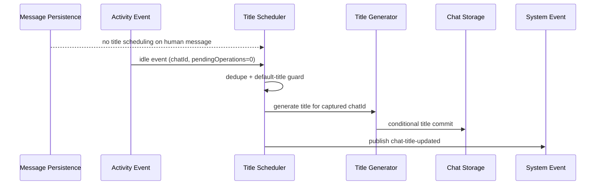

# Architecture Plan: Chat Title Idle-Only Trigger

**Date**: 2026-03-10  
**Type**: Reliability Simplification  
**Status**: SS Complete  
**Related**:
- [Requirements](../../reqs/2026/03/10/req-chat-title-idle-only-trigger.md)
- [Prior Title Generation Plan](../../2026/02/13/plan-chat-title-generation.md)

## Overview

Remove the human-message debounce title trigger and keep automatic chat title generation on the existing chat-scoped idle activity event only.

## Architecture Decisions

### Decision 1: Use Idle as the Sole Trigger Boundary
- Keep `runIdleTitleUpdate(...)` as the only runtime entry point for automatic title generation.
- Remove message-path scheduling via `scheduleNoActivityTitleUpdate(...)`.

### Decision 2: Preserve Existing Commit Safety
- Keep in-flight deduplication keyed by `worldId:chatId`.
- Keep in-memory default-title recheck before commit.
- Keep storage compare-and-set commit semantics.

### Decision 3: Preserve Existing Event Contracts
- Keep `chat-title-updated` payload shape unchanged.
- Keep activity-event `chatId` as the authoritative scoping source.

## Scope of Change

- Core message persistence path that currently schedules no-activity title generation.
- Core title scheduler module to remove the debounce-only code path and any now-unused timer state.
- Unit tests covering title-trigger timing behavior.

## Solution Sketch (SS)

- Remove `scheduleNoActivityTitleUpdate(...)` and debounce timer state from `core/events/title-scheduler.ts` while preserving the idle-path dedupe, default-title guard, compare-and-set commit, and `chat-title-updated` publication flow.
- Make the combined message persistence handler in `core/events/persistence.ts` persistence-only so human message publication no longer schedules title generation.
- Keep `subscribeWorldToMessages(...)` in `core/events/subscribers.ts` as an idempotent listener-registration boundary only, preserving listener-count invariants without reintroducing title-generation side effects on message events.
- Update title-generation tests to replace the removed debounce expectation with a negative assertion and keep idle-path scope/race coverage intact.

## Data Flow

## Implementation Phases

### Phase 1: Remove Debounce Triggering
- [x] Delete human-message scheduling from the message persistence path.
- [x] Remove debounce timer usage for title generation.
- [x] Remove now-unused helper exports/state if no longer needed.

### Phase 2: Preserve Idle-Only Behavior
- [x] Keep idle event validation requirements unchanged.
- [x] Keep chat-scoped in-flight dedupe unchanged.
- [x] Keep compare-and-set commit behavior unchanged.

### Phase 3: Update Tests
- [x] Replace tests that expect title generation from a human-message-only debounce path.
- [x] Add/adjust tests proving that human messages alone do not trigger generation.
- [x] Keep idle-path race and scope tests passing.

### Phase 4: Validation
- [x] Run targeted title-generation unit tests.
- [x] Run any broader integration test required if event/runtime transport behavior is touched.

## Risks and Mitigations

- **Risk**: Human-only chats may remain `New Chat` if no idle event is emitted.
  - **Mitigation**: Treat this as intentional product behavior for this change; validate and document that current runtime only emits `idle` when a tracked world activity lifecycle completes.
- **Risk**: Removing scheduler code could accidentally weaken dedupe or commit guards.
  - **Mitigation**: Limit edits to trigger entry points and preserve downstream title application logic unchanged.
- **Risk**: Tests may still encode old debounce behavior.
  - **Mitigation**: Update assertions to reflect idle-only triggering and retain race-safety coverage.

## Completion Criteria

- [x] Automatic title generation has one runtime trigger path: idle activity events.
- [x] No code path from message persistence directly schedules title generation.
- [x] Chat-scoped race protections remain intact.
- [x] Targeted tests pass with idle-only expectations.

---

## Architecture Review (AR)

**Review Date**: 2026-03-10  
**Status**: Approved with noted product tradeoff

### Review Summary

The proposed simplification is sound from a race perspective. The current race protection is already in the downstream scheduler and commit path; the main value here is reducing trigger ambiguity. The main product tradeoff is concrete, not hypothetical: the current runtime emits `idle` from tracked world-activity completion, which today is entered on agent-processing paths. A standalone human message with no agent response will therefore remain `New Chat` after this change.

### Assumption Validation

- ✅ Idle events already carry the required `chatId` and pending-operation state.
- ✅ Existing compare-and-set commit semantics are sufficient and should remain unchanged.
- ⚠️ Human-only chat titling is expected to stop in flows that do not enter tracked world activity and therefore never emit `idle`.

### Review-Driven Plan Updates Applied

- Explicitly constrained the scope to trigger-path removal only.
- Added test updates for the removed debounce behavior.
- Added validation language to confirm the human-only `New Chat` outcome is an accepted product behavior for this change.
