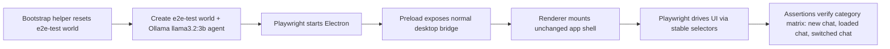

# AP: Electron Playwright E2E Harness

**Date:** 2026-03-10
**Status:** Implemented
**Related REQ:** `.docs/reqs/2026/03/10/req-electron-playwright-e2e-harness.md`

## Overview

Introduce a Playwright Electron harness that launches the real desktop app, provisions a fresh Google-backed `e2e-test` world using `gemini-2.5-flash`, and runs the desktop scenario matrix across new-chat, loaded-default-chat, and switched-chat categories.

The already-landed Electron main IPC scenario matrix remains the lower-level foundation for this story and should not be split into a separate planning track.

## Architecture Decisions

- **AD-1:** Use Playwright Electron, not a browser-only renderer harness.
- **AD-2:** The first pass follows the user-requested real-runtime flow: real Electron plus real Google-backed world setup using `gemini-2.5-flash`.
- **AD-3:** The harness must execute the real Electron main process, real preload bridge, real IPC routes, and real renderer app with no mocked desktop shell.
- **AD-4:** Prefer stable selectors and explicit test hooks over brittle text-only selectors.
- **AD-5:** Keep native OS dialogs out of scope for direct E2E interaction; provide test-safe bypasses or direct IPC/test-runtime data injection where needed.

## Options Considered

### Option A: Playwright against real Electron + real core runtime
- Pros:
  - Highest fidelity
- Cons:
  - Violates deterministic test policy unless a large amount of storage/provider behavior is mocked indirectly
  - Hard to seed reproducible chat/HITL/error states
  - Unsafe for CI

### Option B: Playwright against browser-only renderer with mocked desktop bridge
- Pros:
  - Easy to seed
  - Highly deterministic
- Cons:
  - Does not exercise the real Electron app process, preload bridge, or IPC routing
  - Misses a core part of the desktop integration boundary
  - Rejected by AR: user explicitly requires the real Electron app, not mocks

### Option C: Playwright against real Electron with deterministic E2E runtime mode
- Pros:
  - Exercises real Electron main + preload + renderer path
  - Keeps tests deterministic
  - Allows scripted world/session/message/HITL outcomes
  - Best balance of fidelity and maintainability
- Cons:
  - Requires adding test-runtime seams in main/preload and possibly selector hardening in renderer

### Option D: Playwright against real Electron with scripted world bootstrap and Google Gemini
- Pros:
  - Matches the requested workflow directly
  - Reuses existing `tests/e2e` world bootstrap pattern
  - Highest desktop-path fidelity for local development
- Cons:
  - Not CI-safe by default
  - Depends on Google credentials/model availability
  - Less deterministic than a fully scripted runtime mode

**Selected for first pass:** Option D.

AR update:
- The harness must stay on the real Electron app path.
- Do not mock `window.agentWorldDesktop`.
- Do not replace the renderer with a browser-only harness.
- Do not swap in a fake main/preload runtime after launch.

## Proposed Design

### 1. Add Playwright desktop bootstrap helpers

Introduce shared helpers that:

- check whether world `e2e-test` exists
- delete it when present
- create a fresh `e2e-test` world
- create the required Google agent using `gemini-2.5-flash`
- launch Electron and navigate to the prepared world/session state

Possible implementation shapes:

- bootstrap through core APIs before Electron launch, or
- bootstrap through an Electron main-process test helper invoked before GUI assertions

AR constraint:
- bootstrap helpers may prepare state before launch, but once Electron launches, all behavior under test must flow through the real app.

### 2. Add Playwright Electron test infrastructure

Add:

- Playwright config for Electron tests
- a launch helper that starts the Electron app in E2E mode
- reusable helpers for:
  - app launch/close
  - `e2e-test` world reset/bootstrap
  - locating key desktop UI surfaces
  - waiting for session/message/HITL/queue conditions

### 3. Harden selectors for desktop UI automation

Add stable test selectors or other reliable semantics for critical controls in:

- world selection
- session creation/selection/deletion
- composer input/send/stop
- message edit/delete/branch actions
- HITL response controls
- queue controls
- view selector / logs / settings toggles

### 4. Add first-pass desktop E2E suites

Proposed initial suite grouping:

- `tests/electron-e2e/app-bootstrap.spec.ts`
- `tests/electron-e2e/session-lifecycle.spec.ts`
- `tests/electron-e2e/message-send.spec.ts`
- `tests/electron-e2e/message-edit-delete.spec.ts`
- `tests/electron-e2e/hitl.spec.ts`
- `tests/electron-e2e/queue.spec.ts`

Each suite should organize assertions by category:

- new chat
- loaded default/current chat
- switched chat

## Flow

## Tasks

### Phase 1: Harness foundation
- [x] Add Playwright dependencies and config for Electron tests (`playwright.electron.config.ts`).
- [x] Add npm scripts for desktop E2E (`test:electron:e2e`, `test:electron:e2e:run`).
- [x] Add Electron launch helper for Playwright (`support/fixtures.ts`, `support/electron-harness.ts`).
- [x] Ensure the Playwright launch path uses the real Electron app entry and production preload bridge.

### Existing Completed Foundation
- [x] Add lower-level Electron main IPC matrix coverage for:
  - new chat -> send/edit applicable flows
  - current chat -> send/edit applicable flows
  - switched chat -> send/edit applicable flows
- [x] Validate success / HITL-adjacent / error outcome propagation at the IPC routing boundary.
- [x] Run focused Vitest for the IPC matrix suite.

### Phase 2: Real-world bootstrap helpers
- [x] Add `e2e-test` world existence check/delete bootstrap (`support/bootstrap-real-world.ts`).
- [x] Add fresh `e2e-test` world creation helper.
- [x] Add Google `gemini-2.5-flash` agent bootstrap helper.
- [x] Add prerequisite checks and clear failure messaging for missing Google credential/model setup.

### Phase 3: Selector hardening
- [x] Add stable selectors for critical desktop workflows.
- [x] Avoid brittle reliance on dynamic text where a selector can be made stable.
- [x] Add selectors without introducing renderer-only test harness branching.

### Phase 4: E2E coverage
- [x] Add app bootstrap/world selection coverage (`app-shell.spec.ts`).
- [x] Add session create/load/switch coverage (`chat-flow-matrix.spec.ts`).
- [x] Add send success/error/HITL coverage for: new chat, loaded current chat, switched chat.
- [x] Add edit success/error/HITL coverage for: new chat, loaded current chat, switched chat.
- [x] Add delete message chain coverage for: new chat, loaded current chat, switched chat.
- [x] Add queue lifecycle coverage (retry/skip/clear) for all three chat categories.
- [x] Add cross-session contamination guard (edit/delete does not bleed into sibling session).
- [x] Add smoke coverage for logs/settings/view selector paths (`app-shell.spec.ts`).
- [x] HITL scoped to owning session / replays on return (switched chat) — fixed by session-scoped `activeHitlPrompt`/`hasActiveHitlPrompt` derivation in `App.tsx` (`hitl-scope.ts` utility, 2026-03-10).

### Phase 5: Verification and docs
- [x] Document how to run desktop E2E locally in `tests/electron-e2e/README.md`.
- [x] Coverage matrix table in README reflects current pass/skip/missing status.
- [x] Harness helpers documented in README (`electron-harness.ts` API list).

## AR Review Notes

### High-Priority Risks

1. **Fake-bridge trap**
   - If the harness only mocks `window.agentWorldDesktop` in the renderer, it will not validate the actual Electron desktop integration path.
   - Resolution: keep preload and main in path; reject renderer-only mocked harnesses entirely.

2. **Real-provider dependency risk**
   - Real Google provider dependency makes the first-pass suite less deterministic and unsuitable for default CI gating.
   - Resolution: document this as a local-real-runtime suite. Accept the tradeoff for first pass because AR now prioritizes real-app fidelity over mock-driven determinism.

3. **Native-dialog brittleness**
   - Automating OS dialogs is fragile and slow.
   - Resolution: keep direct OS dialog interaction out of first-pass coverage; use test-runtime seeding or bypass hooks for import/export-like state setup.

4. **Selector instability**
   - Text-only selectors against a fast-changing desktop UI will make the suite flaky.
   - Resolution: add deliberate stable selectors or equivalent reliable semantics on critical controls.

5. **Scope explosion**
   - “All E2E cases” is too broad unless concretized.
   - Resolution: define first-pass coverage as all critical desktop chat/session lifecycle journeys, not every secondary modal or configuration branch.

### Additional Design Guidance

- Reuse the existing world bootstrap pattern from `tests/e2e/test-agent-response-rules.ts` where possible, but switch provider/model bootstrap to Google `gemini-2.5-flash`.
- Prefer resetting the `e2e-test` world before each suite or test rather than sharing uncontrolled state.
- Reuse existing chat isolation rules from the root/Electron AGENTS docs as assertions in the E2E matrix.
- Keep the Playwright assertions focused on visible desktop behavior and avoid test-only shortcuts that bypass the real UI path once the app is open.

## Exit Criteria

- The project has a real Playwright Electron harness.
- The harness provisions `e2e-test` world and agent state automatically.
- The harness uses the real Electron app, real preload bridge, and real IPC flow with no mocked desktop shell.
- Critical desktop user journeys are covered by executable GUI tests across:
  - new chat
  - loaded default/current chat
  - switched chat
- The repo has documented commands to run the suite and documented Google credential/model prerequisites.
