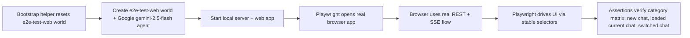

# AP: Web Playwright E2E Harness

**Date:** 2026-03-10
**Status:** Implemented — see `.docs/done/2026/03/10/web-playwright-e2e-harness.md`
**Related REQ:** `.docs/reqs/2026/03/10/req-web-playwright-e2e-harness.md`

## Overview

Introduce a Playwright browser harness that launches the real web app, provisions a fresh Google-backed `e2e-test-web` world using `gemini-2.5-flash`, and runs the web scenario matrix across new-chat, loaded-current-chat, and switched-chat categories.

The existing runtime scenario scripts remain the lower-level foundation for this story and should not be split into a separate planning track.

## Architecture Decisions

- **AD-1:** Use Playwright against the real browser app, not component-only browser rendering.
- **AD-2:** The first pass follows the user-requested real-runtime flow: real web app plus real server runtime plus real Google-backed world setup using `gemini-2.5-flash`.
- **AD-3:** The harness must execute the real web UI, real REST API, real SSE flow, and real server runtime with no mocked browser-only shell.
- **AD-4:** Prefer stable selectors and explicit test hooks over brittle text-only selectors.
- **AD-5:** Keep direct OS/file-picker automation out of scope for first-pass coverage unless the web UI already exposes a test-safe browser path.

## Options Considered

### Option A: Playwright against real web app + real server runtime
- Pros:
  - Highest fidelity
- Cons:
  - Real-provider dependency is less deterministic
  - Harder to use in CI by default

### Option B: Playwright against browser app with mocked API/SSE
- Pros:
  - Easy to seed
  - Highly deterministic
- Cons:
  - Does not exercise the real API and SSE integration path
  - Misses the core browser/server boundary
  - Rejected for this story because the goal is the real web app path

### Option C: Playwright against real web app with deterministic E2E server mode
- Pros:
  - Exercises the real browser + API path
  - More deterministic
- Cons:
  - Requires adding a scripted test runtime
  - More intrusive for the first pass

### Option D: Playwright against real web app with scripted world bootstrap and Google Gemini
- Pros:
  - Matches the requested workflow directly
  - Reuses existing real-runtime E2E patterns already present in the repo
  - Highest fidelity for local development
- Cons:
  - Not CI-safe by default
  - Depends on Google credentials/model availability

**Selected for first pass:** Option D.

AR update:
- The harness must stay on the real web app path.
- Do not replace REST or SSE with mocked browser-side shims.
- Do not replace the UI with isolated component tests after the browser launches.

## Proposed Design

### 1. Add Playwright web bootstrap helpers

Introduce shared helpers that:

- check whether world `e2e-test-web` exists
- delete it when present
- create a fresh `e2e-test-web` world
- create the required Google agent using `gemini-2.5-flash`
- launch the browser and navigate to the prepared world/chat state

Possible implementation shapes:

- bootstrap through core/server APIs before browser launch, or
- bootstrap through HTTP/API helpers before UI assertions

AR constraint:
- bootstrap helpers may prepare state before launch, but once the browser is open, all behavior under test must flow through the real web app.

### 2. Add Playwright web test infrastructure

Add:

- Playwright config for web tests
- dev-server orchestration for the server + web app
- reusable helpers for:
  - app launch/close
  - `e2e-test-web` world reset/bootstrap
  - locating key web UI surfaces
  - waiting for chat/message/HITL/queue conditions

### 3. Harden selectors for browser automation

Add stable test selectors or other reliable semantics for critical controls in:

- world selection
- chat creation/selection/deletion
- composer input/send/stop
- message edit/delete/branch actions
- HITL response controls
- queue controls
- logs/settings/world-management affordances where present

### 4. Add first-pass web E2E suites

Proposed initial suite grouping:

- `tests/web-e2e/app-shell.spec.ts`
- `tests/web-e2e/chat-flow-matrix.spec.ts`
- `tests/web-e2e/queue.spec.ts`
- `tests/web-e2e/world-smoke.spec.ts`

Each suite should organize assertions by category:

- new chat
- loaded current chat
- switched chat

## Flow

## Tasks

### Phase 1: Harness foundation
- [x] Add Playwright config for web tests.
- [x] Add npm scripts for web E2E.
- [x] Add dev-server startup/wait logic for server + web app.
- [x] Ensure the Playwright path uses the real browser UI and real local server.

### Phase 2: Real-world bootstrap helpers
- [x] Add `e2e-test-web` world existence check/delete bootstrap.
- [x] Add fresh `e2e-test-web` world creation helper.
- [x] Add Google `gemini-2.5-flash` agent bootstrap helper.
- [x] Add prerequisite checks and clear failure messaging for missing Google credential/model setup.

### Phase 3: Selector hardening
- [x] Add stable selectors for critical web workflows.
- [x] Avoid brittle reliance on dynamic text where a selector can be made stable.
- [x] Add selectors without introducing browser-only mock branches.

### Phase 4: E2E coverage
- [x] Add app bootstrap/world selection coverage.
- [x] Add chat create/load/switch/delete/branch coverage where the web UI exposes those paths.
- [x] Add send success/error/HITL coverage for:
  - new chat
  - loaded current chat
  - switched chat
- [x] Add edit/delete success/error/HITL coverage for the same categories where applicable.
- [x] Add queue lifecycle coverage, including resume/recovery flows, across the same category model where applicable. _(5 queue panel tests pending web UI queue management panel)_
- [x] Add smoke coverage for logs/settings/world-management paths that exist in the web UI.

### Phase 5: Verification and docs
- [x] Document how to run web E2E locally.
- [x] Run the new web E2E suite.
- [x] Keep focused unit/integration tests for touched web/server files green.

## AR Review Notes

### High-Priority Risks

1. **Mocked API trap**
   - If the harness swaps in mocked REST/SSE behavior, it will miss the real browser/server integration boundary.
   - Resolution: keep the real server and browser API path in place.

2. **Real-provider dependency risk**
   - Real Google provider dependency makes the first-pass suite less deterministic and unsuitable for default CI gating.
   - Resolution: document this as a local-real-runtime suite. Accept the tradeoff for first pass because fidelity is the priority.

3. **Selector instability**
   - Text-only selectors against a changing browser UI will make the suite flaky.
   - Resolution: add deliberate stable selectors or equivalent reliable semantics on critical controls.

4. **SSE timing races**
   - Browser E2E can become flaky if assertions depend on transient SSE timing without stable UI markers.
   - Resolution: wait on durable visible UI states such as queue status, HITL cards, and transcript entries.

5. **Scope explosion**
   - “Same E2E tests for web” is too broad unless concretized.
   - Resolution: define first-pass coverage as all critical chat/session lifecycle journeys, not every secondary browser feature.

### Additional Design Guidance

- Reuse the existing `tests/e2e/` bootstrap patterns where possible, but switch provider/model bootstrap to Google `gemini-2.5-flash`.
- Prefer resetting the `e2e-test-web` world before each suite or test rather than sharing uncontrolled state.
- Reuse existing chat isolation rules from the root `AGENTS.md` as assertions in the web E2E matrix.
- Keep Playwright assertions focused on visible browser behavior and avoid test-only shortcuts that bypass the real UI path after launch.

## Exit Criteria

- The project has a real Playwright web harness.
- The harness provisions `e2e-test-web` world and agent state automatically.
- The harness uses the real web app, real REST API, and real SSE flow with no mocked browser shell.
- Critical web user journeys are covered by executable GUI tests across:
  - new chat
  - loaded current chat
  - switched chat
- The repo has documented commands to run the suite and documented Google credential/model prerequisites.
