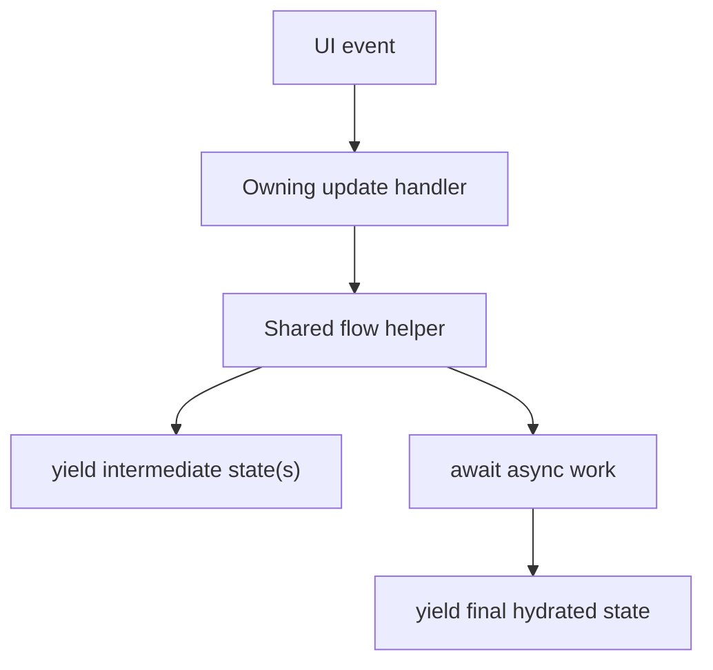

# Architecture Plan: Web Event Handler Generator Flow

**Date**: 2026-03-11  
**Type**: Refactor Plan  
**Component**: `web` AppRun update flow  
**Related Requirement**: `.docs/reqs/2026/03/11/req-web-event-handler-generator-flow.md`

## Summary

Refactor the `web` AppRun update layer so multi-step flows are composed directly inside the owning handler rather than dispatching secondary handlers with `app.run(...)`.

The primary mechanism will be reusable async-generator flow helpers and `yield*` composition for send, init/refresh, and chat-session transitions.

## Architecture Review

### Assumptions Reviewed

- AppRun update handlers can use async generators for progressive state transitions.
- The current world initialization flow is already modeled as an async generator and can be reused as a composition primitive.
- SSE event publishing from outside the update handlers remains acceptable because the user request is specifically to avoid `app.run` inside event handlers.

### Risks Reviewed

- Refactoring send/init/chat flows may accidentally change optimistic-state timing.
- Chat/session refresh flows are coupled to active-chat filtering and HITL reconstruction; composition changes must not reorder those steps.
- Some `app.run(...)` calls are scheduler-driven or external-event driven rather than handler chaining; those should not be folded into this refactor unless required.

### Review Outcome

No major architectural flaw blocks the refactor if scope stays focused on handler-to-handler chaining in `web/src/pages/World.update.ts`.

## Current Problem Areas

- `key-press` dispatches `send-message` indirectly.
- `create-new-chat` dispatches `initWorld` indirectly after the API call succeeds.
- Refresh paths manually iterate `initWorld()` results inside promise-returning handlers instead of composing around the generator flow directly.

## Target Design

## Planned Changes

- [x] Extract a shared send-message flow helper that owns validation, optimistic message insertion, active-chat checks, SSE startup, and send failure recovery.
- [x] Update both keyboard-triggered and direct send handlers to compose that shared flow directly rather than dispatching another AppRun event.
- [x] Refactor system-refresh paths to use generator composition so local transient state and world rehydration remain in one explicit flow.
- [x] Refactor chat creation flow to compose directly into world initialization using the returned `chatId` instead of dispatching `initWorld`.
- [x] Review chat-load and chat-delete paths for any remaining indirect handler chaining and align them with the same composition style where needed.
- [x] Keep scheduler/external-source dispatches out of scope unless they are required to complete the handler-chaining cleanup safely.

## Implementation Notes

- Prefer local helper functions that return `AsyncGenerator<WorldComponentState>` for reusable multi-step flows.
- Prefer `yield*` when a handler is primarily delegating to another flow.
- Preserve the existing `initWorld` flow as the main hydration primitive unless a smaller helper extraction is clearly beneficial.
- Keep SSE transport/event publishing unchanged unless a change is necessary to preserve semantics.

## Test Plan

- [x] Add a targeted unit test covering optimistic send state emission before SSE startup completion.
- [x] Add a targeted unit test covering chat creation flow hydrating the created chat without indirect handler dispatch.
- [x] Add a targeted unit test covering system-triggered refresh composition preserving transient messages and active-chat scope.
- [x] Run the relevant `web` unit tests.
- [ ] If transport/runtime behavior is touched, run `npm run integration`.

## Validation Notes

- Focused unit coverage passed for the changed web generator flows and adjacent world-update regressions.
- Repo-wide and workspace `tsc` entrypoints are currently blocked by a pre-existing unrelated type error in `server/sse-handler.ts` (`TS2349` at line 484).

## Exit Criteria

- [x] Scoped web handlers no longer use `app.run(...)` for handler-to-handler chaining.
- [x] Async-generator composition is used where multi-step state flow benefits from yielded intermediate states.
- [x] Existing send/chat/init/HITL behavior remains intact.
- [x] Targeted regression tests pass.
