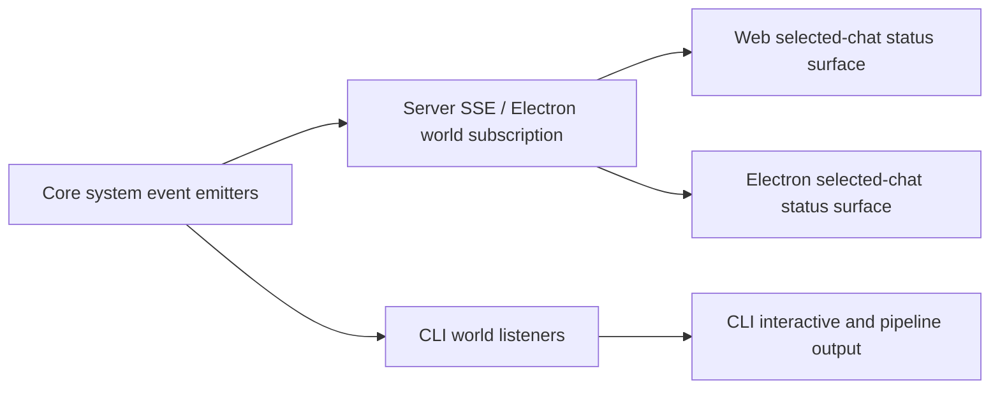

# Plan: Cross-Client System Status Parity

**Date:** 2026-03-12
**Status:** Draft
**Req:** `.docs/reqs/2026/03/12/req-cross-client-system-status-parity.md`

---

## Summary

Implement end-to-end parity for chat-scoped `system` status events across server transport, web, CLI, and Electron so users can consistently see what is happening during runtime work, waits, and failures.

---

## Architecture Notes

- The canonical producer contract already exists in core; this story is mostly about transport correctness, selected-chat scoping, and client presentation parity.
- The transport and clients must continue to treat `chatId` as explicit and authoritative.
- Web and Electron should converge on an intentionally visible selected-chat status surface instead of hidden internal event ingestion.
- CLI should render system events as permanent user-facing output rather than transient internal state only.
- The implementation should not introduce `/status` polling as a substitute for pushed selected-chat system-event visibility.

---

## Phases

- [x] Phase 1: Transport contract hardening
  - [x] Review server SSE system-event scoping against the explicit chat-id contract.
  - [x] Align chat-scoped system-event forwarding behavior with the intended selected-chat isolation rules.
  - [x] Add API transport tests that explicitly assert scoped system-event forwarding and non-forwarding of out-of-scope events.

- [x] Phase 2: Web selected-chat status visibility
  - [x] Replace hidden system-event ingestion with a visible selected-chat status presentation path.
  - [x] Preserve existing actionable failure behavior for queue-dispatch and similar terminal failures.
  - [x] Ensure chat switches clear or replace stale web system status.
  - [x] Add targeted web tests for visible status updates, error visibility, and chat-scoped filtering.

- [x] Phase 3: CLI system-event rendering
  - [x] Implement real rendering for `system` channel events in interactive mode.
  - [x] Implement real rendering for `system` channel events in pipeline mode.
  - [x] Keep status-line coordination clean so system output does not corrupt prompts.
  - [x] Add targeted CLI tests for plain-text and structured system-event display behavior.

- [x] Phase 4: Electron selected-chat parity hardening
  - [x] Trace the selected-chat system-event path in main and renderer against live plain-text and structured payloads.
  - [x] Fix any remaining visibility gaps so emitted selected-chat system events are actually visible in the Electron UI during real usage.
  - [x] Preserve existing deliberate transcript behavior for error-like system events while keeping non-error system events status-surface-only.
  - [x] Add or update Electron tests for visible plain-text system status, structured title-update status, selected-chat isolation, and actual App/status-bar rendering behavior.

- [x] Phase 5: Verification and regression safety
  - [x] Run the targeted unit tests for server, web, CLI, and Electron touched by the change.
  - [x] Run `npm run integration` because the story touches API transport/runtime event paths.
  - [x] Run focused review on cross-chat leakage, duplicate status rendering, and stale status cleanup.

---

## Planned Test Coverage

1. Server/API
   - SSE handler forwards chat-scoped system events to the matching chat stream.
   - SSE handler rejects out-of-scope or unscoped system events for a chat-scoped stream.

2. Web
   - Selected-chat plain-text system status becomes visible.
   - Queue-dispatch failure remains visibly actionable.
   - Chat switch clears or rebinding replaces stale system status.

3. CLI
   - Interactive mode prints system events.
   - Pipeline mode prints system events.
   - Structured error-like system events render readable text.

4. Electron
  - Selected-chat plain-text system status becomes visible.
  - Structured `chat-title-updated` status remains visible and still triggers session refresh.
  - Non-selected-chat and unscoped system events remain filtered out.
  - App-level status-bar rendering reflects selected-chat system status instead of validating helper logic only.

5. Cross-boundary
   - No duplicate or contradictory visible status appears when the same event travels through the normal runtime path.

---

## Risks and Mitigations

| Risk | Mitigation |
|---|---|
| Web status becomes visible but duplicates existing error surfaces | Keep terminal failure handling explicit and test visible output precedence |
| Fixing server transport changes chat scoping in unexpected ways | Add SSE handler tests before and after the transport adjustment |
| CLI output corrupts the interactive prompt/status line | Route permanent output through the existing status-line pause/resume path |
| Electron appears correct in unit tests but still misses live events | Test both structured and plain-text selected-chat events through the actual renderer event handler path |
| Cross-client semantics drift again on future events | Keep plain-text + structured normalization generic and scoped by `chatId` |

---

## AR Updates

- [x] Confirmed the highest-priority implementation target is not new event production but parity across transport and client display.
- [x] Confirmed this story must include the server SSE scoping contract, not just renderer work.
- [x] Confirmed web and CLI need substantive changes; Electron needs hardening and verification rather than assumption-based exclusion.
- [x] Confirmed targeted tests plus `npm run integration` are required by project policy.
- [x] Confirmed this story should not fall back to `/status` polling for selected-chat runtime status visibility.
- [x] Confirmed Electron needs App-visible verification because helper-only coverage does not fully explain the live user report.

---

## Approval Gate

Implementation should begin only after approval of this REQ/AP/AR set.

Recommended next step after approval:

1. Implement transport and client parity in one pass.
2. Run targeted tests plus `npm run integration`.
3. Continue with DD and GC after CR if the implementation is accepted.
