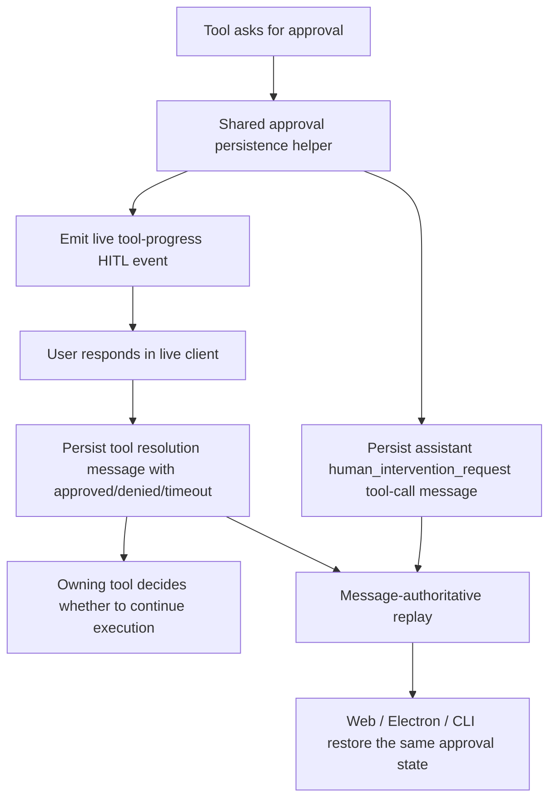

# Plan: Built-in Tool Approval Message Persistence

**Date:** 2026-03-12  
**REQ:** `.docs/reqs/2026/03/12/req-tool-approval-message-persistence.md`  
**Branch:** `feature/tool-approval-message-persistence`

---

## Architecture Overview

---

## Key Design Decision

The implementation should separate the identity of the approval request from the identity of the owning tool call.

- `requestId`: identifies the approval prompt/resolution pair.
- `toolCallId`: identifies the built-in tool call that requested approval.

That split is necessary because a built-in tool call like `shell_cmd` or `create_agent` can already have its own tool call ID, while the approval prompt needs its own canonical `human_intervention_request` message identity if it is to be persisted and replayed cleanly.

Compatibility requirement:

- Existing flows where `requestId === toolCallId` must keep working.
- New durable approval flows where `requestId !== toolCallId` must also work.
- Validation, replay, dedupe, and response-submission code must stop assuming equality as a hard invariant.
- Runtime and renderer code should key pending approval identity by `requestId`, while preserving `toolCallId` for owning-tool correlation.

---

## Phased Tasks

### Phase 1 — Define a shared durable approval artifact contract

- [x] Introduce a shared helper for built-in approval prompt/resolution persistence instead of hand-rolling durable approval handling per tool.
- [x] Define the canonical assistant prompt artifact shape so it is compatible with the existing message-authoritative HITL replay model.
- [x] Define the canonical tool resolution payload shape for `approved`, `denied`, and `timeout` outcomes.
- [x] Ensure the contract carries stable `requestId`, owning `toolCallId`, `chatId`, tool name, and approval metadata.

### Phase 2 — Decouple approval request identity from owning tool identity

- [x] Update the shared HITL runtime contract so a built-in approval request can keep its own `requestId` while still linking back to an owning `toolCallId`.
- [x] Remove or relax any validation rule that rejects a request solely because `requestId !== toolCallId`.
- [x] Preserve current live HITL event behavior for existing clients while allowing persisted approval prompts to use separate canonical IDs.
- [x] Make replay and prompt dedupe use `requestId` as the prompt identity, not the owning tool's `toolCallId`.
- [x] Preserve `toolCallId` in metadata and prompt payloads for transcript correlation and owning-tool linkage.
- [x] Keep deterministic matching and dedupe behavior for replayed prompts.

### Phase 3 — Migrate built-in approval producers to the shared durable path

- [x] Update `shell_cmd` approvals to persist canonical approval prompt/resolution messages.
- [x] Update `web_fetch` local/private access approvals to persist canonical approval prompt/resolution messages.
- [x] Update `create_agent` approvals to persist canonical approval prompt/resolution messages.
- [x] Keep `load_skill` compatible with the shared identity/persistence contract without regressing its existing durable behavior.

### Phase 4 — Preserve live execution semantics

- [x] Keep the owning tool in control of whether execution continues after approval.
- [x] Ensure denied/time-out approvals produce durable approval history without incorrectly auto-resuming execution after reload or restart.
- [x] Preserve queue ownership and existing turn recovery rules.

### Phase 5 — Replay and restore convergence

- [x] Verify that runtime HITL replay and persisted-message replay converge to a single logical approval prompt set.
- [x] Ensure restored clients can explain prior denied approvals from messages alone.
- [x] Preserve existing edit/delete trimming semantics so removed branches do not leave orphan approval artifacts.

### Phase 6 — Targeted automated coverage

- [x] Add core unit tests proving canonical approval prompt/resolution persistence for at least one shared-helper path and one migrated built-in tool.
- [x] Add regression coverage for denied approval surviving restore/replay as approval history rather than only a generic tool failure.
- [x] Add coverage that existing `load_skill` durable approval behavior remains compatible.
- [x] Run integration coverage if API/runtime path changes require it.

---

## Expected File Touches

Likely files to change during implementation:

- `core/tool-approval.ts`
- `core/hitl.ts`
- `core/load-skill-tool.ts`
- `core/shell-cmd-tool.ts`
- `core/web-fetch-tool.ts`
- `core/create-agent-tool.ts`
- `tests/core/tool-approval.test.ts`
- `tests/core/hitl.test.ts`
- targeted tool-specific unit tests under `tests/core/`

If replay or transport handling needs adjustment, implementation may also touch:

- `electron/main-process/realtime-events.ts`
- Electron/Web tests that validate HITL replay from persisted messages

---

## Risks and Mitigations

| Risk | Why It Matters | Mitigation |
|---|---|---|
| `requestId` / `toolCallId` coupling regression | Existing live HITL code assumes they often match | Introduce explicit compatibility handling and targeted HITL tests before migrating all producers |
| Duplicate prompt replay | Runtime replay and persisted-message replay can both surface the same prompt | Keep a single stable dedupe key based on canonical approval request identity |
| Transcript clutter | More persisted approval artifacts may render extra rows | Reuse the existing hidden-placeholder `human_intervention_request` display rules rather than inventing a new rendering model |
| False resume expectations after restart | Durable artifacts may look resumable even if the execution context died | Keep queue/turn recovery rules unchanged and ensure the plan does not treat durable history as resume authority |

---

## Architecture Review Notes (AR)

### Findings

- The existing `load_skill` pattern proves the durable prompt/resolution model is viable and already compatible with message-authoritative replay.
- The main architectural blocker is not storage; it is identity modeling in the shared HITL path.
- Generalizing the existing `load_skill` pattern through a shared helper is lower risk than creating a second durable approval format.

### RequestId / ToolCallId Review Result

- Yes, AR now addresses the consistency issue explicitly.
- The reviewed direction is not to keep them forcibly identical; it is to define their roles clearly and require compatibility with both equal and distinct values.
- Any implementation step must verify this at four boundaries: runtime validation, prompt replay, prompt dedupe, and response submission.

### Chosen Direction

Implement a shared durable built-in approval helper and migrate existing approval producers onto it, rather than keeping `load_skill` as a one-off exception.

### Rejected Direction

Keep the current event-only approval prompt path and rely on terminal tool errors/results to explain denials.

- Rejected because it leaves message history unable to reconstruct the approval boundary itself.

### AR Exit Condition

Proceed to implementation only after the team accepts the identity split (`requestId` vs owning `toolCallId`) and the durable approval artifact model described above.

Implementation should not begin if any planned code path still depends on `requestId === toolCallId` as a hard requirement for durable built-in approval prompts.