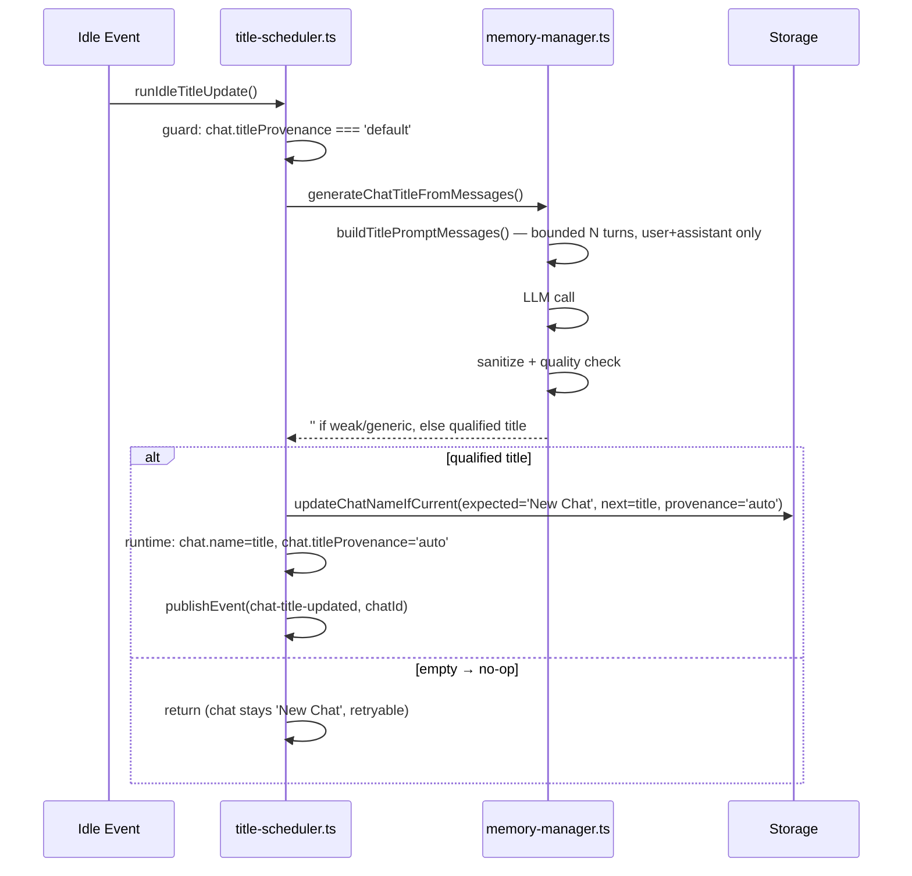
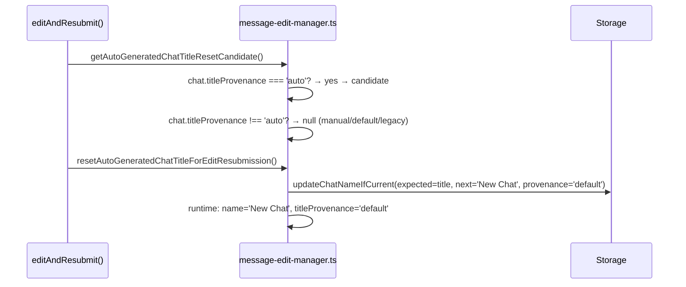

# Plan: Chat Title Quality and Provenance Hardening

**Date**: 2026-03-12  
**Req**: `.docs/reqs/2026/03/13/req-chat-title-quality-hardening.md`  
**Branch**: `feature/chat-title-quality-hardening`  
**Status**: ✅ Implemented — 2026-03-13

---

## Context: Current Architecture

### Title Generation Flow

```
idle event (pendingOperations=0, chatId)
  └─ runIdleTitleUpdate()                   [title-scheduler.ts]
       └─ tryGenerateAndApplyTitle()
            ├─ guard: chat.name === 'New Chat'
            ├─ generateChatTitleFromMessages()  [memory-manager.ts]
            │    ├─ load messages from storage
            │    ├─ buildTitlePromptMessages()  ← uses single latest user message only
            │    ├─ call LLM (maxTokens=20)
            │    ├─ sanitizeGeneratedTitle()
            │    ├─ isLowQualityTitle() → pickFallbackTitle() ← returns 'Chat Session' (weak!)
            │    └─ return title
            ├─ commitChatTitleIfDefault()  (CAS: name='New Chat' → title)
            ├─ world.chats.get(id).name = title
            └─ publishEvent(chat-title-updated)
```

### Edit/Resubmission Reset Flow

```
editAndResubmit()                         [message-edit-manager.ts]
  ├─ getAutoGeneratedChatTitleResetCandidate()
  │    ├─ query last 25 system events for chat-title-updated events
  │    └─ if latest generated title === chat.name → return candidate  ← inferred: fragile!
  ├─ resetAutoGeneratedChatTitleForEditResubmission()  (CAS: name → 'New Chat')
  ├─ [resubmit fails] → rollbackAutoGeneratedChatTitleReset()
```

### Problems

| # | Problem | Impact |
|---|---------|--------|
| P1 | `pickFallbackTitle` returns `'Chat Session'` when no quality title found; `'Chat Session'` is NOT in `GENERIC_TITLES`, so it is committed | Weak fallback permanently replaces 'New Chat' |
| P2 | `buildTitlePromptMessages` uses single latest user message only | Short follow-ups ("How does that work?") produce topic-agnostic titles |
| P3 | Edit reset infers authorship by event-scan comparison (fragile) | Manual rename that matches past auto title gets wrongly reset |

---

## Implementation Phases

### Phase 1 — Weak Fallback No-Commit (REQ-1, REQ-2)

**Problem**: `pickFallbackTitle` returns `'Chat Session'` as final fallback. Because `'chat session'` is absent from `GENERIC_TITLES`, `isLowQualityTitle('Chat Session')` returns `false`, so the weak fallback gets committed as the permanent title.

**Fix**: Change `pickFallbackTitle` to return `''` (empty string) instead of `'Chat Session'` when all candidates fail the quality check. Add `'chat session'` to `GENERIC_TITLES` as a secondary guard.

**Effect**: `generateChatTitleFromMessages` returns `''` → `tryGenerateAndApplyTitle` already exits early on falsy title → chat stays at `'New Chat'` → future idle events can still auto-title.

**Files**:
- `core/events/memory-manager.ts` — `GENERIC_TITLES`, `pickFallbackTitle`

**Checklist**:

- [x] Add `'chat session'` and `'session'` to `GENERIC_TITLES`
- [x] Change `pickFallbackTitle` final return from `'Chat Session'` to `''`
- [x] Add unit tests:
  - `pickFallbackTitle` returns `''` when all candidates are generic
  - `generateChatTitleFromMessages` with LLM returning `'Chat'` → returns `''`
  - `tryGenerateAndApplyTitle` with weak LLM result → chat stays `'New Chat'`
  - Second idle fires after first no-op → generation still attempted (in-flight key cleared)

---

### Phase 2 — Bounded Context Window (REQ-3, REQ-4, REQ-5)

**Problem**: `buildTitlePromptMessages` calls `selectTitleSourceUserMessage` which returns only the single latest user message. Short follow-up turns like "Why?" or "How does that work?" produce titles that don't capture the topic.

**Fix**: Replace single-message selection with a bounded sliding window of recent `user` and `assistant` message pairs. Tool calls, system messages, and non-text content are excluded by role filtering (already enforced). Each selected message is still clipped to `TITLE_PROMPT_MAX_CHARS_PER_TURN`. Window size is a named constant for auditability.

**Design**:

```
const TITLE_CONTEXT_WINDOW_TURNS = 3;  // up to 3 recent u/a pairs = max 6 messages

function buildTitlePromptMessages(messages, content):
  1. Collect up to TITLE_CONTEXT_WINDOW_TURNS * 2 most recent messages
     that are role='user' or role='assistant' (skip tool/system/function)
  2. If explicit `content` is provided, replace the last user slot with it
  3. Each message clipped to TITLE_PROMPT_MAX_CHARS_PER_TURN
  4. Return array preserving chronological order

Resulting prompt shape:
  -user: <clip(msg1)>
  -assistant: <clip(msg2)>
  -user: <clip(msg3)>  ← most recent or overridden by `content`
```

**Files**:
- `core/events/memory-manager.ts` — `TITLE_CONTEXT_WINDOW_TURNS`, `buildTitlePromptMessages`, `selectTitleSourceUserMessage`

**Checklist**:

- [x] Add `TITLE_CONTEXT_WINDOW_TURNS = 3` constant
- [x] Refactor `buildTitlePromptMessages` to collect bounded recent user+assistant pairs
- [x] Keep per-message clip to `TITLE_PROMPT_MAX_CHARS_PER_TURN`
- [x] Keep `content` override for the latest user turn (callers may pass explicit trigger content)
- [x] Filter out messages where role is not `user` or `assistant` (tool/system/function)
- [x] Preserve chronological ordering in the returned array
- [x] `selectTitleSourceUserMessage` becomes an internal helper scoped to the new multi-turn selection function (or inlined); no longer the sole source-selection path
- [x] Update unit tests:
  - Multi-turn context included in prompt up to window limit
  - Single message falls back cleanly (window smaller than TURNS constant)
  - Tool/system/function messages excluded from prompt window
  - Explicit `content` replaces last user slot

---

### Phase 3 — Explicit Title Provenance (REQ-6 through REQ-11)

**Problem**: Authorship of the current title is inferred by scanning the last 25 system events and comparing the most recent generated title to the current name. This fails when:
- A user manually renames to text that happens to equal a past auto-title
- System events are trimmed (event retention is finite)
- Events are unavailable (no `world.eventStorage`)

**Fix**: Store `title_provenance` explicitly on the `world_chats` row. Provenance transitions happen atomically with the name change. Edit reset checks the provenance field directly.

#### 3a — Migration

- [x] Create `migrations/0017_add_title_provenance.sql`:
  ```sql
  ALTER TABLE world_chats
  ADD COLUMN title_provenance TEXT DEFAULT 'default';
  ```

#### 3b — Constants and Types

- [x] Add to `core/chat-constants.ts`:
  ```typescript
  export type TitleProvenance = 'default' | 'auto' | 'manual';
  export const TITLE_PROVENANCE_DEFAULT: TitleProvenance = 'default';
  export const TITLE_PROVENANCE_AUTO: TitleProvenance = 'auto';
  export const TITLE_PROVENANCE_MANUAL: TitleProvenance = 'manual';
  ```
- [x] Add `titleProvenance?: TitleProvenance` to `Chat` interface in `core/types.ts`
- [x] Add `titleProvenance?: TitleProvenance` to `UpdateChatParams` in `core/types.ts`

#### 3c — Storage Implementations

The existing `updateChatNameIfCurrent` CAS method (used in both auto-title commit and edit reset) needs to also write provenance atomically. The cleanest approach is to extend its signature to accept an optional `nextProvenance` parameter so call sites can pass the correct provenance.

- [x] Extend `StorageAPI.updateChatNameIfCurrent` signature in `core/types.ts`:
  ```typescript
  updateChatNameIfCurrent?(
    worldId: string, chatId: string,
    expectedName: string, nextName: string,
    nextProvenance?: TitleProvenance
  ): Promise<boolean>;
  ```
- [x] Update `core/storage/sqlite-storage.ts`:
  - `loadChatData`: read `title_provenance` → populate `chat.titleProvenance`
  - `updateChatData`: write `title_provenance` from `updates.titleProvenance` if provided
  - `updateChatNameIfCurrent`: updated SQL to also write `title_provenance` when `nextProvenance` is provided
  - `listChats`: read and surface `title_provenance`
- [x] Update `core/storage/memory-storage.ts`:
  - Store `titleProvenance` in the in-memory Map
  - `updateChatNameIfCurrent`: write `nextProvenance` if provided
  - `updateChatData`, `loadChatData`, `listChats`: include provenance
- [x] Update `core/storage/world-storage.ts` (file-based):
  - Include `titleProvenance` in serialized chat shape
  - `updateChatNameIfCurrent`: write `nextProvenance` if provided

#### 3d — Auto-Title Commit (REQ-9)

- [x] In `core/events/title-scheduler.ts`, `commitChatTitleIfDefault`:
  - Pass `TITLE_PROVENANCE_AUTO` as `nextProvenance` to `updateChatNameIfCurrent`
  - On legacy-fallback path (no CAS): also write `titleProvenance: TITLE_PROVENANCE_AUTO` in the `updateChatData` call
- [x] After commit, set `currentChat.titleProvenance = TITLE_PROVENANCE_AUTO` in runtime cache

#### 3e — Manual Rename (REQ-10)

The manual rename entry point is `updateChat` in `core/managers.ts`, called by both the CLI (`renameChat` command) and other consumers.

- [x] In `core/managers.ts`, `updateChat`:
  - When `updates.name` is explicitly provided (and non-empty), inject `updates.titleProvenance = TITLE_PROVENANCE_MANUAL` before calling `updateChatData`
  - This ensures any name update from a user-facing path receives `manual` provenance without each call site needing awareness

#### 3f — Edit Reset (REQ-8, REQ-11)

Replace the event-scan provenance inference with direct provenance field check:

- [x] In `core/message-edit-manager.ts`, `getAutoGeneratedChatTitleResetCandidate`:
  - Load chat with provenance (`world.chats.get(chatId)` or `storage.loadChatData`)
  - Return null if `titleProvenance !== 'auto'` (covers legacy/default/manual)
  - No longer needs `eventStorage` query for this purpose
  - Simplify function: remove `latestGeneratedTitle` scan logic + dead `extractGeneratedChatTitleFromSystemPayload` helper
- [x] `resetAutoGeneratedChatTitleForEditResubmission`:
  - Pass `expectedProvenance: 'auto'` guard and write `TITLE_PROVENANCE_DEFAULT` on reset
  - CAS: `expectedName + expectedProvenance='auto'` → `nextName='New Chat' + nextProvenance='default'`
  - Update runtime: `runtimeChat.titleProvenance = TITLE_PROVENANCE_DEFAULT`
- [x] `rollbackAutoGeneratedChatTitleResetAfterFailedResubmission`:
  - Also restore `titleProvenance: TITLE_PROVENANCE_AUTO`
  - Update runtime: `runtimeChat.titleProvenance = TITLE_PROVENANCE_AUTO`

**Legacy safety (REQ-11)**: Legacy rows have `title_provenance = 'default'` (from `DEFAULT 'default'`). A chat with `titleProvenance === 'default'` and a non-default name is ambiguous (could be pre-provenance auto-title). Since `getAutoGeneratedChatTitleResetCandidate` only proceeds if `titleProvenance === 'auto'`, all legacy chats are preserved — matching REQ-11's "favor preserving".

#### 3g — Tests

- [x] Provenance `'auto'` set on successful auto-title commit (storage side + runtime): `post-stream-title.test.ts`
- [x] Provenance `'manual'` set when `updateChat` updates name: `chat-title-provenance.test.ts`
- [x] `getAutoGeneratedChatTitleResetCandidate` returns null for `manual` provenance chat: `message-edit.test.ts`
- [x] `getAutoGeneratedChatTitleResetCandidate` returns null for legacy `default` provenance chat: `message-edit.test.ts`
- [x] `getAutoGeneratedChatTitleResetCandidate` returns candidate for `auto` provenance chat: `message-edit.test.ts`
- [x] Edit reset where manual rename equals past auto-title → not reset (REQ-7): `message-edit.test.ts`
- [x] Rollback restores provenance to `auto`: `message-edit.test.ts`

---

## Data / Schema Changes

| Change | File | Notes |
|--------|------|-------|
| New column `title_provenance TEXT DEFAULT 'default'` | `migrations/0017_add_title_provenance.sql` | Backward-compatible; existing rows get `'default'` |
| `Chat.titleProvenance?: TitleProvenance` | `core/types.ts` | Optional for backward compat |
| `UpdateChatParams.titleProvenance?: TitleProvenance` | `core/types.ts` | Auto-injected by `managers.updateChat` for user renames |
| Extend `StorageAPI.updateChatNameIfCurrent` | `core/types.ts` | Add optional `nextProvenance` param |

---

## Architecture Flow (After)





---

## File Change Summary

| File | Phase | Change Type |
|------|-------|-------------|
| `core/events/memory-manager.ts` | 1, 2 | Modify: `GENERIC_TITLES`, `pickFallbackTitle`, `buildTitlePromptMessages` |
| `core/events/title-scheduler.ts` | 3d | Modify: `commitChatTitleIfDefault` — write provenance='auto' |
| `core/message-edit-manager.ts` | 3f | Modify: `getAutoGeneratedChatTitleResetCandidate`, reset/rollback helpers; remove dead `extractGeneratedChatTitleFromSystemPayload` |
| `core/chat-constants.ts` | 3b | Modify: add `TitleProvenance` type and constants |
| `core/types.ts` | 3b, 3c | Modify: `Chat`, `UpdateChatParams`, `StorageAPI` |
| `core/managers.ts` | 3e | Modify: `updateChat` — inject `manual` provenance on rename |
| `core/storage/sqlite-storage.ts` | 3c | Modify: read/write `title_provenance` |
| `core/storage/memory-storage.ts` | 3c | Modify: provenance in CAS and CRUD |
| `core/storage/world-storage.ts` | 3c | Modify: provenance in file-based CAS and CRUD |
| `core/storage/storage-factory.ts` | 3c | Modify: forward `nextProvenance` through both storage wrappers |
| `migrations/0017_add_title_provenance.sql` | 3a | New |
| `tests/core/events/post-stream-title.test.ts` | 1, 2, 3 | Modify: extend with new coverage |
| `tests/core/chat-title-provenance.test.ts` | 3e | New: `updateChat` provenance injection tests |
| `tests/core/message-edit.test.ts` | 3f | Modify: add provenance assertions + rollback-provenance test |

---

## Acceptance Criteria Mapping

| AC | Phase | Key Test |
|----|-------|----------|
| Weak fallback → chat stays 'New Chat' | 1 | `post-stream-title.test.ts` ✅ |
| Later idle can still auto-title after prior no-op | 1 | `post-stream-title.test.ts` ✅ |
| Bounded context window; topic-aware for follow-ups | 2 | `post-stream-title.test.ts` ✅ |
| Tool/system content excluded from prompt | 2 | `post-stream-title.test.ts` ✅ |
| Manual rename == past auto title → not reset | 3 | `message-edit.test.ts` ✅ |
| Edit resets only auto-generated titles | 3 | `message-edit.test.ts` ✅ |
| Rollback restores provenance to 'auto' | 3 | `message-edit.test.ts` ✅ |
| updateChat sets provenance='manual' on rename | 3 | `chat-title-provenance.test.ts` ✅ |
| Successful auto-title emits `chat-title-updated` | existing | (preserved) ✅ |

---

## Out of Scope

- Manual title editing UX changes
- New user controls for forcing title regeneration
- Large prompt-engineering experiments
- Re-titling chats that have a protected manual title

---

## Addendum — Prompt Quality Improvement (2026-03-13)

**Trigger**: Live database investigation found a real chat (`chat-1773457029164-11r2g8may`) where the LLM echoed the user message verbatim (`@gemini search most recent 10 youtube videos about google stitch`) instead of producing a concise title. Root cause: the title-gen prompt lacked `@mention` semantics and a no-verbatim-copy rule.

**Fix** (`core/events/memory-manager.ts`):

- **System prompt** (before): `'You are a helpful assistant that turns conversations into concise titles.'`
- **System prompt** (after): `'You are a concise title generator. Given a conversation snippet, output a short noun-phrase title (3–6 words, Title Case). Rules: output the title only — no explanation, no punctuation at the end; never copy the user message verbatim; if the user message begins with @agentname, that is an agent mention — base the title on the topic or task after it, not on the mention itself.'`
- **User prompt** (after): structured 3-rule format — (1) do not copy user message verbatim, (2) `@name` prefix is an agent mention — title based on topic/task, (3) output title only, followed by the conversation turns.

**Tests**: All 1741 existing tests pass after this change — no new test cases required (behavior is LLM output quality policy, not unit-testable logic).
