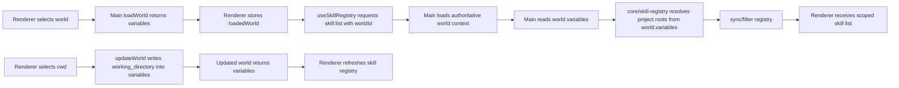

# Plan: World Env Skill Registry Resolution

**Date:** 2026-03-19
**Status:** Draft
**Req:** [req-world-env-skill-registry.md](../../reqs/2026/03/19/req-world-env-skill-registry.md)

## Summary

Refactor project-scope skill discovery so it is driven by the active world's env data instead of the process-wide `AGENT_WORLD_WORKSPACE_PATH` and `AGENT_WORLD_DATA_PATH` variables.

The implementation will keep `world.variables` as the only world-local env source and make skill-registry refresh follow active-world changes rather than renderer-selected workspace/project path overrides.

## Architecture Notes

- `world.variables` remains the persisted and runtime source for world-local env values such as `working_directory`, `tool_permission`, and `reasoning_effort`.
- The Electron main process, not the renderer, should remain the authority for resolving project-scope skill roots during `skill:list`.
- Renderer skill-registry refresh should follow active world identity and env changes, not `workspacePath` or `selectedProjectPath`.
- The change should not expand into storage-path rework; `AGENT_WORLD_DATA_PATH` removal is scoped to skill-registry path resolution only.

## Architecture Decisions

### AD-1: World-scoped context instead of renderer path injection

- Replace `skill:list` project scoping based on renderer-provided `projectPath`.
- Scope `skill:list` by `worldId` so the main process can load the authoritative world and read `world.variables` itself.
- Keep the global/project include toggles unchanged.

### AD-2: Skill-registry root resolution takes explicit world variables

- Extend `core/skill-registry.ts` root resolution so project-scope roots can be derived from explicit world `variables` input.
- Stop consulting `AGENT_WORLD_WORKSPACE_PATH` and `AGENT_WORLD_DATA_PATH` for default project roots.
- When no usable world-scoped path exists, fall back to `homedir()` instead of `process.cwd()`.

### AD-3: Renderer refresh follows loaded world lifecycle

- `useSkillRegistry` should refresh based on the loaded world context, especially world switch and world env change.
- Selecting a project folder for a loaded world must:
  - persist the new `working_directory` into `variables`,
  - refresh the skill registry after the update succeeds.
- Switching worlds must refresh the skill registry for the newly active world.

## Data Flow

## Phases

### Phase 1: World variables contract alignment
- [ ] Confirm all affected desktop world flows continue using `variables` as the only world-local env source.
- [ ] Reuse existing `working_directory` parsing helpers rather than introducing a new `world.env` surface.
- [ ] Keep export/import and persistence behavior unchanged: no new `env` field is added.

### Phase 2: Core skill-registry context refactor
- [ ] Add explicit world-variables-aware project-root resolution to `core/skill-registry.ts`.
- [ ] Remove `AGENT_WORLD_WORKSPACE_PATH` and `AGENT_WORLD_DATA_PATH` from default project-root resolution.
- [ ] Change the no-world-path fallback from `process.cwd()` to `homedir()`.
- [ ] Preserve existing global/project filtering and project-over-global precedence behavior.

### Phase 3: Main/preload skill-list contract update
- [ ] Replace `SkillListFilterPayload.projectPath` with a world-scoped contract for the desktop bridge.
- [ ] Update `electron/main-process/ipc-handlers.ts` `listSkillRegistry` to load the target world, read `world.variables`, and pass that context into `syncSkills` / `getSkillsForSystemPrompt`.
- [ ] Update preload bridge and IPC route tests to match the new skill-list payload contract.

### Phase 4: Renderer refresh and world-selection behavior
- [ ] Update `useSkillRegistry` so refresh inputs are based on loaded-world context rather than `workspacePath` / `selectedProjectPath`.
- [ ] Update the project-folder selection flow to refresh the skill registry after a successful `working_directory` update.
- [ ] Ensure world switch/load flows trigger a skill-registry refresh for the newly loaded world.
- [ ] Keep world-creation behavior unchanged except where the resulting loaded world `variables` should naturally drive subsequent refresh behavior.

### Phase 5: Targeted tests and verification
- [ ] Add core regression coverage for world-env-based project-root resolution.
- [ ] Add core regression coverage that missing world path falls back to the user home directory.
- [ ] Update Electron main IPC handler coverage for world-scoped `skill:list`.
- [ ] Add renderer coverage for project-folder selection refreshing the skill registry.
- [ ] Add renderer coverage for world-switch-triggered skill-registry refresh.
- [ ] Run targeted tests for core, Electron main, preload, and renderer paths touched by the change.

## Planned Test Coverage

1. Core
   - `syncSkills` / project-root resolution uses explicit world `variables` `working_directory`.
   - Default project-root fallback uses `homedir()` when `variables` has no usable path.
   - Removed process env variables no longer influence project-root selection.

2. Electron main
   - `listSkillRegistry({ worldId })` loads the authoritative world and derives project roots from that world's `variables`.
   - `listSkillRegistry` preserves include-global/include-project filtering while using world-scoped roots.

3. Electron preload / IPC contracts
   - `skill:list` bridge wiring forwards the new world-scoped payload shape.
   - Route/handler wiring remains deterministic.

4. Electron renderer
   - Project-folder selection persists `working_directory` and triggers `refreshSkillRegistry`.
   - World switch/load triggers skill-registry refresh for the newly loaded world.
   - Renderer no longer relies on `workspacePath` / `selectedProjectPath` as the skill-registry project-root source.

## Risks and Mitigations

| Risk | Mitigation |
|---|---|
| Renderer and main disagree on which world/path is active | Make `skill:list` world-scoped and resolve env in main, not renderer |
| Introducing a new env surface creates divergence from existing world settings behavior | Keep `variables` as the only world-local env source and reuse existing parsing helpers |
| Homedir fallback broadens project-scope skill search unexpectedly | Limit fallback roots to the existing `.agents/skills` and `skills` subpaths under `homedir()` and cover behavior with tests |
| Existing refresh behavior masks stale skill lists after same-world cwd edits | Add explicit refresh after successful cwd update and renderer regression coverage |

## AR Updates

- [x] Confirmed the highest-value design is to make main-process world context authoritative for `skill:list` rather than trusting renderer-supplied paths.
- [x] Confirmed `world.variables` must remain the only world-local env source; no `world.env` surface should be introduced in this story.
- [x] Confirmed the requested removal of `AGENT_WORLD_DATA_PATH` should be limited to skill-registry path resolution in this story.
- [x] Confirmed renderer refresh must cover both same-world cwd edits and world switches.
- [x] Confirmed targeted tests are available at the core, main IPC, preload, and renderer hook/action boundaries.

## Approval Gate

Implementation should begin only after approval of this REQ/AP/AR set.

Recommended next step after approval:

1. Implement the world-env contract and core skill-registry refactor first.
2. Update main/preload/renderer skill-list flow to use world-scoped refresh.
3. Run targeted tests, then continue to TT/CR/DD.
