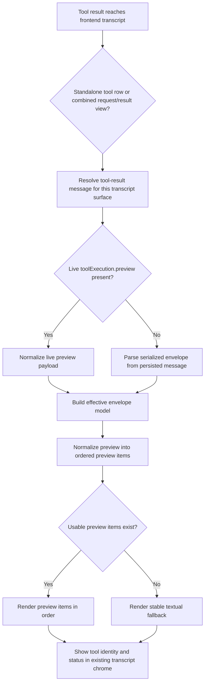

# Architecture Plan: Frontend Tool Envelope Preview Display

**Date**: 2026-03-21  
**Type**: Feature  
**Status**: SS Completed  
**Related Requirement**: [req-frontend-tool-envelope-preview-display.md](../../reqs/2026/03/21/req-frontend-tool-envelope-preview-display.md)

## Overview

Implement frontend display behavior that treats `tool_execution_envelope.preview` as the canonical display source for adopted tool-result messages in both Electron and web clients.

The plan focuses on frontend parsing, normalization, rendering, and fallback behavior only. It does not change the backend envelope contract, tool persistence model, or ordinary assistant-message rendering semantics.

This work must preserve app-boundary separation:

- web preview helpers and rendering stay inside `web/src`
- Electron preview helpers and rendering stay inside `electron/renderer/src`

## Architecture Decisions

### AD-1: Keep the Existing Envelope Contract

- Build on the current `tool_execution_envelope` shape already used by adopted tools.
- Do not introduce a new frontend-only preview protocol.
- Do not reinterpret `result` as the preferred rich display source when `preview` exists.

### AD-2: Keep Web and Electron Implementations Separate

- Both frontends may mirror the same conceptual display model.
- They must keep app-local helpers and renderer implementations.
- No new shared UI module may be created across `web/` and `electron/`.

### AD-3: Preserve Preview Normalization Semantics

- The frontend boundary should normalize `preview` into an ordered list regardless of whether the envelope stores one item or many.
- Ordered preview data is authoritative for display order and reload parity.
- Tool identity and status remain envelope metadata, not inferred UI state.

### AD-4: Live and Persisted Tool Results Must Converge

- Live `message.toolExecution.preview` payloads and persisted serialized envelope content should converge into the same effective display model.
- The renderer should not branch into meaningfully different display logic for live versus restored tool results.
- If both live and persisted data exist, the renderer should avoid duplicate or conflicting display.

### AD-5: Fallbacks Must Be Envelope-Aware, Not Tool-Specific

- Unsupported or incomplete preview items must degrade to stable text or file-style fallback derived from envelope metadata.
- When no usable preview item exists, the renderer falls back to textual result display using generic envelope helpers.
- Avoid adding tool-name-specific parsing rules for adopted envelope paths.

### AD-6: Web Preserves Current Strengths; Electron Closes the Gap

- The web client already has partial structured preview rendering and should be consolidated around the requirement rather than redesigned.
- Electron currently relies mostly on preview summarization text and requires explicit structured preview rendering to reach parity.
- Plan implementation should therefore preserve working web behavior while using Electron as the primary rendering expansion target.

### AD-7: Transcript-Surface Coverage Must Include Combined Result Views

- Frontend work must cover both standalone tool rows and assistant-linked combined request/result transcript views.
- Upgrading only direct tool rows would leave existing combined result bodies flattened back to preview summary text and would not satisfy the requirement.
- Shared envelope-aware fallback rules should apply across both transcript surfaces within each app.

### AD-8: Electron Previewable Artifact Interaction Stays in the Frontend Surface

- For Electron adopted envelope paths, previewable artifact interaction should stay within renderer/frontend UI rather than depending on a dedicated local-path opener bridge.
- The frontend may use existing same-origin preview URLs, routed viewer state, modal state, or another renderer-local mechanism, as long as the preview interaction remains in-app.
- Non-previewable artifacts may still use stable file-style fallback presentation without forcing inline rendering.

## Current-State Findings

1. Both frontends already have app-local envelope parsing helpers:
   - `web/src/domain/tool-execution-envelope.ts`
   - `electron/renderer/src/utils/tool-execution-envelope.ts`

2. Both frontends already normalize preview payloads and derive fallback display text from the envelope.

3. The web client already renders structured preview items in `web/src/domain/message-content.tsx`, including image, SVG, audio, video, markdown, URL, and artifact/file-style display.

4. Web custom-renderer utilities already prefer envelope preview payloads over raw result bodies.

5. Electron currently still routes most completed tool-result display through `getToolPreviewDisplayText(...)`, which collapses previews into textual summaries instead of rendering structured preview items.

6. Electron message utilities already unwrap envelope results for status/body logic, so the missing capability is concentrated in renderer presentation rather than core parsing.

7. Both frontends still have assistant-linked combined request/result paths that use `getToolPreviewDisplayText(...)` or equivalent text flattening, so transcript-surface coverage is broader than direct tool rows alone.

8. Existing tests already cover parsing and summary extraction in both frontends, but they do not yet prove reload-safe structured preview rendering parity across the supported preview classes and transcript compositions.

9. Follow-up clarification: the Electron solution should not depend on a dedicated local-path bridge for adopted previewable artifact interaction; the preview should remain within the frontend surface.

## Target Flow

## Implementation Strategy

### Phase 1: Inventory and Contract Consolidation

- [x] Confirm the exact preview classes currently emitted by adopted envelopes and already understood by frontend helpers.
- [x] Identify where each frontend currently decides between:
  - [x] preview rendering
  - [x] preview text summarization
  - [x] raw result fallback
- [x] Preserve current tool-row status and summary semantics while upgrading body rendering.
- [x] Identify assistant-linked combined request/result display paths that currently flatten envelope previews to text.
- [x] Keep ordinary assistant-message rendering out of scope.

### Phase 2: Web Frontend Consolidation

- [x] Review the current web renderer path in `web/src/domain/message-content.tsx` and keep envelope preview as the canonical tool-result body source.
- [x] Ensure web live-preview and restored-envelope paths converge through the same normalization helpers.
- [x] Close any remaining gaps where web display still falls back to raw result bodies too early for adopted envelope paths.
- [x] Apply the same envelope-aware preview/fallback rules to web combined request/result transcript views, not only direct tool rows.
- [x] Preserve current web fallback behavior for non-enveloped historical tool results.
- [x] Keep custom renderer utilities aligned with preview-first extraction semantics.

### Phase 3: Electron Structured Preview Rendering

- [x] Replace Electron’s text-only preview collapse for adopted envelope paths with structured preview rendering comparable to the web contract.
- [x] Apply Electron structured preview rendering to both direct tool rows and assistant-linked combined result bodies.
- [x] Add Electron-local preview item rendering for supported envelope renderer classes, including at minimum:
  - [x] text
  - [x] markdown
  - [x] URL
  - [x] image/SVG
  - [x] audio/video
  - [x] file-style artifact fallback
- [x] Ensure artifact preview metadata such as title, URL/path, media type, and companion text can be displayed without exposing raw envelope JSON.
- [x] Keep Electron rendering local to `electron/renderer/src` and avoid cross-importing web rendering logic.

### Phase 4: Live/Reload Parity and Fallback Rules

- [x] Ensure the same envelope content produces materially equivalent display whether it arrives from:
  - [x] live `toolExecution.preview`
  - [x] persisted tool-result content after reload
- [x] Ensure transcript composition does not change preview meaning between standalone tool rows and combined request/result views.
- [x] Ensure preview item order is preserved after reload.
- [x] Ensure missing or unsupported preview items degrade to stable fallback text or file-style presentation.
- [x] Confirm tool identity and status remain associated with the displayed preview content.
- [x] Preserve backward-compatible fallback rendering for non-enveloped tool histories.

### Phase 4b: Electron Frontend-Surface Artifact Interaction Follow-Up

- [x] Replace any dedicated Electron local-path opener dependency used for adopted previewable artifact interaction.
- [x] Add an Electron renderer-local viewer flow for previewable artifact-backed tool previews so the user stays inside the app surface.
- [x] Ensure both standalone tool rows and assistant-linked combined result views use the same in-app preview interaction model for previewable artifacts.
- [x] Preserve file-style fallback for non-previewable artifact outputs without exposing raw envelope JSON.
- [x] Keep the implementation inside `electron/renderer/src` unless an existing non-preview-specific transport is already sufficient.

### Phase 5: Testing

- [ ] Extend web-domain tests to cover structured preview rendering and reload parity for representative preview types.
- [x] Extend Electron renderer tests to cover structured preview rendering for the same representative preview types.
- [ ] Add regression cases for:
  - [x] Electron frontend-surface artifact activation for previewable artifacts
  - [ ] multi-item preview ordering
  - [ ] unsupported-inline preview fallback
  - [x] persisted envelope reload behavior
  - [x] live preview payload behavior matching persisted behavior
  - [x] non-enveloped fallback preservation
  - [x] combined request/result transcript rendering parity
- [x] Run targeted Electron frontend tests again after the follow-up implementation aligns with the frontend-surface requirement.
- [x] Run targeted unit tests for touched web/electron frontend domains.

## Proposed File Scope

- `web/src/domain/tool-execution-envelope.ts`
- `web/src/domain/message-content.tsx`
- `web/src/domain/renderers/custom-renderer-utils.ts`
- `electron/renderer/src/utils/tool-execution-envelope.ts`
- `electron/renderer/src/components/MessageContent.tsx`
- `electron/renderer/src/utils/message-utils.ts`
- related frontend tests under:
  - `tests/web-domain/`
  - `tests/electron/renderer/`

## Test Plan

### Web

- Expand `tests/web-domain/tool-execution-envelope.test.ts` for preview-class and ordering coverage.
- Add or update `tests/web-domain/tool-message-ui.test.ts` when render-body behavior changes.

### Electron

- Expand `tests/electron/renderer/message-content-status-label.test.ts` for structured preview rendering.
- Add a dedicated Electron renderer regression test if preview item rendering becomes substantial enough to justify separate coverage.

## Risks and Mitigations

1. **Risk:** Electron introduces preview rendering that diverges materially from web behavior.
   **Mitigation:** Use the same preview categories and fallback rules in both clients, while keeping implementation app-local.

2. **Risk:** Live tool rows and restored tool rows display duplicate or conflicting preview bodies.
   **Mitigation:** Normalize both sources through the same envelope helper boundary and treat them as one conceptual payload.

3. **Risk:** Standalone tool rows and assistant-linked combined result views diverge and show different meanings for the same envelope.
  **Mitigation:** Route both transcript surfaces through the same preview normalization and fallback rules inside each app.

4. **Risk:** Unsupported preview types disappear entirely.
   **Mitigation:** Require stable text or file-style fallback from envelope metadata.

5. **Risk:** Envelope preview upgrades accidentally affect assistant-message rendering.
   **Mitigation:** Keep all changes confined to tool-result detection and tool-body rendering paths.

6. **Risk:** Frontend refactors accidentally violate web/Electron separation rules.
   **Mitigation:** Mirror helper behavior separately in app-local modules and avoid cross-app UI imports.

7. **Risk:** Electron preview interaction leaks back into preload/main transport changes that are unnecessary for adopted previewable artifacts.
  **Mitigation:** Treat frontend-surface interaction as the default for previewable artifacts and reserve bridge usage only for truly external/non-previewable actions.

## Exit Criteria

- Both Electron and web clients render adopted tool previews from `envelope.preview` rather than raw envelope JSON or tool-specific parsing.
- Both standalone tool rows and assistant-linked combined request/result views use the same envelope-aware preview/fallback model.
- Structured preview rendering works for representative preview classes and remains stable after reload.
- Unsupported or non-inline preview cases degrade gracefully.
- Non-enveloped historical tool results still render acceptably.
- Frontend tests cover the new preview behavior at the domain/render boundary.
- Electron adopted previewable artifact interaction stays in-app rather than relying on a dedicated local-path opener bridge.

## Architecture Review Notes

- The initial AP correctly identified Electron as the larger rendering gap, but it understated the transcript surface area by centering mostly on direct tool rows.
- The plan is approved after expanding scope to include assistant-linked combined request/result views in both apps.
- Follow-up clarification: the preferred Electron artifact interaction path is now explicitly frontend-surface first for previewable artifacts, so any bridge-based opener used only for adopted preview activation should be treated as transitional and removed in the next implementation pass.