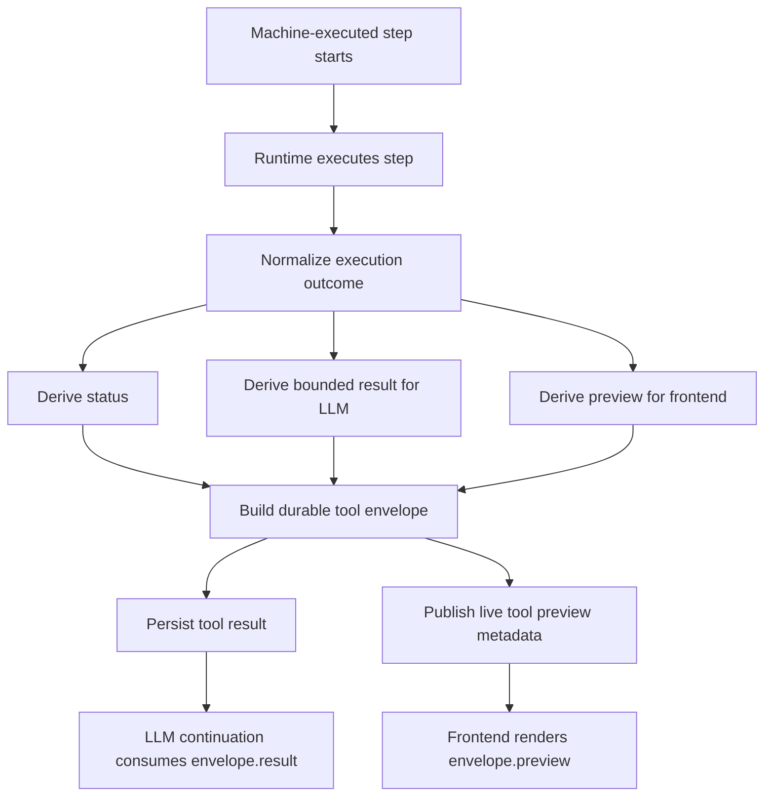
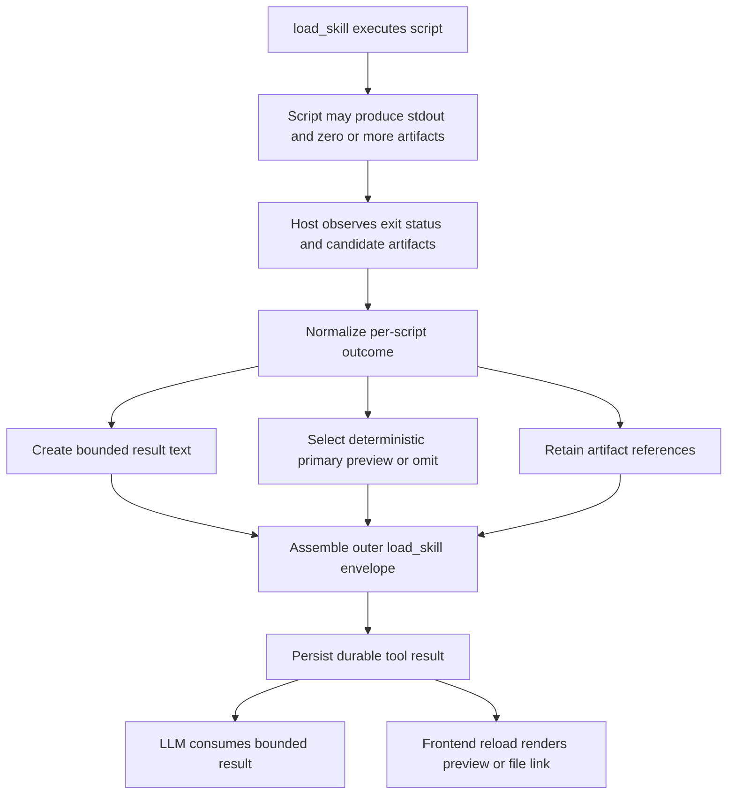

# Architecture Plan: Machine-Executed Tool Envelopes

**Date**: 2026-03-21  
**Type**: Feature  
**Status**: SS In Progress  
**Related Requirement**: [req-machine-execution-envelopes.md](../../reqs/2026/03/21/req-machine-execution-envelopes.md)

## Overview

Standardize the existing tool envelope model for machine-executed runtime steps so each adopted path can carry:

- explicit execution status
- bounded LLM-facing result content
- frontend-facing preview data

This plan covers:

- existing adopted tool paths (`shell_cmd`, `load_skill`)
- `load_skill` script execution outcomes
- one additional concrete machine-executed built-in tool adopter in this scope

This plan does not change ordinary assistant response storage or formatting.

This plan also does not prescribe exact frontend preview rendering behavior. It defines durable preview metadata and normalization rules, not viewer implementation details.

The guiding design target in this plan is a generalized artifact-producing script protocol that works for image outputs, audio/video outputs, Markdown and PDF documents, HTML artifact bundles, and generic generated documents such as PPTX.

## Architecture Decisions

### AD-1: Keep the Current Tool Envelope Contract

- Reuse the existing `tool_execution_envelope` contract for machine-executed results.
- Preserve the current `status`, `preview`, and `result` split.
- Keep durable preview data separate from continuation-facing result data.

### AD-2: Keep the Host Authoritative for Envelope Construction

- Runtime host code remains responsible for constructing durable envelopes.
- Scripts executed by `load_skill` may emit structured result contracts, but they do not become top-level runtime tool envelopes by themselves.
- Envelope validation, artifact URL generation, and preview normalization remain host responsibilities.

### AD-3: Preserve Tool Role Semantics

- Machine-executed steps continue to use tool-result semantics.
- Ordinary assistant responses remain unchanged in this scope.
- No assistant-response envelope migration is included in this delivery.

### AD-4: Model Result Content Must Stay Bounded

- `result` remains the canonical continuation payload and must stay bounded.
- Large raw execution bodies must not be blindly replayed into continuation context.
- `preview` may remain richer than `result` when needed for frontend display.

### AD-5: `load_skill` Uses Nested Structured Outcomes, Not Nested Runtime Tool Lifecycles

- `load_skill` script execution should preserve structured per-script outcomes.
- The outer durable tool result remains a single `load_skill` result.
- Script executions do not become sibling top-level tool lifecycles in transcript state.

### AD-6: Normalize Script Outcomes with Artifact References

- `load_skill` should preserve per-script normalized outcomes before assembling the outer durable tool result.
- The normalized per-script outcome should support:
   - `status`
   - bounded `result` content for model reuse
   - optional `preview` content derived for durable frontend rendering
   - optional `artifacts` collection for produced files
- Each artifact reference should align with existing envelope-compatible metadata where available:
   - `path` or `url`
   - `media_type`
   - `bytes`
   - `display_name`
- Artifact references are inputs to preview derivation and bounded result synthesis; they are not a second top-level durable protocol.

### AD-7: Host-Derived Artifact Outcomes Are Valid Machine-Execution Results

- The runtime host may derive structured script outcomes from observed execution facts, not only from structured stdout.
- For artifact-producing scripts, generated files may be the primary source for preview material and may also inform bounded result text.
- This must work across representative artifact categories:
   - previewable graphics or images such as SVG and PNG
   - media such as audio or video
   - previewable documents such as Markdown and PDF
   - HTML artifact bundles with a primary HTML entry and companion JS/CSS assets
   - generic file outputs such as PPTX where link-style preview is more appropriate than inline rendering

### AD-8: Exit Status Remains Authoritative

- Artifact discovery augments the machine-execution outcome; it does not redefine success or failure.
- If a script exits non-zero, the durable status remains failed even if a partial or stale artifact file exists in scope.
- Failure cases may still carry bounded diagnostic result content and optional preview material, but they must not be surfaced as completed.

### AD-9: Artifact Preview Selection Must Be Deterministic

- When one execution yields multiple candidate preview artifacts, the host must choose a primary preview deterministically or omit artifact preview.
- The selection rule must be stable across persistence and replay so reload does not change which artifact is rendered.
- If no deterministic primary artifact can be established, the durable result should keep textual outcome data and omit artifact preview rather than guess.

### AD-10: Previewability Is Type-Dependent, Not Required for Success

- Some artifact types are previewable with frontend-specific handling, such as images, SVG, audio, video, Markdown, HTML bundles, and PDF.
- Some artifact types are not inherently previewable inline, such as PPTX and other binary documents.
- Non-previewable artifact types must still produce durable result content and file-style preview or link metadata so the frontend can present a stable downloadable/openable artifact reference.

### AD-11: HTML Bundle Preview Uses Metadata, Not Rendering Prescription

- For HTML outputs that depend on JS and CSS assets, the protocol should preserve a primary HTML artifact reference plus companion asset references.
- The plan does not prescribe whether clients use iframe rendering, sandboxing, static hosting, or another mechanism.
- The contract ends at durable artifact metadata sufficient for a client to choose a safe rendering strategy.

### AD-12: First Additional Tool Adopter in Scope

- Adopt `web_fetch` as the first additional non-`shell_cmd`, non-`load_skill` machine-executed tool path.
- Rationale:
  - deterministic structured output already exists
  - preview opportunities are clear (`title`, `url`, bounded markdown summary)
  - frontend value is immediate without introducing filesystem artifact complexity first

## Current-State Findings

1. `shell_cmd` already persists the durable envelope model.
2. `load_skill` already persists an outer durable envelope, but script execution inside `load_skill` is flattened too early.
3. `load_skill` script execution currently uses the low-level shell executor directly instead of preserving shell-style structured outcomes.
4. Some other machine-executed built-in tools still return ad hoc strings or JSON payloads instead of the shared durable envelope contract.
5. Frontend clients already know how to read preview data from live tool metadata and persisted envelope content.

## Target Flow

## Normalized Artifact Outcome Flow

## Implementation Phases

### Phase 1: Envelope Boundary Consolidation

- [ ] Confirm and document the minimum invariant set for adopted machine-execution envelopes:
  - [ ] stable tool name
  - [ ] explicit status
  - [ ] bounded `result`
  - [ ] normalized `preview`
- [ ] Identify any current code paths that still depend on raw non-enveloped durable machine-execution output.
- [ ] Preserve all current replay behavior where `message-prep` unwraps envelope `result` for continuation.

### Phase 2: Shared Outcome Normalization Helpers

- [ ] Add or extract reusable helper(s) for turning machine-execution outcomes into envelope parts without duplicating tool-specific preview/result splitting logic.
- [ ] Keep these helpers within the existing core tool-envelope boundary rather than creating a separate parallel protocol.
- [ ] Ensure helper boundaries support:
  - [ ] text previews
  - [ ] markdown previews
  - [ ] artifact/media previews
   - [ ] HTML bundle preview metadata
   - [ ] PDF preview metadata
  - [ ] bounded result strings or structured result objects

### Phase 3: `load_skill` Script Outcome Preservation

- [x] Change `load_skill` script execution to preserve structured per-script outcomes instead of flattening directly to opaque text.
- [x] Capture, per script:
   - [x] source identity
   - [x] execution status
   - [x] bounded result text for model reuse
   - [x] preview material for frontend/display assembly
   - [x] zero or more artifact references with envelope-compatible metadata
- [x] Keep the final durable result as one outer `load_skill` tool result.
- [x] Ensure `<script_output>` content in the final `load_skill` result uses the bounded script result content rather than raw preview payloads.
- [x] Ensure `load_skill` preview assembly can include derived preview material from script outcomes.
- [x] Ensure script outcome normalization can derive success/result/preview from produced artifacts even when stdout is unstructured.
- [x] Define protocol handling for representative artifact categories:
   - [x] previewable image/graphic outputs such as PNG or SVG
   - [x] previewable media outputs such as audio or video
   - [x] previewable document outputs such as Markdown or PDF
   - [x] previewable HTML bundles with primary HTML plus supporting JS/CSS assets
   - [x] non-previewable file outputs such as PPTX
- [x] Keep exit status authoritative even when artifact files are present on failure paths.
- [x] Define deterministic primary-artifact selection when multiple candidate artifacts are present.
- [x] Persist artifact-backed preview data when the artifact type is previewable.
- [x] Persist file-style preview or link metadata when the artifact type is not previewable inline.
- [x] Keep rendering details frontend-agnostic by limiting the protocol to durable metadata rather than viewer implementation rules.

### Phase 4: Additional Tool Adoption (`web_fetch`)

- [x] Apply the durable tool envelope model to `web_fetch`.
- [x] Define `web_fetch` status mapping for at minimum:
   - [x] completed
   - [x] failed
   - [x] blocked/denied outcomes represented through existing failure semantics
- [x] Define `web_fetch` bounded result content for continuation.
- [x] Define `web_fetch` preview content for frontend display, including a bounded summary and URL/title context.
- [x] Preserve existing approval and safety behavior while changing only the durable result contract.

### Phase 5: Live Preview and Persistence Parity

- [ ] Ensure adopted machine-executed paths publish preview metadata consistently for live clients.
- [ ] Ensure the same preview content remains recoverable from durable persisted messages after reload.
- [ ] Confirm no path relies exclusively on live event metadata for frontend rendering of completed machine-execution results.

### Phase 6: Replay and Continuation Guardrails

- [x] Verify continuation paths consume `envelope.result`, not `envelope.preview`.
- [ ] Verify replay of durable tool results preserves tool identity and completion linkage.
- [ ] Confirm adopted tool paths do not regress current chat scoping or tool-result matching behavior.

### Phase 7: Tests

- [x] Add targeted unit coverage for `load_skill` structured script outcomes and final envelope assembly.
- [x] Add targeted unit coverage for the newly adopted `web_fetch` durable envelope behavior.
- [x] Add replay/continuation regression tests proving model preparation consumes bounded result content.
- [ ] Add frontend-domain regression tests proving durable preview data renders correctly after reload.
- [x] Run integration coverage for touched runtime/tool transport paths per project policy.

## Expected File Scope

- `core/tool-execution-envelope.ts`
- `core/load-skill-tool.ts`
- `core/shell-cmd-tool.ts` (only if shared formatter/helper extraction is needed)
- `core/web-fetch-tool.ts`
- `core/message-prep.ts`
- `core/events/orchestrator.ts`
- `core/events/memory-manager.ts`
- `electron/renderer/src/utils/tool-execution-envelope.ts`
- `web/src/domain/tool-execution-envelope.ts`
- related tests under `tests/core`, `tests/electron/renderer`, and `tests/web-domain`

## Risks and Mitigations

1. **Risk:** `load_skill` mixes script preview JSON into model-facing context.
   **Mitigation:** keep per-script `result` and `preview` separate and only emit `result` into `<script_output>`.

2. **Risk:** New adopted tools choose inconsistent status/result/preview conventions.
   **Mitigation:** enforce a shared invariant checklist in Phase 1 and shared helper boundaries in Phase 2.

3. **Risk:** Artifact-producing scripts succeed but produce no discoverable artifact, leaving the host unable to synthesize a meaningful preview.
   **Mitigation:** treat artifact discovery as best-effort, fall back to bounded textual result content, and keep preview optional when no durable artifact can be confirmed.

4. **Risk:** Artifact discovery could accidentally mask script failure if a stale or partial artifact exists.
   **Mitigation:** make exit status authoritative and allow artifact preview only as supplemental context, never as success evidence by itself.

5. **Risk:** Different artifact categories may be normalized inconsistently, causing renderer drift between image, media, and document outputs.
   **Mitigation:** define one normalized per-script outcome contract with shared artifact-reference fields and explicit previewability rules.

6. **Risk:** The plan could accidentally over-specify how Markdown, HTML, or PDF previews must be rendered, constraining frontend safety or UX choices.
   **Mitigation:** keep rendering mechanics explicitly out of scope and constrain this plan to durable preview metadata only.

7. **Risk:** Frontend display depends on live preview metadata but fails after reload.
   **Mitigation:** require persisted envelope preview parity in Phase 5 and add reload-focused UI regression tests.

8. **Risk:** Expanding envelope adoption accidentally drifts into assistant-response migration.
   **Mitigation:** keep assistant responses explicitly out of scope and reject any role-semantics changes in this plan.

9. **Risk:** `web_fetch` adoption increases continuation payload size.
   **Mitigation:** keep `result` bounded and separate richer preview material into `preview` only.

## Acceptance Mapping

- REQ-1 through REQ-6 map to Phases 1, 2, and 4.
- REQ-7 through REQ-14 map to AD-6, AD-7, AD-10, and Phase 3.
- REQ-15 and REQ-16 map to AD-8, AD-9, and Phase 3.
- REQ-17 and REQ-18 map to Phases 5 and 6.
- REQ-19 maps to Phase 6.
- REQ-20 is enforced by AD-3 and risk guardrails throughout the plan.

## Architecture Review (AR)

### AR Summary

Approved with five narrowing decisions: keep scope limited to machine-executed envelope adoption, define one generalized artifact protocol instead of a single example-specific path, keep exit status authoritative over artifact discovery, require deterministic artifact preview selection, and keep frontend rendering mechanics out of scope.

### Options Considered

1. **Option A: Generic envelope migration for tools and assistant responses together**
   - Rejected for this scope.
   - Too much role/replay/rendering surface area at once.

2. **Option B: Machine-executed envelope adoption only, using the current tool envelope model**
   - Accepted.
   - Lowest-risk path to achieve status/result/preview separation now.

3. **Option C: `load_skill` scripts emit raw tool envelopes directly**
   - Rejected.
   - Scripts should not become authoritative runtime tool lifecycle emitters.

4. **Option D: Require every skill script to emit a rigid JSON contract for artifact preview support**
   - Rejected.
   - Too restrictive for simple script workflows and unnecessary when the host can derive status/result/preview from produced artifacts.

5. **Option E: Define separate artifact protocols per output type such as image, video, and document**
   - Rejected.
   - Increases implementation and replay complexity; one normalized artifact-reference contract is sufficient.

6. **Option F: Specify frontend rendering rules for Markdown, HTML, and PDF in the same requirement/plan**
   - Rejected.
   - That would couple durable runtime contracts to client-specific rendering and safety decisions.

### AR Guardrails

- Do not change assistant-role storage or replay semantics.
- Do not let scripts author top-level runtime tool envelopes directly.
- Do not regress current tool-result matching and chat-scoped transport behavior.
- Do not adopt additional tools opportunistically without explicit bounded-result design.
- Do not let discovered artifacts implicitly convert failed executions into completed outcomes.
- Do not pick a preview artifact nondeterministically when multiple candidate outputs exist.
- Do not prescribe exact Markdown, HTML, or PDF rendering implementation in this runtime plan.

### AR Exit Condition

Implementation may proceed after approval of this plan, but only within the machine-executed scope defined here.