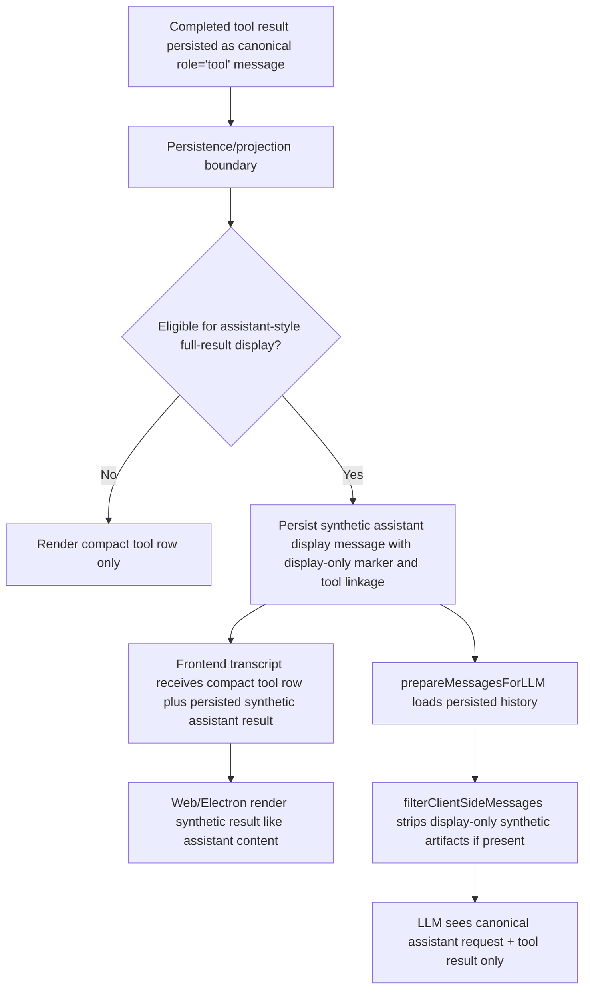

# Architecture Plan: Synthetic Assistant Tool Result Display

**Date**: 2026-03-21
**Type**: Feature
**Status**: Approved (AR Completed)
**Related Requirement**: [req-synthetic-assistant-tool-result-display.md](../../reqs/2026/03/21/req-synthetic-assistant-tool-result-display.md)

## Overview

Replace rich preview/full-result rendering inside tool transcript rows with a synthetic assistant-style display message persisted from completed tool results.

The synthetic assistant result must be a persisted display artifact, not a canonical assistant turn for future model history. Tool lifecycle ownership remains on the persisted assistant tool request plus terminal tool result. Future LLM conversation-history assembly must exclude the synthetic display message deterministically.

For adopted tools such as `shell_cmd`, the persisted synthetic display payload may need to be fuller than the safe LLM-facing tool `result`. For example, markdown containing an SVG data URI may be redacted or bounded in the tool `result` sent to the LLM while still being preserved in full for the synthetic assistant display message.

This work spans two distinct boundaries:

- transcript projection and rendering for web/Electron
- model-facing history preparation in core as a defense-in-depth filter

## Current-State Findings

1. Completed adopted tool results already persist durable `tool_execution_envelope` data, with `preview` and canonical `result` split.
2. Both frontends currently render rich preview/full-result content directly inside tool transcript bodies:
   - `web/src/domain/message-content.tsx`
   - `electron/renderer/src/components/MessageContent.tsx`
3. Both frontends already compose merged assistant request/result tool rows, so moving display output out of the tool row affects transcript composition, not just renderer internals.
4. Core continues LLM execution from persisted history loaded by `prepareMessagesForLLM(...)` in `core/utils.ts`.
5. `filterClientSideMessages(...)` in `core/message-prep.ts` is the final model-facing filter boundary and already strips client-only artifacts and unwraps tool envelopes for tool results.
6. Persisting a synthetic assistant result without explicit display-only metadata would create duplicate transcript authority and risk contaminating future LLM history, restore, and replay paths.
7. The current message-publishing/subscription pipeline treats persisted assistant messages as ordinary conversation events, so synthetic assistant display rows need an explicit way to avoid agent auto-reply and related side effects.

## Architecture Decisions

### AD-1: Synthetic Assistant Results Are Persisted Display Artifacts

- The synthetic assistant result should be persisted from a completed tool result for transcript display purposes.
- It must not become a canonical assistant turn for future model history.
- The source of truth remains:
  - assistant tool request with `tool_calls`
  - terminal `role='tool'` result with `tool_call_id`

### AD-2: Tool Rows Stay Compact and Canonical

- Tool rows continue to represent tool lifecycle/status.
- Rich preview/full-result body rendering should be removed from adopted tool rows.
- Tool rows should still show compact status, tool identity, and failure/success semantics.

### AD-3: Synthetic Display Messages Need Stable Marking

- Any projected synthetic assistant result included in transcript transport or frontend state must carry explicit display-only metadata.
- That metadata must be stable enough for:
  - frontend transcript composition
  - restore/reload projection
  - model-facing exclusion

### AD-4: Persist Once with Stable Semantics, Render Everywhere

- The synthetic assistant result should be created once from canonical tool-result data and persisted with explicit display-only metadata.
- Frontends may keep app-local rendering implementations, but the message-shape semantics for the synthetic row should be shared through existing storage/transport contracts rather than duplicated heuristics.
- This reduces parity drift between Electron and web and keeps restore deterministic.

### AD-5: History Exclusion Must Be Defense-in-Depth

- Primary protection comes from persisting synthetic assistant results with explicit display-only metadata and stable linkage to the owning tool result.
- A secondary protection layer should explicitly filter any display-only synthetic message from model-facing message preparation in `core/message-prep.ts`.
- This ensures future transport or restore changes do not accidentally leak display-only synthetic messages into LLM context.

### AD-6: Restore/Replay Must Rebuild the Same Projection Deterministically

- Reloaded chats must be able to show the same synthetic assistant result from the persisted canonical tool result.
- The presence and ordering of the synthetic row must not depend on transient SSE chunks or process-local runtime state.

### AD-7: Tool Selection for Synthetic Display Must Remain Explicit

- Not every tool result should automatically produce a synthetic assistant result.
- Adoption should be driven by explicit criteria or metadata from the durable tool-result/envelope path, so compact-only tools remain compact.

### AD-8: Display Payload and LLM Payload May Diverge Intentionally

- The persisted synthetic assistant display payload does not have to equal the canonical tool `result` sent back to the LLM.
- When a tool path intentionally redacts or bounds content for LLM safety, the synthetic assistant message may preserve richer display content if that content is needed by the frontend renderer and is marked display-only.
- For `shell_cmd`, this specifically allows full markdown image payloads such as SVG data URIs to render in the synthetic assistant message while the model sees only the safe bounded/redacted summary.

### AD-9: Persisted Synthetic Assistant Messages Must Not Trigger Agent Processing

- Persisting or restoring a synthetic assistant display message must not make it behave like an ordinary incoming assistant turn for subscription, mention-routing, or auto-reply purposes.
- The implementation should rely on explicit display-only metadata rather than sender/content heuristics to suppress those side effects.
- This rule applies both when the synthetic message is first created and when historical chats are reloaded.

## Options Considered

### Option A: Persist a Real Assistant Message for Full Tool Results

- Pros:
  - Simple frontend rendering model.
  - Restored chats naturally include the result row.
- Cons:
  - Pollutes future LLM history unless every history path filters it perfectly.
  - Creates duplicate authority relative to the canonical tool result.
  - Complicates replay, edit/delete trimming, and queue/restore semantics.

### Option B: Frontend-Only Synthesis from Existing Tool Rows

- Pros:
  - Avoids persistence changes.
  - Minimal backend changes.
- Cons:
  - Electron and web can drift because each re-derives the synthetic row independently.
  - Restore and transcript ordering logic becomes duplicated across clients.

### Option C: Persisted Display Artifact with Explicit Exclusion

- Pros:
  - Keeps restored chats deterministic.
  - Keeps transcript semantics consistent across clients.
  - Provides one place to assign ordering, linkage, display-only metadata, and richer display payloads when needed.
  - Still allows app-local UI rendering.
- Cons:
  - Requires storage-schema/message-shape work plus history filtering.
  - Needs careful restore and test coverage.

## AR Decision

Proceed with **Option C**.

The synthetic assistant result should be persisted from canonical tool-result data with explicit display-only metadata and stable linkage to the owning tool result. It may preserve fuller assistant-renderable display content than the LLM-facing tool `result` when needed, and it must be filtered from all future model-facing history.

## Target Flow

## Phased Plan

### Phase 1: Define Projection Contract

- [x] Define the minimal display-only metadata required for a synthetic assistant tool-result projection.
- [x] Define how the synthetic message links back to the owning tool result/tool call.
- [x] Define eligibility rules for which tool results produce a synthetic assistant display message.
- [x] Define stable ordering semantics relative to request and tool-result rows.
- [x] Define the split between model-facing tool `result` content and persisted synthetic display content for adopted tools that need richer rendering than the LLM should see.

### Phase 2: Persist Synthetic Display Messages

- [x] Introduce a persistence step that creates synthetic assistant result messages from canonical tool results when eligible.
- [x] Keep canonical persisted assistant/tool records authoritative for lifecycle ownership.
- [x] Ensure persisted synthetic rows are tagged as display-only and linked to the owning tool result/tool call.
- [x] Ensure persisted synthetic rows carry enough metadata for publish/restore code to suppress agent auto-reply side effects.
- [x] Ensure chat restore/reload reads the persisted synthetic rows directly without depending on transient runtime recomputation.
- [x] For adopted `shell_cmd` outputs, persist the full assistant-renderable markdown display payload when available even if the canonical tool `result` is bounded or redacted for LLM safety.

### Phase 3: Update Frontend Rendering

- [x] Remove rich preview/full-result rendering from adopted tool message bodies in web.
- [x] Remove rich preview/full-result rendering from adopted tool message bodies in Electron.
- [x] Render the projected synthetic assistant result using existing assistant-message presentation paths.
- [x] Render the persisted synthetic assistant result using existing assistant-message presentation paths.
- [x] Preserve compact tool-row status rendering, including failed red-dot semantics and request/result merge behavior.
- [x] Verify assistant markdown renderers can display the persisted full markdown payload, including SVG data URI images, without depending on tool-row preview rendering.

### Phase 4: Protect Model-Facing History

- [x] Update model-facing message-preparation filters to exclude persisted display-only synthetic assistant result messages from prepared history.
- [x] Verify immediate continuation after tool execution still uses only canonical assistant/tool records.
- [x] Verify restore/replay/resume flows do not enqueue or resend synthetic assistant display artifacts.
- [x] Verify richer persisted display payloads never leak into the LLM path even when their originating tool `result` was intentionally redacted or bounded.
- [ ] Verify publish/restore flows do not route persisted synthetic assistant display messages through ordinary agent auto-reply handling.

### Phase 4b: Cleanup Semantics

- [ ] Ensure edit/delete tail trimming removes persisted synthetic assistant display messages when their owning tool result or owning user-turn tail is removed.
- [ ] Ensure orphan synthetic display messages do not survive result deletion or transcript-tail replacement.

### Phase 5: Testing

- [x] Add targeted core tests for display-only message exclusion from LLM history preparation.
- [x] Add targeted transcript-composition tests for persisted synthetic assistant ordering and linkage.
- [ ] Add targeted event/persistence tests proving persisted synthetic assistant display messages do not trigger agent auto-reply on publish or restore.
- [x] Add targeted web tests proving tool bodies no longer render adopted rich previews directly.
- [x] Add targeted Electron tests proving tool bodies no longer render adopted rich previews directly.
- [x] Add regression tests that failed tool rows still show failed status styling while a synthetic assistant result is present.
- [x] Add targeted tests for the `shell_cmd` markdown SVG-data-URI case: redacted/bounded tool `result` to LLM, full markdown preserved in the persisted synthetic assistant display message.
- [ ] Add targeted cleanup tests for edit/delete tail trimming of synthetic assistant display messages.
- [x] Run `npm run integration` because transport/runtime/history-preparation paths are touched.

## Proposed File Scope

- `core/utils.ts`
- `core/message-prep.ts`
- `core/events/orchestrator.ts`
- `core/events/memory-manager.ts`
- storage/transcript/message shaping paths used by web and Electron session loading
- `web/src/domain/message-content.tsx`
- `web/src/domain/tool-merge.ts`
- `electron/renderer/src/components/MessageContent.tsx`
- `electron/renderer/src/components/MessageListPanel.tsx`
- related tests under:
  - `tests/core/`
  - `tests/web-domain/`
  - `tests/electron/renderer/`

## Risks and Mitigations

1. **Risk:** Synthetic results get persisted without reliable display-only metadata and are treated as normal assistant turns.
   **Mitigation:** Require explicit persisted display-only fields plus defense-in-depth history filtering.

2. **Risk:** Web and Electron derive different synthetic rows from the same tool result.
   **Mitigation:** Centralize projection semantics before app-local rendering.

3. **Risk:** Removing preview rendering from tool bodies regresses useful compact status information.
   **Mitigation:** Preserve tool-row headers, status dots, args, and other compact lifecycle details while moving only the full result display.

4. **Risk:** Synthetic display rows reappear in restore/resume or queued-turn logic.
   **Mitigation:** Keep queue ownership and durable turn lifecycle on canonical user/assistant/tool records only; test restore/replay explicitly.

5. **Risk:** Some tools that should stay compact start producing noisy synthetic assistant results.
   **Mitigation:** Require explicit eligibility rules instead of universal synthesis.

6. **Risk:** Implementation reuses the bounded/redacted tool `result` as the synthetic display payload and loses renderable markdown such as SVG data URIs.
   **Mitigation:** Define explicit per-tool display-payload sourcing for adopted tools and add targeted tests for shell markdown-image outputs.

7. **Risk:** Persisted synthetic assistant messages trigger ordinary assistant-message subscribers and cause unwanted agent processing.
   **Mitigation:** Add explicit display-only metadata checks in publish/restore processing and cover them with event-path tests.

## Exit Criteria

- Adopted tool rows no longer render rich preview/full-result content directly.
- Eligible tool results appear as persisted display-only synthetic assistant transcript messages.
- Future model-facing history excludes synthetic display-only artifacts.
- Reload/restore produces stable synthetic result ordering from persisted synthetic assistant results plus canonical tool data.
- Persisted synthetic assistant display messages do not trigger ordinary agent-processing side effects on publish or restore.
- Adopted `shell_cmd` markdown-image outputs can preserve full assistant-renderable display content in the synthetic assistant message while the LLM path remains safe/redacted or bounded.
- Electron and web display materially equivalent transcript behavior.
- Targeted unit tests pass.
- `npm run integration` passes before implementation is considered complete.

## Architecture Review Notes

- The critical design correction is to persist the synthetic row with explicit display-only semantics instead of treating it as an ordinary assistant turn.
- The clean boundary is persisted display artifacts plus defense-in-depth filtering in model preparation.
- This keeps the feature aligned with existing queue, restore, tool lifecycle, and history-isolation rules.

## Architecture Review (AR)

**Review Date**: 2026-03-21
**Reviewer**: AI Assistant
**Result**: Approved

### Review Summary

The plan is approved once persistence semantics, payload-sourcing semantics, and side-effect isolation are made explicit. The earlier version corrected persistence, but it still left open the risk of reusing only the bounded/redacted tool `result` for display or accidentally letting persisted synthetic assistant rows behave like normal assistant messages. The clarified plan now allows a richer persisted display payload while keeping the LLM path safe and suppressing ordinary agent-processing side effects.

### Review Decisions

- Persist synthetic assistant result display artifacts with explicit display-only metadata.
- Keep canonical lifecycle ownership limited to the assistant tool request plus terminal tool result.
- Add defense-in-depth filtering in model-facing message preparation.
- Allow the persisted synthetic assistant message to preserve fuller display content than the LLM-facing tool `result` when required by renderer UX.
- Suppress agent auto-reply and similar side effects for persisted synthetic assistant display messages.
- Keep eligibility for synthetic assistant display explicit rather than universal.
- Require restore/replay and integration coverage because transcript/runtime boundaries are involved.

### Review Outcome

- Proceed to implementation only if persisted display-only semantics and model-history exclusion are preserved end-to-end.
