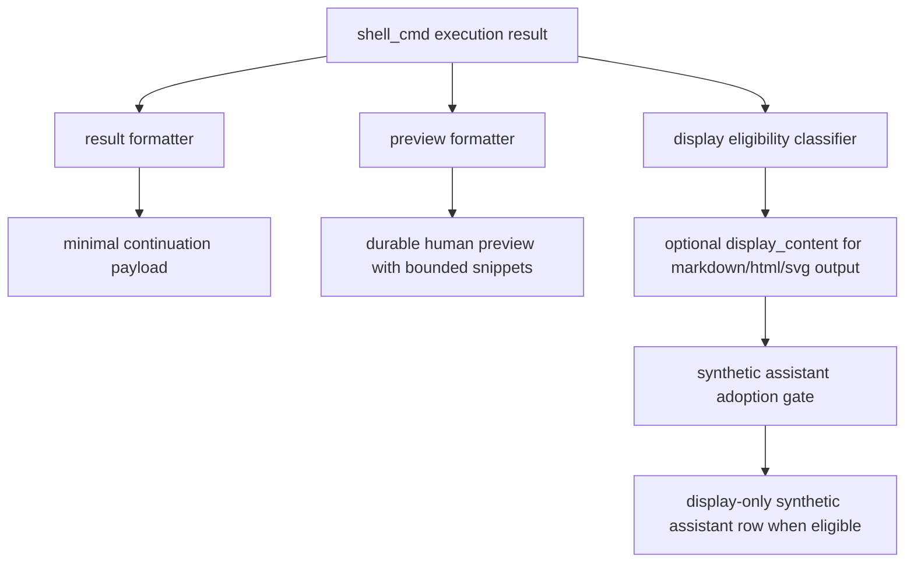

# AP: Shell Tool Result Contract Refinement

**Date:** 2026-03-22
**Status:** Draft
**Related:**
- `.docs/reqs/2026/03/22/req-shell-tool-result-contract-refinement.md`
- `docs/Tool Results Contract.md`

## Objective

Refine the `shell_cmd` tool-result contract so that:

- `result` stays minimal for production continuation
- `preview` stays durable and human-readable with bounded stdout/stderr snippets
- human preview sizing is decoupled from LLM continuation sizing
- `display_content` supports explicit renderable `markdown`, `html`, and `svg` outputs without turning ordinary shell text into duplicate synthetic assistant display rows

## Architecture Review Summary

No blocking architecture flaw is present in the refined direction after narrowing the display surface to an explicit allow-list.

The key constraint is that `display_content` expansion must not automatically expand synthetic assistant adoption for all shell outputs. The synthetic adoption boundary must remain narrower than generic preview text, otherwise transcript duplication and restore-time clutter will regress.

The explicit allow-list of `markdown`, `html`, and `svg` resolves the earlier ambiguity around “non-JSON” outputs and removes the main architecture risk of accidentally treating plain text logs or stderr as display-first content.

One additional architecture constraint remains: `html` and `svg` eligibility must not imply raw unsafe transcript rendering. The implementation should reuse existing safe rendering or viewer boundaries rather than introduce a new direct-injection path for shell-produced markup.

## Current Runtime Touchpoints

- `core/shell-cmd-tool.ts`
  - formats minimal continuation result
  - formats human preview markdown
  - decides `display_content` eligibility
- `core/synthetic-assistant-tool-result.ts`
  - derives synthetic display content from `display_content` first, then textual preview fallback
- `core/events/orchestrator.ts`
  - sets production `shell_cmd` continuation mode to `minimal`
- `core/events/memory-manager.ts`
  - persists tool results and appends synthetic assistant display rows
- `core/message-prep.ts`
  - filters synthetic assistant display rows from future LLM history

## Proposed Runtime Direction

## Plan

- [x] Phase 1: Separate human preview sizing from LLM continuation sizing
  - introduce distinct shell preview sizing controls for:
    - minimal LLM continuation preview
    - persisted human transcript preview
  - keep current minimal continuation structure intact
  - preserve backward-compatible envelope shape

- [x] Phase 2: Preserve durable human preview while tightening its purpose
  - keep shell preview as a durable human-readable summary block
  - preserve bounded stdout/stderr snippets in preview
  - ensure preview remains useful after reload, restore, and export

- [x] Phase 3: Expand `display_content` eligibility for explicit renderable outputs
  - define `markdown`, `html`, and `svg` as the only directly renderable shell stdout forms eligible for `display_content`
  - keep JSON explicitly excluded from `display_content`
  - keep ordinary text output excluded from `display_content`
  - preserve existing safe rendering behavior for `html` and `svg` surfaces

- [x] Phase 4: Narrow synthetic assistant adoption to explicit renderable shell outputs only
  - update synthetic adoption logic so `markdown`, `html`, and `svg` display content does not create duplicate assistant rows for ordinary text results
  - preserve existing filtering of synthetic assistant rows from LLM history
  - preserve canonical tool lifecycle authority on assistant tool-call plus `role='tool'` completion rows

- [x] Phase 5: Update docs and focused regression coverage
  - update `docs/Tool Results Contract.md`
  - extend shell envelope regression tests for:
    - direct vs skill-script parity
    - minimal continuation invariants
    - independent preview-size behavior
    - `display_content` eligibility boundaries
    - synthetic assistant adoption boundaries
  - run targeted unit tests and, if event-path behavior changes, `npm run integration`

## Implementation Notes

- Keep the change focused on `shell_cmd`; do not redesign unrelated adopted-tool envelope behavior unless needed for consistency.
- Preserve the current orchestrator policy that production shell continuations use minimal mode.
- Avoid transcript regressions where users lose durable bounded output context after restore.
- Treat synthetic assistant adoption as a separate policy layer, not an automatic consequence of any non-empty textual preview.

## Risks

| Risk | Why it matters | Mitigation |
| --- | --- | --- |
| Preview simplification removes too much context | Restored shell rows become hard to interpret | Keep bounded stdout/stderr snippets in preview |
| Display-content expansion creates duplicate assistant rows | Transcript clutter and restore confusion | Restrict `display_content` and synthetic adoption to explicit `markdown`/`html`/`svg` allow-list |
| HTML or SVG display content introduces unsafe rendering | Security and transcript integrity risk | Reuse existing sanitization or safe viewer boundaries; do not inject raw shell markup directly |
| Preview-size increase leaks into continuation payload | Higher token cost and noisier follow-up prompting | Split human preview cap from LLM preview cap |
| JSON starts rendering as display content | Synthetic rows become noisy and redundant | Keep JSON excluded from `display_content` |

## Validation Plan

- Targeted unit tests for `shell_cmd` formatting and envelope persistence
- Targeted unit tests for `markdown`/`html`/`svg` display eligibility and synthetic assistant adoption boundaries
- Targeted message-prep regression assertions proving display-only rows still stay out of LLM history
- `npm run integration` if runtime event-path or persisted tool-result behavior changes in orchestrator or memory-manager layers

## Approval Gate

Stop after REQ/AP approval before implementation.