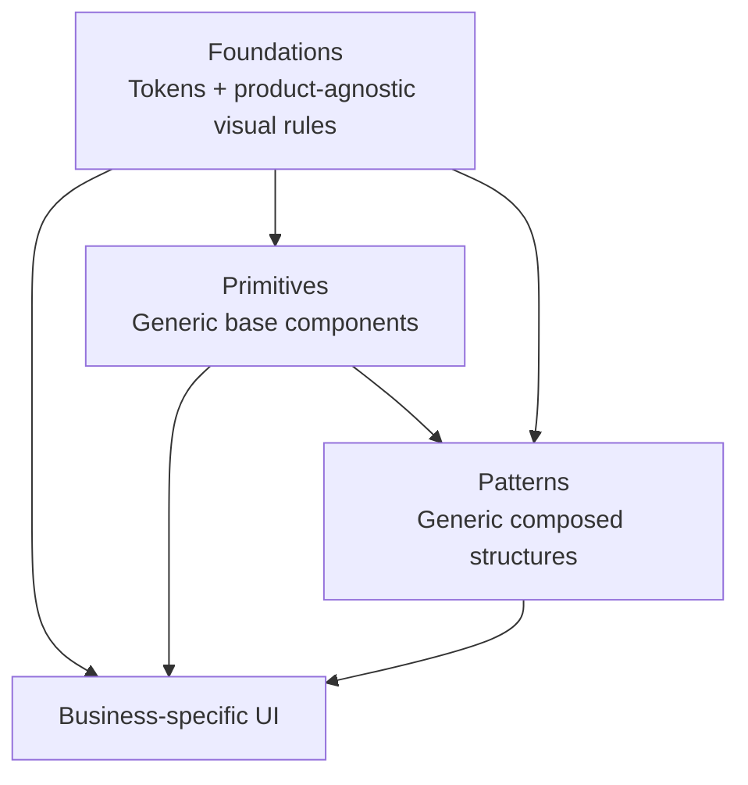

# AP: Electron Renderer Design System Layers

**Date**: 2026-03-23  
**REQ**: `.docs/reqs/2026/03/23/req-electron-renderer-design-system-layers.md`

**Status**: ✅ Completed

## Architecture Review (AR)

**Review Date**: 2026-03-23  
**Reviewer**: AI Assistant  
**Result**: ✅ Approved with corrected guardrails

### Review Summary

The core strategy is sound: keep the design-system core intentionally small, move only clearly generic renderer UI into it, and leave business-specific chat/world/agent/skill/queue/settings UI outside the core unless it is explicitly generalized first.

Two high-priority corrections were required during AR:

1. `BaseEditor.tsx` cannot be promoted into Patterns as-is because it currently imports and defaults to `EditorChatPane`, which is business-specific UI.
2. `styles.css` cannot be promoted wholesale into Foundations because it currently mixes real foundation material with feature-specific selectors such as header-agent and streaming/tool/message presentation rules.

### Options Considered

1. **Option A: Conservative core-first migration (Recommended)**
2. **Option B: Move most current components into the three layers immediately**
3. **Option C: Add folder names only and defer module classification**

### AR Decision

- Proceed with **Option A**.
- Treat the design-system core as intentionally small.
- Require explicit classification before any component is promoted into the core.
- Keep mixed CSS and mixed components out of the core until they are split or generalized.
- Favor extracting smaller generic pieces from mixed business components instead of relabeling those business components as Primitives or Patterns.
- Treat the current flat business-component area as transitional; prefer app-shell and feature/domain ownership for business-specific UI as follow-on structure.

### Clarification Update (2026-03-23)

The primitive layer has been further clarified: `Primitives` are atomic generic base components such as buttons, cards, menu items, inputs, and similar neutral UI building blocks. Reusable specialized widgets are not primitives just because they are small. That means timer/status/toggle/navigation widgets previously treated as primitive candidates must be re-audited and either demoted back to business-specific UI, split into atomic pieces, or reclassified only after genuine generalization.

The current codebase still contains a transitional primitive barrel and export test that bless that superseded widget-based set. That transitional surface is now architectural debt, not an approved target state.

## Planning Principles

- **Small core bias**: If classification is ambiguous, keep the module in business-specific UI.
- **Behavior lock**: Preserve current renderer behavior and visual output while changing ownership and imports.
- **One-way dependency enforcement**: Foundations → Primitives → Patterns → business-specific UI.
- **Incremental compatibility**: Use transitional exports/import rewiring so refactors can land in phases.
- **Stable entry points**: Keep the renderer boot/import surface stable while ownership shifts underneath it.
- **Electron-only scope**: Do not create a shared cross-app UI package with the web app.

## Grounded Current-State Findings

- `electron/renderer/src/main.tsx` currently imports `./styles.css`, so stylesheet migration must preserve a stable renderer entry import during the transition.
- `electron/renderer/src/styles.css` is mixed. It contains genuine foundation material such as tokens and global rules, but also feature-specific selectors such as `.header-agent-active`, `.agent-streaming-card`, `.agent-tool-active-card`, and related transcript/status presentation rules.
- `electron/renderer/src/components/index.ts` currently mixes generic and business-specific UI behind one barrel export.
- The current flat `electron/renderer/src/components/` directory is workable for incremental migration, but it is not the ideal long-term ownership model for business-specific UI.
- `electron/renderer/src/constants/app-constants.ts` mixes UI defaults with business defaults such as provider options, agent defaults, and system settings.
- `electron/renderer/src/app/shell/components/MainContentArea.tsx`, `components/RightPanelContent.tsx`, `app/shell/components/MainHeaderBar.tsx`, `app/shell/components/LeftSidebarPanel.tsx`, `features/chat/components/MessageListPanel.tsx`, and related message/world/agent/skill components are business-specific renderer UI today.
- `electron/renderer/src/design-system/patterns/AppFrameLayout.tsx` is the current product-agnostic composed-structure resident and remains a valid pattern.
- `electron/renderer/src/design-system/patterns/BaseEditor.tsx` became a valid pattern only after its default `EditorChatPane` dependency and editor-chat-specific API naming were removed or inverted through generic slots.
- `electron/renderer/src/design-system/primitives/ActivityPulse.tsx`, `ElapsedTimeCounter.tsx`, `SettingsSwitch.tsx`, `SidebarToggleButton.tsx`, and `ThinkingIndicator.tsx` are the current transitional primitive exports, but they are too specialized to satisfy the clarified primitive definition and must not be treated as final primitive-layer examples.
- The renderer has many repeated button, card/panel, and list-row shells that are better primitive candidates than the specialized widgets above.

## Target Structure

Recommended ownership structure:

```text
electron/renderer/src/
  app/
    shell/
    providers/
  design-system/
    foundations/
      tokens.css
      globals.css
      index.ts
    primitives/
      Button.tsx
      IconButton.tsx
      Card.tsx
      MenuItem.tsx
      Input.tsx
      Radio.tsx
      Checkbox.tsx
      Select.tsx
      Switch.tsx
      Textarea.tsx
      index.ts
    patterns/
      AppFrameLayout.tsx
      BaseEditor.tsx
      LabeledField.tsx
      PanelActionBar.tsx
      TextEditorDialog.tsx
      index.ts
    index.ts
  features/
    chat/
    queue/
    settings/
    skills/
    worlds/
    workspace/
  shared/
    hooks/
    utils/
    constants/
    types/
  components/        # transitional compatibility area during migration only
  styles.css        # temporary stable renderer entry aggregator during migration
```

Notes:

- The exact file moves can be phased, but the exported ownership model should match this structure.
- The three-layer design-system core remains the only approved shared UI core; `app/`, `features/`, and `shared/` are for business/application ownership outside that core.
- A stable renderer entry stylesheet may remain at the current import point, but it should become an aggregator that imports foundation CSS plus any remaining business-specific renderer styles during migration.
- If a current file cannot cleanly fit a core layer without domain assumptions, it stays outside the design-system core and should live under the owning app-shell or feature/domain area rather than defaulting to a permanent mixed bucket.

## Dependency Model



Forbidden dependencies:

- Foundations importing from Primitives, Patterns, or business-specific UI
- Primitives importing from Patterns or business-specific UI
- Patterns importing from business-specific UI

## Initial Classification Matrix

### Promote Into Foundations

- The token/global subset extracted from `electron/renderer/src/styles.css`

### Promote Into Primitives

- No current specialized widget should be treated as a final primitive-layer resident without re-audit.
- The preferred primitive targets are neutral atomic components extracted from repeated renderer markup, such as `Button`, `IconButton`, `Card`, `MenuItem`, and similar base controls/surfaces when their APIs are kept generic.

### Promote Into Patterns

- `electron/renderer/src/design-system/patterns/AppFrameLayout.tsx`
- `electron/renderer/src/design-system/patterns/BaseEditor.tsx`

### Keep Business-Specific For Now

- The following modules are business-specific regardless of whether they currently live in `components/` or later move under `app/` or `features/`.
- `electron/renderer/src/app/shell/components/MainWorkspaceLayout.tsx`
- `electron/renderer/src/app/shell/components/MainHeaderBar.tsx`
- `electron/renderer/src/app/shell/components/MainContentArea.tsx`
- `electron/renderer/src/app/shell/components/LeftSidebarPanel.tsx`
- `electron/renderer/src/app/shell/components/RightPanelShell.tsx`
- `electron/renderer/src/components/RightPanelContent.tsx`
- `electron/renderer/src/features/chat/components/MessageListPanel.tsx`
- `electron/renderer/src/features/chat/components/MessageContent.tsx`
- `electron/renderer/src/features/chat/components/ComposerBar.tsx`
- `electron/renderer/src/components/WorkingStatusBar.tsx`
- `electron/renderer/src/components/WorldInfoCard.tsx`
- `electron/renderer/src/components/AgentFormFields.tsx`
- `electron/renderer/src/features/queue/components/AgentQueueDisplay.tsx`
- `electron/renderer/src/features/queue/components/MessageQueuePanel.tsx`
- `electron/renderer/src/features/queue/components/QueueMessageItem.tsx`
- The current specialized widget exports under `electron/renderer/src/design-system/primitives/` remain transitional and must be demoted, replaced, or reclassified before the architecture is considered complete.
- `electron/renderer/src/features/skills/components/SkillEditor.tsx`
- `electron/renderer/src/features/skills/components/SkillFolderPane.tsx`
- `electron/renderer/src/features/chat/components/EditorChatPane.tsx`
- `electron/renderer/src/components/PromptEditorModal.tsx`
- `electron/renderer/src/components/WorldConfigEditorModal.tsx`
- `electron/renderer/src/features/settings/components/SettingsSkillSwitch.tsx`
- `electron/renderer/src/components/ToolExecutionStatus.tsx`
- `electron/renderer/src/components/EditorModalsHost.tsx`
- `electron/renderer/src/app/shell/components/AppOverlaysHost.tsx`

### Mixed Files To Split Before Promotion

- `electron/renderer/src/styles.css`
  - Split product-agnostic tokens/global rules from feature-specific renderer selectors before any foundation move.
- `electron/renderer/src/features/chat/components/MessageContent.tsx`
  - Keep out of the core until tool/output/artifact/domain rendering is split from any generic shell behavior.
- `electron/renderer/src/features/chat/components/ComposerBar.tsx`
  - Keep out of the core until world-specific reasoning/tool-permission controls are separated from generic input primitives.
- `electron/renderer/src/constants/app-constants.ts`
  - Split generic UI defaults from world/agent/settings business defaults before any constants become part of the core.

## Phase Plan

### Phase 1: Create the Design-System Core Skeleton

- [x] Create `electron/renderer/src/design-system/` with `foundations/`, `primitives/`, and `patterns/` subfolders.
- [x] Add layer-scoped barrel exports so ownership is obvious.
- [x] Add a short contributor-facing readme or equivalent documentation in the renderer area describing allowed contents and forbidden contents for each layer.
- [x] Keep existing runtime behavior unchanged while introducing the new ownership structure.

### Phase 2: Split and Re-home Foundations Safely

- [x] Split `styles.css` into product-agnostic foundation CSS and remaining business-specific renderer CSS before promoting any stylesheet content into Foundations.
- [x] Keep a stable renderer entry stylesheet import for `main.tsx` during the migration, using it as an aggregator if needed.
- [x] Keep Tailwind import and current theme-token behavior unchanged.
- [x] Move only the token/global subset into Foundations; leave feature-specific selectors outside the core unless they are first generalized.
- [x] Ensure imports/reference points continue to work after the ownership move.

### Phase 3: Extract a True Atomic Primitive Set

- [x] Audit the current primitive-layer exports against the clarified atomic-base rule and remove or reclassify specialized widgets that do not qualify.
- [x] Extract genuinely atomic primitives such as `Button`, `IconButton`, `Card`, `MenuItem`, and similar neutral controls/surfaces where repeated renderer markup justifies them.
- [x] Update imports incrementally so business-specific UI consumes the extracted atomic primitives instead of relying on specialized widgets labeled as primitives.
- [x] Add or update targeted unit tests for representative atomic primitives during the implementation.
- [x] Remove the current specialized-widget primitive exports only after replacement atomic primitives or explicit business-specific imports are in place so consumer behavior does not regress during rewiring.
- [x] Extract generic field-control primitives (`Input`, `Select`, `Textarea`) from repeated renderer form markup using foundation-level field style aliases.
- [x] Rewire the remaining duplicated sidebar/right-panel text fields and selects onto the extracted field-control primitives.
- [x] Extract `Radio` and `Checkbox` primitives and rewire the remaining raw selection controls in the current renderer surface.
- [x] Extract a generic `Switch` primitive and rewire remaining neutral switch controls while leaving settings-specific row patterns outside the primitive layer.
- [x] Rewire the remaining neutral text/select/textarea controls in `ComposerBar`, `SkillEditor`, and inline message editing onto the shared field primitives.

### Phase 4: Promote a Minimal Pattern Set

- [x] Move `AppFrameLayout.tsx` into Patterns.
- [x] Refactor `BaseEditor.tsx` to remove its default dependency on `EditorChatPane` and any editor-chat-specific API naming before promotion.
- [x] Promote `BaseEditor` only after its composition contract is slot-based and domain-agnostic.
- [x] Verify that any promoted pattern remains domain-agnostic after the move.
- [x] Extract a reusable `LabeledField` pattern for repeated form label-plus-control structure shared across world and agent forms.
- [x] Extract a reusable `TextEditorDialog` pattern for repeated modal text-editing structure shared across prompt/config screens.
- [x] Extract a reusable `PanelActionBar` pattern for repeated side-panel footer action layout shared across settings, world, and agent forms.
- [x] Avoid moving `MainWorkspaceLayout` or `MainContentArea` into Patterns unless they are first generalized away from chat/workspace-specific contracts.

### Phase 5: Clean Up Mixed Export Surfaces

- [x] Replace the single mixed component barrel with layer-aware exports.
- [x] Decide whether to keep `electron/renderer/src/components/index.ts` as a temporary compatibility shim or remove it once imports are updated.
- [x] Ensure the design-system root export does not expose business-specific UI.
- [x] Update internal imports to use explicit layer paths so ownership stays visible in code review.
- [x] Re-audit the primitive barrel after the atomic primitive extraction so specialized widgets are not exported as primitives.
- [x] Rewrite the design-system export surface expectations so tests no longer codify `ActivityPulse`, `ElapsedTimeCounter`, `SettingsSwitch`, `SidebarToggleButton`, and `ThinkingIndicator` as approved primitive exports.

### Phase 6: Split Mixed UI and Constant Modules Conservatively

- [x] Split generic UI defaults out of `electron/renderer/src/constants/app-constants.ts` when needed.
- [x] Extract smaller generic pieces from mixed business components instead of promoting those mixed components whole.
- [x] Leave chat, message, world, agent, queue, skill, and settings components outside the core unless a follow-up extraction makes them truly generic.
- [x] Leave specialized status/toggle/navigation widgets outside `Primitives` unless a follow-up extraction reduces them to atomic generic pieces.
- [x] Keep the core intentionally small rather than overfitting the current app structure to the new labels.
- [x] Document the flat `components/` area as transitional and clarify that future non-core cleanup should group business-specific UI by app shell or feature/domain ownership.

### Phase 7: Add Boundary and Regression Tests

- [x] Add a targeted layer-boundary test that fails if core layers import from forbidden layers.
- [x] Add a targeted export-surface test that ensures the design-system root/barrels do not expose business-specific modules.
- [x] Update representative component tests for any files moved into core layers.
- [x] Re-run existing renderer regression tests that exercise moved modules and adjacent layout behavior.

## Recommended Implementation Order

1. Add the new design-system folders and barrels.
2. Split foundation CSS from business-specific renderer CSS while keeping the current renderer stylesheet entry stable.
3. Move the minimal primitive set.
  - Under the clarified requirement, this means extracting true atomic base components rather than promoting specialized widgets.
4. Move the minimal pattern set.
5. Rewire imports and compatibility exports.
6. Add boundary tests.
7. Do follow-up extraction only where a mixed business component yields a clearly generic reusable piece.

## File-Level Worklist

### New Files

- `electron/renderer/src/design-system/index.ts`
- `electron/renderer/src/design-system/foundations/index.ts`
- `electron/renderer/src/design-system/foundations/tokens.css`
- `electron/renderer/src/design-system/foundations/globals.css`
- `electron/renderer/src/design-system/primitives/index.ts`
- `electron/renderer/src/design-system/patterns/index.ts`
- `electron/renderer/src/design-system/foundations/field-styles.ts`
- Renderer contributor guidance file for layer rules
- Boundary-focused test file for design-system imports/exports
- `tests/electron/renderer/design-system-exports.test.ts`
- `.docs/tests/test-electron-renderer-design-system-layers.md`

### Files Likely To Move or Be Repointed

- Foundation CSS files extracted from `electron/renderer/src/styles.css`
- New atomic primitive files such as `Button.tsx`, `IconButton.tsx`, `Card.tsx`, and `MenuItem.tsx` if extracted from repeated renderer markup
- Generic field-control primitives such as `Input.tsx`, `Select.tsx`, and `Textarea.tsx`
- Generic selection-control primitives such as `Radio.tsx` and `Checkbox.tsx`
- `electron/renderer/src/design-system/patterns/AppFrameLayout.tsx`
- `electron/renderer/src/design-system/patterns/BaseEditor.tsx`
- `electron/renderer/src/design-system/patterns/TextEditorDialog.tsx`
- `electron/renderer/src/components/index.ts`

### Follow-On Structure Targets Outside the Completed Scope

- `electron/renderer/src/app/` for top-level shell/layout composition and providers
- `electron/renderer/src/features/chat/` for chat-specific UI such as composer, transcript, and message panels
- `electron/renderer/src/features/queue/` for queue list and queue item UI
- `electron/renderer/src/features/settings/`, `features/skills/`, `features/worlds/`, and `features/workspace/` for their owning business surfaces
- `electron/renderer/src/shared/` for non-design-system hooks, constants, types, and utilities reused across multiple business features
- [x] First follow-on slice completed: moved queue-specific business UI into `electron/renderer/src/features/queue/components/` while keeping compatibility exports during import rewiring.
- [x] Chat business UI now lives under `electron/renderer/src/features/chat/components/` with feature barrels and compatibility re-exports.
- [x] Skill-editor business UI now lives under `electron/renderer/src/features/skills/components/` with feature barrels and compatibility re-exports.
- [x] Settings toggle-row business UI now lives under `electron/renderer/src/features/settings/components/` with feature barrels and compatibility re-exports.
- [x] Added a focused renderer feature-entry-point regression test covering chat, queue, skills, settings, and transitional compatibility exports.
- [x] App-shell composition now lives under `electron/renderer/src/app/shell/`, including workspace layout, header, sidebar, right-panel shell, overlays host, main content area, and sidebar toggle components.
- [x] `EditorChatPane` now lives under `electron/renderer/src/features/chat/components/` so the chat slice is no longer split across folders.
- [x] The transitional `electron/renderer/src/components/index.ts` barrel is now narrowed to unmigrated component-owned UI only and no longer fronts migrated shell or feature surfaces.

### Files Likely To Stay Business-Specific But Need Import Updates

- `electron/renderer/src/App.tsx`
- `electron/renderer/src/app/shell/components/MainWorkspaceLayout.tsx`
- `electron/renderer/src/app/shell/components/MainContentArea.tsx`
- `electron/renderer/src/app/shell/components/MainHeaderBar.tsx`
- `electron/renderer/src/app/shell/components/LeftSidebarPanel.tsx`
- `electron/renderer/src/components/RightPanelContent.tsx`
- `electron/renderer/src/components/AgentFormFields.tsx`
- `electron/renderer/src/components/PromptEditorModal.tsx`
- `electron/renderer/src/components/WorldConfigEditorModal.tsx`
- `electron/renderer/src/design-system/primitives/ActivityPulse.tsx`
- `electron/renderer/src/design-system/primitives/ElapsedTimeCounter.tsx`
- `electron/renderer/src/design-system/primitives/SettingsSwitch.tsx`
- `electron/renderer/src/design-system/primitives/SidebarToggleButton.tsx`
- `electron/renderer/src/design-system/primitives/ThinkingIndicator.tsx`
- Other current business-specific components that consume moved primitives/patterns

## Test Strategy

### New Tests

- [x] `tests/electron/renderer/design-system-layer-boundaries.test.ts`
  - Verifies no forbidden import direction across Foundations, Primitives, Patterns, and business-specific UI.
- [x] `tests/electron/renderer/design-system-exports.test.ts`
  - Currently verifies the root surface excludes business-specific renderer components, but its approved-export list is now transitional and must be rewritten once the primitive barrel is corrected.
- [x] Add a targeted primitive-classification regression that fails if specialized widgets are exported from the primitive barrel.
- [x] Rewrite `tests/electron/renderer/design-system-exports.test.ts` so it validates the corrected atomic primitive surface instead of the superseded widget-based primitive set.
- [x] Add focused tests for extracted field-control primitives and the reusable text-editor dialog pattern.

### Existing Tests To Update or Reuse

- [x] `tests/electron/renderer/base-editor.test.ts`
- [x] `tests/electron/renderer/main-workspace-layout-status-slot.test.ts`
- [x] `tests/electron/renderer/main-header-view-selector.test.ts`
- [x] `tests/electron/renderer/skill-editor.test.ts`
- [x] `tests/electron/renderer/world-info-card.test.ts`
- [x] `tests/electron/renderer/main-content-floating-layout.test.ts`

### Regression Test Focus

- Preserve existing workspace composition behavior.
- Preserve editor-mode layout behavior.
- Preserve settings and world/agent feature UI behavior while imports are rewired.
- Catch accidental promotion of business-specific modules into the design-system core.
- Catch accidental export of specialized widgets from the primitive layer when only atomic base components belong there.
- Prevent stale export tests from re-approving the superseded widget-based primitive barrel.

## Risks and Mitigations

| Risk | Impact | Mitigation |
|---|---|---|
| Over-promoting business UI into the core | High | Use small-core bias and require explicit classification before any promotion |
| Import churn breaks renderer builds | Medium | Use layer barrels and optional temporary compatibility exports during migration |
| Stylesheet move breaks Vite entry wiring | Medium | Re-home ownership carefully while preserving the existing stylesheet entry import path until tests pass |
| Foundation CSS still contains feature-specific selectors | High | Split tokens/global rules from feature-specific selectors before moving any stylesheet content into Foundations |
| `BaseEditor` is promoted while still depending on `EditorChatPane` | High | Keep it outside the core until the dependency is inverted or removed through generic slot composition |
| Mixed component semantics remain hidden | Medium | Split only when a genuinely generic abstraction is obvious; otherwise keep the module in business-specific UI |
| Specialized widgets are mislabeled as primitives | High | Restrict primitives to atomic neutral controls/surfaces and re-audit the primitive barrel after clarification |
| Stale export tests bless the wrong primitive surface | High | Rewrite barrel tests to validate the corrected atomic primitive contract before treating Phase 7 as complete |
| Boundary rules drift after initial refactor | High | Add explicit boundary/export tests and contributor guidance |

## Exit Criteria

- The design-system core exists as Foundations, Primitives, and Patterns with clear exports.
- Only clearly generic modules are promoted into the core, and `Primitives` are limited to atomic base components rather than specialized widgets.
- Business-specific renderer UI remains outside the core.
- Renderer behavior remains unchanged from the user's perspective.
- Boundary tests and representative renderer regression tests pass.

## Implementation Outcome

- `styles.css` now acts as a stable renderer entry aggregator while foundations and feature-specific styles live in separate files.
- Specialized widget exports were removed from the primitive layer and replaced with atomic generic controls and surfaces.
- The final pattern layer includes only generic composed structures: `AppFrameLayout`, `BaseEditor`, `TextEditorDialog`, `LabeledField`, and `PanelActionBar`.
- Business-specific components such as `MainWorkspaceLayout`, `MainContentArea`, `RightPanelContent`, `ComposerBar`, `MessageListPanel`, and settings/world/agent surfaces remain outside the design-system core.
- The completed implementation intentionally stopped short of a feature-folder migration for business-specific UI, but the preferred follow-on structure is `app/` plus `features/<domain>/` and `shared/`, with the existing flat `components/` directory treated as transitional.
- Queue-specific business UI is now the first concrete feature-scoped slice under `electron/renderer/src/features/queue/components/`, with the old business-components barrel preserved as a compatibility surface.
- Chat-specific business UI now lives under `electron/renderer/src/features/chat/components/`, and skill-editor plus settings-toggle UI now live under `features/skills/components/` and `features/settings/components/` with matching feature barrels.
- Focused boundary coverage now verifies feature entry points for chat, queue, skills, and settings while ensuring the design-system root stays free of those business exports.
- App-owned shell composition now lives under `electron/renderer/src/app/shell/`, separating workspace/layout orchestration from both `design-system/` and feature-owned UI.
- The narrowed `components/index.ts` barrel no longer re-exports migrated feature or shell modules, so the old mixed surface is no longer a first-class import path for those areas.
- The narrowed `components/index.ts` barrel is now explicitly documented as a compatibility surface for unmigrated UI so new business-specific code is steered toward `app/shell` or `features/<domain>`.
- Mixed renderer constants were split into `ui-constants.ts` and `app-defaults.ts`.

## Verification

- Focused renderer suite passed:
  - `npx vitest run tests/electron/renderer/design-system-primitives.test.ts tests/electron/renderer/design-system-patterns.test.ts tests/electron/renderer/design-system-exports.test.ts tests/electron/renderer/agent-form-fields.test.ts tests/electron/renderer/right-panel-content.test.ts tests/electron/renderer/left-sidebar-import-panel.test.ts tests/electron/renderer/composer-bar-reasoning-effort.test.ts tests/electron/renderer/skill-editor.test.ts tests/electron/renderer/message-list-editing-controls.test.ts`
- Follow-on feature-slice verification passed:
  - `npx vitest run tests/electron/renderer/queue-message-item-status-label.test.ts tests/electron/renderer/composer-bar-reasoning-effort.test.ts tests/electron/renderer/message-content-status-label.test.ts tests/electron/renderer/message-list-editing-controls.test.ts tests/electron/renderer/message-list-failed-turn-actions.test.ts tests/electron/renderer/message-list-tool-pending.test.ts tests/electron/renderer/message-list-collapse-default.test.ts tests/electron/renderer/message-list-plan-visibility.test.ts tests/electron/renderer/skill-editor.test.ts tests/electron/renderer/skill-folder-pane.test.ts tests/electron/renderer/right-panel-content.test.ts tests/electron/renderer/main-content-floating-layout.test.ts tests/electron/renderer/feature-entry-points.test.ts`
- App-shell cleanup verification passed:
  - `npx vitest run tests/electron/renderer/main-workspace-layout-status-slot.test.ts tests/electron/renderer/left-sidebar-import-panel.test.ts tests/electron/renderer/main-header-view-selector.test.ts tests/electron/renderer/main-header-agent-highlights.test.ts tests/electron/renderer/main-content-floating-layout.test.ts tests/electron/renderer/feature-entry-points.test.ts`
- Final focused verification passed:
  - `npx vitest run tests/electron/renderer/main-workspace-layout-status-slot.test.ts tests/electron/renderer/left-sidebar-import-panel.test.ts tests/electron/renderer/main-header-view-selector.test.ts tests/electron/renderer/main-header-agent-highlights.test.ts tests/electron/renderer/main-content-floating-layout.test.ts tests/electron/renderer/feature-entry-points.test.ts tests/electron/renderer/composer-bar-reasoning-effort.test.ts tests/electron/renderer/message-content-status-label.test.ts tests/electron/renderer/message-list-editing-controls.test.ts tests/electron/renderer/message-list-failed-turn-actions.test.ts tests/electron/renderer/message-list-tool-pending.test.ts tests/electron/renderer/message-list-collapse-default.test.ts tests/electron/renderer/message-list-plan-visibility.test.ts tests/electron/renderer/skill-editor.test.ts tests/electron/renderer/skill-folder-pane.test.ts tests/electron/renderer/right-panel-content.test.ts tests/electron/renderer/queue-message-item-status-label.test.ts`
  - Result: 17 files passed, 85 tests passed.
- Final audit confirmed no unchecked plan items remained and no raw neutral `input`/`select`/`textarea`/switch controls were left outside the approved primitive layer in the current renderer scope.

## Code Review (CR)

- Result: no high-priority findings in the final uncommitted renderer-layering diff.
- Residual note: `LabeledField` currently standardizes visual label structure, but caller-owned accessibility associations still depend on each consumer supplying the right control semantics.

## Approval Gate

This plan is complete. The matching done doc records the final closeout state for `CR` and `DD`.
