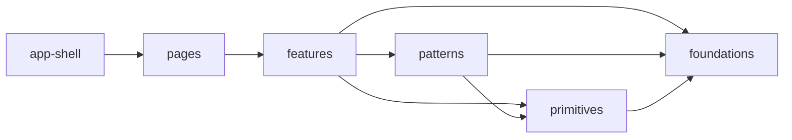

# Architecture Plan: Web AppRun Layered View Architecture and Feature-Sliced Updates

**Date**: 2026-03-23
**Related**: [REQ](../../../reqs/2026/03/23/req-web-apprun-layered-architecture.md)

## Overview

Refactor the web app into an explicit layered structure for view code and a feature-sliced structure for AppRun update logic. The work will preserve the current AppRun MVU model, typed event contracts, async generator composition, chat-scoped SSE behavior, and current route behavior while making ownership and future placement much clearer.

## Architecture Decisions

- **AD-1:** Keep AppRun page components as the route-level entry points. The refactor reorganizes ownership beneath the pages rather than replacing AppRun routing or component structure.
- **AD-2:** Introduce a layered view structure for presentation concerns only: `app-shell -> pages -> features -> patterns -> primitives -> foundations`.
- **AD-3:** Keep feature-specific state transitions and AppRun update handlers in feature-owned modules rather than pushing them into patterns or primitives.
- **AD-4:** Preserve `web/src/types/events.ts` as the typed event contract for the World page while splitting the handler implementation into multiple update modules that merge into one `Update<WorldComponentState, WorldEventName>` export.
- **AD-5:** Preserve multi-step flows through local helpers and async generators composed with direct function calls and `yield*`; do not reintroduce handler-to-handler `app.run(...)` chaining.
- **AD-6:** Treat `World.update` refactoring as an extraction/composition task, not a behavior rewrite. Existing event names, payload expectations, and runtime ordering stay stable unless a coordinated change is required.
- **AD-7:** Migrate existing generic view code gradually into `foundations`, `primitives`, and `patterns`, while feature-specific world/home/settings surfaces move under feature ownership.
- **AD-8:** Keep `web/src/pages/World.update.ts` as a compatibility facade during migration, re-exporting the composed feature update surface until all tests and callers are intentionally moved.
- **AD-9:** Extract the World page's remaining route-local UI handlers into an explicit `route-ui` update slice so the route page genuinely becomes assembly-focused.
- **AD-10:** New extracted modules use function-based exports and helpers; existing AppRun class pages remain only as compatibility route entry points unless separately migrated.

## Target Structure

```text
web/src/
  app-shell/
    index.ts
    layout.tsx
    routes.tsx
  foundations/
    index.ts
    tokens.css
    base.css
    composer.css
    transcript.css
  primitives/
    index.ts
    button.tsx
    icon-button.tsx
    panel-surface.tsx
    status-pill.tsx
    modal-frame.tsx
  patterns/
    index.ts
    page-shell.tsx
    sidebar-panel.tsx
    composer-shell.tsx
    chat-history-panel.tsx
    empty-state.tsx
  features/
    home/
      views/
      update/
      index.ts
    world/
      views/
      update/
        index.ts
        route-ui.ts
        lifecycle.ts
        composer.ts
        streaming.ts
        messages.ts
        history.ts
        management.ts
        runtime.ts
      index.ts
    settings/
      views/
      update/
      index.ts
  pages/
    Home.tsx
    World.tsx
    Settings.tsx
  types/
  domain/
  utils/
```

## Ownership Rules

- `app-shell/` owns application bootstrapping, top-level layout shell, and route registration helpers.
- `pages/` owns route entry components only.
- `features/` owns domain-specific AppRun view assembly, update handlers, and orchestration for one product area.
- `patterns/` owns reusable composed UI structures with no feature-specific business rules.
- `primitives/` owns generic visual controls and shells with no feature-specific state logic.
- `foundations/` owns CSS tokens, shared variables, global base styles, and repeated low-level style contracts.
- `domain/` remains the home for pure business/domain helpers not tied to the view-layer taxonomy.
- `utils/` remains the home for generic non-domain utilities such as formatting and low-level helpers.

## Dependency Direction



Arrows indicate allowed imports. Lower layers do not import higher layers.

## World Update Composition Plan

The current `web/src/pages/World.update.ts` will be split into a composed feature update surface with these module responsibilities:

- `update/route-ui.ts`: right-panel, modal-open/close, agent-filter, and other route-bound World UI handlers that do not belong in generic patterns.
- `update/lifecycle.ts`: route init, world refresh, world hydration, transient-message preservation helpers.
- `update/composer.ts`: input updates, key handling, send/stop flows, project-folder selection, tool permission, reasoning effort.
- `update/streaming.ts`: stream start/chunk/end, tool lifecycle, system events, HITL response, world activity, stream flush/timer handlers.
- `update/messages.ts`: message display toggles, edit lifecycle, delete lifecycle, tool-output expansion.
- `update/history.ts`: chat search, create/load/delete chat, chat-history modal state.
- `update/management.ts`: world export/view, agent delete/clear, world clear, any remaining world-scope actions.
- `update/runtime.ts`: shared helper functions and async generators used across multiple update slices.
- `update/index.ts`: merges all update slices into the exported `worldUpdateHandlers` object.

## Implementation Phases

### Phase 1: Lay Down Structure and Stable Entry Points
- [x] Create `app-shell`, `foundations`, `primitives`, `patterns`, and feature folder structure in `web/src`.
- [x] Move app bootstrap/layout ownership out of the current generic component area into `app-shell` while preserving route behavior.
- [x] Add barrel exports for each new layer where useful to keep import paths stable.
- [x] Keep current pages functional by using compatibility re-exports or minimal import-path changes during the transition.
- [x] Preserve `web/src/pages/World.update.ts` as a compatibility export surface while the new feature update modules are introduced.

### Phase 2: Extract Foundations and Shared View Building Blocks
- [ ] Split the current `styles.css` into foundation-owned CSS files for tokens/base/shared surface rules without changing appearance.
- [x] Identify the first set of generic primitives currently embedded in feature views and extract them into `primitives`.
- [x] Identify repeated composed structures and extract them into `patterns` without embedding feature state logic.
- [x] Keep all feature/business decisions in feature modules, not in patterns or primitives.

### Phase 3: Rehome Existing View Modules by Ownership
- [x] Move world-specific view pieces under `features/world/views`.
- [x] Move home-specific view pieces under `features/home/views`.
- [x] Move settings-specific view pieces under `features/settings/views`.
- [ ] Reduce the old catch-all `components` area to either compatibility wrappers or remove it once all callers are migrated.

### Phase 4: Split World Update by Feature
- [x] Extract shared runtime helpers and reusable async-generator flows from `World.update.ts` into `features/world/update/runtime.ts`.
- [x] Extract route-local World page UI handlers into `features/world/update/route-ui.ts`.
- [x] Extract lifecycle handlers into `features/world/update/lifecycle.ts`.
- [x] Extract composer handlers into `features/world/update/composer.ts`.
- [x] Extract streaming and tool/HITL handlers into `features/world/update/streaming.ts`.
- [x] Extract message editing/deletion/display handlers into `features/world/update/messages.ts`.
- [x] Extract chat-history/session handlers into `features/world/update/history.ts`.
- [x] Extract world/agent management handlers into `features/world/update/management.ts`.
- [x] Replace the old monolith export with an `index.ts` aggregator and keep the page import surface stable.

### Phase 5: Thin the Route Pages
- [x] Update `pages/World.tsx` so it primarily assembles feature views, page shell, and at most a minimal route-entry wrapper around explicit feature/page-ui handler slices.
- [x] Update `pages/Home.tsx` and `pages/Settings.tsx` to align with the new ownership model and avoid generic reusable UI living directly in pages.
- [x] Keep page components as AppRun route entry points and preserve their current route registration semantics.

### Phase 6: Tests and Verification
- [x] Add targeted unit tests for the composed World update surface, focusing on production-path behavior rather than implementation details.
- [x] Add targeted tests for at least one extracted feature update module plus one shared runtime flow.
- [ ] Update any view-level tests affected by moved imports or new public module boundaries.
- [x] Run targeted web tests, full `npm test`, and any required integration coverage if API/runtime paths are touched.

## Testing Strategy

- Verify the composed `worldUpdateHandlers` still exposes the same public event behavior for critical flows.
- Add a regression test for at least one generator-based flow after extraction, such as send, create-chat, or stop-processing.
- Add a regression test for one composed synchronous handler path, such as message toggle/edit/delete UI state.
- Keep existing tests that import `web/src/pages/World.update.ts` green by preserving the compatibility facade or updating those imports in the same change set.
- Keep tests at the public unit boundary using exported handlers/helpers; do not assert internal file layout.
- If SSE/runtime-adjacent code in `web/src/utils/sse-client.ts` changes, also run `npm run integration` per repo policy.

## Risks and Mitigations

| Risk | Mitigation |
|------|------------|
| Update extraction accidentally changes event ordering | Move behavior through pure extraction first; keep event names and helper bodies stable while splitting files |
| Streaming/HITL/chat-scope regressions in the World page | Extract streaming last, add focused tests before and after migration, preserve existing helper functions during the move |
| View-layer refactor turns into a visual redesign | Keep CSS and markup parity as a requirement; change ownership first, appearance second never |
| AppRun update composition becomes fragmented and hard to follow | Centralize shared flows in `runtime.ts` and keep `update/index.ts` as the single authoritative composition point |
| Import churn causes broad breakage during migration | Use incremental barrel exports and compatibility wrappers until all call sites are updated |
| Route page remains oversized because local handlers were not migrated | Introduce an explicit `route-ui.ts` slice and treat leftover page-local handlers as refactor debt that must be closed |

## Exit Criteria

- The web app uses the new layered structure for view ownership.
- `World.update` is replaced by a composed feature-sliced update structure.
- Route pages are thinner and more assembly-focused.
- Existing world/chat behavior remains intact.
- Targeted unit tests cover the new module boundaries or preserved critical flows.
- The refactor passes the agreed verification steps.