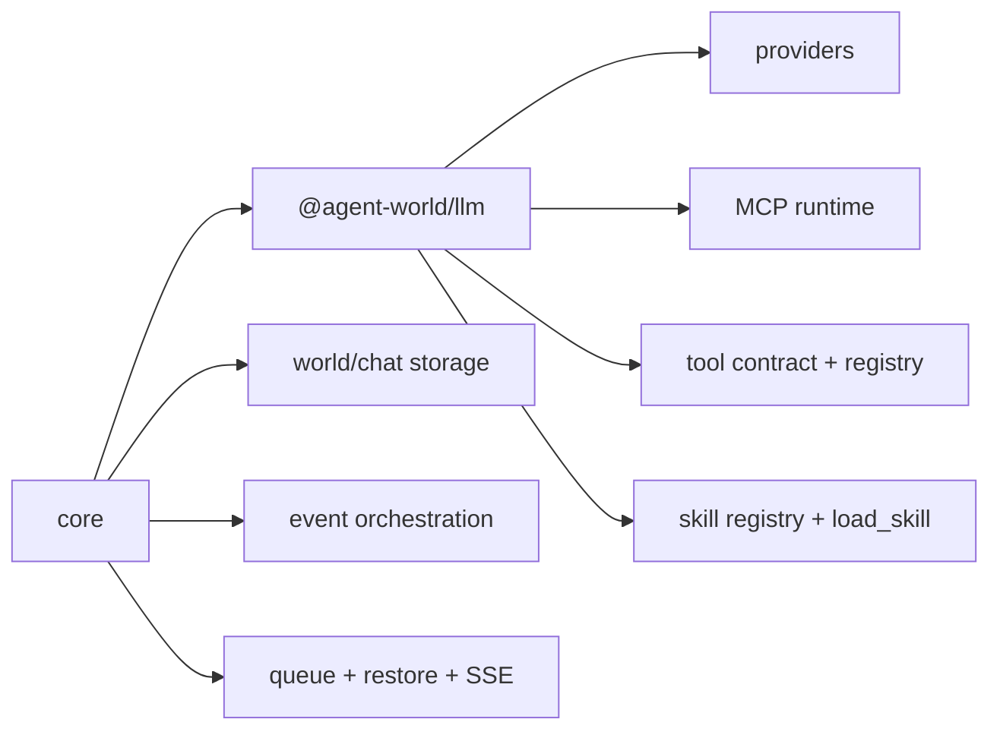

# Architecture Plan: Publishable LLM Workspace Package

**Date:** 2026-03-27  
**Related Requirement:** [req-llm-workspace-package.md](/Users/esun/Documents/Projects/agent-world/.docs/reqs/2026/03/27/req-llm-workspace-package.md)  
**Status:** In Progress

## Overview

Create a new publishable monorepo workspace that packages the reusable LLM runtime surface currently spread across `core/`.

Unlike a thin provider client, this workspace will include:
- provider/model invocation
- MCP integration
- tool registration and execution contracts
- skill discovery and loading support

`core/` will remain the application-facing orchestrator for world/chat/session behavior, but it will consume this package for the reusable runtime substrate instead of owning the implementation directly.

## Package Identity

- Workspace folder: `packages/llm`
- npm package name: `@agent-world/llm`

Why this name:
- This matches the requested workspace and package identity.
- The package scope is broader than a thin provider client, but the short name is acceptable if the public API clearly describes MCP, tools, and skills as first-class runtime capabilities.

## Architecture Decisions

### AD-1: Package Boundary

The new package owns reusable runtime capabilities:
- normalized provider request/response interfaces
- streaming and non-streaming model invocation
- MCP server registry/integration
- tool contract, validation hooks, and tool registry assembly
- skill registry, skill discovery metadata, and `load_skill` support

`core/` keeps app-specific orchestration:
- world/agent/chat lifecycle
- storage persistence and restore flows
- event publishing/SSE wiring
- queueing, retries, and message-processing control
- transcript-specific tool-call continuation orchestration unless later migrated explicitly

### AD-2: Host-Provided Context Contract

The package must not hard-code application assumptions into its public API. Instead, the host (`core/`) passes execution context explicitly.

The contract should cover:
- trusted working directory / world variables
- abort/cancellation signals
- optional persistence/event callbacks where the package needs host participation

This preserves package reuse while allowing `core/` to remain the authority for world/chat state.

Host inputs should be split by lifetime rather than collapsed into one untyped variable bag:
- constructor-time runtime config
- per-call execution context

Recommended split:
- constructor-time:
  - provider credentials/config
  - built-in tool enablement
  - MCP config
  - skill roots
  - optional package-level defaults/policies
- per-call context:
  - working directory / cwd
  - reasoning effort
  - tool permission / execution permission
  - abort signal
  - optional host callbacks for persistence/events

For compatibility with current `core`, the package may also accept `worldVariablesText` as an adapter input, but it should not be the preferred long-term public API.

### AD-3: Tool System Lives in the Package

The package will expose one canonical tool system that supports:
- built-in tools
- MCP-provided tools
- host-registered tools if needed later

The package API should let `core/` ask for a resolved tool set through one entrypoint rather than assembling tools ad hoc from multiple modules.

Built-in tool ownership should move into the package, not remain split across `core`.
This includes the current reusable built-ins such as:
- `shell_cmd`
- `web_fetch`
- file tools (`read_file`, `write_file`, `list_files`, `grep`)
- `load_skill`
- `human_intervention_request`

These built-ins should execute inside the package by default. `human_intervention_request` should return a package-owned pending HITL artifact rather than requiring a package adapter. Clients may add extra tools, but they must not override built-in names. Their definitions, registration, and package-facing enablement rules should live in `@agent-world/llm`.

Out of scope for the package-owned built-in set:
- `create_agent`
- `send_message`

Those remain `core`-level app/runtime tools rather than reusable package built-ins.

### AD-3A: Built-In Tool Enablement Policy

Built-in tool enablement should use two layers:
- constructor-time baseline enablement
- optional generate-time narrowing

Recommendation:
- Use constructor-time config as the primary API for enabling/disabling built-ins.
- Allow generate-time filtering only as a narrower override of the already-configured baseline.

Reasoning:
- Built-in tools are part of runtime identity and prompt/tool-catalog stability.
- MCP startup, prompt preparation, and skill guidance benefit from a stable default catalog.
- Generate-time toggles are still useful for reducing tool surface on a specific call, but they should not be the main source of truth because they make runtime behavior harder to reason about and test.

Recommended shape:

```typescript
const runtime = createLLMRuntime({
  tools: {
    builtIns: {
      shell_cmd: true,
      web_fetch: true,
      read_file: true,
      write_file: false,
      list_files: true,
      grep: true,
      load_skill: true,
      human_intervention_request: true,
    },
    extraTools: [createAgentTool()],
  },
});
```

```typescript
await runtime.generate({
  provider: 'openai',
  model: 'gpt-5',
  messages,
  tools: {
    enabledBuiltIns: ['read_file', 'list_files', 'grep'],
  },
});
```

In this model, generate-time configuration may only reduce the active built-in set or append extra host tools; it should not silently enable built-ins that were disabled at runtime construction unless the package later exposes an explicit policy permitting that.

### AD-4: Skills Stay with the Runtime Layer

Skill listing and loading remain part of the new package because they are part of model/runtime behavior rather than UI-only behavior.

The package should expose:
- available skill metadata for prompt injection
- skill source lookup/loading
- `load_skill` tool behavior

`core/` may still decide when to call the package and how to persist resulting messages/events.

### AD-5: Registry Ownership and Host Inputs

The package should include both the MCP registry and the skill registry, but they must be package-owned runtime components rather than `core` singletons.

Host applications should pass configuration into the package explicitly:
- MCP configuration from host/world config
- skill root locations from host/app configuration
- execution context from host runtime state

Compatibility with today’s `core` should be preserved by accepting the existing MCP JSON string format through a helper or constructor option, but the package should not expose raw JSON strings as its only public contract.

For skills, the public API should use one ordered root list rather than separate public `global` and `project` buckets. Precedence should be determined by list order. If internal logic still needs source-scope metadata, the package can derive or annotate it internally without exposing that complexity in the main constructor API.

Recommended host-facing input shape:
- `mcp.config`: normalized object, with optional helper for parsing legacy JSON string input
- `skills.roots`: one ordered `string[]`
- `worldVariablesText` or `workingDirectory` when needed for compatibility with existing root resolution behavior

### AD-6: Incremental Migration

Do not attempt a flag-day rewrite. Migrate in slices behind stable facades:
1. create workspace and exports
2. move pure provider-facing modules first
3. move MCP/tool registry modules next
4. move skill modules next
5. switch `core/` imports to package entrypoints
6. collapse leftover compatibility shims only after tests are stable

This reduces risk in event-path and continuation-path behavior.

## Proposed Public API Surface

The exact names may change during implementation, but the package should expose categories like:

- `createLLMRuntime(...)`
- `providers`
  - create/configure provider clients
  - `generate(...)`
  - `stream(...)`
- `tools`
  - tool types/contracts
  - built-in tool definitions
  - tool validation wrappers
  - tool registry assembly
- `mcp`
  - MCP config parsing
  - server lifecycle/registry helpers
  - MCP-backed tool resolution
- `skills`
  - skill registry sync/list/load APIs
  - skill-aware prompt helpers
  - `load_skill` tool definition

Recommended constructor shape:

```typescript
const runtime = createLLMRuntime({
  providers,
  defaults: {
    reasoningEffort: 'medium',
    toolPermission: 'ask',
  },
  mcp: {
    config: parsedMcpConfig,
  },
  skills: {
    roots: [],
  },
  tools: {
    builtIns: true,
  },
});
```

Recommended call shape:

```typescript
await runtime.generate({
  provider: 'openai',
  model: 'gpt-5',
  messages,
  context: {
    workingDirectory,
    reasoningEffort,
    toolPermission,
    abortSignal,
  },
});
```

## Target Dependency Shape



## Migration Plan

### Phase 1: Workspace Scaffolding
- [x] Add `packages/llm` workspace and include it in root `package.json` workspaces.
- [x] Add package-local `package.json`, `tsconfig`, build/check scripts, and typed entrypoints.
- [x] Decide whether root exports will re-export the package temporarily for compatibility.
- [x] Establish package versioning and release metadata.

### Phase 2: Contract Extraction
- [x] Define package public types for:
  - LLM request/response
  - stream chunk payloads
  - tool definitions and execution context
  - MCP config/runtime contracts
  - skill registry entry types
- [x] Separate public contracts from app-internal helper types.
- [x] Keep contracts compatible with current `core` usage to minimize churn.

### Phase 3: Provider Module Migration
- [x] Move provider configuration and provider adapters into the package.
- [x] Keep provider modules pure with respect to host state wherever possible.
- [ ] Update `core` imports to consume provider APIs from the package.
- [x] Add focused tests around normalized provider behavior and compatibility.

Current slice status:
- Provider configuration moved into the package and `core/llm-config` now re-exports from `@agent-world/llm`.
- `@agent-world/llm` now owns package-native provider adapters for OpenAI-compatible, Anthropic, and Google providers, plus runtime-level `generate(...)` and `stream(...)` dispatch through those adapters.
- Direct provider adapters (`openai-direct`, `anthropic-direct`, `google-direct`) still remain in `core` as legacy imports and have not been switched over yet.

### Phase 4: MCP and Tool Registry Migration
- [x] Move MCP registry/config parsing into the package.
- [x] Move built-in tool registration and canonical built-in definitions into the package.
- [x] Preserve package-level built-in + MCP merged-tool behavior.
- [x] Define package-level entrypoints for resolving tools for a host execution context.
- [x] Update `core` to consume the package built-in tool catalog for reusable built-ins.
- [x] Add package-level built-in tool enable/disable configuration with constructor-time defaults and optional generate-time narrowing.
- [x] Define the package-owned HITL pending-artifact contract used by host runtimes.

Current slice status:
- `@agent-world/llm` now owns the reusable built-in tool catalog, constructor-time enablement policy, additive `extraTools`, reserved built-in names, and package-owned executors for `shell_cmd`, `load_skill`, `human_intervention_request`, `web_fetch`, `read_file`, `write_file`, `list_files`, and `grep`.
- `human_intervention_request` is package-owned and returns a pending HITL artifact without requiring a package adapter.
- `@agent-world/llm` now resolves executable MCP tools through the package runtime and merges them with package-owned built-ins during `generate(...)`, `stream(...)`, and async tool resolution.
- `core/mcp-server-registry` now consumes the package-owned built-in catalog for `shell_cmd`, `load_skill`, `human_intervention_request`, `web_fetch`, `read_file`, `write_file`, `list_files`, and `grep` through a core execution-signature bridge; HITL pending artifacts are converted into the existing world/chat pending-request flow.
- `create_agent` and `send_message` intentionally remain `core`-level tools.

### Phase 5: Skill Support Migration
- [x] Move skill registry and skill-loading support into the package.
- [x] Preserve package-owned `load_skill` execution behavior through package skill registry and built-in definitions.
- [x] Ensure host-controlled settings/context still flow into skill resolution.
- [ ] Update `core` to consume package skill APIs.

### Phase 6: Core Integration Cleanup
- [ ] Replace direct `core` internal imports with package entrypoints.
- [ ] Leave compatibility shims only where needed during transition.
- [ ] Remove duplicated logic after package-backed flow is stable.
- [ ] Update docs to describe the new ownership boundary.

Current slice status:
- `core/llm-config` is now a compatibility re-export from `@agent-world/llm`.
- Broader `core` runtime imports still point at legacy local modules and remain to be migrated.

### Phase 7: Validation
- [x] Add/update targeted unit tests for package exports and package-backed `core` integration points.
- [x] Run targeted tests for providers, MCP/tool paths, and skill paths.
- [ ] Run `npm run integration` because this change touches runtime/tool transport behavior.
- [x] Verify build/check flows across root, `core`, and the new workspace.

## Testing Strategy

### Package-Focused
- Public API export coverage
- Provider request/response normalization
- MCP config parsing and tool resolution
- MCP tool execution and merged runtime tool resolution
- Tool contract validation behavior
- Built-in tool enable/disable behavior at constructor time
- Reserved built-in-name enforcement at constructor time and per-call request time
- Generate-time built-in filtering behavior
- Package-owned built-in execution, including HITL pending-artifact coverage
- Skill discovery/listing/loading behavior
- Terminal-runnable real-LLM showcase runner for package capabilities, using Google Gemini from repo `.env`

### Core-Focused Regression
- Existing agent turns still resolve tools through the package
- Existing skill-aware prompting still works
- Existing `load_skill` and MCP-backed tool flows remain intact
- Existing continuation/restore behavior remains stable

## Risks and Mitigations

### Risk 1: Boundary Too Broad or Too Narrow
- Risk: pushing too much into the package drags app-specific orchestration with it.
- Mitigation: keep world/chat/session persistence and event orchestration in `core`; move only reusable runtime substrate.

### Risk 2: Circular Dependencies
- Risk: package code importing `core` types/helpers would defeat the split.
- Mitigation: package public contracts must be self-owned; `core` depends on package, not the reverse.

### Risk 3: Event-Path Regressions
- Risk: MCP/tool/skill code currently participates in persisted tool lifecycle assumptions.
- Mitigation: preserve `core` ownership of persistence and transcript orchestration during initial migration.

### Risk 4: Publishing Friction
- Risk: package entrypoints accidentally depend on app-only files or root-only TypeScript config.
- Mitigation: validate package build/check in isolation early in Phase 1.

## Open Questions

- Should the root package temporarily re-export `@agent-world/llm` symbols for internal compatibility, or should `core` switch imports directly from the new workspace immediately?
- Should package consumers outside this repo be expected to provide persistence/event hooks, or should the package expose a minimal default no-op host adapter?

Resolved:
- Built-in tools should move into the package.
- Built-in enable/disable should be constructor-time by default, with optional generate-time narrowing rather than generate-time-first control.

## Exit Criteria

- [ ] The new workspace exists and is publishable as `@agent-world/llm`.
- [ ] `core` consumes the package for provider, MCP, built-in tools, tool-contract, and skill functionality.
- [ ] No package-to-`core` dependency remains.
- [ ] Current agent runtime behavior remains compatible at the `core` boundary.
- [ ] Build/check/test coverage confirms the split is stable.

## Architecture Review (AR)

**Review Date:** 2026-03-27  
**Reviewer:** AI Assistant  
**Status:** Approved for SS after user approval

### AR Notes

- The package scope is coherent if defined as a reusable runtime substrate rather than a pure model client.
- Keeping `core` as the owner of world/chat/session orchestration avoids the most dangerous regressions and keeps the initial split tractable.
- The main failure mode would be allowing the new package to import `core` internals; this must be treated as a hard architectural constraint.
- The approved package identity is `packages/llm` and `@agent-world/llm`; API naming should make the broader runtime scope explicit so the package is not mistaken for a provider-only SDK.
- The primary API should not require `worldId`, `agentId`, or `chatId`; those remain host orchestration details unless a later package behavior proves it truly depends on them.
