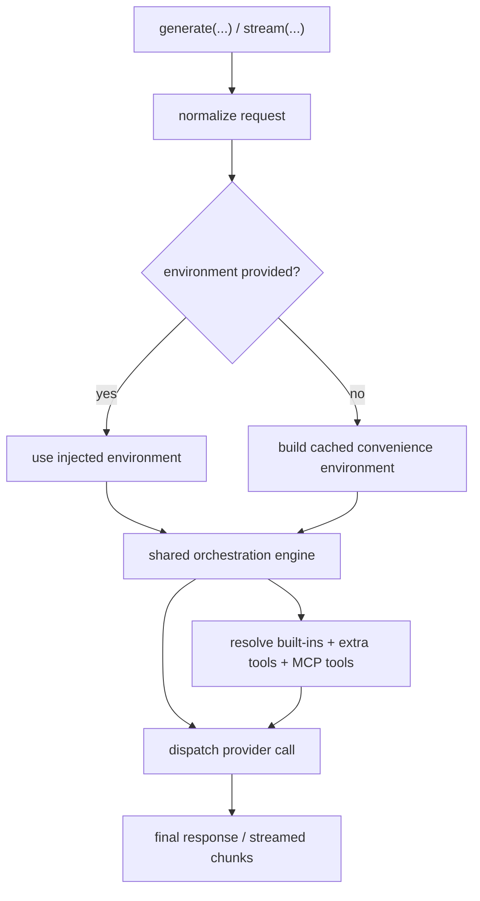

# Architecture Plan: LLM Package Explicit Environment and Dependency Injection

**Date:** 2026-03-28  
**Related Requirement:** [req-llm-explicit-environment.md](/Users/esun/Documents/Projects/agent-world/.docs/reqs/2026/03/28/req-llm-explicit-environment.md)  
**Status:** Implemented

## Overview

Extend `@agent-world/llm` with an explicit environment injection model while preserving the current per-call convenience API.

The package should separate:
- orchestration logic
- environment-bound dependencies
- convenience caching/adapters

The end state is:
- simple callers can still use `generate(...)` and `stream(...)` with plain per-call config
- advanced callers can inject an explicit environment that owns provider access, MCP access, skill access, and tool-execution dependencies

This avoids forcing all consumers into a heavier API while removing hidden state as the only available execution model.

## Architecture Decisions

### AD-1: Two Public Paths, One Engine

Keep `generate(...)` and `stream(...)` as the only primary entrypoints.

Both should accept either:
- a convenience request with plain config inputs
- or the same request plus an injected `environment`

The orchestration engine underneath should be the same in both cases.

Why:
- avoids a second top-level mental model
- preserves the current per-call API
- adds explicit dependency control without replacing the existing path

### AD-2: Introduce an Explicit `LLMEnvironment`

Add a public environment contract, likely named `LLMEnvironment`, that contains the resolved dependency surfaces needed by orchestration.

Recommended contents:
- provider config store or provider resolver
- MCP registry or MCP tool resolver
- skill registry or skill loader
- built-in tool dependency adapters where environment access is needed

Possible shape:

```ts
type LLMEnvironment = {
  providerStore: LLMProviderConfigStore;
  mcpRegistry: MCPRegistry;
  skillRegistry: SkillRegistry;
  builtInAdapters?: LLMBuiltInAdapters;
};
```

or, if more abstract:

```ts
type LLMEnvironment = {
  resolveProviderConfig(provider): ProviderConfig;
  resolveMCPTools(): Promise<Record<string, LLMToolDefinition>>;
  loadSkill(skillId): Promise<LoadedSkill | undefined>;
};
```

Recommendation:
- prefer concrete typed registries/stores first
- keep abstraction lower until real variation forces more indirection

### AD-3: Split Orchestration From Environment Construction

The current `runtime.ts` mixes:
- request normalization
- cache lookup/creation
- environment construction
- provider dispatch
- tool resolution

This should be split into:

1. **Pure-ish orchestration layer**
- takes normalized request + explicit environment
- resolves built-ins, extra tools, MCP tools
- dispatches provider invocation
- returns final or streamed response

2. **Convenience environment builder**
- takes provider config / MCP config / skill roots
- constructs or reuses cached environment pieces

This makes testing and reasoning cleaner.

### AD-4: Built-In Tool Ownership Stays in the Package

Built-in tool definitions, validation, reserved-name protection, and orchestration behavior remain package-owned.

What changes is how built-ins access environment-sensitive capabilities.

Examples:
- `load_skill` should use injected `skillRegistry`
- MCP-backed tool resolution should use injected `mcpRegistry`
- other built-ins may later use explicit adapters if they depend on environment-specific IO

The important boundary is:
- built-in tool identity and behavior stay in the package
- environment-sensitive backing services can be injected

### AD-5: Convenience Path Uses Internal Caches

The package should keep the current convenience path for:
- provider config store reuse
- MCP registry reuse
- skill registry reuse

But those caches should move behind an internal environment-builder layer rather than being mixed directly into orchestration.

This keeps current ergonomics while making the advanced path explicit.

### AD-6: Public Surface Simplification

Keep:
- `generate(...)`
- `stream(...)`
- `resolveTools(...)`
- `resolveToolsAsync(...)`
- `createLLMEnvironment(...)`

Do not keep:
- `createLLMRuntime(...)`

Instead:
- add environment support directly to the per-call APIs
- keep convenience behavior internal when no environment is injected
- migrate tests toward explicit environment coverage

## Proposed Public API

### Convenience Path

```ts
await generate({
  provider,
  model,
  providerConfig,
  messages,
  mcpConfig,
  skillRoots,
  builtIns,
  extraTools,
  context,
});
```

### Explicit Environment Path

```ts
const environment = createLLMEnvironment({
  providers,
  mcpConfig,
  skillRoots,
});

await generate({
  provider,
  model,
  messages,
  builtIns,
  extraTools,
  context,
  environment,
});
```

### Stream Path

```ts
await stream({
  provider,
  model,
  messages,
  environment,
  builtIns,
  extraTools,
  context,
  onChunk,
});
```

### Optional Tool Resolution Path

```ts
const tools = await resolveToolsAsync({
  builtIns,
  extraTools,
  environment,
});
```

## Proposed Internal Structure



## Implementation Plan

### Phase 1: Public Type Design
- [x] Add `LLMEnvironment` public type.
- [x] Add `environment?: LLMEnvironment` to `generate(...)`, `stream(...)`, `resolveTools(...)`, and `resolveToolsAsync(...)`.
- [x] Add any supporting adapter/store types needed for built-in dependencies.
- [x] Keep existing convenience request fields intact for backward compatibility.

### Phase 2: Environment Builder Extraction
- [x] Extract current internal cache logic into a dedicated environment-builder path inside `runtime.ts`.
- [x] Move provider-store cache, MCP-registry cache, and skill-registry cache behind that layer.
- [x] Define one internal function that converts convenience inputs into an `LLMEnvironment`.
- [x] Keep orchestration code unaware of whether the environment was cached or injected.

### Phase 3: Orchestration Engine Refactor
- [x] Refactor provider dispatch, tool resolution, and MCP merge logic into helpers that accept `LLMEnvironment`.
- [x] Ensure `generate(...)` and `stream(...)` both call the same environment-aware orchestration path.
- [x] Keep response semantics unchanged.
- [x] Keep reserved built-in name enforcement unchanged.

### Phase 4: Built-In Dependency Injection
- [x] Route `load_skill` through injected `skillRegistry`.
- [x] Route MCP-backed tool resolution through injected `mcpRegistry`.
- [x] Keep built-ins package-local unless they truly need external adapters.
- [x] Avoid broadening this slice into unrelated `core`-specific adapters.

### Phase 5: Public API Cleanup
- [x] Remove `createLLMRuntime(...)` from the package implementation.
- [x] Remove constructor-only `LLMRuntime*` types from the public package types.
- [x] Keep convenience per-call `generate(...)` and `stream(...)` behavior unchanged from a caller perspective.

### Phase 6: Testing
- [x] Add unit tests for explicit injected environment path.
- [x] Add isolation tests proving different injected environments do not leak state.
- [x] Keep convenience-path tests intact.
- [x] Run `npm run check --workspace=packages/llm`
- [x] Run `npx vitest run tests/llm/*.test.ts`
- [x] Run `npm run test:llm-showcase`
- [x] Run `npm run integration`

## Risks

### Risk 1: API complexity growth

Adding `environment` can make the request shape feel heavier and less obvious.

Mitigation:
- keep it optional
- document convenience vs explicit path clearly
- avoid introducing multiple new top-level factories unless necessary

### Risk 2: Partial abstraction that adds ceremony without enough value

If the environment contract is too thin or too abstract, it may complicate the code without improving testability.

Mitigation:
- prefer concrete registries/stores first
- extract only the capabilities already proven useful: provider, MCP, skills

### Risk 3: Duplicate logic during migration

There is risk of keeping both cache-backed convenience logic and injected-environment logic in parallel incorrectly.

Mitigation:
- one shared orchestration engine
- one shared environment shape
- convenience path should only construct environment, not reimplement orchestration

## Open Questions

1. Should `createLLMEnvironment(...)` be a public helper, or should callers construct the environment pieces themselves?
   Recommendation: expose `createLLMEnvironment(...)` for convenience, but allow direct environment injection for advanced callers.

2. Should built-in adapters be part of `LLMEnvironment` now, or only added when specific built-ins need them?
   Recommendation: add only the adapters needed by the first extracted built-ins; do not over-generalize early.

3. Should internal convenience caches remain indefinitely?
   Recommendation: yes for the convenience path, but they should no longer be the only execution model.

## Implementation Notes

Completed in `packages/llm` only:
- added explicit `LLMEnvironment` injection
- removed `createLLMRuntime(...)` from the package implementation and public entrypoint
- preserved convenience per-call usage by keeping internal caching behind `generate(...)`, `stream(...)`, `resolveTools(...)`, and `resolveToolsAsync(...)`
