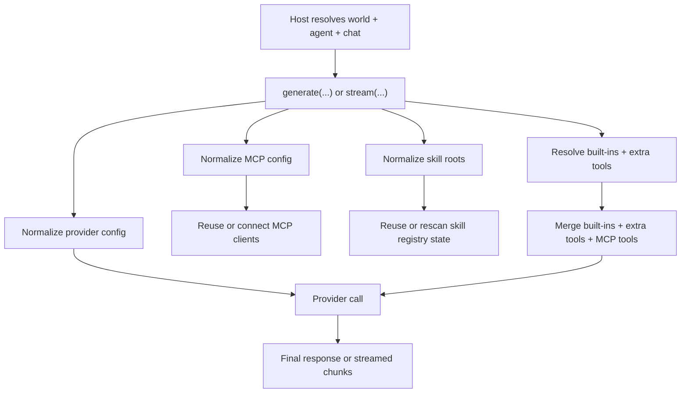

# Architecture Plan: LLM Package Per-Call API

**Date:** 2026-03-28  
**Related Requirement:** [req-llm-per-call-api.md](/Users/esun/Documents/Projects/agent-world/.docs/reqs/2026/03/28/req-llm-per-call-api.md)  
**Status:** Implemented

## Overview

Change `@agent-world/llm` from a constructor-first API to a per-call API while keeping distinct `generate(...)` and `stream(...)` entrypoints.

The public package should stop requiring `createLLMRuntime(...)` for normal usage. Instead, callers pass provider/model/config/tool/context inputs directly to `generate(...)` or `stream(...)`, and the package handles provider reuse, MCP reuse, skill-root handling, and tool resolution internally.

The main design goal is to let `core/` map world, agent, and chat state into one request object per call:
- world contributes MCP config and fallback provider/model
- agent can override provider/model
- chat/UI contributes cwd, reasoning, and permission

## Key Decision

### AD-1: Public API Becomes Per-Call Only

The recommended primary package API becomes:
- `generate(request)`
- `stream(request)`

`createLLMRuntime(...)` should no longer be the recommended public entrypoint. It may remain temporarily as a compatibility shim during migration, but the package design should assume that callers do not construct or hold runtime instances.

Why:
- `core/` already resolves effective world/agent/chat state per request.
- constructor-time vs per-call distinctions are harder to teach than necessary for current app usage.
- MCP and skill reuse can be kept internal instead of being exposed as public lifecycle concerns.

### AD-2: Public Inputs Are All Per-Call

Each call should carry:
- provider
- model
- provider config or provider config map
- messages
- MCP config
- skill roots
- built-in tool selection
- extra tools
- request execution context

This lets the host remain the authority for world/agent/chat resolution while the package stays focused on invocation and tool-capability assembly.

Implementation note:
- The package now also exposes top-level `resolveTools(...)` and `resolveToolsAsync(...)` so per-call consumers can run a tool loop without falling back to `createLLMRuntime(...)`.

### AD-3: Caching Remains Internal

Internal caches should exist for:
- provider clients by provider config
- MCP clients and discovered tools by normalized MCP config
- skill discovery results by normalized skill roots and filesystem state where beneficial

These caches should not require public setup APIs. The package should compute cache keys from the request and reuse cached internals when possible.

### AD-4: `generate(...)` and `stream(...)` Stay Separate

The package should keep both functions public because they represent different delivery modes and cleaner return types.

Internally, both should share the same request normalization pipeline:
- normalize provider config
- normalize MCP config
- normalize skill roots
- resolve built-ins
- resolve extra tools
- resolve MCP tools
- validate tool collisions
- dispatch provider call

Only the output delivery layer should differ:
- `generate(...)`: buffered/final response
- `stream(...)`: chunk callback plus final response

### AD-5: World / Agent / Chat Mapping Rule

The host integration rule should be:

- world-level state:
  - MCP config
  - fallback provider/model
  - optional world-level built-in policy
- agent-level state:
  - provider/model override
- chat/UI-level state:
  - cwd
  - reasoning effort
  - permission

The package should not require world, agent, or chat identifiers as primary API inputs. It only needs the resolved configuration and execution context for the current call.

## Proposed Public API Shape

### Generate

```ts
const result = await generate({
  provider: 'google',
  model: 'gemini-2.5-pro',
  providerConfig: {
    apiKey: process.env.GOOGLE_API_KEY!,
  },
  messages,
  mcpConfig,
  skillRoots,
  builtIns: {
    read_file: true,
    list_files: true,
    grep: true,
    load_skill: true,
    human_intervention_request: true,
  },
  extraTools,
  context: {
    workingDirectory,
    reasoningEffort,
    toolPermission,
    abortSignal,
  },
});
```

### Stream

```ts
const result = await stream({
  provider: 'google',
  model: 'gemini-2.5-pro',
  providerConfig: {
    apiKey: process.env.GOOGLE_API_KEY!,
  },
  messages,
  mcpConfig,
  skillRoots,
  builtIns,
  extraTools,
  context: {
    workingDirectory,
    reasoningEffort,
    toolPermission,
    abortSignal,
  },
  onChunk(chunk) {
    // incremental UI updates
  },
});
```

## Request Normalization Model



## Implementation Plan

### Phase 1: Public Type Refactor
- [x] Introduce per-call request types for `generate(...)` and `stream(...)`.
- [x] Add per-call fields for provider config, MCP config, skill roots, built-in selection, and extra tools.
- [x] Keep response types unchanged where possible.
- [x] Leave constructor-oriented runtime types in place as compatibility support while the per-call API becomes primary.

### Phase 2: Internal Engine Extraction
- [x] Extract current runtime logic into internal helpers that accept one normalized request object.
- [x] Move tool resolution into an internal shared function used by both `generate(...)` and `stream(...)`.
- [x] Move provider dispatch into an internal shared function used by both `generate(...)` and `stream(...)`.
- [x] Preserve tool-collision rules and built-in ownership rules.

### Phase 3: Internal Cache Layer
- [x] Add provider-store cache keyed by normalized provider config.
- [x] Add MCP registry cache keyed by normalized MCP config.
- [x] Add skill-registry cache keyed by normalized skill roots.
- [x] Add an internal test-reset helper and keep cache ownership inside the package.

### Phase 4: MCP and Skill Adaptation
- [x] Remove public dependence on constructor-held MCP and skill registries for the primary API.
- [x] Ensure MCP tool discovery/execution works from per-call `mcpConfig`.
- [x] Ensure `load_skill` works from per-call `skillRoots`.
- [x] Preserve deterministic behavior for equivalent config inputs.

### Phase 5: Public API Migration
- [x] Export package-level `generate(...)` and `stream(...)` as the recommended primary API.
- [x] Keep `createLLMRuntime(...)` as a compatibility wrapper during transition.
- [x] Update package tests/examples to use the per-call API first.
- [x] Leave non-package consumers unchanged in this slice.

### Phase 6: Test and Showcase Updates
- [x] Update unit tests to cover per-call MCP config, skill roots, built-ins, and provider config.
- [x] Add regression coverage proving that equivalent per-call inputs reuse internal caches safely.
- [x] Update the real Gemini showcase to call package-level `generate(...)` / `stream(...)` directly.
- [x] Run `npm test:llm-showcase` and `npm run integration`.

## Risks

### Risk 1: Hidden cache leakage

If internal cache keys are too coarse, requests with different MCP config, provider config, or skill roots may reuse the wrong state.

Mitigation:
- normalize and hash relevant config inputs precisely
- add regression tests for differing configs

### Risk 2: Compatibility drift during migration

The package already has a constructor-based API and tests around it. Moving too aggressively may break current consumers or test assumptions.

Mitigation:
- migrate through compatibility shims
- keep core provider/message semantics unchanged
- update docs/tests alongside code

### Risk 3: MCP cleanup semantics become unclear

Without explicit runtime instances, MCP connection lifetime becomes internal and easier to leak.

Mitigation:
- add internal cache cleanup policy
- optionally expose a narrow maintenance helper later only if truly needed

## Open Questions

1. Should the per-call API accept a single `providerConfig` for the selected provider, or a provider config map for all providers?
   Recommendation: accept a single provider-specific config for the selected provider to keep request shape simple.

2. Should built-in tool selection default to “all supported built-ins enabled” or “explicit selection required” per call?
   Recommendation: default to current package behavior unless the host supplies an explicit selection.

3. Should `createLLMRuntime(...)` be removed immediately or kept as a compatibility shim for one transition cycle?
   Recommendation: keep it temporarily as a compatibility wrapper, but document `generate(...)` and `stream(...)` as primary.

## Approval Gate

This plan changes the public package shape and the mental model for `core/` integration. Implementation should wait for approval before starting `SS`.
