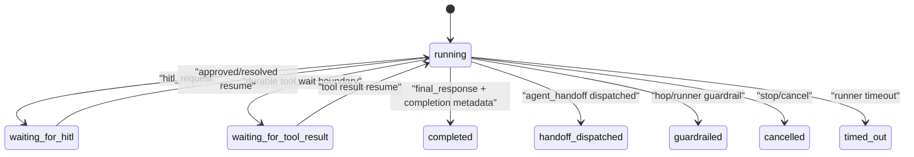
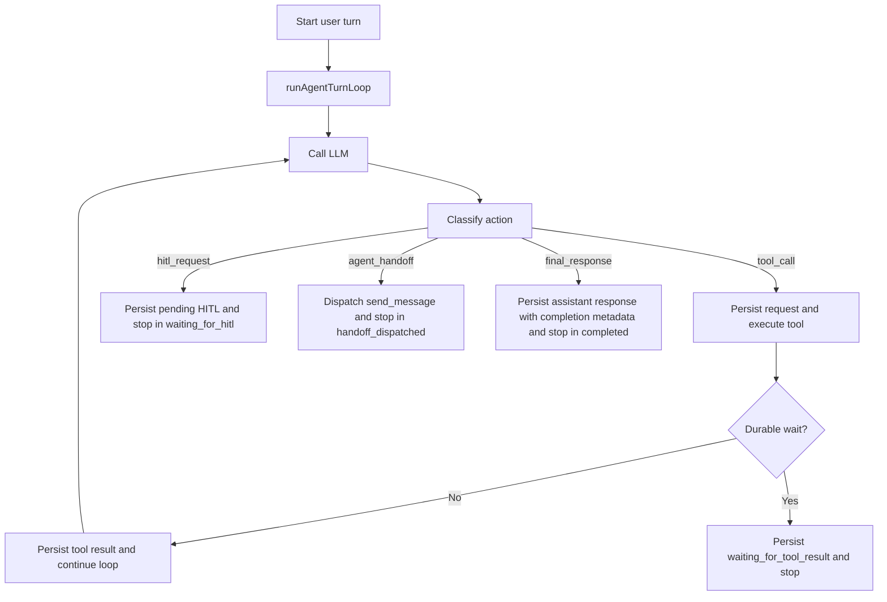

# Architecture Plan: Explicit Agent Turn Loop Runner

**Date**: 2026-03-29  
**Type**: Runtime Orchestration Refactor  
**Status**: In Progress  
**Related Requirement**: [req-agent-turn-loop-runner.md](../../../reqs/2026/03/29/req-agent-turn-loop-runner.md)

## Overview

Introduce one canonical runtime unit that owns a single agent turn loop end-to-end. The immediate goal is not to redesign provider clients or unlock broad multi-tool behavior. The immediate goal is to move today’s fragmented continuation logic behind one explicit per-chat runner with:

- explicit turn state
- explicit terminal outcome
- one canonical Phase 1 completion mechanism
- durable persistence between hops
- idempotent resume semantics

Phase 1 keeps the existing conservative single-tool execution behavior. It does not yet replace the global LLM queue or add multi-tool read batching.

## Implementation Update

### Delivered

- `runAgentTurnLoop(...)` now exists and is used by both the direct-turn and continuation-turn model-call paths.
- Terminal assistant completion metadata is persisted through `agent_memory.message_metadata`.
- Successful `send_message` tool dispatches now terminate as `handoff_dispatched`.
- Restore-time unresolved tool resumes now use a process-local resume lease to reduce duplicate same-turn execution.
- Regression coverage was added for terminal metadata, handoff terminality, retry semantics, and same-process resume duplication.

### Remaining

- Tool execution and action dispatch are still split across `orchestrator.ts` and `memory-manager.ts`.
- HITL has not yet been normalized under the same action boundary.
- Queue progression and restore do not yet consume completion metadata as their primary terminality signal.
- Phase 1 still lacks an explicit “one tool call per hop” regression test.
- Global LLM queue narrowing remains a later phase.

## Current-State Findings

1. `core/events/memory-manager.ts` already contains the practical loop body in `continueLLMAfterToolExecution(...)`, including hop counting, tool execution, persistence, retries, and post-tool continuation.
2. `core/llm-manager.ts` is already a pure provider/orchestration boundary for LLM calls, but concurrency is currently enforced by one global singleton queue.
3. `core/send-message-tool.ts` already behaves like a loop-owned action in practice, but its result is still treated as just another tool payload rather than a first-class handoff action result.
4. Queue progression and restore logic depend on durable artifacts and are already stronger than most chat-with-tools implementations.
5. Completion semantics are still too implicit because terminality is inferred from assistant text publication and side effects rather than from a dedicated persisted completion contract.

## Target Architecture

### AD-1: Introduce One Runtime-Owned Turn Runner

- Add one canonical `runAgentTurnLoop(...)` entry point in core runtime code.
- This runner becomes the single owner of:
  - initial LLM call for a turn
  - action classification
  - tool execution
  - post-tool continuation
  - handoff dispatch
  - final assistant publication
  - terminal state persistence
- Existing direct continuation helpers should become implementation details of this runner or be absorbed into it.

### AD-2: Separate Turn State from Terminal Outcome

- Represent live state and terminal result as different concepts.
- Phase 1 state model:
  - `running`
  - `waiting_for_hitl`
  - `waiting_for_tool_result`
- Phase 1 terminal outcomes:
  - `completed`
  - `handoff_dispatched`
  - `guardrailed`
  - `cancelled`
  - `timed_out`
- `waiting_for_tool_result` is reserved for a durable pause awaiting a resumable tool-related continuation boundary, not for ordinary inline synchronous tool execution still happening inside the same active loop hop.

### AD-3: Phase 1 Completion Uses Structured Assistant Metadata

- Phase 1 uses one canonical completion mechanism:
  - structured completion metadata persisted with the terminal assistant response
- Do not add a `complete_turn` built-in tool in Phase 1.
- Rationale:
  - avoids adding an artificial terminal tool call to the transcript
  - preserves the current user-facing final-response shape
  - allows queue progression and restore logic to key off durable metadata instead of text presence alone

### AD-4: Add a First-Class Action Record

- Normalize loop decisions into one action union:
  - `tool_call`
  - `agent_handoff`
  - `final_response`
  - `hitl_request`
- The runner persists enough action-linked data at each hop to explain:
  - what the model requested
  - what the runtime executed or dispatched
  - whether the turn is still live or terminal

### AD-5: Handoff Is a Terminal Loop Outcome

- A `send_message` handoff remains a loop action, not a side path.
- In Phase 1, when the turn intentionally ends by dispatching a handoff, the runner records:
  - action kind `agent_handoff`
  - terminal outcome `handoff_dispatched`
- The handoff target’s downstream work remains owned by its own turn lifecycle.

### AD-6: Resume Must Be Idempotent

- Resume is defined as re-entering the loop from persisted state, not replaying side effects blindly.
- If the same persisted turn is resumed twice:
  - no duplicate tool calls
  - no duplicate `send_message` handoffs
  - no duplicate terminal assistant publication
  - no duplicate queue advancement
- If a matching loop instance is already active, resume should no-op or rejoin that same in-flight run boundary.

### AD-7: Phase 1 Preserves Single-Tool Execution

- Keep current single-tool continuation semantics for safety.
- Do not broaden to multi-tool batches in this plan.
- Design the action/state boundary so later bounded read-only multi-tool support can be added without replacing the loop runner.

## State Model

## Target Flow

## Implementation Phases

### Phase 1: Type and Boundary Introduction

- [x] Add shared loop-state and terminal-outcome types.
- [x] Add a canonical loop-runner entry point and a minimal runner context contract.
- [x] Define a stable persisted completion metadata shape for terminal assistant responses.
- [x] Define a stable persisted loop-run record or equivalent metadata boundary sufficient for restore and idempotent resume.

### Phase 2: Migrate Current Continuation Ownership

- [x] Move current continuation orchestration under the new runner boundary.
- [x] Keep `core/llm-manager.ts` focused on LLM request/response work, not turn ownership.
- [ ] Reduce `core/events/memory-manager.ts` from “implicit loop owner” to “message persistence and helper boundary.”
- [x] Preserve current hop guards, empty-text retries, invalid-tool-call handling, and tool-result persistence behavior.

### Phase 3: Final Response and Completion Metadata

- [x] Persist structured completion metadata with the terminal assistant response.
- [ ] Make queue progression consume completion metadata instead of assistant-text presence.
- [ ] Make restore logic respect the same completion metadata.
- [ ] Ensure terminal assistant publication stays single-shot under repeated resume attempts.

### Phase 4: Action Normalization

- [ ] Normalize tool calls, HITL requests, handoffs, and final responses under one action classification boundary.
- [ ] Treat `send_message` as `agent_handoff` in runner logic while preserving its existing routing and safety rules.
- [ ] Persist enough action-linked metadata to explain stop reason and next resume boundary.

### Phase 5: Idempotent Resume

- [x] Define the resume key for one persisted turn instance.
- [x] Ensure resume no-ops or rejoins when the same turn is already active.
- [ ] Ensure repeated resume cannot duplicate:
  - [ ] tool execution
  - [ ] handoff dispatch
  - [ ] terminal assistant publish
  - [ ] queue advancement
- [ ] Preserve current chat/world isolation and stop behavior.

### Phase 6: Queue and Restore Integration

- [ ] Update queue progression to rely on terminal completion metadata and terminal outcome.
- [ ] Preserve the rule that only queue-owned user turns auto-resume.
- [ ] Preserve durable failed-turn recovery semantics and do not auto-retry failed user turns.
- [ ] Preserve HITL reconstruction from persisted messages.

### Phase 7: Tests

- [x] Add targeted unit tests for the loop-state and terminal-outcome boundary.
- [x] Add a regression test proving a terminal assistant response carries the expected completion metadata.
- [x] Add a regression test proving repeated resume of the same persisted turn is idempotent.
- [x] Add a regression test proving `send_message` handoff is recorded as a loop-owned action with terminal outcome `handoff_dispatched`.
- [ ] Add a regression test proving Phase 1 still executes at most one tool call per hop.
- [x] Run `npm run integration` because queue/restore/runtime transport paths are in scope.

## File Scope

- `core/events/memory-manager.ts`
- `core/llm-manager.ts`
- `core/managers.ts`
- `core/send-message-tool.ts`
- `core/types.ts`
- targeted core runtime tests under existing vitest conventions

## Architecture Review (AR)

### High-Priority Issues Reviewed

1. **Ambiguous waiting state**
   - `waiting_for_tool` was too vague because it could mean “tool is running inline right now” or “the turn is durably paused awaiting a resumable tool boundary.”
   - Decision:
     - rename to `waiting_for_tool_result`
     - reserve it for durable/resumable tool waits only

2. **Blended state/outcome model**
   - A single mixed list of statuses would make restore, queue progression, and UI logic harder to reason about.
   - Decision:
     - separate nonterminal turn state from terminal outcome

3. **Multiple Phase 1 completion options**
   - Leaving both `complete_turn` and structured metadata open in Phase 1 would create planning ambiguity.
   - Decision:
     - choose structured completion metadata on the terminal assistant response as the only Phase 1 completion mechanism

4. **Duplicate resume side effects**
   - A new loop runner without explicit idempotent resume semantics would risk duplicate tool/handoff/finalization behavior during restore or manual retries.
   - Decision:
     - make idempotent resume a Phase 1 contract, not a later hardening pass

### Outcome

- Proceed to implementation only if the work starts with Phase 1 and keeps the delivery narrow:
  - canonical loop runner
  - state/outcome model
  - structured terminal completion metadata
  - idempotent resume
  - no Phase 1 multi-tool expansion
