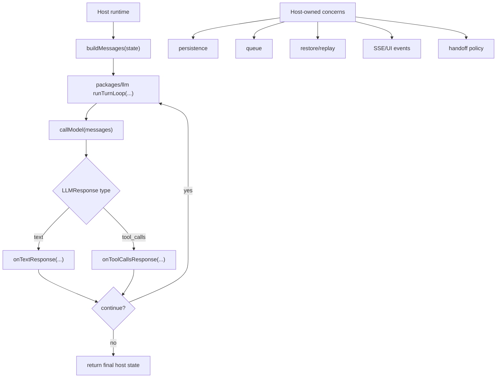

# Architecture Plan: LLM Package Host-Agnostic Turn Loop

**Date:** 2026-03-29  
**Related Requirement:** [req-llm-host-agnostic-turn-loop.md](/Users/esun/Documents/Projects/agent-world/.docs/reqs/2026/03/29/req-llm-host-agnostic-turn-loop.md)  
**Status:** Implemented

## Overview

Add a generic `runTurnLoop(...)` to `@agent-world/llm` as a host-agnostic, callback-driven loop engine, while restoring the repository boundary so `core/` does not consume the package as its runtime owner.

The key architectural decision is:

- `packages/llm` owns generic loop control
- hosts own persistence, queueing, replay, and side effects

For this repository, that means the package gains a reusable loop API, and `core/` is reverted to direct provider/runtime ownership rather than continuing to depend on `@agent-world/llm`.

## Architecture Decisions

### AD-1: Separate Generic Loop Control From Host Durability

The package loop should own only generic orchestration concerns:

- build next input
- call model
- classify response
- execute tool step through host callback
- decide continue vs stop
- enforce bounded retry rules

The package loop should not own:

- transcript persistence
- queue mutation
- restore/replay
- SSE or UI events
- Agent World-specific handoff semantics

Why:

- keeps the package reusable by non-Agent World hosts
- avoids forcing one durability model on all consumers
- preserves a clean app/runtime boundary

### AD-2: Callback-Driven API With Caller-Owned State

The loop API should carry generic host state rather than repository-specific runtime objects.

Recommended shape:

```ts
type TurnLoopControl =
  | { control: 'stop' }
  | { control: 'continue'; transientInstruction?: string };

interface RunTurnLoopOptions<TState, TMessage extends LLMChatMessage> {
  initialState: TState;
  emptyTextRetryLimit: number;
  buildMessages: (params: {
    state: TState;
    emptyTextRetryCount: number;
    transientInstruction?: string;
  }) => Promise<TMessage[]>;
  callModel?: (params: {
    messages: TMessage[];
    abortSignal?: AbortSignal;
  }) => Promise<LLMResponse>;
  onTextResponse: (params: {
    state: TState;
    responseText: string;
    response: LLMResponse;
  }) => Promise<{ state: TState; next?: TurnLoopControl }>;
  onToolCallsResponse: (params: {
    state: TState;
    response: LLMResponse;
  }) => Promise<{ state: TState; next?: TurnLoopControl }>;
  onUnhandledResponse?: ...
  parsePlainTextToolIntent?: ...
  abortSignal?: AbortSignal;
}
```

Notes:

- `state` belongs to the host
- `messages` and `LLMResponse` belong to the package
- the package can provide a default `callModel` backed by `generate(...)` or `stream(...)`

### AD-3: Reuse Package-Owned Message and Response Contracts

The new loop should use package-owned contracts from `packages/llm/src/types.ts`:

- `LLMChatMessage`
- `LLMResponse`
- `LLMToolCall`
- `LLMToolDefinition`

Why:

- avoids duplicating message/response shapes
- keeps the loop aligned with package `generate(...)` and `stream(...)`
- makes the loop naturally consumable by existing package users

### AD-4: Package Loop Should Compose Existing Per-Call APIs

`runTurnLoop(...)` should not replace:

- `generate(...)`
- `stream(...)`

Instead, it should layer on top of them.

Recommended behavior:

- hosts that need only one model hop keep using `generate(...)` or `stream(...)`
- hosts that need iterative tool looping opt into `runTurnLoop(...)`
- the loop may accept an optional `callModel` callback, with a package default that uses existing per-call APIs

### AD-5: Keep Tool Execution Policy Host-Owned

The package loop should not hardcode:

- one-tool-per-hop vs multi-tool-per-hop policy
- mutating-tool restrictions
- approval/HITL persistence
- handoff semantics such as `send_message`

Instead:

- the package loop reports a `tool_calls` response
- the host callback executes according to host policy
- the host callback returns next-state plus continue/stop instruction

This keeps the engine generic while still removing duplicated loop-control code.

### AD-6: Core Rollback Is A Boundary Correction, Not A Package Concern

The desired repository end state is for `core/` to stop consuming `@agent-world/llm`.

That means:

- restore `core` direct imports/ownership for provider/runtime integration
- keep `core` durable turn metadata and queue logic local
- do not redesign `core` around the package loop in this story

This rollback should be treated as repository-boundary work, not as a requirement for the generic package loop API itself.

### AD-7: Do Not Move Durable Agent World Semantics Into The Package

The following stay in `core/`:

- `agentTurn` metadata
- queue completion rules
- restore/replay rules
- persisted HITL/tool artifacts
- `send_message` terminal handoff semantics
- world/chat-scoped event routing

Why:

- these are app semantics, not generic LLM runtime semantics
- external hosts may not have analogous concepts

## Proposed Structure



## Package API Proposal

### Public Additions In `packages/llm`

- `runTurnLoop(...)`
- `TurnLoopControl` type
- `RunTurnLoopOptions<...>` type
- optional helper for plain-text tool-intent normalization if that remains useful across hosts

### Public Non-Changes

- keep `generate(...)`
- keep `stream(...)`
- keep `resolveTools(...)`
- keep `resolveToolsAsync(...)`

## Core Boundary Proposal

### Target Repository State

- `packages/llm` is publishable and host-agnostic
- `core` does not import `@agent-world/llm`
- `core` owns its own provider/runtime boundary again

### Migration Constraint

- do not redesign `core` to depend on the new package loop
- revert `core` to the pre-package-boundary state first or in parallel
- only after that, decide whether `core` should adopt the generic package loop through an explicit adapter in a separate story

## Implementation Plan

### Phase 1: Specify The Generic Loop API
- [x] Add package-owned loop control types to `packages/llm/src/types.ts` or a dedicated loop-types module.
- [x] Add `packages/llm/src/turn-loop.ts` with a host-agnostic `runTurnLoop(...)`.
- [x] Keep the implementation free of `core/` imports and Agent World types.
- [x] Use package-owned `LLMResponse` and tool-call contracts.

### Phase 2: Compose Existing Package Runtime
- [x] Implement package-default model invocation by composing existing `generate(...)` and `stream(...)` behavior.
- [x] Keep the loop compatible with current package provider, MCP, skill, and built-in tool surfaces.
- [x] Keep one-shot package APIs unchanged.

### Phase 3: Preserve Host Ownership Boundaries
- [x] Do not add persistence, queue, restore, or event-routing ownership to the package.
- [x] Keep tool execution policy callback-owned.
- [x] Keep handoff semantics out of package-owned generic behavior.

### Phase 4: Repository Boundary Reset
- [x] Revert `core/` to direct runtime/provider ownership instead of depending on `@agent-world/llm`.
- [x] Remove `core` package-boundary imports from `@agent-world/llm`.
- [x] Keep `core` durable turn metadata, queue logic, restore logic, and app-specific tools unchanged in ownership.
- [x] Do not adopt the new package loop into `core` in this story.

### Phase 5: Validation
- [x] Add `packages/llm` tests for generic loop text-stop behavior.
- [x] Add `packages/llm` tests for tool-call continuation behavior through callbacks.
- [x] Add `packages/llm` tests proving no world/agent/chat assumptions are required.
- [x] Add repository-level checks that `core` no longer imports `@agent-world/llm`.
- [x] Run `npm run check --workspace=packages/llm`.
- [x] Run targeted `packages/llm` vitest coverage.
- [x] Run `npm run check --workspace=core`.
- [x] Run `npm run integration`.

## Risks

### Risk 1: Package absorbs app semantics

If persistence or queue semantics leak into `runTurnLoop(...)`, the package will become Agent World-specific again.

Mitigation:

- keep lifecycle persistence in host callbacks only
- reject package-owned transcript/queue abstractions in this slice

### Risk 2: Core rollback and package loop get entangled

If the package-loop work is designed around current `core` integration, the package API will inherit local assumptions.

Mitigation:

- design the package API first from external-host needs
- treat `core` rollback as boundary cleanup, not as the package API contract

### Risk 3: Duplicated orchestration remains in core

If the package gets only a thin wrapper while `core` keeps all reusable control flow, the package will still not solve the external-host reuse problem.

Mitigation:

- move actual iterative control flow into the package
- leave only durability and app policy in hosts

## Architecture Review

### Review Outcome

No blocking architectural flaw remains in this proposed direction if the boundary is kept strict:

- package owns generic loop control
- host owns durability and app semantics
- `core` rollback is handled as repository-boundary cleanup, not pushed into package abstractions

### Key Tradeoff

This plan intentionally avoids making `core` the first-class consumer of the package loop. That is the right tradeoff for package reusability, but it also means short-term duplication may remain until a later story decides whether `core` should adopt the generic loop through an explicit adapter.

### Approval Gate

Proceed to implementation only if this boundary is accepted:

- `packages/llm` gets a generic callback-driven `runTurnLoop(...)`
- `core` is reverted away from package dependence
- no Agent World durability model is moved into the package

## Implementation Notes

- Delivered `packages/llm/src/turn-loop.ts` with a generic callback-driven loop and optional package-managed model invocation.
- Restored `core/llm-config.ts`, `core/mcp-server-registry.ts`, `core/package.json`, and `core/tsconfig.json` to a core-owned runtime boundary without `@agent-world/llm` coupling.
- Updated regression coverage for the new package loop and the rollback of the temporary core package override.
