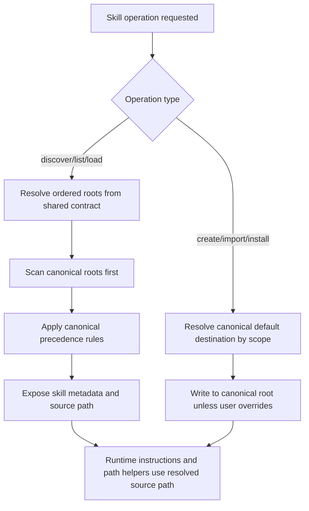

# Architecture Plan: Canonical Agent World Skill Roots

**Date:** 2026-04-11
**Related Requirement:** [req-canonical-skill-roots.md](../../../reqs/2026/04/11/req-canonical-skill-roots.md)
**Status:** Implemented

## Overview

Standardize Agent World on one canonical project skill root and one canonical global skill root and remove legacy compatibility paths.

This work touches four coupled surfaces:

- default skill-root discovery in `core`
- skill import/create/install destination selection in Electron IPC and skill-management flows
- skill-relative runtime path guidance in load-skill, shell-command, and file-tool flows
- docs and tests that currently teach or expect legacy roots

The implementation should change defaults and visible guidance first, keep legacy reads during transition, and preserve deterministic collision precedence.

## Architecture Decisions

### AD-1: Canonical roots become a shared contract

Introduce one shared skill-root contract used by all Agent World hosts and flows.

- Canonical global root: `~/.agent-world/skills`
- Canonical project root: `<project folder>/.agent-world/skills` (displayed as `./.agent-world/skills` relative to the active project)

The code should not leave root selection scattered across `core`, Electron IPC handlers, docs, and tests with hard-coded mixed path lists.

### AD-2: Treat `<project folder>/.agent-world/skills` as the actual project skill root

The canonical project root for this story is the real on-disk project directory `<project folder>/.agent-world/skills`.

The implementation should stop defaulting to `<project folder>/skills` and should write, discover, and present project skills under `<project folder>/.agent-world/skills`. Legacy `skills/` behavior should not remain part of the canonical contract.

### AD-3: Legacy roots are removed from defaults and fallback discovery

Legacy roots are no longer part of this story's supported runtime contract:

Only the canonical roots participate in discovery and default write behavior.

Legacy roots may be handled manually outside this story, but Agent World no longer reads them automatically.

### AD-4: Canonical precedence is explicit

Collision precedence should become:

1. canonical project root
2. canonical global root

This preserves existing project-over-global intent without keeping compatibility ordering branches.

### AD-5: Root-building logic should be centralized

Default roots, user-visible root labels, and legacy compatibility roots should be built from a single helper or module instead of repeated arrays and string-prefix checks.

That helper should own:

- canonical roots for each scope
- ordered precedence lists
- display labels used in docs or runtime instruction surfaces

### AD-6: Runtime instruction surfaces must consume the same root contract

`load_skill`, `shell-cmd`, file-tool skill-path fallbacks, and skill import flows must continue to work for canonical roots.

No runtime flow should assume any non-canonical project prefix once canonical global/project roots become the advertised defaults.

## Components and Responsibilities

- `core/skill-registry.ts`
  - Canonical default global/project root selection
  - Ordered discovery precedence across canonical roots
  - Source-scope metadata and collision behavior
- `core/shell-cmd-tool.ts`
  - Skill-relative path prefix support and runtime skill-root resolution
  - Trusted-root handling for canonical and legacy skill roots
- `core/file-tools.ts`
  - Read/list/grep fallbacks and lexical alias handling for skill-root paths
- `electron/main-process/ipc-handlers.ts`
  - Default project/global destination selection for import/install flows
  - GitHub repo candidate search order for skill folders
- `README.md` and related docs under `.docs/` and `docs/`
  - Canonical path wording, examples, and migration guidance
- targeted tests in `tests/core/*` and `tests/electron/*`
  - Regression coverage for precedence, discovery, and import behavior

## Data Flow

## Implementation Phases

### Phase 1: Root Contract Extraction
- [x] Add one shared helper/module that defines canonical skill roots plus precedence order.
- [x] Replace ad hoc root arrays in `core/skill-registry.ts` with the shared contract.
- [x] Preserve world-variable-aware project root derivation where applicable, but route resulting root selection through the new shared contract.
- [x] Document the canonical on-disk dot-directory roots and remove the old project-folder `skills/` default.

### Phase 2: Discovery and Precedence Alignment
- [x] Make canonical global/project roots the primary defaults for discovery.
- [x] Remove legacy roots from default discovery.
- [x] Keep collision behavior scoped to canonical project-vs-global precedence.
- [x] Preserve project-over-global precedence after canonical-vs-legacy ordering is applied.

### Phase 3: Write-Path and Import Alignment
- [x] Update Electron skill import/install/create flows to target canonical roots by default.
- [x] Reorder GitHub import candidate paths so canonical project paths are tried before legacy paths.
- [x] Ensure scope-selection UI and backend handlers refer to canonical roots in visible messages or metadata.

### Phase 4: Runtime Path Surface Alignment
- [x] Update skill-relative path helpers in `core/shell-cmd-tool.ts` to recognize canonical skill-root shapes alongside legacy aliases.
- [x] Update file-tool skill-path fallback logic to remain compatible with canonical and legacy source paths.
- [x] Verify `load_skill` and downstream runtime guidance emit coherent skill-root instructions regardless of where the skill was discovered.

### Phase 5: Documentation and Migration Guidance
- [x] Update `README.md` to present `<project folder>/.agent-world/skills` and `~/.agent-world/skills` as the standard roots.
- [x] Update requirement, done-doc, and contract references that still teach `.agents/skills`, `~/.agents/skills`, or `~/.codex/skills` as primary defaults.
- [x] Add concise migration guidance explaining that only canonical roots are supported after this change.

### Phase 6: Test Coverage and Validation
- [x] Update targeted unit tests for root discovery defaults and precedence in `tests/core/skill-registry.test.ts`.
- [x] Update shell/file-tool tests to cover canonical skill-root path resolution.
- [x] Update Electron import tests for canonical-first candidate ordering and canonical default destinations.
- [x] Run targeted tests first, then run `npm test` once implementation is complete.

## Risks and Mitigations

| Risk | Impact | Mitigation |
|---|---|---|
| Existing project skills may still live under legacy locations | Legacy project skills can appear to disappear after the root change | Update fixtures, install flows, and docs to use the canonical dot-prefixed root only |
| Different subsystems keep separate root arrays | Docs and runtime behavior drift again | Centralize root construction and import that helper everywhere |
| Canonical precedence changes break current project-over-global override semantics | Behavior regression for duplicate skill IDs | Encode ordered precedence explicitly and cover it with unit tests |
| Runtime helpers only recognize old prefixes like `.agents/skills/` | Script execution and artifact handling break for canonical roots | Update prefix/path handling tests and helper logic together |

## Open Questions

1. Is a dedicated migration helper needed, or is documentation-only migration acceptable?

## Exit Criteria

- [x] Canonical roots are the default answer in code, docs, and user-facing flows.
- [x] Legacy roots are removed from supported discovery and write paths.
- [x] Import/create/install flows default to canonical destinations.
- [x] Runtime skill-path instructions remain coherent for canonical and legacy source paths.
- [x] Targeted tests cover canonical precedence and compatibility behavior.

## Architecture Review (AR)

**Review Date:** 2026-04-11
**Reviewer:** AI Assistant
**Status:** Approved for implementation after user approval

### Findings

- The main architectural change is that the canonical roots are real on-disk defaults: `<project folder>/.agent-world/skills` and `~/.agent-world/skills`.
- The implementation must stop defaulting project installs and discovery to the bare workspace `skills/` directory.
- The codebase already has multiple hard-coded root arrays and prefix checks. Implementing this story without centralizing those definitions would likely reintroduce drift.

### AR Decision

Proceed with a shared canonical-root contract, canonical-only defaults, and dot-prefixed on-disk project/global roots.

### Approval Gate

Stop here for approval before `SS`. This plan assumes runtime storage itself moves to `<project folder>/.agent-world/skills` and `~/.agent-world/skills` as the canonical defaults.
