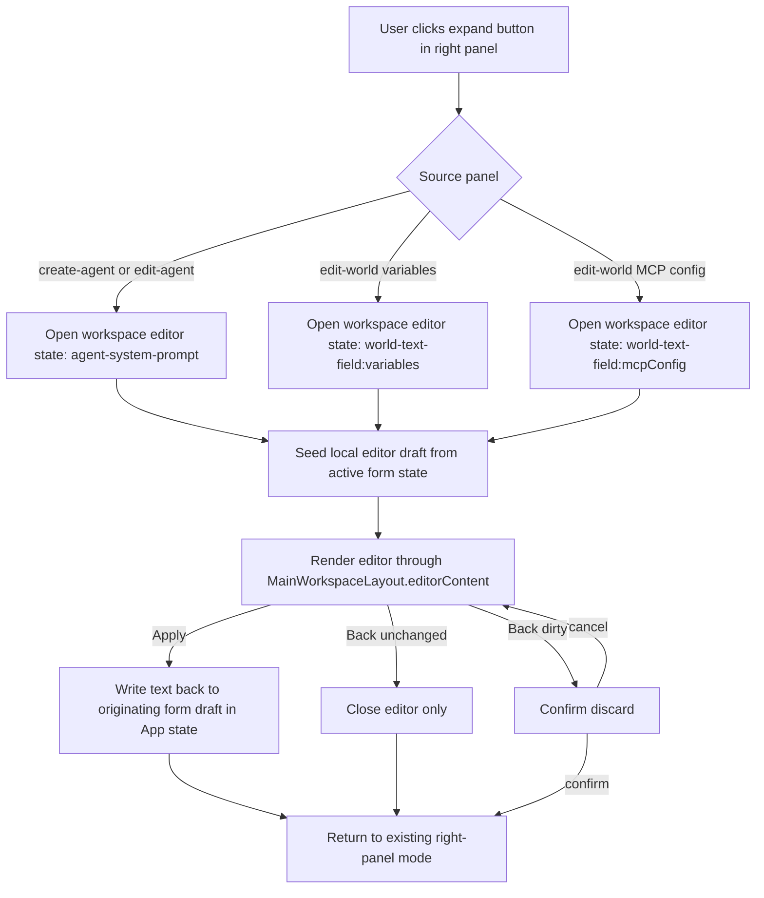

# Architecture Plan: Electron Agent and World Full-Area Editors

**Date:** 2026-04-11
**Related Requirement:** [req-electron-agent-world-editors.md](../../../reqs/2026/04/11/req-electron-agent-world-editors.md)
**Status:** Implemented

## Overview

Replace the current renderer popup editors for agent system prompts and world config text with workspace-level editor surfaces that use the same full-area routing model as the existing skill editor.

The current implementation splits long-text editing across two modal-only paths:

- agent system prompt editing via `PromptEditorModal`
- world `variables` / `mcpConfig` editing via `WorldConfigEditorModal`

The renderer already has one proven full-area editor seam: `MainWorkspaceLayout.editorContent`, currently driven by skill-editor state in `App.tsx`. The clean extension is to generalize that seam into a discriminated workspace-editor route while preserving the existing right-panel draft forms and final save ownership.

## Architecture Decisions

### AD-1: Keep panel state and workspace-editor state separate

Do not overload `panelMode` to represent prompt/config editor submodes.

Instead, introduce a dedicated discriminated workspace-editor state in `App.tsx`, for example:

- `none`
- `skill-edit`
- `skill-install`
- `agent-system-prompt`
- `world-text-field`

This keeps the right-panel mode unchanged (`create-agent`, `edit-agent`, `edit-world`, etc.) while the main workspace temporarily renders editor content. The result is simpler back-navigation and zero disruption to existing panel-mode logic.

### AD-2: Preserve draft ownership in `App.tsx`

Agent/world form drafts should remain owned by existing app state:

- `creatingAgent`
- `editingAgent`
- `editingWorld`

The new editor surfaces should open with a local working copy derived from the active draft, then write back only on explicit Apply/Save.

This preserves current final persistence boundaries:

- agent persistence still happens through existing create/update agent actions
- world persistence still happens through existing create/update world actions

### AD-3: Reuse `BaseEditor` as the shared workspace chassis

Do not create a new modal-like pattern or duplicate the skill editor shell.

Instead, compose new business-specific editor surfaces on top of the existing `BaseEditor` pattern so they inherit:

- full-area workspace layout
- toolbar placement
- optional right-pane support
- collapsed-sidebar traffic-light spacing behavior

This keeps the design-system boundary intact while avoiding unnecessary abstraction churn.

### AD-4: Add feature-owned editors, not new transitional `components/` UI

New UI should not be added to `electron/renderer/src/components/`, which is explicitly transitional.

Create feature-owned components for the new surfaces, for example:

- `electron/renderer/src/features/agents/components/AgentPromptEditor.tsx`
- `electron/renderer/src/features/worlds/components/WorldTextEditor.tsx`

If import ergonomics matter, add feature barrels. Otherwise keep the export surface minimal.

### AD-5: Use one world editor component with field mode

World long-text editing should use a single `WorldTextEditor` component with a field discriminator, not two separate sibling editors.

That component should vary:

- title
- placeholder/help text
- monospace presentation
- apply target (`variables` vs `mcpConfig`)

This avoids duplicating nearly identical editor structure while keeping the field semantics explicit.

### AD-6: Back navigation should protect unapplied editor changes

Unlike the current skill editor, agent/world editors are editing ephemeral form drafts rather than file-backed content. Silent back-navigation that drops local editor changes would be easy to trigger accidentally.

The plan should therefore use:

- explicit Apply/Save to write into the originating form draft
- Back/Close that discards local editor state
- discard confirmation only when the local editor draft differs from the source form draft

This protects user work without changing the originating form until the user explicitly applies edits.

### AD-7: Remove modal editor plumbing after replacement

Once full-area editors handle these flows, remove the old popup-specific wiring:

- modal state in `App.tsx` for prompt/world text editing
- `EditorModalsHost`
- `PromptEditorModal`
- `WorldConfigEditorModal`
- related prop-builder inputs that only supported those modal paths

Keep `AppOverlaysHost` only if it still serves another top-level overlay purpose. Otherwise collapse that seam as part of cleanup.

## Target Components and Responsibilities

- `electron/renderer/src/App.tsx`
  - own the discriminated workspace-editor state
  - seed editor local draft state from the active agent/world draft
  - apply editor output back into `creatingAgent`, `editingAgent`, or `editingWorld`
  - route `MainWorkspaceLayout.editorContent` to skill, agent, or world editors
- `electron/renderer/src/components/AgentFormFields.tsx`
  - keep the existing expand affordance
  - switch its expand callback to the new workspace editor open action
- `electron/renderer/src/components/RightPanelContent.tsx`
  - replace world-config modal setters with world-editor open actions
  - preserve edit-world-only visibility for Variables and MCP rows
- `electron/renderer/src/utils/app-layout-props.ts`
  - simplify/remove modal-oriented prop wiring
  - wire new editor-open callbacks into right-panel content props
- `electron/renderer/src/features/agents/components/AgentPromptEditor.tsx`
  - render system-prompt editing surface on `BaseEditor`
  - expose back/apply callbacks and dirty-state handling
- `electron/renderer/src/features/worlds/components/WorldTextEditor.tsx`
  - render Variables/MCP editing surface on `BaseEditor`
  - adjust label/text presentation by field mode
- `electron/renderer/src/app/shell/components/MainWorkspaceLayout.tsx`
  - likely unchanged structurally; verify that editor routing stays generic for all editor surfaces
- overlay cleanup files
  - `electron/renderer/src/components/EditorModalsHost.tsx`
  - `electron/renderer/src/components/PromptEditorModal.tsx`
  - `electron/renderer/src/components/WorldConfigEditorModal.tsx`
  - `electron/renderer/src/app/shell/components/AppOverlaysHost.tsx`

## Editor Flow

## Implementation Phases

### Phase 1: Replace skill-only editor routing with a generic workspace-editor state
- [x] Replace the current skill-specific `editorMode` approach in `App.tsx` with a discriminated workspace-editor state that can represent skill, agent, and world editor surfaces.
- [x] Keep `panelMode` unchanged while an editor is open so the originating right-panel state remains authoritative.
- [x] Introduce local editor draft state for agent/world text that is seeded on open and reset on close.
- [x] Keep existing skill editor behavior working through the new generic route.

### Phase 2: Build feature-owned editor surfaces
- [x] Create `AgentPromptEditor` as a feature-owned renderer component that composes `BaseEditor`.
- [x] Create `WorldTextEditor` as a feature-owned renderer component that composes `BaseEditor` and switches behavior by field mode.
- [x] Reuse the same toolbar idioms as the skill editor where they improve consistency, but keep business labels explicit.
- [x] Reserve sidebar-collapse spacing via the same `BaseEditor` contract used by `SkillEditor`.

### Phase 3: Rewire right-panel entry points
- [x] Update `AgentFormFields` so the existing expand button opens the new agent workspace editor.
- [x] Update `RightPanelContent` so Variables and MCP rows open the new world workspace editor instead of staging modal state.
- [x] Remove modal-only prop requirements from `createMainContentRightPanelContentProps` and downstream call sites.
- [x] Preserve current create/edit visibility rules, especially that Variables/MCP remain edit-world-only unless a separate story expands create-world scope.

### Phase 4: Apply/back/discard semantics
- [x] Implement explicit Apply for agent/world editor surfaces that writes the local editor draft back into the active form draft.
- [x] Implement Back that closes immediately when unchanged.
- [x] Implement dirty-back discard confirmation for changed local drafts.
- [x] Preserve the existing final validation boundary so world JSON validation still happens at the world save action, not earlier during editor apply.

### Phase 5: Remove replaced modal infrastructure
- [x] Remove prompt/world-config modal state from `App.tsx`.
- [x] Remove `EditorModalsHost`, `PromptEditorModal`, and `WorldConfigEditorModal` if they are no longer referenced.
- [x] Simplify `AppOverlaysHost` or remove its editor-modal responsibility if no longer needed.
- [x] Remove dead prop wiring and transitional exports tied only to the replaced popup flows.

### Phase 6: Test coverage and validation
- [ ] Add targeted renderer component tests for `AgentPromptEditor` covering title/context, apply callback, and dirty-back discard behavior.
- [ ] Add targeted renderer component tests for `WorldTextEditor` covering field-mode labeling, apply target, and dirty-back discard behavior.
- [x] Update `tests/electron/renderer/agent-form-fields.test.ts` to confirm the expand button still routes through the provided callback contract.
- [x] Update `tests/electron/renderer/right-panel-content.test.ts` to assert world Variables/MCP expand actions call the new workspace-editor open callbacks rather than modal setters.
- [ ] Add or update a targeted App/renderer orchestration test only if needed to cover discriminated editor routing that is not practical to validate at component boundaries.
- [ ] Run targeted renderer tests first, then run `npm test` after implementation.

### Phase 6 Notes

- Added targeted renderer component tests for `AgentPromptEditor` and `WorldTextEditor` covering render context and Back/Apply callback wiring.
- Did not add direct `window.confirm` discard-path coverage in `App.tsx`; that remains a follow-up gap.
- Ran focused renderer tests for the new editor surfaces and related entry-point tests.
- Ran `npm run check`, `npm run deps:check:electron-runtime`, and `npm run version:check:electron` successfully.

## Risks and Mitigations

| Risk | Impact | Mitigation |
|---|---|---|
| Editor routing is added by mutating `panelMode` instead of separating concerns | brittle navigation, panel regressions, harder future editors | keep a dedicated workspace-editor state independent from right-panel mode |
| Agent/world editors duplicate the skill editor shell instead of reusing `BaseEditor` | UI drift and maintenance duplication | treat `BaseEditor` as the shared full-area editor chassis |
| Applying editor text directly persists to backend | breaks current save semantics and increases side effects | keep App form drafts as the only apply target; final persistence remains with existing panel save actions |
| Back navigation silently drops editor-local changes | user loses text unexpectedly | add dirty-state discard confirmation only when local draft differs from source draft |
| New UI is added to transitional `components/` | layering debt grows | place new editors under feature ownership and only keep transitional files for compatibility cleanup |
| World editor introduces earlier JSON validation | behavior drift from current world save flow | preserve validation at existing final save boundary |

## Open Questions

1. Should the dirty-back confirmation text be shared between agent/world editors, or can each editor own a tailored message while using the same behavior?
2. If `AppOverlaysHost` becomes empty after this story, should it be removed immediately or kept as an intentional future overlay seam?
3. Do we want a follow-up story to migrate the skill editor onto the same local-draft/discard-confirm contract for consistency, or should that remain intentionally separate because it is file-backed?

## Exit Criteria

- [x] Agent system prompt editing opens in a full-area workspace editor rather than a popup modal.
- [x] World Variables editing opens in a full-area workspace editor rather than a popup modal.
- [x] World MCP Config editing opens in a full-area workspace editor rather than a popup modal.
- [x] Editor apply writes back only to the originating form draft.
- [x] Back-navigation preserves the originating panel state and protects dirty editor drafts from accidental loss.
- [x] Old prompt/world-config modal plumbing is removed or fully unused.
- [x] Targeted renderer tests cover the new editor components and updated entry points.

## Architecture Review (AR)

**Review Date:** 2026-04-11  
**Reviewer:** AI Assistant  
**Status:** Approved for implementation after user approval

### Findings

- The existing renderer already solved the hardest layout problem through `MainWorkspaceLayout.editorContent`; introducing a second full-area routing mechanism would be unnecessary duplication.
- The main architectural risk is coupling editor navigation to `panelMode`. That would complicate close-panel logic, dirty-state checks, and header/right-panel behavior. A separate workspace-editor discriminator avoids that.
- Because agent/world editors are draft-oriented rather than file-oriented, copying the skill editor's no-confirm back behavior would create a user-data-loss footgun. Dirty-discard confirmation is warranted here.
- There is no value in preserving the prompt/world modal host after replacement unless another overlay depends on it. Keeping dead modal seams would only fossilize transitional plumbing.

### AR Decision

Proceed with a single generalized workspace-editor route in `App.tsx`, two feature-owned editor surfaces on `BaseEditor`, explicit draft-apply semantics, and cleanup of the obsolete modal infrastructure.

### Approval Gate

Stop here for approval before `SS`. If you want a different discard behavior, such as auto-applying on back or never prompting on dirty close, that should be changed now because it affects both component API design and test coverage.