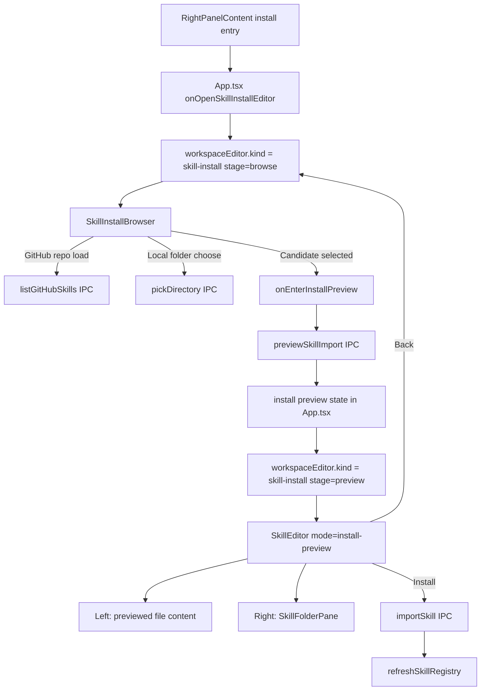

# AP: Electron Skill Install Search and Preview Flow

**Date:** 2026-04-11  
**REQ:** [../../../reqs/2026/04/11/req-electron-skill-install-search-preview.md](../../../reqs/2026/04/11/req-electron-skill-install-search-preview.md)

---

## Architecture Overview

---

## Architecture Decision

### Chosen approach: two-stage install workspace with SkillEditor reused for preview only

- Keep install as one workspace editor flow, but split it into two explicit stages:
  - `browse` for source/search/display
  - `preview` for file inspection and install confirmation
- Reuse `SkillEditor` for the preview stage instead of keeping search controls inside its toolbar.
- Add a new feature-owned browser surface for the first stage rather than forcing `SkillEditor` to own discovery, listing, and preview at the same time.

### Why this approach

- It matches the requirement directly: search/display first, preview second.
- It preserves the existing preview strengths already implemented in `SkillEditor`: file rendering, markdown preview, file tree, and install-preview draft overlay behavior.
- It removes the current mixed-responsibility `install` toolbar branch, which currently combines source selection, candidate selection, preview state, scope selection, and install action in one dense toolbar layout.
- It avoids inventing a second preview editor shell and keeps renderer design-system usage aligned with the existing editor surface.

### Rejected option: keep extending the current `SkillEditor mode='install'`

- Rejected because the current install branch is already overloaded and toolbar-centric.
- Pushing search/display into the same component would preserve the coupling between discovery and preview and make the preview-back requirement awkward.
- It would also keep install-first mental framing instead of browse-first mental framing.

---

## Phase 1: State Model in App.tsx

### 1.1 Workspace editor state

- [x] Replace the install editor's implicit single-screen behavior with an explicit staged state.
- [x] Update `WorkspaceEditorState` so install mode can represent:
  - `kind: 'skill-install', stage: 'browse'`
  - `kind: 'skill-install', stage: 'preview'`
- [x] Keep `skill-edit` as a separate route so installed-skill editing remains unaffected.

### 1.2 Preserve and split install state ownership

- [x] Keep existing install source state in `App.tsx`:
  - `installSkillSourceType`
  - `installSkillSourcePath`
  - `installSkillRepo`
  - `installSkillItemName`
  - `installGitHubSkillOptions`
  - `installSkillTargetScope`
- [x] Keep existing preview state in `App.tsx`:
  - `editingSkillFilePath`
  - `editingSkillContent`
  - `savedSkillContent`
  - `editingSkillFolderEntries`
  - `installSkillPreviewFiles`
  - `installSkillDraftFiles`
- [x] Introduce a stricter conceptual split between:
  - browse/search state, which must survive preview back-navigation
  - preview/file state, which can be reset when choosing a different candidate or leaving install mode entirely

### 1.3 Reset helpers

- [x] Split the current broad install reset behavior into two helpers:
  - `resetInstallBrowseState()` only for full exit or source hard-reset
  - `resetInstallPreviewState()` only for preview/file state
- [x] Ensure preview-back does not call the full close/reset path.

---

## Phase 2: Browse/Search Surface

### 2.1 New feature-owned component

- [x] Add a new feature component, tentatively `SkillInstallBrowser`, under `electron/renderer/src/features/skills/components/`.
- [x] This component owns the first-stage main-area install UI.
- [x] It must render inside the workspace editor area rather than the toolbar.

### 2.2 Browse-stage responsibilities

- [x] Render source selection (`GitHub` vs `Local`) inside the main content area.
- [x] For GitHub:
  - [x] show repo input and repo-load action
  - [x] show discovered skills in a list/grid/searchable result view
  - [x] allow selecting one skill to enter preview
- [x] For Local:
  - [x] show folder-path selection inside the main-area surface
  - [x] show the chosen folder as the candidate to preview/install
  - [x] allow entering preview from that candidate without pretending local mode has a remote-style multi-result catalog
- [x] Show install scope selection in the main area, not the toolbar.

### 2.3 Search/display interaction model

- [x] Search/display is the default stage when the install editor opens.
- [x] GitHub skill loading must populate browse results without automatically switching into preview.
- [x] Selecting a result must be the explicit transition into preview.
- [x] The component should make the current repo/folder context obvious so users understand what catalog they are browsing.

---

## Phase 3: Preview Stage Reuse

### 3.1 Reuse `SkillEditor` for preview

- [x] Refactor `SkillEditor` so install preview becomes a preview-focused mode, tentatively `install-preview`.
- [x] Remove search/discovery controls from `SkillEditor`.
- [x] Keep in `SkillEditor` only the concerns that are shared with preview:
  - [x] file-content rendering
  - [x] markdown preview handling
  - [x] file-tree pane via `SkillFolderPane`
  - [x] disabled-state handling for non-editable preview files
  - [x] install action row and scope display, if those remain in preview

### 3.2 Preview back behavior

- [x] In preview mode, the `Back` action must transition from install preview back to install browse.
- [x] Do not close the workspace editor on preview back.
- [x] Keep `onCloseSkillEditor()` for leaving the install flow entirely.

### 3.3 Preview state population

- [x] Add a focused `onEnterInstallPreview(...)` handler in `App.tsx`.
- [x] That handler should:
  - [x] call `previewSkillImport`
  - [x] populate folder entries, preview files, selected file, initial content, and description
  - [x] set `workspaceEditor.stage = 'preview'` only after preview data is ready
- [x] Preserve the existing preview-file switching behavior and draft overlay behavior already used in install mode.

---

## Phase 4: Handler Changes in App.tsx

### 4.1 Open / close / back transitions

- [x] `onOpenSkillInstallEditor()` should enter `stage: 'browse'`.
- [x] Add `onBackFromInstallPreview()` that returns to `stage: 'browse'` while preserving browse state.
- [x] Keep a separate full-exit handler that clears install state and returns to normal workspace content.

### 4.2 Remove auto-preview coupling

- [x] Stop using `onChangeInstallSkillItemName()` as an implicit preview trigger for GitHub mode.
- [x] `onLoadInstallGitHubSkills()` should load results and set selection state, but must not force preview as a side effect.
- [x] Preview entry should happen only from explicit user selection in the browse stage.

### 4.3 File selection and draft behavior

- [x] Keep the existing install-preview file switching behavior in `onSelectSkillFile()`.
- [x] Keep `mergeSkillInstallDraftFiles(...)` behavior so edited preview files overlay only the changed files at install time.
- [x] Keep `currentFileEditable` checks unchanged unless the implementation reveals a preview-specific bug.

### 4.4 Install action behavior

- [x] Keep `onInstallSkillContent()` as the final explicit action.
- [x] Preserve existing `importSkill(...)` payload semantics.
- [x] Preserve success behavior: refresh registry best-effort, then close install editor.

---

## Phase 5: Renderer Component Ownership and Placement

### 5.1 Feature ownership

- [x] Keep new install browse UI under `features/skills`.
- [x] Do not move install-specific business UI into `design-system/`.
- [x] Reuse existing primitives/patterns where appropriate for cards, inputs, radios, buttons, and empty states.

### 5.2 Avoid transitional component leakage

- [x] Do not place the new browse/search UI in `components/`.
- [x] Keep `App.tsx` responsible for state and IPC orchestration only.
- [x] Keep `SkillInstallBrowser` and `SkillEditor` presentational/controlled via props.

---

## Phase 6: Tests

### 6.1 Renderer component tests

- [x] Add targeted tests for the new browse/search surface:
  - [x] renders GitHub and Local source controls in the main area
  - [x] renders result/candidate selection affordances
  - [x] preserves scope controls outside the toolbar
- [x] Update `tests/electron/renderer/skill-editor.test.ts` for preview-only install mode expectations.

### 6.2 App-level flow tests

- [ ] Add targeted tests around the install state machine in `App.tsx` or extracted helpers:
  - [ ] open install editor lands on browse stage
  - [ ] selecting a candidate enters preview stage
  - [ ] preview back returns to browse without clearing browse state
- [ ] Add a regression test that GitHub skill selection no longer auto-enters preview during browse-stage input changes.

### 6.3 Existing contract tests

- [x] Preserve current IPC handler tests for `previewSkillImport` and `importSkill`.
- [x] Add tests only if the plan introduces helper extraction or changed payload shaping.

---

## Risks and Mitigations

| Risk | Impact | Mitigation |
|------|--------|------------|
| Browse and preview state stay coupled through one reset helper | Preview back accidentally clears repo/folder/results | split browse reset and preview reset into separate helpers |
| Current GitHub selection code still auto-previews | Search stage collapses into preview unexpectedly | remove preview side effect from item-name change and result loading |
| Reusing `SkillEditor` without pruning its install toolbar branch preserves old UX clutter | Requirement is only half-met | shrink `SkillEditor` to preview concerns only and move discovery into `SkillInstallBrowser` |
| Local source does not naturally fit a search-results list | UX inconsistency or over-engineered fake list | treat local mode as candidate-card selection rather than force a remote-style result list |
| Preview back accidentally uses the full close handler | User exits install flow instead of returning to browse | add explicit preview-back handler and test it |

---

## Architecture Review (AR)

### Review outcome

No major architectural blockers remain after choosing the two-stage wrapper approach.

### Key findings addressed in this plan

1. The current install flow couples discovery and preview too tightly.
   Resolution: separate browse and preview stages in workspace editor state and remove auto-preview side effects.

2. The current `SkillEditor mode='install'` has mixed responsibilities.
   Resolution: reuse `SkillEditor` for preview only and move discovery/search into a dedicated feature component.

3. Preview back-navigation could easily regress into a full close because the current editor only knows how to leave the workspace editor.
   Resolution: add a dedicated preview-back transition that returns to browse stage while preserving browse state.

### Tradeoffs

- Reusing `SkillEditor` for preview reduces duplication, but requires refactoring its current install branch rather than dropping in a brand-new screen.
- A separate browse component adds one more feature surface, but it keeps search/display logic out of the file-preview shell and makes the user flow easier to reason about.
- Local-source browse UX will be intentionally simpler than GitHub browse UX; that asymmetry is acceptable because the source models are inherently different.

### Contract assumption

- This plan assumes the browse/preview redesign can stay renderer-only and continue using existing `listGitHubSkills`, `previewSkillImport`, `pickDirectory`, and `importSkill` contracts.
- If implementation reveals a real gap for local-source metadata display, that should be handled as a small follow-up plan change rather than widening backend scope by default.

---

## File Changelist

| File | Change |
|------|--------|
| `electron/renderer/src/App.tsx` | Split install editor into browse/preview stages, adjust handlers, preserve browse state on preview back |
| `electron/renderer/src/features/skills/components/SkillEditor.tsx` | Refactor install branch into preview-only install mode |
| `electron/renderer/src/features/skills/components/SkillFolderPane.tsx` | No behavioral change expected beyond preview-mode wiring validation |
| `electron/renderer/src/features/skills/components/SkillInstallBrowser.tsx` | New browse/search surface for install discovery |
| `electron/renderer/src/features/skills/components/index.ts` | Export the new install browser component |
| `tests/electron/renderer/skill-editor.test.ts` | Update install-mode expectations to match preview-only role |
| `tests/electron/renderer/*skill-install*` | Add targeted browse/preview state and UI coverage |

---

## Approval Gate

- [ ] Approve the two-stage install architecture (`browse` -> `preview`).
- [ ] Approve reusing `SkillEditor` for preview only instead of for both discovery and preview.
- [ ] Approve the simpler local-source browse model (candidate card / preview entry) rather than forcing a fake multi-result list.