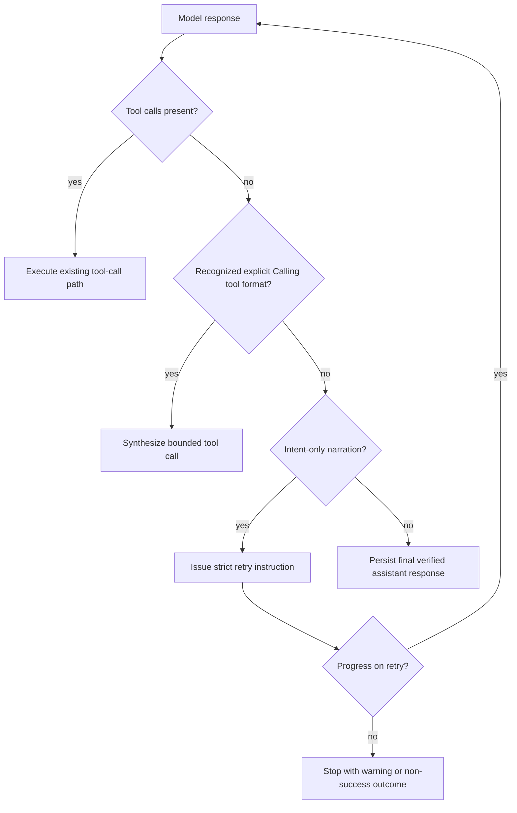

# Architecture Plan: LLM Action Execution Hardening

**Date**: 2026-04-12
**Type**: Bug Fix / Runtime Reliability
**Status**: Implemented
**Related Requirement**: [req-llm-action-execution-hardening.md](../../../reqs/2026/04/12/req-llm-action-execution-hardening.md)

## Overview

Harden the agent turn loop so weaker tool-using models cannot complete a turn merely by narrating an intended action.

The change should stay narrow:

- keep provider adapters pure
- keep the existing explicit `Calling tool:` fallback bounded
- make runtime validation authoritative
- avoid inventing tool args or side effects from prose

The implementation should first classify and reject intent-only narration in the runtime, then tighten tool-usage guidance, then add focused regression coverage for both direct and continuation paths.

## Current-State Findings

1. `core/events/agent-turn-loop.ts` treats any non-empty text as a valid response branch once plain-text tool-intent normalization has had one chance to fire.
2. `core/events/orchestrator.ts` persists direct-turn text as a terminal `final_response` unless it is empty or matches the narrow plain-text tool-intent fallback.
3. `core/events/memory-manager.ts` does the same for post-tool continuation text.
4. `core/utils.ts` includes tool-usage guidance, but it is advisory and does not explicitly forbid future-tense action narration.
5. Provider adapters send tool definitions but do not add turn-level forcing or validation that would prevent weak models from responding with narrated intent.

## Target Architecture

### AD-1: Add One Shared Intent-Only Response Classifier

- Introduce one shared runtime helper for classifying assistant text in tool-capable turns.
- The classifier should distinguish:
  - real final response
  - recognized explicit plain-text tool intent
  - empty/non-progressing response
  - intent-only narration
- The helper should be used in both direct and continuation paths so the rule is identical.

### AD-2: Reject Intent-Only Narration As Completion

- When the classifier flags intent-only narration and there is no accompanying tool call or verified result, the runtime must not persist terminal assistant completion metadata.
- The runtime should prefer one bounded corrective retry with a strict transient instruction.
- If the model still does not make progress, stop with a non-success warning/system outcome rather than inventing execution.

### AD-2.5: Treat Parameter Failures As Validation-Recovery, Not Success

- Wrong or missing tool parameters should stay on the tool-error path as `validation_error`.
- The runtime should preserve the current safe normalization layer for deterministic fixes:
  - aliases
  - type coercions
  - known provider-specific argument-shape bugs
- The runtime should not guess missing semantic values such as file paths, URLs, agent targets, questions, or message bodies.
- After a validation failure, continuation should be allowed one bounded self-correction opportunity using the durable tool error artifact already persisted in the transcript.
- Repeated validation failures for the same attempted action should terminate with an explicit recovery message or HITL path instead of continuing indefinitely.

### AD-3: Keep Plain-Text Tool Fallback Narrow

- Preserve the existing explicit `Calling tool: ...` fallback path.
- Do not broaden fallback into fuzzy action-to-tool inference.
- Rationale:
  - avoids unsafe guesswork
  - keeps behavior deterministic
  - limits false positives for mutating tools

### AD-4: Tighten Tool Guidance, But Do Not Trust It

- Update `buildToolUsagePromptSection()` so the model is explicitly told:
  - do not say you will use a tool
  - call the tool now when action is required
  - only report verified results
- Prompting reduces incidence, but runtime classification remains the authority.

### AD-5: Keep Provider Policy Minimal In This Slice

- Do not redesign provider request contracts in this bug-fix slice.
- If a provider/model-specific hook is needed, it should remain additive and narrow.
- The primary reliability fix should live in runtime classification and terminality handling, not in optimistic provider forcing.

## Proposed Flow

## Implementation Phases

### Phase 1: Shared Runtime Classification

- [x] Add a shared helper to classify assistant text in tool-capable turns.
- [x] Keep classification deterministic and string/shape based; do not guess tool args from prose.
- [x] Ensure direct and continuation paths call the same helper before terminal text persistence.
- [x] Keep tool validation failures out of the terminal-success path.

### Phase 2: Direct-Turn Hardening

- [x] Update `core/events/orchestrator.ts` so intent-only narration does not immediately flow into terminal `handleTextResponse(...)`.
- [x] Add one bounded corrective retry path with a transient instruction telling the model to either emit the tool call now or provide verified results.
- [x] If no progress occurs after the retry budget, stop without terminal success metadata and publish an explicit warning/error artifact.
- [x] Ensure direct-turn validation failures caused by wrong/missing tool parameters feed a corrective continuation path rather than being interpreted as completed work.

### Phase 3: Continuation Hardening

- [x] Update `core/events/memory-manager.ts` so continuation text is subject to the same intent-only guard before terminal completion.
- [x] Reuse the same bounded corrective retry approach.
- [x] Preserve existing empty-text, invalid-tool-call, and hop-guardrail semantics.
- [x] Add a bounded repeated-validation-failure guard so the same attempted action cannot self-correct forever.

### Phase 4: Validation-Error Recovery Policy

- [x] Reuse the existing safe normalization and schema-validation boundary instead of adding a second argument-repair layer.
- [x] Keep deterministic repairs only:
  - alias normalization
  - unambiguous scalar/array and string/number coercions
  - known provider bug translation
- [x] Do not add guessing for missing semantic values.
- [x] Ensure durable validation errors are clear enough for the model to self-correct on the next hop.

### Phase 5: Prompt Guidance Tightening

- [x] Update `core/utils.ts` tool-usage guidance to explicitly forbid future-tense action narration.
- [x] Instruct the model to either call the tool now or report verified results from already executed tools.
- [x] Instruct the model that if a tool call fails validation, it must emit a corrected tool call instead of narrating intent.
- [x] Keep the guidance generic so it applies across providers without coupling to one adapter.

### Phase 6: Regression Tests

- [x] Add a targeted direct-turn regression test proving `"I will run the command now"` does not complete the turn when no tool call is emitted.
- [x] Add a targeted continuation regression test proving `"I will inspect the file next"` does not complete the turn when no tool call or verified result is emitted.
- [x] Keep coverage for the narrow explicit `Calling tool:` fallback to confirm it still works.
- [x] Add a regression test proving a validation failure from missing required parameters produces a durable tool error and a bounded self-correction opportunity.
- [x] Verify existing safe deterministic alias/type correction coverage still succeeds.
- [x] Add a regression test proving repeated validation failures terminate instead of looping indefinitely.
- [x] Assert production-path outcomes:
  - no terminal assistant completion metadata
  - no terminal assistant publish for the false-success case
  - warning/system artifact or bounded retry behavior occurs as designed

### Phase 7: Verification

- [x] Run targeted vitest coverage for the affected core runtime tests.
- [x] Run `npm run integration` because the change touches runtime transport/turn-completion behavior per project policy.

## File Scope

- `core/events/agent-turn-loop.ts`
- `core/events/assistant-response-guards.ts`
- `core/events/orchestrator.ts`
- `core/events/memory-manager.ts`
- `core/utils.ts`
- targeted tests under `tests/core/events/*`

## Architecture Review (AR)

### Issue 1: Risk of Over-Matching Ordinary Helpful Text

- Problem:
  - A naive regex for phrases like "I will" could incorrectly block legitimate final answers.
- Decision:
  - classification must be scoped to action-oriented phrasing and only used where tool-capable execution is relevant
  - the runtime must still allow true non-tool final answers to complete normally

### Issue 2: Risk of Unsafe Prose-to-Tool Guessing

- Problem:
  - Broadening plain-text recovery from narrated prose into inferred tool calls would create unsafe or incorrect side effects.
- Decision:
  - preserve only the existing narrow explicit `Calling tool:` recovery
  - use corrective retry instead of guessing

### Issue 3: Risk of Divergent Direct vs Continuation Behavior

- Problem:
  - fixing only the initial path would leave post-tool continuation vulnerable to the same false-success terminality bug.
- Decision:
  - require one shared classifier and one shared policy for both paths

### Issue 4: Risk of Solving This Only With Prompting

- Problem:
  - weak local/nano models ignore advisory prompts unpredictably
- Decision:
  - prompting is a supporting mitigation only
  - runtime terminality validation remains authoritative

### Issue 5: Risk of Over-Correcting Bad Tool Parameters

- Problem:
  - broad automatic repair of missing or wrong parameters can create incorrect or unsafe side effects
- Decision:
  - keep only deterministic repairs already justified by schema or known provider bugs
  - missing semantic values remain validation failures
  - use bounded model self-correction instead of runtime guessing

### Outcome

- No major architecture flaws remain for this slice if the implementation stays narrow:
  - shared runtime classification
  - bounded retry on intent-only narration
  - no fuzzy action inference
  - direct and continuation parity
  - focused regression coverage

## Approval Gate

Implementation should not begin until this plan is approved.
