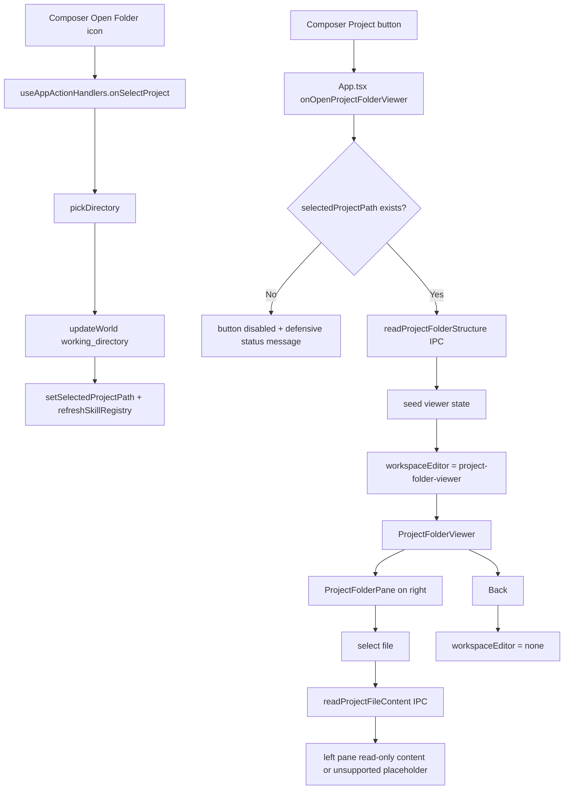

# Architecture Plan: Electron Composer Project Folder Viewer

**Date:** 2026-04-14
**Related Requirement:** [req-electron-composer-project-folder-viewer.md](../../../reqs/2026/04/14/req-electron-composer-project-folder-viewer.md)
**Status:** Implemented

## Overview

Split the current Electron composer Project affordance into two explicit actions:

- an icon-only Open Folder action that preserves the existing folder-picker flow
- a Project action that opens an editable workspace folder viewer for supported text files under the currently selected project path

The renderer already has a proven full-area editor seam through `MainWorkspaceLayout.editorContent`, and the skill editor already demonstrates the target split-pane interaction model. The clean implementation is to preserve project selection in the existing action-handler flow while adding a new workspace-editor route plus bounded IPC for project tree/content inspection and scoped text-file saves.

The key architectural constraint is scale: project folders are much larger than skill folders. The viewer must therefore load folder structure and file content lazily rather than preloading all files into renderer state.

## Architecture Decisions

### AD-1: Keep folder selection and folder viewing as separate actions and separate code paths

Do not overload one callback to both pick and view.

- Keep the existing project-folder selection behavior behind the composer icon button.
- Keep that selection flow in `useAppActionHandlers.onSelectProject`, because it already owns:
  - folder picker invocation
  - world `working_directory` persistence
  - selected-project state updates
  - skill-registry refresh
- Add a new viewer-open action dedicated to opening the workspace editor for the selected project.

This preserves current semantics and avoids coupling stateful world updates to a read-only viewer action.

### AD-2: Add a dedicated workspace-editor route for the project viewer

Extend the existing discriminated `WorkspaceEditorState` in `App.tsx` with a new viewer mode, for example:

- `kind: 'project-folder-viewer'`

Do not represent the project viewer through `panelMode`. The right panel should remain independent, consistent with the existing agent/world/skill full-area editor pattern.

### AD-3: Treat the project viewer as an editable text-file surface with explicit save semantics

The implemented version supports editing and saving supported text files.

- File editing is limited to supported text content returned with `status: 'ok'`
- Save stays explicit through a skill-editor-style save control
- `selectedProjectPath` does not mutate while browsing or saving
- Binary, unsupported, and oversized files remain non-editable placeholder states

This keeps the scope tight while matching the later UX direction that aligned the project viewer with the skill editor.

### AD-4: Use lazy file loading, not skill-preview-style full-folder preloading

Do not reuse the skill install preview model of reading every file into renderer memory.

Instead:

- load folder structure first
- load file content only when a file is selected
- keep only the active file content in renderer state

This is the most important architectural choice in the plan because project folders can contain large trees and many files.

### AD-5: Bound tree traversal to keep the viewer responsive

The main-process tree reader should avoid pathological traversal costs.

The initial implementation should:

- recurse within an explicit depth/entry budget for the structure payload, not file contents
- omit clearly non-useful generated or vendor directories by default, such as:
  - `.git`
  - `node_modules`
  - `dist`
  - `build`
  - `coverage`
  - `test-results`
- preserve stable alphabetical ordering with directories first, matching the skill tree behavior

This keeps the viewer responsive on real projects instead of freezing on dependency trees.

### AD-6: Expose unsupported-file behavior explicitly

Project folders will contain binary and unsupported files.

The viewer should:

- keep those files visible in the tree when practical
- refuse to render unsafe/binary content as text
- show a clear read-only placeholder for unsupported/binary files or excessively large files

Do not silently fail or try to decode arbitrary binary blobs into the left pane.

### AD-7: Reuse `BaseEditor` and skill-editor split-pane idioms, but keep the viewer feature-owned

Use the existing workspace editor chassis:

- `BaseEditor` for the toolbar + content shell
- a right pane styled similarly to `SkillFolderPane`

But keep the new viewer under a feature-owned surface rather than moving it into the design system. A new feature domain such as `features/projects` is the best fit because the viewer is project-context UI, not a generic primitive or pattern.

### AD-8: Prefer a disabled Project button when no project folder is selected

The requirement allows either a disabled state or an explicit empty-state view when no project is selected.

Choose the simpler and clearer first version:

- disable the Project button when `selectedProjectPath` is empty
- expose the reason via title/tooltip and aria-disabled semantics
- keep a defensive status/error message in the open-viewer handler if it is called programmatically without a selected path

This avoids sending the user into a blank editor just to discover they must pick a folder first.

## Target Components and Responsibilities

- `electron/renderer/src/features/chat/components/ComposerBar.tsx`
  - split the current Project affordance into two buttons
  - keep the icon button wired to project-folder selection
  - wire the Project button to project-viewer open behavior
  - disable the Project button when no project path is selected
- `electron/renderer/src/hooks/useAppActionHandlers.ts`
  - keep `onSelectProject` as the open-folder action
  - do not add project-viewer state management here
- `electron/renderer/src/App.tsx`
  - extend `WorkspaceEditorState`
  - own project-viewer state: folder entries, selected file path, file content, loading/error flags
  - implement viewer open/back/select-file flows
  - route `MainWorkspaceLayout.editorContent` to the new project viewer
- `electron/renderer/src/features/projects/components/ProjectFolderViewer.tsx`
  - render the full-area read-only workspace viewer
  - show toolbar with Back and folder identity
  - show file content on the left
  - render the folder tree pane on the right
- `electron/renderer/src/features/projects/components/ProjectFolderPane.tsx`
  - render the folder tree recursively with file selection
  - mirror the skill-tree interaction pattern where useful
- `electron/main-process/project-file-helpers.ts`
  - read bounded project folder structure
  - resolve relative file paths safely within the selected root
  - detect binary/unsupported files and guard file content reads
- `electron/main-process/ipc-handlers.ts`
  - register new read-only IPC handlers for project tree and file content
- `electron/preload/bridge.ts`
  - expose the new project viewer bridge methods
- `electron/shared/ipc-contracts.ts`
  - add invoke channel constants, payload contracts, result types, and `DesktopApi` methods

## Data and IPC Design

### New renderer-facing API surface

Add two read-only desktop bridge methods:

- `readProjectFolderStructure(projectPath: string): Promise<ProjectFolderEntry[]>`
- `readProjectFileContent(projectPath: string, relativePath: string): Promise<ProjectFileReadResult>`

Where `ProjectFolderEntry` mirrors the skill-tree shape closely enough to reuse tree rendering patterns:

- `name`
- `relativePath`
- `type: 'directory' | 'file'`
- `children?`

And `ProjectFileReadResult` should carry explicit status rather than returning raw text only, for example:

- `status: 'ok' | 'binary' | 'unsupported' | 'too-large'`
- `content?: string`
- `relativePath`
- `sizeBytes?`

### Why explicit result status

Returning a structured file-read result prevents the renderer from having to guess why content is unavailable. That is cleaner than overloading empty strings or thrown errors for normal unsupported-file cases.

### Path safety rules

The main process must:

- reject absolute `relativePath` values
- resolve requested files only within the selected project root
- validate canonical parent/target paths so symlinks cannot escape the selected project root
- reject `..` traversal outside the root

This should mirror the skill editor's safe path-resolution boundary.

## Viewer Flow

## Implementation Phases

### Phase 1: Split the composer control contract
- [x] Update `ComposerBar` props to accept two separate actions:
  - [x] `onOpenProjectFolder`
  - [x] `onOpenProjectViewer`
- [x] Render two adjacent buttons in the composer toolbar:
  - [x] icon-only Open Folder button
  - [x] labeled Project button
- [x] Disable the Project button when `selectedProjectPath` is missing.
- [x] Keep reasoning/tool-permission/send-stop behavior unchanged.

### Phase 2: Add project viewer workspace state in `App.tsx`
- [x] Extend `WorkspaceEditorState` with `kind: 'project-folder-viewer'`.
- [x] Add local state for:
  - [x] `projectViewerEntries`
  - [x] `projectViewerSelectedFilePath`
  - [x] `projectViewerContentState`
  - [x] loading/error flags for structure and file reads
- [x] Add `onOpenProjectFolderViewer()` that loads the tree and opens the workspace editor.
- [x] Add `onCloseProjectFolderViewer()` that returns to normal chat workspace without touching panel/chat/composer state.
- [x] Add `onSelectProjectViewerFile()` that loads one file at a time.

### Phase 3: Add project-folder IPC
- [x] Add new shared IPC contracts for project tree, file reads, and file saves.
- [x] Extend `DesktopApi` and preload bridge wiring with the new methods.
- [x] Add `project-file-helpers.ts` for bounded folder traversal plus safe file reads and saves.
- [x] Register IPC handlers in `ipc-handlers.ts`.
- [x] Reuse the skill helper's safety patterns, but do not refactor skill helpers unless the extraction stays small and local.

### Phase 4: Build the project viewer UI surface
- [x] Add `features/projects/components/ProjectFolderViewer.tsx` using `BaseEditor`.
- [x] Add `features/projects/components/ProjectFolderPane.tsx` for the right-side tree.
- [x] Render the selected file path and project root context in the viewer header.
- [x] Render editable text content in the left pane for supported files.
- [x] Add a skill-editor-style save action and markdown preview/text toggle for markdown files.
- [x] Render a clear unsupported/binary/too-large placeholder when the selected file cannot be shown as text.

### Phase 5: Integrate the viewer into the main workspace layout
- [x] Route `MainWorkspaceLayout.editorContent` to `ProjectFolderViewer` when `workspaceEditor.kind === 'project-folder-viewer'`.
- [x] Keep the right panel and header behavior consistent with the existing editor-content model.
- [x] Ensure entering/leaving the viewer does not clear messages, queue, composer draft, or selected session.

### Phase 6: Testing
- [x] Add or update a composer component test to verify the project affordance is split into two buttons and the Project button disables without a selected path.
- [x] Preserve the existing project-select regression test for `onSelectProject` and extend it only if needed to assert no behavior drift.
- [x] Add targeted viewer component tests for:
  - [x] tree renders on the right
  - [x] selected file content renders on the left
  - [x] unsupported-file placeholder renders correctly
  - [x] Back callback wiring
- [x] Add IPC/main-process tests for:
  - [x] safe relative path resolution
  - [x] ignored directory omission
  - [x] binary/too-large file handling
  - [x] symlink escape rejection for reads and saves
  - [x] bounded directory traversal for large trees
- [ ] Add one targeted App or extracted-helper test that opening the Project viewer loads tree state and that closing it preserves chat/composer state.

## Risks and Mitigations

| Risk | Impact | Mitigation |
|---|---|---|
| Reusing the skill preview approach and preloading all files | renderer memory blow-up and slow open on real repos | use lazy file reads and tree-only initial load |
| Traversing `node_modules` and generated outputs | viewer appears hung or unusable | omit high-volume generated/vendor directories by default |
| Project viewer code gets pushed into `useAppActionHandlers` | hook mixes world mutation and workspace-view orchestration | keep picker logic in the hook, viewer logic in `App.tsx` |
| Project button opens with no selected path | confusing blank editor or silent failure | disable the button and keep a defensive handler-level error message |
| Unsupported/binary files are decoded as text | broken rendering and noisy output | return structured read result statuses and render placeholders |
| Symlinked paths escape the selected project root | arbitrary file read/write outside the chosen folder | validate canonical parent/target paths before every read/write |
| Very large directory trees stall the viewer open flow | viewer appears hung on large repos | cap traversal depth and total entries during initial tree load |
| Viewer entry/exit clears live chat state | message flicker or composition loss | reuse the existing `editorContent` route instead of replacing main chat state |

## Open Questions

1. Should the omitted-directory list remain fixed for v1, or should it become a small helper constant that is easy to expand later without changing IPC contracts?
2. For markdown files, do we want plain text in v1 for scope control, or should the left pane opportunistically reuse the existing markdown renderer when the selected file is `.md`?
3. Should the Project button continue to show the literal label `Project`, or should a later polish pass surface the selected folder basename in the button while keeping the current requirement intact?

## Exit Criteria

- [x] The composer shows separate Open Folder and Project buttons.
- [x] The Open Folder button preserves current folder-picker and `working_directory` persistence behavior.
- [x] The Project button opens a workspace folder viewer for the selected project.
- [x] The viewer shows file content on the left and folder tree on the right.
- [x] File content loads lazily on selection rather than preloading the full project.
- [x] Supported text files can be edited and saved safely within the selected project root.
- [x] Unsupported or binary files are handled explicitly and safely.
- [x] Entering and leaving the viewer preserves active chat/composer state.
- [x] Targeted renderer and main-process tests cover the new flow.

## Architecture Review (AR)

**Review Date:** 2026-04-14  
**Reviewer:** AI Assistant  
**Status:** Implemented and validated

### Findings

1. A skill-editor-style preload-all-files strategy would be a major flaw for project folders.
   Resolution: this plan uses tree-only initial load plus lazy file reads.

2. Folding the viewer into `useAppActionHandlers` would blur the boundary between world-mutating actions and workspace-editor routing.
   Resolution: keep picker persistence in the hook and own viewer state in `App.tsx`.

3. A blank viewer when no project is selected would satisfy the requirement technically but create unnecessary friction.
   Resolution: disable the Project button by default when there is no selected project path.

4. Treating unsupported files as generic errors would produce noisy UX for normal project trees.
   Resolution: return explicit file-read result states and render intentional placeholders.

### AR Decision

Proceed with an editable `project-folder-viewer` workspace route for supported text files, lazy file reads, bounded directory traversal, canonical path guards, and a feature-owned viewer surface under the renderer feature layer.

### Approval Gate

Stop here for approval before `SS`. The main decision worth changing now is how the UI should surface traversal truncation for very large repos beyond the current bounded load behavior.