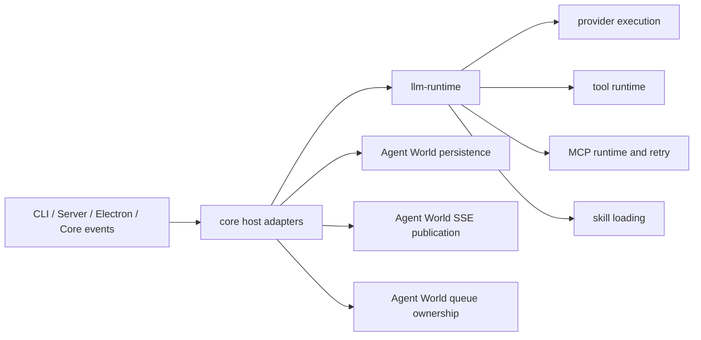

# Architecture Plan: Remove Internal LLM Package And Fully Adopt `llm-runtime`

**Date:** 2026-04-16  
**Related Requirement:** `.docs/reqs/2026/04/16/req-remove-internal-llm-package.md`  
**Status:** Proposed

## Overview

Replace the repository-owned `packages/llm` workspace and the remaining repository-owned LLM runtime execution path with the external npm package `llm-runtime`.

This is not a partial swap. The target state is:

- `llm-runtime` owns provider/model execution, tool runtime ownership, MCP/runtime orchestration, skill loading, tool-call recovery, malformed-tool handling, and retry policy.
- `core/` owns Agent World host concerns only: world/chat/session state, persistence, queue ownership, event/SSE publication, approval/HITL artifacts, and translation between Agent World state and `llm-runtime` callbacks/contracts.
- Internal package showcase tests, package-boundary assertions, and workspace wiring are removed.

## Current State

The repo still has four overlapping LLM ownership layers:

1. Root workspace/package wiring for `packages/llm`
2. A standalone internal package in `packages/llm`
3. A second runtime implementation in `core/llm-manager.ts`, `core/llm-config.ts`, and direct provider modules
4. Additional tool-call retry/recovery ownership in `core/tool-utils.ts`, `core/events/memory-manager.ts`, and `core/mcp-server-registry.ts`

The result is duplicated ownership of:

- provider configuration
- model execution
- tool orchestration
- MCP retry behavior
- malformed tool-call handling
- recovery/retry semantics
- package-specific unit and e2e tests

## Verified Inputs

- The external target package exists on npm as `llm-runtime@0.3.0` with repository `yysun/llm-runtime`.
- Root package scripts still build/check `packages/llm`.
- Electron still depends on `@agent-world/llm` via `file:../packages/llm`.
- `core/events/agent-turn-loop.ts`, `core/events/memory-manager.ts`, `core/activity-tracker.ts`, `core/message-processing-control.ts`, CLI, and server code still depend on core-owned LLM modules.
- `tests/llm/**`, `tests/e2e/llm-package-showcase.ts`, `tests/e2e/llm-turn-loop-showcase.ts`, and `tests/workspace-package-resolution.test.ts` still assert the internal package boundary.

## Architecture Decisions

### AD-1: Remove `core/llm-manager.ts` And `core/llm-config.ts` Entirely

Do not keep `core/llm-manager.ts` or `core/llm-config.ts` as temporary compatibility facades.

The migration target is a direct host integration with `llm-runtime`, with call sites updated to consume the new boundary explicitly.

Implications:

- imports that currently target `core/llm-manager.ts` or `core/llm-config.ts` must be rewritten
- tests that mock those modules must be rewritten around the new host boundary
- `core/index.ts` exports must either be removed or replaced with direct `llm-runtime`-backed exports from their final location, not from deleted compatibility files

Why this is the right seam:

- It enforces the approved end state immediately rather than preserving a misleading intermediate boundary.
- It eliminates the risk that the temporary facades become a permanent second ownership layer.
- It keeps the architecture honest: Agent World integrates with `llm-runtime` directly instead of pretending repo-owned runtime modules still exist.

### AD-2: `llm-runtime` Owns Recovery And Retry Policy

Tool-call error classification, recoverable validation handling, malformed tool-call fallback behavior, plain-text tool-intent correction, and bounded tool/MCP retry policy must live in `llm-runtime`.

`core/` may still emit or persist user-visible artifacts derived from failures, but it must not run a second retry loop or make competing retriable/non-retriable decisions.

This means current logic in:

- `core/tool-utils.ts`
- `core/events/memory-manager.ts`
- `core/mcp-server-registry.ts`

must be either deleted or reduced to event/persistence translation around runtime-owned results.

### AD-3: Provider Configuration Must Also Move To `llm-runtime`

CLI and server startup currently configure providers through `core/llm-config.ts`.

The storage and validation authority must move into `llm-runtime` so there is one provider-config source of truth.

Planned shape:

- `cli/index.ts` and `server/index.ts` call the final `llm-runtime`-backed config boundary directly
- `core/llm-config.ts` is deleted
- root and Electron no longer depend on the internal package workspace to get config types or runtime helpers

### AD-4: Remove Package-Specific Surfaces In The Same Story

Do not leave `packages/llm`, its tests, and showcase scripts around after the runtime migration lands.

The internal package boundary is the thing being removed. Leaving the package in place after the host begins using `llm-runtime` would keep ambiguous ownership and stale tests alive.

### AD-5: Preserve Host-Owned Behavior Boundaries

This story does not move these responsibilities out of Agent World:

- world/chat persistence
- queue ownership and durable retry state for user turns
- SSE event publication and renderer/web transport shape
- approval/HITL artifact persistence and restore
- chat title updates and other host side effects tied to persisted state

Those remain in `core/`, but they must consume runtime outputs from `llm-runtime` rather than reproducing runtime logic locally.

## Target Dependency Shape

## Phase Plan

### Phase 1: Contract Audit And Final Integration Design

- [ ] Compare current `core/llm-manager.ts` / `core/llm-config.ts` public surface against `llm-runtime` exported APIs.
- [ ] Build a migration matrix covering:
  - provider configuration functions/types
  - generate/stream entrypoints
  - cancellation and queue status hooks
  - tool execution callbacks
  - MCP configuration and retry callbacks
  - skill loading / root configuration
  - retry / malformed-tool / recoverable-validation behavior
- [ ] Decide the final non-compat integration surface that replaces deleted `core/llm-manager.ts` and `core/llm-config.ts` imports.
- [ ] Identify any behavior gaps where `llm-runtime` needs different host callbacks than the current core runtime.

Deliverable:

- A migration table embedded in implementation notes or PR description showing which old core exports are deleted, which new `llm-runtime` calls replace them, and which host-side helpers remain.

### Phase 2: External Dependency And Workspace Removal

- [ ] Add `llm-runtime` to the root package dependencies.
- [ ] Replace Electron's `@agent-world/llm: file:../packages/llm` dependency with the external package boundary needed by the migrated runtime.
- [ ] Remove `packages/llm` from root workspaces.
- [ ] Remove root `./llm` export.
- [ ] Remove root build/check scripts that operate on `packages/llm`.
- [ ] Update lockfiles to remove local-workspace resolution for `@agent-world/llm`.
- [ ] Remove `.npmignore` entries that preserve `packages/llm` in the published root package.
- [ ] Remove `tsconfig.json` path mapping for `@agent-world/llm`.

Validation target:

- Root install/build/check no longer mention `packages/llm`.

### Phase 3: Replace Core Runtime Ownership With Direct `llm-runtime` Integration

- [ ] Rewrite imports and call sites so they no longer depend on `core/llm-config.ts`.
- [ ] Rewrite imports and call sites so they no longer depend on `core/llm-manager.ts`.
- [ ] Remove direct provider execution ownership from:
  - `core/openai-direct.ts`
  - `core/anthropic-direct.ts`
  - `core/google-direct.ts`
  or reduce them to deleted/obsolete state if no longer needed.
- [ ] Update host-side imports in `core/events/agent-turn-loop.ts`, `core/events/memory-manager.ts`, `core/activity-tracker.ts`, `core/message-processing-control.ts`, CLI, server, and any other call sites to consume the final `llm-runtime` integration surface.
- [ ] Delete `core/llm-manager.ts` and `core/llm-config.ts`.
- [ ] Update `core/index.ts` exports to remove or replace deleted module exports from their final location.

Key rule:

- After this phase, repo code must not directly call provider SDKs for normal runtime execution.

### Phase 4: Move Tool Recovery Ownership Out Of Core

- [ ] Remove or reduce duplicated tool-call recovery logic in `core/tool-utils.ts`.
- [ ] Remove or reduce continuation-loop retry/malformed-tool handling in `core/events/memory-manager.ts` where `llm-runtime` already owns it.
- [ ] Remove or reduce runtime-owned MCP retry handling from `core/mcp-server-registry.ts` if `llm-runtime` now owns the execution and retry policy.
- [ ] Reconnect any necessary host callbacks so Agent World still publishes system/tool/SSE events from runtime-owned failure information.
- [ ] Ensure `core/` no longer decides retriable vs terminal tool-call failures independently from `llm-runtime`.

Key rule:

- Core may translate runtime outcomes into persisted artifacts and emitted events, but must not host a second retry policy.

### Phase 5: Remove Package-Specific Tests And Showcase Coverage

- [ ] Delete `tests/llm/**`.
- [ ] Delete `tests/e2e/llm-package-showcase.ts`.
- [ ] Delete `tests/e2e/llm-turn-loop-showcase.ts`.
- [ ] Delete LLM showcase support fixtures used only by those tests.
- [ ] Delete `tests/workspace-package-resolution.test.ts` or rewrite it to validate the new dependency boundary if any repository-level assertion still matters.
- [ ] Remove `test:llm`, `test:llm-showcase`, and `test:llm-turn-loop-showcase` scripts.

### Phase 6: Replace Coverage With Host-Boundary Regression Tests

- [ ] Update or add targeted unit tests for the delegated `core/llm-config.ts` host wrapper.
- [ ] Update or add targeted unit tests for the delegated `core/llm-manager.ts` host wrapper.
- [ ] Add focused regression coverage proving `core` no longer runs its own tool-call retry loop when `llm-runtime` surfaces a retriable failure/result.
- [ ] Add focused regression coverage proving Agent World still emits/persists expected failure artifacts from runtime-owned tool errors.
- [ ] Update existing tests that currently mock `core/llm-manager.js` so they continue to assert host-boundary outcomes rather than deleted internal implementation details.

Required minimum targeted tests for the implementation story:

- one regression covering delegated provider/runtime execution path
- one regression covering delegated tool-call retry/error ownership
- one regression covering retained host-side event/persistence behavior after delegated runtime failure

### Phase 7: Cleanup And Validation

- [ ] Remove obsolete docs or developer workflow references that instruct contributors to build/test the internal package.
- [ ] Run typecheck/build/test flows against the new dependency boundary.
- [ ] Confirm Electron runtime packaging no longer expects the deleted local package.
- [ ] Confirm no repo source files still import from `packages/llm` or `@agent-world/llm` local workspace paths.

## Test Strategy

Primary test goal: prove the runtime boundary changed without regressing Agent World host behavior.

Planned validation:

- [ ] `npm run check`
- [ ] targeted Vitest runs for changed `core` host-boundary modules
- [ ] `npm run integration` if API/runtime transport paths change materially during the migration

Planned targeted test updates:

- Replace tests that validate the internal package with tests that validate core delegation and host behavior.
- Keep assertions black-box at the host boundary: emitted events, returned responses, persisted state, queue/cancellation effects.
- Do not reintroduce package-internal assertions through repo-local mocks of deleted implementation.

## Risks And Mitigations

### Risk 1: Breaking Wide Existing Call Sites

Risk:

- `core/llm-manager.ts` is mocked or imported widely across event and activity tests.

Mitigation:

- Rewrite call sites and tests against the final integration surface in the same story rather than leaving compatibility facades behind.

### Risk 2: Conflicting Retry Loops Persist After Migration

Risk:

- Leaving retry logic in `core/tool-utils.ts`, `core/events/memory-manager.ts`, or `core/mcp-server-registry.ts` would create double retries, duplicate tool-error artifacts, or divergent malformed-call handling.

Mitigation:

- Treat all runtime retry/recovery branches as explicit deletion-or-delegation items in Phase 4.
- Add a targeted regression that asserts one runtime-owned retry path and one host-owned side-effect path, not two policy layers.

### Risk 3: Provider Configuration Drifts Between Callers

Risk:

- CLI/server/Electron could accidentally configure providers through a repo-local store while runtime execution reads from `llm-runtime` state.

Mitigation:

- Move provider configuration authority first.
- Delete `core/llm-config.ts` after call sites are rewritten so no second store remains.

### Risk 4: MCP Retry Status/Event Semantics Regress

Risk:

- Current core logic emits chat-scoped retry status updates and deterministic exhausted-error mapping.

Mitigation:

- Audit `llm-runtime` callback surface before removing core retry branches.
- Ensure the host adapter can publish the same Agent World-visible events using runtime-owned retry metadata.

## Architecture Review

### Finding 1: Deleting `core/llm-manager.ts` and `core/llm-config.ts` expands the call-site rewrite scope

Severity: High

Why:

- These modules are wide host seams used by turn-loop, activity tracking, message-processing control, CLI/server startup, and many tests.

Resolution:

- Accept the wider rewrite explicitly and make it part of the approved architecture, rather than hiding it behind temporary compatibility files.

Status: Resolved in plan via AD-1 and Phases 1 and 3.

### Finding 2: Retry/recovery duplication is the major regression trap

Severity: High

Why:

- The repo currently hosts retry/correction logic in multiple places. A naive migration could preserve both the old core loop and the new runtime loop.

Resolution:

- Make runtime retry/recovery ownership an explicit migration phase and acceptance criterion.

Status: Resolved in plan via AD-2 and Phase 4.

### Finding 3: Provider config needs one authority before runtime swap is safe

Severity: Medium

Why:

- CLI/server currently initialize provider config through core-owned code. If runtime execution changes first, config can drift.

Resolution:

- Move provider configuration authority into `llm-runtime` early while preserving stable host call sites.

Status: Resolved in plan via AD-3 and Phase 3.

### Finding 4: Removing package tests without replacing host-boundary regressions would reduce confidence

Severity: Medium

Why:

- The internal package tests will be deleted, but they currently cover behavior that still matters to the host.

Resolution:

- Replace them with a smaller set of host-boundary regressions focused on delegated execution and runtime-owned retry semantics.

Status: Resolved in plan via Phase 6.

## Approval Gate

Implementation should start only after approval of this plan.

Proposed execution order after approval:

1. Phase 1 contract audit
2. Phases 2 and 3 dependency/runtime rewrite
3. Phase 4 retry/recovery consolidation
4. Phases 5 through 7 cleanup and validation