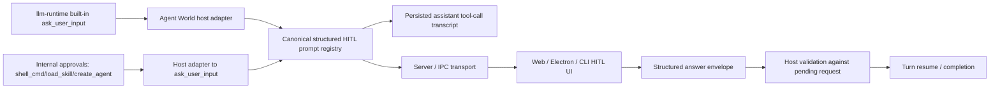

# Architecture Plan: Adopt `llm-runtime` Structured HITL Schema

**Date:** 2026-04-24  
**Related Requirement:** `.docs/reqs/2026/04/24/req-llm-runtime-hitl-schema.md`  
**Status:** Proposed

## Overview

Align Agent World's approval and HITL flow with the schema already owned by `llm-runtime`.

The target state is:

- `llm-runtime` remains the schema and validation authority for the built-in HITL tool names `ask_user_input` and `human_intervention_request`.
- Agent World transports, persists, replays, and renders the runtime's structured pending HITL request shape without flattening it.
- Agent World submits structured answers that can represent multi-question `single-select`, `multiple-select`, and request-level skip.
- Existing internal approval flows such as `shell_cmd`, `load_skill`, and `create_agent` are migrated to emit the same `ask_user_input` request family rather than keeping a core-owned approval runtime contract.
- Historical chats containing the old flat built-in HITL schema remain replayable through a compatibility parser.

## Current State

The current repository still mixes two incompatible approval/HITL models:

1. `llm-runtime` built-in HITL contract
   - `ask_user_input` / `human_intervention_request`
   - `type`, `allowSkip`, and `questions[]`
   - runtime-owned validation that rejects flat `question/options/defaultOption/timeoutMs/metadata`

2. Agent World host/client approval contract
   - one `message`
   - one flat `options[]`
   - one `defaultOptionId`
   - one submitted `optionId`

The mismatch is present in multiple layers:

- `core/hitl-tool.ts` still defines a core-owned flat built-in HITL tool shape.
- `core/mcp-server-registry.ts` still registers core-owned HITL built-ins under reserved runtime names.
- `core/hitl.ts` pending prompt and replay helpers still assume one flat option list.
- `server/api.ts`, `web/src/api.ts`, Electron IPC contracts, CLI helpers, and renderer state still expose `optionId` as the only answer shape.
- web/Electron/CLI parsing and replay helpers reconstruct unresolved HITL prompts from flat assistant tool-call arguments.
- internal approval producers still emit core-owned option prompts instead of `ask_user_input`-shaped requests.
- tests and harness prompts still instruct the model to call `human_intervention_request` with flat `question` and `options` fields.

## Verified Inputs

- `llm-runtime` README and runtime tests define the built-in request shape as:
  - `type?: 'single-select' | 'multiple-select'`
  - `allowSkip?: boolean`
  - `questions: Array<{ header, id, question, options: Array<{ id, label, description? }> }>`
- `llm-runtime` built-ins return a pending artifact with:
  - `status: 'pending'`
  - `pending: true`
  - `requestId`
  - `type`
  - `allowSkip`
  - `questions[]`
- The current Agent World HTTP and IPC answer path is still `requestId + optionId (+ chatId)`.
- Current web and core replay helpers still reconstruct pending built-in HITL prompts from flat tool arguments.
- Internal system approval flows currently use `requestWorldOption(...)` and are not yet aligned to `llm-runtime` `ask_user_input`.

## Architecture Decisions

### AD-1: Use `ask_user_input` For Internal Approvals Too

Do not keep a parallel Agent World-owned approval prompt contract.

Selected approach:

- Model-initiated HITL and internal approval producers both emit the runtime-owned structured `ask_user_input` request family.
- `human_intervention_request` remains only as a legacy compatibility alias, not as the preferred generated tool name.
- Client state can still keep host metadata that distinguishes approval origin, but not a separate prompt schema.

Why:

- This removes the last approval/HITL contract split.
- It matches the clarified product direction exactly.
- It avoids forcing every client and replay path to support two active prompt schemas forever.

### AD-2: Use A Structured Answer Envelope With Request-Level Skip

Resolve the response-shape ambiguity by introducing one canonical built-in HITL answer envelope:

```ts
{
  requestId: string;
  chatId?: string | null;
  skipped?: boolean;
  answers: Array<{
    questionId: string;
    optionIds: string[];
  }>;
}
```

Rules:

- `single-select` questions must submit exactly one `optionId` in `optionIds`.
- `multiple-select` questions may submit one or more `optionIds`.
- `skipped: true` means the entire request was skipped; in that case `answers` must be empty.
- When `allowSkip` is false, `skipped: true` is invalid.

Why this is the right shape:

- It preserves stable question identity.
- It supports multiple questions without key collisions.
- It supports multiple-select without inventing a separate transport.
- Request-level skip matches the runtime's global `allowSkip` flag better than per-question skip semantics.

### AD-3: Use Lazy Read-Time Compatibility For Historical Flat Prompts

Do not attempt an eager storage migration of old persisted built-in HITL requests in this story.

Selected approach:

- Historical flat built-in HITL tool calls remain stored as-is.
- Replay/reconstruction helpers recognize both:
  - the new structured `questions[]` schema for newly created built-in prompts, and
  - the historical flat built-in schema for older chats.
- New requests must always use the structured runtime-owned schema.

Why:

- Persisted assistant tool-call messages are transcript artifacts, not a dedicated mutable HITL table.
- Lazy compatibility avoids risky transcript rewrites.
- The compatibility surface is narrow and testable.

### AD-4: Remove Core-Owned HITL Schema Registration Under Reserved Names

Agent World must stop defining its own built-in HITL schema under the reserved `llm-runtime` built-in names.

Selected approach:

- Remove or reduce `core/hitl-tool.ts` so it no longer acts as the schema owner for `human_intervention_request` / `ask_user_input`.
- Stop advertising those core-owned tool definitions from `core/mcp-server-registry.ts` under the reserved names.
- Keep `core/hitl.ts` as the host-side pending prompt registry and validation layer for Agent World lifecycle concerns, not as the schema source for approval/HITL.

Why:

- The current core-owned registration is the root cause of schema drift.
- Reserved-name collisions are already a known integration hazard with `llm-runtime`.

### AD-5: Adopt One Canonical Host-Side Structured HITL Read Model

The repo needs one render/replay model for approval and HITL prompts.

Selected shape:

- `StructuredHitlPrompt`
  - requestId, chatId, tool identity, `type`, `allowSkip`, `questions[]`, host metadata

All queue, replay, renderer, and submission code should use this canonical structured model rather than branching between active built-in and internal prompt schemas.

## Target Flow



## Phase Plan

### Phase 1: Contract Audit And Canonical Type Design

- [ ] Audit all built-in HITL schema touchpoints in:
  - `core/hitl-tool.ts`
  - `core/mcp-server-registry.ts`
  - `core/hitl.ts`
  - `core/events/orchestrator.ts`
  - `server/api.ts`
  - `web/src/domain/hitl.ts`
  - `web/src/types/index.ts`
  - Electron renderer HITL hooks/types
  - `cli/hitl.ts`
- [ ] Introduce the target type matrix for:
  - canonical structured approval/HITL prompt
  - structured built-in HITL answer envelope
  - historical flat built-in replay adapter
- [ ] Document where the host must preserve runtime-owned fields versus where host-only envelope fields belong.

Deliverable:

- A migration table in implementation notes or PR description listing each current flat HITL type and its target replacement.

### Phase 2: Core Runtime Boundary Cleanup

- [ ] Remove core-owned built-in HITL schema registration for reserved runtime names from `core/mcp-server-registry.ts`.
- [ ] Remove or reduce `core/hitl-tool.ts` so it no longer defines the built-in `ask_user_input` / `human_intervention_request` parameter schema.
- [ ] Update `core/llm-runtime.ts` integration so built-in HITL behavior comes from `llm-runtime` without host schema override.
- [ ] Preserve alias behavior through shared tool-name helpers, but ensure alias handling no longer implies a host-owned flat request contract.

Validation target:

- Built-in HITL tool advertising comes from the runtime-owned schema only.

### Phase 3: Extend Core HITL Registry And Replay Logic

- [ ] Refactor `core/hitl.ts` pending request bookkeeping to store the canonical structured prompt model instead of only flat option prompts.
- [ ] Add structured built-in request registration and validation helpers that can validate:
  - request-level skip,
  - one answer per question for `single-select`,
  - one-or-many answers per question for `multiple-select`.
- [ ] Update `submitWorldHitlResponse(...)` or replace it with a structured equivalent that accepts the new answer envelope while preserving world/chat scoping checks.
- [ ] Update `listPendingHitlPromptEvents(...)` and `listPendingHitlPromptEventsFromMessages(...)` to preserve structured built-in request payloads.
- [ ] Add lazy compatibility parsing for historical flat built-in HITL tool calls during replay/reconstruction.
- [ ] Migrate internal approval producers to emit `ask_user_input`-shaped structured requests through the same registry.

Key rule:

- Core owns prompt lifecycle, persistence linkage, and validation against pending request state, but not the approval/HITL schema definition itself.

### Phase 4: Update Message-Authoritative Restore And Turn-Resume Paths

- [ ] Update message-authoritative reconstruction logic to recognize both structured and historical flat built-in assistant tool calls.
- [ ] Ensure restored pending structured requests can repopulate the runtime pending map without losing question IDs or selection semantics.
- [ ] Update any `waiting_for_hitl` resume metadata and turn lifecycle logic that currently assumes `selectedOption` or a single flat answer.
- [ ] Ensure edit/resubmit cleanup still removes orphaned structured built-in prompts correctly.

Files likely touched:

- `core/hitl.ts`
- `core/agent-turn.ts`
- `core/events/orchestrator.ts`
- `core/events/memory-manager.ts`
- restore / activation call sites that seed pending HITL prompts from messages

### Phase 5: Migrate Server And IPC Response Contracts

- [ ] Replace the HTTP `/worlds/:worldName/hitl/respond` request body contract with the structured answer envelope.
- [ ] Preserve restart-safe behavior when the pending request exists in messages but is not yet activated in runtime memory.
- [ ] Update Zod or schema validation for the new answer envelope.
- [ ] Update Electron IPC payload contracts and preload bridge APIs to send structured answers instead of `optionId`.
- [ ] Keep a bounded compatibility path only if needed for older renderer/API clients during the transition.

Key rule:

- Server and IPC must not remain permanently dual-shaped for new product code.

### Phase 6: Update Web, Electron, And CLI HITL Clients

- [ ] Replace flat `HitlPromptRequest` client types with the canonical structured prompt model.
- [ ] Update web prompt parsing, queueing, and prompt selection helpers in `web/src/domain/hitl.ts`.
- [ ] Update web API client methods to send structured answers.
- [ ] Update web prompt rendering to support:
  - multiple questions,
  - multiple-select,
  - request-level skip when allowed.
- [ ] Update Electron renderer prompt types and handlers to mirror the same structured behavior.
- [ ] Update Electron main-process IPC handlers to forward structured answers.
- [ ] Update CLI prompt parsing and response collection to handle structured requests without flattening them.

Validation target:

- Web, Electron, and CLI all render and submit the same built-in structured HITL request correctly.

### Phase 7: Update Tests, Harness Prompts, And Docs

- [ ] Rewrite unit tests that currently assume flat built-in HITL payloads in:
  - `tests/core/hitl.test.ts`
  - `tests/web-domain/hitl.test.ts`
  - `tests/web-domain/hitl-api.test.ts`
  - Electron IPC/renderer HITL tests
  - API route tests for `/hitl/respond`
- [ ] Add focused regression coverage for:
  - structured pending built-in request parsing,
  - `single-select` answer submission,
  - `multiple-select` answer submission,
  - request-level skip validation,
  - internal approval flows emitting `ask_user_input`-shaped prompts,
  - historical flat-schema replay compatibility,
  - world/chat isolation for structured answers.
- [ ] Update seeded agent prompts and e2e harness instructions that still tell the model to call `human_intervention_request` with flat `question/options` parameters.
- [ ] Update user-facing docs such as `docs/hitl-approval-flow.md` to distinguish built-in structured HITL from internal approval prompts.

### Phase 8: Cleanup And Validation

- [ ] Confirm no new code path still depends on built-in HITL `optionId` as the only answer representation.
- [ ] Confirm no new prompt or harness still documents the deprecated flat built-in request schema.
- [ ] Run targeted unit tests for core, API, web-domain, and Electron HITL flows.
- [ ] Run `npm run integration` because API/runtime transport paths are changing.

## Test Strategy

Primary test goal: prove Agent World now transports and resolves the runtime-owned built-in HITL schema without regressing host lifecycle behavior.

Required minimum targeted coverage:

- one core regression covering structured built-in prompt registration and structured answer validation
- one core regression covering historical flat built-in replay compatibility
- one API regression covering the new `/hitl/respond` structured request body
- one web-domain regression covering multi-question prompt parsing and queue behavior
- one Electron or CLI regression covering structured answer submission from a client boundary
- one transport regression covering restart-safe activation/retry behavior with the new schema

Planned validation:

- [ ] targeted `runTests` runs for changed HITL suites
- [ ] `npm run integration`

## Risks And Mitigations

### Risk 1: Conflating Built-In HITL With Internal Approval Flows

Risk:

- Migrating internal approvals to `ask_user_input` could break shell, skill, or agent-management flows if the host adapters do not preserve existing lifecycle metadata and UX expectations.

Mitigation:

- Keep one canonical prompt schema, but preserve origin-specific host metadata next to the prompt.
- Add targeted approval-flow regression coverage for shell, skill, and agent-management prompts.

### Risk 2: Permanent Dual Schema Support For New Code

Risk:

- Keeping both flat and structured built-in request handling for newly created prompts would preserve drift indefinitely.

Mitigation:

- Restrict flat-schema support to read-time compatibility for historical persisted data only.
- Reject or remove flat built-in request generation in active code paths.

### Risk 3: Answer Validation Becomes Underspecified

Risk:

- If the answer contract is not explicit, different clients could submit incompatible shapes for multi-question or multiple-select prompts.

Mitigation:

- Standardize on the answer envelope in AD-2.
- Add client-boundary tests for the exact transport shape.

### Risk 4: Reserved Built-In Name Collisions Reappear

Risk:

- Host code could continue to register reserved names such as `ask_user_input` or `human_intervention_request` and reintroduce runtime collisions.

Mitigation:

- Remove core-owned built-in registration under those names.
- Keep reserved-name collision coverage in runtime-host tests.

## Architecture Review

### Finding 1: The current REQ was too close to implying that all HITL prompts must become structured runtime prompts

Severity: High

Why:

- The user clarified that internal approval flows should also use `llm-runtime`'s `ask_user_input`, so keeping a separate internal prompt family would be architecturally wrong.

Resolution:

- Explicitly require internal approvals to emit the same `ask_user_input` request family via AD-1 and AD-5.

Status: Resolved in plan.

### Finding 2: The response-shape ambiguity would block implementation and testing

Severity: High

Why:

- A single `optionId` is insufficient, but the REQ originally left the concrete structured answer shape open.

Resolution:

- Choose the answer envelope in AD-2 and make it the transport target for server, IPC, and clients.

Status: Resolved in plan.

### Finding 3: Eager transcript migration would add unnecessary risk

Severity: Medium

Why:

- Persisted assistant tool-call messages are the authoritative history; rewriting them is more invasive than needed.

Resolution:

- Use lazy read-time compatibility for historical flat built-in prompts via AD-3.

Status: Resolved in plan.

### Finding 4: Core-owned built-in HITL registration is the main contract-drift seam

Severity: High

Why:

- As long as core redefines reserved built-in names, Agent World can keep drifting from `llm-runtime` even if clients are updated.

Resolution:

- Remove that ownership in Phase 2 and let `llm-runtime` remain the built-in schema authority.

Status: Resolved in plan.