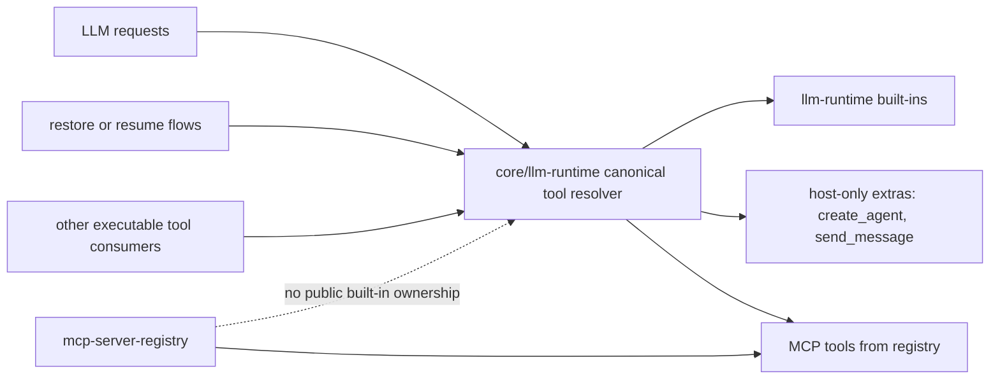

# Architecture Plan: Migrate And Delete Duplicated Runtime Tools

**Date:** 2026-04-24  
**REQ:** `.docs/reqs/2026/04/24/req-remove-duplicated-runtime-tools.md`  
**Status:** In Progress

## Overview

Remove Agent World's duplicate public implementations of runtime-reserved built-in tool names and converge all active execution paths on one canonical runtime-backed tool surface.

The end state is:

- `llm-runtime` is the only public owner of the reserved built-in names.
- Agent World uses one canonical runtime-backed resolver for those names in both model-execution paths and non-LLM execution paths such as restore/resume.
- `mcp-server-registry` no longer constructs or returns public built-in duplicates.
- Any remaining Agent World-specific behavior exists only as host integration logic, not as a second public built-in implementation under a reserved runtime name.

## Current State

The repository currently has two overlapping tool-resolution paths:

1. `core/llm-runtime.ts` already delegates normal runtime tool resolution to `llm-runtime`, passing only host-only extras like `create_agent` and `send_message`.
2. `core/mcp-server-registry.ts` still constructs a second built-in tool map for the same runtime-reserved names and returns it to non-LLM consumers.

That split creates live duplicate ownership for:

- `shell_cmd`
- `load_skill`
- `ask_user_input`
- `human_intervention_request`
- `web_fetch`
- `read_file`
- `write_file`
- `list_files`
- `grep`

The duplication is not just catalog-level. Active execution paths such as restore/resume still pull executable tools from `getMCPToolsForWorld(...)`, which means deleting the duplicate core tools without migrating those consumers would break resumed tool calls and tool-driven continuation flows.

## Verified Inputs

- `core/llm-runtime.ts` already uses `llm-runtime.resolveTools()` / `resolveToolsAsync()` and only passes host-owned extras under non-reserved names.
- `core/mcp-server-registry.ts` still constructs duplicate public built-ins for all runtime-reserved names.
- `core/events/memory-manager.ts` still imports `getMCPToolsForWorld(...)` during pending tool-call resume.
- The `llm-runtime` built-in executors are materially thinner than Agent World's richer core implementations for `shell_cmd`, `web_fetch`, `load_skill`, and `write_file`.

## Architecture Decisions

### AD-1: One Canonical Runtime-Backed Tool Resolver

Introduce or promote one canonical world-tool resolver for executable tools backed by `llm-runtime` tool resolution.

This resolver may reuse `getRuntimeToolsForWorld(...)` directly or wrap it behind a renamed host-facing helper, but it must be the only executable catalog for runtime-reserved built-in names.

Implications:

- non-LLM consumers such as restore/resume must stop depending on `getMCPToolsForWorld(...)` for built-ins
- advertised tool names and executable tool names will come from the same resolver
- reserved built-in name ownership becomes explicit and singular

### AD-2: `mcp-server-registry` Becomes MCP Infrastructure Only

`core/mcp-server-registry.ts` must stop owning public built-ins.

Target responsibility after migration:

- MCP server lifecycle
- MCP tool discovery/cache
- optional MCP-only introspection APIs

It must not remain the constructor or return surface for runtime-reserved built-in tools.

### AD-3: Delete Duplicates In Two Groups

The duplicate tools must be removed in two groups.

Thin duplicates:

- `ask_user_input`
- `human_intervention_request`
- `read_file`
- `list_files`
- `grep`

Rich duplicates with required Agent World semantics that are not yet obviously present in `llm-runtime`:

- `shell_cmd`
- `web_fetch`
- `load_skill`
- `write_file`

Thin duplicates can be deleted as soon as all active consumers resolve them through the canonical runtime-backed surface and any historical replay needs are covered.

Rich duplicates require a parity gate before deletion. Their current product semantics must first move to either:

- runtime-owned capabilities in a compatible `llm-runtime` version, or
- a non-public Agent World host integration seam that does not republish the reserved runtime name as a second built-in implementation.

### AD-4: Historical Replay Uses Private Compatibility Adapters Only

Historical persisted tool calls may require compatibility handling after duplicate public tool implementations are removed.

That compatibility must not keep the old tool definitions alive in the public tool catalog. If needed, replay compatibility should exist as private restore-time adapters keyed off persisted transcripts or tool-call metadata.

Current assessment:

- ordinary pending-tool resume does not currently require a private adapter for migrated built-in names because persisted assistant messages record public tool names plus generic `tool_calls` / `toolCallStatus` state, and `resumePendingToolCallsForChat(...)` already resumes by that public transcript shape rather than by legacy implementation identity
- any future private adapter work should therefore target legacy result-side side effects or transcript artifacts that depended on removed duplicate implementations, not the basic unresolved-tool replay path itself

### AD-5: Boundary Tests Replace Duplicate-Implementation Tests

Test coverage must move from validating duplicate built-in implementations in isolation to validating the Agent World boundary around the canonical runtime-owned tool surface.

Focus areas:

- canonical resolver content
- restore/resume execution behavior
- retained host side effects such as approvals, persistence, replay, and event publication

## Target Shape

## Phase Plan

### Phase 1: Migration Inventory And Canonical Seam

- [x] Inventory every consumer of `getMCPToolsForWorld(...)` and every direct consumer of duplicate core tool-definition factories.
- [ ] Build a migration matrix for each duplicated tool name with:
  - current consumers
  - current extra semantics
  - target owner
  - deletion prerequisite
  - replay compatibility need
- [x] Define the canonical executable tool resolver API backed by `llm-runtime` resolution.
- [x] Decide whether to reuse `getRuntimeToolsForWorld(...)` directly or expose a renamed wrapper for non-LLM paths.

Deliverable:

- one canonical executable tool resolver for runtime-reserved names, documented in the implementation notes/PR

### Phase 2: Move Active Consumers Off The Duplicate Registry Surface

- [x] Migrate restore/resume flows in `core/events/memory-manager.ts` from `getMCPToolsForWorld(...)` to the canonical runtime-backed resolver.
- [x] Migrate any orchestrator, server, Electron, or other live execution paths that still use the duplicate built-in registry.
- [x] Keep any MCP-only inspection or status endpoints on explicit MCP-only APIs rather than mixed built-in catalogs.
- [x] Update tests that currently mock or assert `getMCPToolsForWorld(...)` as the built-in execution source.

Validation target:

- no active executable path depends on `getMCPToolsForWorld(...)` for runtime-reserved built-ins

### Phase 3: Remove Thin Duplicates

- [x] Delete public duplicate registrations for `ask_user_input` and `human_intervention_request` from the old built-in registry.
- [x] Delete public duplicate registrations for `read_file`, `list_files`, and `grep` once consumers resolve them through the canonical runtime-backed surface.
- [ ] Remove thin duplicate tests that only validate the deleted core implementations.
- [ ] Keep any required historical replay handling as private compatibility logic rather than public tool catalog entries.

Validation target:

- the canonical runtime-backed surface still advertises and executes these names, but `core/` no longer publishes second public copies

Historical replay note:

- current evidence indicates no private compatibility adapter is needed for ordinary pending replay of thin duplicates because persisted unresolved tool calls resume by public tool name and generic transcript state; revisit only if deletion uncovers old duplicate-only result artifacts that a restore flow still interprets specially

### Phase 4: Close Parity Gaps For Rich Duplicates

- [x] Produce a parity checklist for `shell_cmd`, `web_fetch`, `load_skill`, and `write_file` covering current Agent World behavior that must survive deletion.
- [x] For each rich duplicate, classify every behavior as one of:
  - already owned by `llm-runtime`
  - must move into `llm-runtime` via dependency upgrade/upstream change
  - must remain host-owned but behind a non-public integration seam
- [ ] Implement the chosen parity path before deleting the public duplicate implementation.

Expected rich-tool parity areas:

- `shell_cmd`: approval gating, process tracking, SSE streaming, artifact metadata, durable envelope output
- `web_fetch`: SSRF/private-target gating, approval behavior, durable tool envelopes
- `load_skill`: approval caching, skill-context payload format, replay-safe approval persistence
- `write_file`: `tool_permission=ask` approval flow and any skill-path compatibility behavior that must remain

Key rule:

- do not delete a rich duplicate until its required product semantics are preserved without re-publishing a second built-in under the reserved runtime name

Current parity classification against the installed `llm-runtime` executors:

| Tool | Already owned by `llm-runtime` | Must remain host-owned behind non-public seam | Must move into `llm-runtime` |
| --- | --- | --- | --- |
| `shell_cmd` | Basic command execution, trusted-working-directory scoping, timeout/output shaping, reserved-name schema and validation. | Risk-tier approval gating, durable approval-denied normalization, shell process tracking, live SSE/tool streaming, artifact metadata, durable tool envelopes, continuation-specific result shaping such as bounded preview handling. | None required to complete this deletion slice. |
| `web_fetch` | Basic URL fetch, timeout/max-chars bounds, HTML/JSON normalization, reserved-name schema and validation. | Private/local target detection, approval gating for blocked targets, durable tool envelopes, approval metadata that requires chat-scoped host state. | None required to complete this deletion slice. |
| `load_skill` | Skill lookup and base `<skill_context>` payload generation for a known `skill_id`. | Session/turn approval caching, replay-safe approval prompt/result persistence, instruction-referenced script execution, run-scoped result caching, durable envelopes for rich outcomes. | None required to complete this deletion slice. |
| `write_file` | Trusted-directory path scoping, create/overwrite write semantics, read-level permission blocking, reserved-name schema and validation. | `tool_permission=ask` approval flow and any host-specific skill/script compatibility policy layered on top of raw file writes. | None required to complete this deletion slice. |

Implementation note for Phase 4:

- The current installed `llm-runtime` built-ins cover the thin execution contract for all four tools, but the remaining gaps are host orchestration behaviors rather than missing reserved-name ownership. Deletion is therefore gated on extracting or preserving those host behaviors behind private integration seams, not on keeping a second public built-in catalog in `core/`.

### Phase 5: Remove Public Rich Duplicates And Shrink The Registry

- [ ] Delete public duplicate registrations for `shell_cmd`, `web_fetch`, `load_skill`, and `write_file` after parity is proven.
- [x] Delete duplicate-only helper code and file-level factories whose only remaining purpose was public duplicate ownership.
- [ ] Remove built-in tool construction from `core/mcp-server-registry.ts` entirely.
- [ ] Reduce `mcp-server-registry` to MCP-only infrastructure and explicit MCP-only APIs.

Validation target:

- runtime-reserved built-ins come only from the canonical runtime-backed resolver

Current extraction progress:

- `shell_cmd`, `web_fetch`, `load_skill`, and `write_file` now expose explicit internal host execution helpers so their approval/envelope/session semantics can be preserved from a non-public seam even after the legacy public tool-definition factories are removed
- `getRuntimeToolsForWorld(...)` now keeps llm-runtime as the public owner of those rich built-in names while overriding execution through the internal host helpers; this is the intended Phase 5 pattern for rich duplicates
- the duplicate-only public factory exports for `shell_cmd`, `web_fetch`, `load_skill`, and `write_file` have now been removed from `core/`; module-specific unit suites were retargeted to local subjects over the host-semantics entrypoints instead of importing the deleted public wrappers
- the remaining deletion work is now limited to any leftover duplicate-only documentation or dead compatibility notes, not a second execution-path migration

### Phase 6: Cleanup Docs, Tests, And Dead Code

- [ ] Remove tests that only validated duplicate core built-in implementations.
- [ ] Replace them with boundary tests that validate the canonical runtime-backed resolver and retained host side effects.
- [ ] Update active developer docs that still describe duplicate core built-ins as first-class public implementations.
- [ ] Remove dead imports, exports, and comments that imply dual ownership.

### Phase 7: Validation

- [x] Run targeted unit tests for changed runtime-boundary modules.
- [x] Run targeted resume/replay tests for pending tool-call flows.
- [x] Run `npm run build`.
- [x] Run `npm test`.
- [x] Run `npm run integration` because the migration changes API/runtime transport and execution paths.

## Test Strategy

Primary goal: prove there is one executable ownership boundary for runtime-reserved built-ins and no behavioral regression in host-facing flows.

Required targeted coverage:

- [x] a regression test proving the canonical runtime-backed resolver is the executable source for runtime-reserved built-ins
- [x] a regression test proving pending tool-call resume no longer depends on the duplicate built-in registry
- [ ] a regression test for private compatibility replay, if historical duplicate-built-in transcripts still need resume support
  current assessment: not required for ordinary pending replay based on the persisted `tool_calls` / `toolCallStatus` shape; add only if legacy duplicate-only result artifacts require restore-time translation
- [x] focused boundary tests for any rich-tool semantics preserved behind non-public host integration seams
  current progress: shared runtime boundary coverage now exists for `shell_cmd`, `web_fetch`, `load_skill`, and `write_file`, and resolver-level override coverage now exists for all four rich tools (`shell_cmd`, `web_fetch`, `load_skill`, `write_file`)

## Risks And Mitigations

### Risk 1: Split-Brain Ownership Persists Through `getMCPToolsForWorld(...)`

Risk:

- migrating only LLM request execution would leave restore/resume and other non-LLM flows on the old duplicate registry.

Mitigation:

- make the canonical runtime-backed resolver explicit in Phase 1 and migrate all executable consumers before deleting duplicates

### Risk 2: Rich Tool Deletion Regresses Product Semantics

Risk:

- `shell_cmd`, `web_fetch`, `load_skill`, or `write_file` may currently encode behavior not yet available from runtime-owned execution.

Mitigation:

- classify every required behavior, add a parity gate, and refuse deletion until behavior is preserved behind the new ownership boundary

### Risk 3: Historical Tool Replay Breaks After Deletion

Risk:

- persisted old tool calls may no longer be executable if their public duplicate implementations disappear abruptly.

Mitigation:

- keep replay compatibility private and scoped to restore flows rather than leaving obsolete tool definitions in the live public catalog

## Architecture Review (AR)

### High-Priority Issues Found And Resolved

- Major flaw: the migration had no explicit canonical resolver seam for non-LLM execution paths.
  - Resolution: Phase 1 defines one canonical runtime-backed executable tool resolver and Phase 2 migrates all consumers before deletion.
- Major flaw: the original deletion request could have removed rich duplicates before required Agent World semantics were preserved.
  - Resolution: Phase 4 introduces a parity gate and Phase 5 forbids deletion until the parity checklist is satisfied.
- Major flaw: historical persisted tool calls could be stranded after duplicate deletion.
  - Resolution: the plan allows private replay compatibility adapters while forbidding continued public duplicate ownership.

### Options Considered

1. Immediate direct deletion of all duplicate core tools.
   - Rejected: too likely to break restore/resume and rich-tool host semantics.
2. Permanent hybrid model where `llm-runtime` owns model-execution built-ins but `mcp-server-registry` keeps a second public built-in catalog for non-LLM paths.
   - Rejected: preserves the exact duplicate ownership the REQ is trying to remove.
3. Staged migration with one canonical runtime-backed resolver, thin-then-rich deletion order, and private compatibility replay only.
   - Selected: reaches the requested end state without requiring risky all-at-once deletion.

No major flaws remain after these decisions.