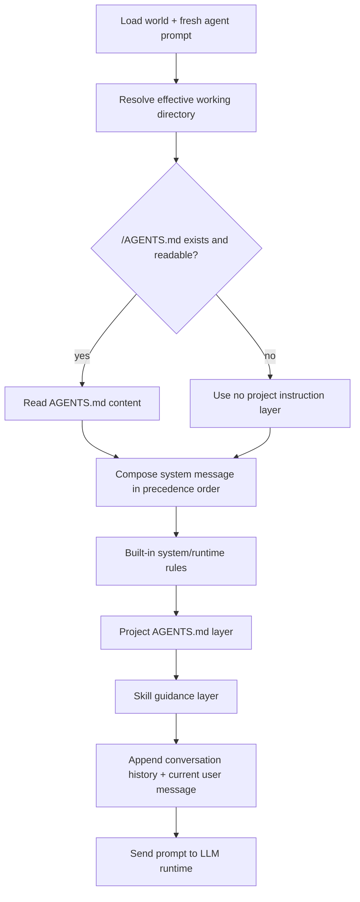

# Architecture Plan: CWD AGENTS.md Context Loading

**Date:** 2026-05-10  
**Related Requirement:** [req-cwd-agents-context-loading.md](../../../reqs/2026/05/10/req-cwd-agents-context-loading.md)  
**Status:** ✅ Reviewed (AR Completed)

## Overview

Implement project-local `AGENTS.md` loading during LLM prompt construction by resolving the effective working directory, reading exactly `<cwd>/AGENTS.md` when present, and injecting its contents into the system-context stack with explicit precedence:

1. Built-in system prompt and invariant runtime rules
2. CWD-local `AGENTS.md`
3. Skill-specific instructions and skill-discovery guidance
4. Current user message

The plan must preserve existing behavior when no local `AGENTS.md` exists and must avoid hard failures on missing or unreadable files.

## Architecture Decisions

### AD-1: Reuse Existing Turn Prompt Builder
- Implement CWD `AGENTS.md` loading in the shared LLM-message preparation path centered on `prepareMessagesForLLM` in `core/utils.ts`.
- Keep both direct-turn and continuation-turn behavior aligned by using the existing shared helper rather than adding separate loading logic per orchestrator path.

### AD-2: Single-Path File Resolution
- Resolve exactly one project-instruction file: `<effective working directory>/AGENTS.md`.
- Do not add parent-directory traversal, nested-directory scanning, or multi-file merging.

### AD-3: Centralized Prompt Layer Ordering
- Build the full system-message instruction stack through one deterministic composition path.
- Preserve the required precedence by ensuring built-in runtime rules appear before `AGENTS.md`, and `AGENTS.md` appears before skill guidance.
- Avoid split ordering where some built-in rules are appended later in `core/llm-runtime.ts` after `AGENTS.md` has already been injected.

### AD-4: Missing/Unreadable File Is Non-Fatal
- Missing `AGENTS.md` is a normal no-op.
- Read failures are logged for diagnostics and treated as non-fatal prompt omissions.

### AD-5: Fresh Per-Turn Evaluation
- Evaluate the effective working directory and file contents at prompt-build time for each turn.
- Do not reuse cached content across different working directories.

### AD-6: Minimal Surface Area
- Limit implementation changes to prompt assembly helpers and targeted tests.
- Do not modify queue semantics, skill-loading behavior, or tool execution flow beyond prompt-layer ordering needed for precedence correctness.

## Implementation Shape

Likely implementation seam:

- `core/utils.ts`
  - add helper to resolve effective working directory from world variables/defaults
  - add helper to read `<cwd>/AGENTS.md` safely
  - add helper to compose system prompt sections in precedence order
- `core/llm-runtime.ts`
  - refactor `appendToolRulesToSystemMessage` usage if needed so tool/runtime rules do not end up below `AGENTS.md` in the final system message
- `tests/core/prepare-messages-for-llm.test.ts`
  - add prompt-order and file-loading regression tests
- `tests/core/append-tool-rules.test.ts`
  - update or replace tests if prompt-layer assembly moves out of the late-append path

## End-to-End Flow

## Phased Implementation

### Phase 1: Validate and Isolate Prompt Assembly Seam
- [x] Confirm the final system-message order produced today by `prepareMessagesForLLM` plus `appendToolRulesToSystemMessage`.
- [x] Identify whether built-in runtime rules must move into the shared prompt builder or whether `AGENTS.md` and skill sections can be delayed safely without changing behavior.
- [x] Choose one deterministic assembly function as the single source of truth for system-message layer ordering.

### Phase 2: Add CWD AGENTS.md Resolution Helpers
- [x] Add a helper that resolves the effective working directory using the same world-variable/default logic used by the runtime.
- [x] Add a helper that resolves `<cwd>/AGENTS.md` without directory walking.
- [x] Add a safe file-read helper that returns empty/no layer on not-found and logs on read failure.

### Phase 3: Compose Prompt Layers in Required Order
- [x] Inject built-in system/runtime rules first.
- [x] Inject CWD-local `AGENTS.md` second when present.
- [x] Inject skill-discovery or skill-procedure guidance after `AGENTS.md`.
- [x] Preserve existing authored system prompt interpolation and conversation-history behavior.
- [x] Ensure the final system message remains deterministic and separator usage stays readable.

### Phase 4: Update Runtime Ordering Seam
- [x] Refactor `appendToolRulesToSystemMessage` or its call site if late appending would violate the reviewed precedence contract.
- [x] Keep tool-usage text functionally equivalent unless ordering changes require a small wording adjustment.
- [x] Avoid duplicating tool rules across multiple assembly paths.

### Phase 5: Add Targeted Tests
- [x] Add a happy-path unit test showing a readable `<cwd>/AGENTS.md` is injected into the system message.
- [x] Add a regression test asserting the final order is built-in/runtime rules, then `AGENTS.md`, then skill guidance.
- [x] Add a no-file test showing prompt behavior remains unchanged when `AGENTS.md` is absent.
- [x] Add an unreadable-file test showing prompt build remains non-fatal and omits the project layer.
- [x] Add a working-directory-change test showing a different CWD yields a different `AGENTS.md` evaluation on the next prompt build.

### Phase 6: Validate Impacted Paths
- [x] Run targeted unit tests for prompt assembly helpers.
- [x] Run targeted unit tests for any `llm-runtime` prompt-order helper changes.
- [x] Confirm no continuation-path regressions where orchestrator or memory-manager still rely on the same shared prompt builder.

## Risks and Mitigations

- Risk: Existing late tool-rule appending creates an actual final prompt order that conflicts with the reviewed precedence.
  Mitigation: centralize final system-message composition in one place and reduce `llm-runtime` to pure execution concerns.

- Risk: File I/O in prompt build introduces nondeterministic test behavior.
  Mitigation: mock filesystem access and keep all tests in-memory/deterministic.

- Risk: Re-reading `AGENTS.md` on every turn adds avoidable churn.
  Mitigation: keep the first implementation simple and correct; optimize later only if profiling shows prompt-build overhead matters.

- Risk: Ambiguity around whether mention-format and tool-usage rules are part of the built-in layer.
  Mitigation: treat all invariant runtime guidance injected by the host as part of the built-in system/rules layer and render it before `AGENTS.md`.

## Exit Criteria

- [x] A readable `<cwd>/AGENTS.md` is injected into turn prompt context.
- [x] Final prompt ordering matches the reviewed precedence contract.
- [x] Missing or unreadable files do not fail turn construction.
- [x] Direct-turn and continuation-turn prompt paths continue to share the same prompt builder.
- [x] Targeted unit tests pass for prompt loading and ordering behavior.

## Architecture Review (AR)

**Review Date:** 2026-05-10  
**Reviewer:** AI Assistant  
**Status:** ✅ Approved for SS

### AR Notes

- The requirement is coherent after adding explicit precedence.
- The main implementation risk is not file reading; it is prompt-layer ordering drift caused by the current split between `prepareMessagesForLLM` and `appendToolRulesToSystemMessage`.
- The plan is approved on the condition that implementation treats invariant host guidance as part of the built-in layer and verifies the final assembled system message, not just intermediate fragments.