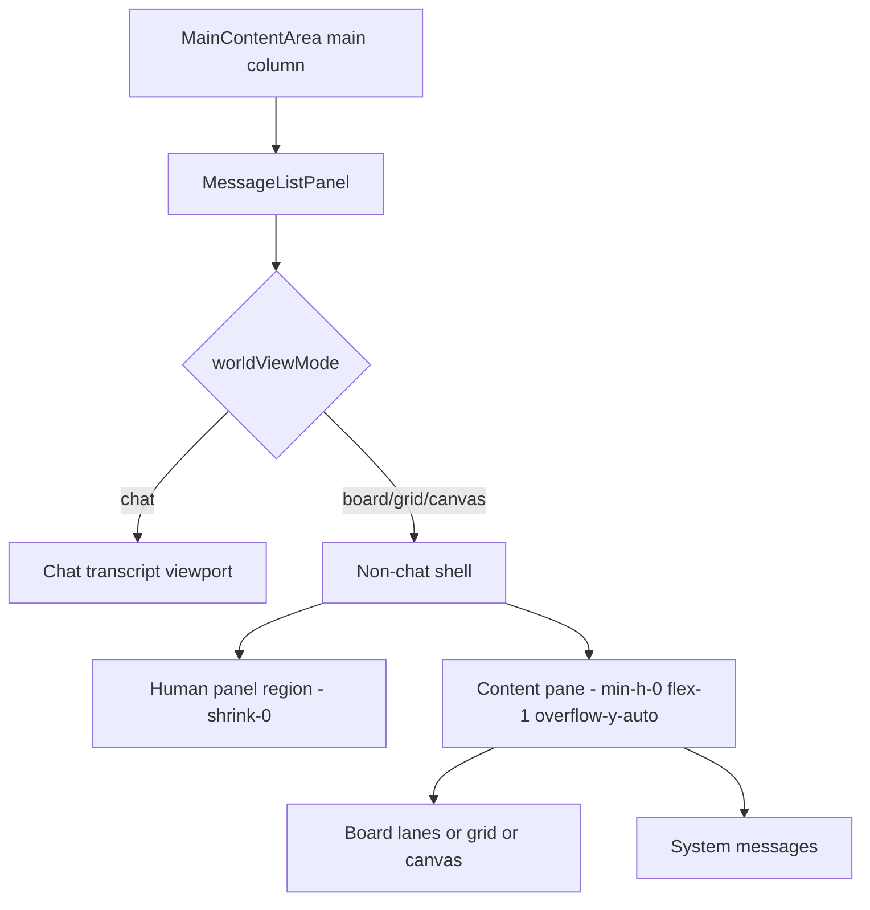

# Architecture Plan: Electron Non-Chat Human Panel Layout

## Requirement

[req-electron-non-chat-human-panel-layout.md](../../../reqs/2026/05/10/req-electron-non-chat-human-panel-layout.md)

## Overview

Redesign the Electron renderer's non-chat message area so it behaves like a dedicated split surface rather than a chat transcript with patched alternate layouts. The redesign replaces mixed outer/inner scroll behavior with one explicit non-chat shell: fixed human panel above, scroll-owned content pane below.

## Diagnosis

### Finding 1: The current non-chat layout mixes responsibilities across layers

The current behavior is split between:

- `MainContentArea`, which defines overall height flow
- `RendererWorkspace`, which still owns outer transcript auto-scroll policy
- `MessageListPanel`, which swaps rendering modes and also manipulates outer scroll on view entry
- inner board/grid/canvas regions, which attempt to own lower-pane scrolling

This means visibility of the human panel depends on multiple effects and flex chains staying perfectly aligned.

### Finding 2: The current design still treats non-chat as a variant of transcript scrolling

Even after recent fixes, the non-chat message surface is still structurally close to a chat transcript viewport with alternate children. That increases the risk that chat-era behavior, especially auto-scroll and full-surface overflow, leaks back into non-chat views during mode switches.

### Finding 3: The latest human panel should be a shell-level non-chat region, not an emergent side effect

The latest human panel is currently rendered inline as just another section in `MessageListPanel`. The behavior the user wants is stronger: in non-chat views, the panel is part of the layout frame. It should be treated as a stable region with fixed sizing, while the lower region is the only scrollable pane.

## Options Considered

### Option A: Continue patching current class chains

- Keep the current `MessageListPanel` structure.
- Continue tuning `overflow-*`, `min-h-0`, sticky, and scroll-reset behavior.

Why rejected:

- This has already produced repeated regressions.
- The layout remains hard to reason about because multiple layers still share scroll responsibility.

### Option B: Make the human panel sticky inside one large scroll surface

- Keep one scroll container.
- Use sticky positioning for the human panel.

Why rejected:

- Sticky behavior remains coupled to outer scroll position.
- It does not cleanly separate chat and non-chat scroll ownership.
- It risks recurrence of the same switch-path bugs.

### Option C: Create a dedicated non-chat shell with fixed top region and scroll-owned bottom region

- Keep chat as the existing transcript model.
- For non-chat, render a dedicated full-height shell.
- Reserve a stable top slot for the latest human panel.
- Reserve a `min-h-0 flex-1 overflow-y-auto` lower pane for board/grid/canvas/system content.
- Keep outer transcript auto-scroll disabled in non-chat.

Chosen because:

- It gives non-chat one clear layout contract.
- It matches the user-visible mental model.
- It reduces the amount of stateful scroll coordination needed across layers.

## Architecture Decisions

- **AD-1:** Keep chat and non-chat as separate viewport contracts inside `MessageListPanel`, not just different child arrangements.
- **AD-2:** The non-chat shell owns exactly two regions: `humanPanel` and `contentPane`.
- **AD-3:** The `contentPane` is the only primary vertical scroll container for non-chat views.
- **AD-4:** Human-message detection must reuse canonical renderer message semantics, not a duplicate heuristic.
- **AD-5:** Parent-level auto-scroll remains chat-only and must not attempt to manage non-chat positioning.

## Proposed Structure

## Implementation Phases

### Phase 1: Redefine the non-chat layout contract
- [x] Replace the current non-chat root helpers with a dedicated full-height shell contract.
- [x] Ensure the human panel is always rendered in a fixed top region when a latest human message exists.
- [x] Ensure the lower pane is the only primary vertical scroll owner for non-chat views.

### Phase 2: Separate board/grid/canvas content from shell framing
- [x] Make board/grid/canvas rendering return content-only structures that plug into the lower pane.
- [x] Keep board lane internal scrolling only where needed, without reintroducing outer-surface scroll coupling.
- [x] Keep system messages in the lower pane, below the primary board/grid/canvas content.

### Phase 3: Remove redundant switch-path scroll compensation
- [x] Keep chat-only auto-scroll in `RendererWorkspace`.
- [x] Remove or simplify any non-chat outer-scroll reset logic that becomes unnecessary after the redesign.
- [x] Verify the final behavior no longer depends on layered scroll corrections to reveal the human panel.

### Phase 4: Regression coverage
- [x] Update focused renderer tests for the new shell contract.
- [x] Add or update pure domain tests where the latest human message is derived.
- [x] Verify switch-path coverage for chat -> board/grid/canvas with canonical human sender variants.

## Files Expected to Change

| File | Why |
|---|---|
| `electron/renderer/src/features/chat/components/MessageListPanel.tsx` | Primary non-chat shell redesign |
| `electron/renderer/src/app/RendererWorkspace.tsx` | Final chat-only outer-scroll policy cleanup |
| `electron/renderer/src/domain/world-view.ts` | Keep canonical latest-human partitioning stable if needed |
| `tests/electron/renderer/message-list-plan-visibility.test.ts` | Renderer boundary regression coverage |
| `tests/electron/renderer/world-view-domain.test.ts` | Human-message partitioning coverage |

## Test Strategy

### Unit / renderer tests

- Update focused renderer tests around `MessageListPanel` and world-view partitioning.
- Run targeted Vitest coverage for the changed renderer files.

### E2E coverage decision

This is a user-facing, regression-prone layout flow triggered by view switching. It should have a human-readable E2E spec so the switch path can be exercised later in Electron UI verification.

## Architecture Review

### Review result

Proceed with Option C.

### Why this is the best direction

- It addresses the root cause as a layout-contract problem instead of continuing to tune side effects.
- It reduces the number of places that need to coordinate scroll position.
- It makes the intended UI state explicit: fixed human context above a scrollable workspace.

### Remaining risks

- Board lane internal scrolling can regress if the lower pane loses `min-h-0` or if lane wrappers stop stretching.
- Existing focused tests may need reshaping because they currently assert helper class strings more than semantic region ownership.

### Mitigations

- Prefer testing shell-region ownership rather than only literal class strings where practical.
- Keep the redesign narrow to the non-chat shell; do not disturb chat transcript behavior.
