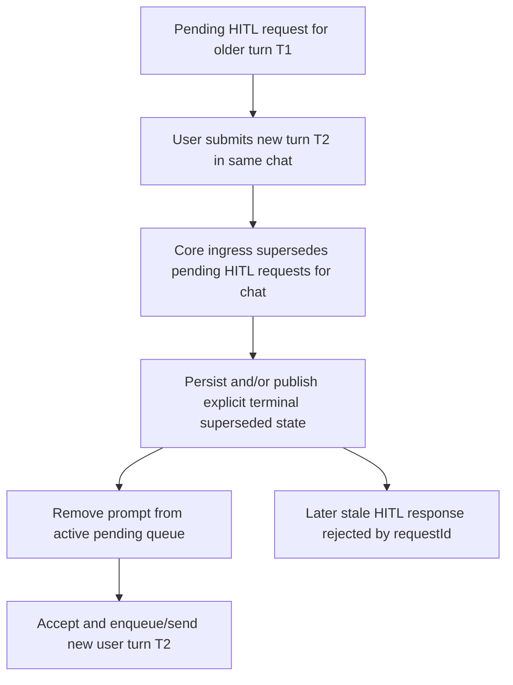

# Architecture Plan: HITL Non-Blocking User Input

## Requirement

[req-hitl-non-blocking-user-input.md](../../../reqs/2026/05/10/req-hitl-non-blocking-user-input.md)

## Overview

Change the product contract for pending HITL prompts from modal blocking to non-blocking continuation. Users must be able to submit a new turn even when an older HITL prompt is still unresolved.

The selected design is not to keep multiple unresolved turn gates active indefinitely in one chat. Instead, a newly accepted user turn in a chat will explicitly supersede any older pending HITL requests for that chat. Superseded prompts become visible terminal state, not silently dropped state.

This keeps user input unblocked while preserving deterministic turn ownership and avoiding stale prompt responses resuming obsolete work.

## Current State

The repository already has structured HITL request identity and chat-scoped prompt selection, but the interactive clients still behave as if pending HITL is a modal lock:

- Electron blocks send in `useMessageManagement.ts` and disables the composer in `ComposerBar.tsx`.
- Web derives `composerDisabled` from `hasActiveHitlPrompt` in `world-chat.tsx` and `world-dashboard.tsx`.
- Current docs explicitly state that while a HITL prompt is pending in UI, sending a new message is blocked.
- Core edit/delete flows can clear pending HITL requests without producing an explicit user-visible terminal state.

The underlying runtime already preserves request identity and scoped response validation, which is the right base to build on.

## Diagnosis

### Finding 1: The block is currently a client UX rule, not a core lifecycle rule

The current lock mostly exists in UI send gates and composer-disabled logic. That means the product behavior is inconsistent with the core runtime model, which already tracks request identity by `worldId + requestId` and validates chat scope on response.

### Finding 2: Non-blocking input without a supersession rule would create ambiguous turn ownership

If a user can submit a second turn while the first turn is waiting on HITL, the system needs an explicit rule for what happens to the older prompt. Leaving both prompts fully active in one chat makes later answers ambiguous and creates a real risk of resuming obsolete work.

### Finding 3: Silent removal is not acceptable

The repo already has strong durability rules around user-turn lifecycle, pending HITL reconstruction, and turn recovery. Replacing a blocking lock with silent prompt removal would violate those rules and make replay/debugging worse.

## Options Considered

### Option A: Remove the client-side lock and keep all pending HITL prompts active

- Allow new sends while keeping older prompts answerable.
- Let multiple unresolved prompts coexist in the same chat.

Why rejected:

- It creates competing unresolved turn gates in a single chat.
- It makes later responses harder to reason about and easier to misapply.
- It complicates queue ownership and replay semantics substantially.

### Option B: Allow new sends and explicitly supersede older pending HITL in the same chat

- Remove the composer/send lock.
- When a new user turn is accepted for a chat, mark older pending HITL requests in that chat as superseded.
- Emit/persist explicit terminal state for the superseded request.

Chosen because:

- It satisfies the product goal directly.
- It preserves one clear active user-turn path per chat.
- It prevents stale prompt answers from reviving obsolete work.
- It fits the repo's queue/HITL lifecycle rules better than concurrent unresolved gates.

### Option C: Keep the modal lock but add an explicit dismiss button

- User cannot continue until they dismiss or answer the prompt.

Why rejected:

- It still blocks the user from sending a different idea.
- It does not satisfy the new requirement.

## Architecture Decisions

### AD-1: New user turns supersede older pending HITL in the same chat

The canonical rule is:

- if chat `A` has pending HITL from older turn `T1`,
- and the user submits a new turn `T2` in chat `A`,
- then pending HITL owned by `T1` becomes superseded before or as `T2` is accepted.

The system must not keep `T1` as a still-resumable pending prompt once `T2` is accepted.

### AD-2: Supersession is authoritative at the core send/edit ingress, not only in clients

Interactive clients must stop blocking input, but the authoritative supersession decision must happen at the core boundary that accepts or resubmits user turns. That keeps Electron, web, server/API callers, and future clients consistent.

### AD-3: Superseded HITL must produce explicit terminal state

Superseding a pending prompt must create a deterministic terminal outcome for that request. Acceptable implementation forms include:

- a durable terminal artifact linked to the request/tool call,
- a replayable non-pending prompt state with `status: superseded`,
- a structured host event plus persisted terminal message/result.

The important rule is that superseded is visible and reconstructable, not an in-memory-only disappearance.

### AD-4: Stale HITL responses must be rejected deterministically

Once a request is superseded, later responses to that `requestId` must not resume work. They must return a deterministic rejection such as `request superseded` and clients must remove or downgrade the stale interactive prompt.

### AD-5: Queue/HITL lifecycle semantics stay strict

Pending HITL still belongs to the owning user turn. Non-blocking input does not mean the old turn completed successfully; it means the old turn reached a durable superseded terminal state instead of waiting forever.

### AD-6: Client parity applies to Electron and web, with CLI covered explicitly

Electron and web must adopt the non-blocking rule in this story. CLI interactive behavior must either:

- adopt the same non-blocking rule in the same implementation slice, or
- be called out as an explicit documented limitation before implementation starts.

Default recommendation: include CLI in the plan rather than silently exempting it.

## Proposed Flow

## Implementation Phases

### Phase 1: Define the supersession contract and read model
- [x] Add an explicit core concept for a pending request becoming `superseded` rather than simply disappearing.
- [x] Decide the durable artifact shape for superseded requests so replay and clients can show deterministic state.
- [ ] Ensure the pending prompt read model can distinguish:
  - active pending requests,
  - resolved requests,
  - superseded requests.

### Phase 2: Make core user-turn ingress authoritative
- [x] Update canonical user-turn ingress to supersede older pending HITL for the same chat before accepting a new user turn.
- [ ] Apply the same rule to edit-and-resubmit flows so existing raw `clearPendingHitlRequestsForChat(...)` cleanup becomes explicit supersession/terminalization where required.
- [x] Keep cross-chat isolation intact so supersession only affects the owning chat.

Likely files:
- `core/hitl.ts`
- `core/queue-manager.ts`
- `core/message-edit-manager.ts`
- any core send/edit ingress wrappers used by server/Electron/web

### Phase 3: Reject stale responses safely
- [x] Update `submitWorldHitlResponse(...)` handling so superseded requests return a deterministic non-accepted result that is distinguishable from `request not found`.
- [x] Preserve requestId/chatId scoping checks and ensure stale answers cannot resume obsolete work.
- [x] Ensure runtime replay does not reconstruct superseded requests as active pending prompts.

### Phase 4: Update interactive client UX
- [x] Remove Electron composer disable and send-block logic tied to `hasActiveHitlPrompt`.
- [x] Remove web composer disable/send-block logic tied to `hasActiveHitlPrompt`.
- [x] Keep HITL prompts visible while active, but ensure they are removed or downgraded when superseded.
- [ ] Preserve queue visibility and working-status rules where they still make sense under the new product contract.

Likely files:
- `electron/renderer/src/hooks/useMessageManagement.ts`
- `electron/renderer/src/features/chat/components/ComposerBar.tsx`
- `electron/renderer/src/hooks/useAppActionHandlers.ts`
- `electron/renderer/src/domain/queue-visibility.ts`
- `web/src/features/world/views/world-chat.tsx`
- `web/src/features/world/views/world-dashboard.tsx`
- `web/src/pages/World.update.ts`

### Phase 5: Transport and multi-client consistency
- [x] Ensure server/API and Electron IPC callers receive the new deterministic `superseded` rejection shape when answering stale prompts.
- [ ] Decide whether a lightweight terminal realtime event is needed so other live subscribers can remove superseded prompts immediately.
- [ ] Keep chat-load/switch replay behavior deterministic across restore flows.

Likely files:
- `server/api.ts`
- `electron/main-process/ipc-handlers.ts`
- `electron/main-process/realtime-events.ts`
- `server/sse-handler.ts`

### Phase 6: CLI parity or explicit limitation
- [ ] Review CLI interactive HITL flow.
- [ ] Either implement non-blocking prompt handling in CLI interactive mode or explicitly document why CLI is temporarily exempt and how that limitation is surfaced.

Likely files:
- `cli/hitl.ts`
- CLI-facing HITL docs if limitation remains

### Phase 7: Regression coverage
- [x] Add focused core tests for superseding pending HITL when a newer user turn is accepted.
- [x] Add tests that stale HITL responses cannot resume superseded turns.
- [x] Add Electron renderer tests covering non-blocking composer behavior with active HITL.
- [x] Add web view/domain tests covering non-blocking composer behavior with active HITL.
- [ ] Add or update restore/replay tests so superseded prompts are not replayed as pending.

## Files Expected to Change

| File | Why |
|---|---|
| `core/hitl.ts` | explicit supersession state, pending-read-model updates, stale-response handling |
| `core/queue-manager.ts` | authoritative new-turn supersession at queue-backed user-turn ingress |
| `core/message-edit-manager.ts` | replace raw HITL clearing with deterministic supersession/terminalization during edit flows |
| `server/api.ts` | deterministic stale/superseded HITL response handling |
| `electron/main-process/ipc-handlers.ts` | same stale/superseded response behavior for renderer approvals |
| `electron/main-process/realtime-events.ts` | live prompt removal/update propagation if needed |
| `electron/renderer/src/hooks/useMessageManagement.ts` | remove send block on active HITL |
| `electron/renderer/src/features/chat/components/ComposerBar.tsx` | remove composer disabled state tied to active HITL |
| `electron/renderer/src/hooks/useAppActionHandlers.ts` | remove Enter/send gating based on active HITL where applicable |
| `web/src/features/world/views/world-chat.tsx` | remove composer disabled state tied to active HITL |
| `web/src/features/world/views/world-dashboard.tsx` | same non-blocking composer update in dashboard view |
| `web/src/pages/World.update.ts` | state transitions when stale/superseded prompts are removed or downgraded |
| `cli/hitl.ts` | interactive-mode parity or explicit documented limitation |

## Test Strategy

### Unit and boundary tests

- Core:
  - supersede pending HITL when a new user turn is accepted,
  - stale responses return `superseded` and do not resume work,
  - replay/restore excludes superseded requests from active pending state.
- Electron renderer:
  - composer remains enabled with active HITL,
  - sending a new message clears/downgrades the superseded prompt correctly,
  - prompt scoping across session switches remains correct.
- Web:
  - `getComposerActionState(...)` no longer disables input for active HITL,
  - dashboard/chat views keep send enabled while HITL is visible,
  - stale prompt removal/downgrade is deterministic.

### E2E coverage decision

This is a user-facing, regression-prone interaction and should have an executable or human-readable E2E spec. The primary scenarios are cross-surface and easy to regress because they depend on turn lifecycle, prompt replay, and client state.

## Architecture Review

### Review result

Proceed with Option B: explicit supersession on newer user turns.

### Why this is the best direction

- It satisfies the non-blocking product requirement directly.
- It preserves the repo's strong turn-ownership rules instead of weakening them.
- It avoids a much riskier design where multiple unresolved HITL prompts remain simultaneously resumable in one chat.

### Key risk

The largest risk is implementing non-blocking send only in the UI and forgetting to make core ingress authoritative. That would produce inconsistent behavior across Electron, web, server callers, and possibly CLI.

### Mitigation

- Put supersession at the core send/edit ingress.
- Treat UI changes as presentation updates, not as the source of truth.
- Add targeted replay and stale-response tests before broad E2E validation.

## Approval Gate

Stop here for approval before `SS`.

Primary product decision to change now if desired:

- whether newer user turns should always supersede older pending HITL in the same chat,
- or whether the product should instead allow multiple still-answerable pending prompts in one chat.

This plan assumes supersession is the desired behavior.